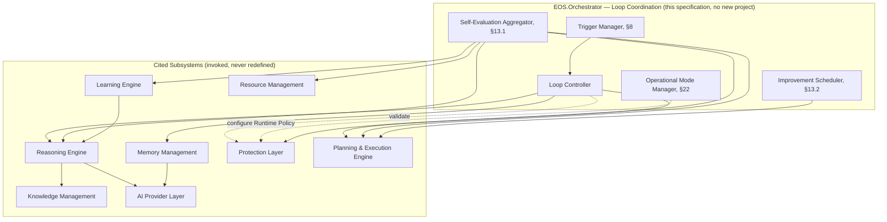

# Autonomous Engineering Loop Specification v1.0

**Document Type:** Capstone Orchestration Specification — the operational conductor of EOS
**Extends:** `@EOS-Specification.md` (the Constitution, immutable), and orchestrates — without redefining — `@Learning-Engine-Specification-v1.1.md`, `@Memory-Management-Specification-v1.0.md`, `@Reasoning-Engine-Specification-v1.0.md`, `@Protection-Layer-Specification-v1.0.md`, `@Planning-Execution-Engine-Specification-v1.0.md`, `@Knowledge-Management-Specification-v1.0.md`, `@AI-Provider-Layer-Specification-v1.0.md`, `@Resource-Management-Specification-v1.0.md`, and `@EOS-System-Architecture-Specification-v1.0.md` (all immutable, approved)
**Status:** Proposed
**Primary Constitutional Anchors:** §0.12 — Execution Cycles · `EOS.Orchestrator`'s existing charter ("Coordinates roles, cycles, and event routing," Constitution Part 1) · EOS-System-Architecture-Specification-v1.0 §8–§13 (the six named Flows)

This document introduces **no new project**. It is the full operational detail behind two things the Constitution and its synthesis document already named but never fully choreographed into one continuously-running cycle: Constitution §0.12's Execution Cycles, and `EOS.Orchestrator`'s own charter as the coordinator of "roles, cycles, and event routing." It realizes this entirely as `EOS.Orchestrator`'s top-level loop-coordination behavior — the same project Planning-Execution-Engine-Specification-v1.0 already hosts the Scheduler within, now additionally hosting the Loop that sequences *when* Observation, Decision, Execution, and Learning phases happen and *which* Operational Mode governs how much autonomy is currently granted. It defines two genuinely new concepts no prior document addresses — Operational Modes (§22) and Trigger Sources (§8) — and otherwise strictly cites, never restates, each subsystem's own already-approved algorithm.

---

## 1. Executive Summary

The Autonomous Engineering Loop is the continuously-repeating cycle — Observe → Understand → Retrieve Context → Reason → Generate Alternatives → Evaluate Risks → Validate → Plan → Schedule → Execute → Observe Results → Measure Outcomes → Learn → Update Memory → Promote Knowledge → Self-Evaluate → Improve → Repeat — that makes EOS an autonomous engineering operating system rather than a collection of independently-capable subsystems. It owns the *sequence*, the *triggers* that start an iteration, the *Operational Mode* that governs how much autonomy is currently granted, and the *aggregation* of every subsystem's own outcome into a loop-level self-evaluation. It owns none of the cognition, storage, safety, or execution logic itself — every step in the cycle above is a citation to a capability the other eight approved specifications already fully define. Human governance always outranks autonomous behavior (Architecture Rule), no step in the loop ever bypasses Protection Layer, and every optimization the loop triggers is reversible.

## 2. Purpose

To give another autonomous engineer the complete, implementation-independent choreography of how EOS's eight subsystems cooperate as one continuously-improving system — filling the one gap the System Architecture Specification's own flows (§8–§13 of that document) left open: those flows describe *pairwise* interactions (Context Flow, Knowledge Flow, Decision Flow, etc.); this document is the *single repeating cycle* that sequences all of them together, decides when a new iteration starts, and governs how much autonomy each iteration is granted.

## 3. Scope

In scope:
- The Autonomous Loop's 18-step lifecycle (§7), each step citing the subsystem specification that actually performs it
- Trigger Sources (§8) — what starts an iteration, including two genuinely new trigger types (File Changes, Git Events) flagged as an open capability gap (§8.9)
- Operational Modes (§22) — a new, loop-level global setting realized as a specific Runtime Policy profile (Protection-Layer-Specification-v1.0 §12.4) the Loop selects and Protection continues to enforce
- Self-Evaluation and Continuous Improvement (§13) as a loop-level *aggregation* of each subsystem's own KPIs, never a redefinition of any subsystem's own metric

Out of scope (see Non-Goals §5): every subsystem's own internal algorithm, already fully specified and unchanged.

## 4. Goals

- Make the full autonomous cycle explainable end to end (Architecture Rule) — every step's citation in §7 traces to an already-explainable mechanism (Reasoning's Explainability, Protection's reason-on-deny, Learning's provenance chain).
- Make every execution observable and every decision traceable (Architecture Rules) — realized by the loop never introducing a parallel observability/audit mechanism, only sequencing calls into the ones that already exist (Constitution's Event Catalog, Artifact Registry).
- Keep the loop deterministic wherever possible (Architecture Rule) — the sequence itself (§7) is a fixed state machine; only the content of Reasoning/Learning decisions carries any non-determinism, unchanged from those documents' own postures.
- Ensure human governance always outranks autonomous behavior (Architecture Rule) — realized structurally via Operational Modes (§22) and Human Governance checkpoints (§14), never as a soft preference.
- Guarantee the loop degrades gracefully under resource constraints and remains extensible without redesign (Architecture Rules) — §23, §28.

## 5. Non-Goals

- The Loop does not perform learning logic itself — Learning Engine's Meta Learning pipeline (Learning-Engine-Specification-v1.1) is invoked, never re-implemented.
- The Loop does not own memory — Memory Management's storage/retrieval (Memory-Management-Specification-v1.0) is invoked, never re-implemented.
- The Loop does not perform reasoning — Reasoning Engine's 12-stage pipeline (Reasoning-Engine-Specification-v1.0) is invoked, never re-implemented.
- The Loop does not perform planning — Planning & Execution Engine's Goal→Task Graph→dispatch machinery (Planning-Execution-Engine-Specification-v1.0) is invoked, never re-implemented.
- The Loop does not set or enforce protection policy — Protection Layer's Policy/Rule/Risk/Approval Engines (Protection-Layer-Specification-v1.0) are invoked and, for Operational Modes specifically, *configured* (§22), never re-implemented or bypassed.
- The Loop does not perform AI inference — every inference/embedding call in any cited step still routes exclusively through `EOS.Reasoning`/`EOS.Knowledge`'s existing channels into AI Provider Layer (AI-Provider-Layer-Specification-v1.0), unchanged.
- The Loop does not own knowledge — Knowledge Management's taxonomy/governance (Knowledge-Management-Specification-v1.0) is invoked, never re-implemented.
## 6. Engineering Philosophy

The Loop's behavior is governed entirely by principles the Constitution already established — this section names them as the philosophy driving autonomous behavior, without restating their mechanics (each is fully mechanized elsewhere in this lineage):

1. **Evidence before action** (Constitution §0.1.1.1) — the Loop never advances from Decision to Execution without the Decision carrying resolvable evidence (Reasoning-Engine-Specification-v1.0 §13.3).
2. **Bounded autonomy** (Constitution §0.2.3, §0.6) — the Loop's Operational Mode (§22) never grants more autonomy than the Decision Matrix's Authority Levels already permit; a mode can only narrow, never widen, what Protection would otherwise allow.
3. **Compounding, not repeating** (Constitution §0.1.1.7) — every loop iteration that produces a Lesson feeds Learning Engine's pipeline (§9 of the System Architecture Specification); the Loop never treats two structurally similar iterations as unrelated events.
4. **Safety is structural, not aspirational** (Protection-Layer-Specification-v1.0 §1) — the Loop has no "skip Protection for speed" mode; even Autonomous Mode (§22) still passes every action through the same unchanged Validation Pipeline.
5. **Reversibility as a default engineering posture** (Architecture Rule: "every optimization must be reversible") — every Continuous Improvement action (§13) the Loop triggers is expressed as a Task subject to Planning & Execution Engine's own existing Rollback Path (Planning-Execution-Engine-Specification-v1.0 §19.2), never an irreversible direct mutation.
6. **Human judgment is the ceiling, not the floor** (Architecture Rule: "human governance always has higher priority") — the Loop's default posture in the absence of an explicit Operational Mode selection is the *most* human-involved mode (Assisted), never the most autonomous one (§22.9).

## 7. Autonomous Loop Overview

### 7.1 The Complete Cycle

Every step below cites the subsystem specification and section that actually performs it — this document owns only the sequencing arrow between them.

```
 1. Observe              — Resource Management (§18), Protection (health signals), Memory (Episodic entries) — §9 below
        |
 2. Understand            — Reasoning Engine, Goal Understanding/Intent Analysis (Reasoning-Engine-Specification-v1.0 §10, Stages 2-3)
        |
 3. Retrieve Context       — Memory Management, assemble_context() (Memory-Management-Specification-v1.0 §15);
        |                    optionally enriched by Knowledge Management's ranking pass (Knowledge-Management-Specification-v1.0 §15.7)
        |
 4. Reason                — Reasoning Engine, full 12-stage pipeline (Reasoning-Engine-Specification-v1.0 §10)
        |
 5. Generate Alternatives  — Reasoning Engine, Stage 5 (Hypothesis Generation) + Stage 8 (Alternative Exploration)
        |
 6. Evaluate Risks         — Reasoning Engine's risk_score (Stage 9, Trade-off Analysis) + Protection's Risk Engine
        |                    (Protection-Layer-Specification-v1.0 §10.5, reusing Constitution §0.6.1's formula)
        |
 7. Validate               — Protection Layer, full Validation Pipeline (Protection-Layer-Specification-v1.0 §14)
        |
 8. Plan                  — Planning & Execution Engine, Goal decomposition into Task Graph (Planning-Execution-Engine-Specification-v1.0 §10.2-§10.3)
        |
 9. Schedule               — Planning & Execution Engine, Scheduler (§10.6 of that spec), budget values from Resource Management
        |
10. Execute                — Planning & Execution Engine, Execution Coordinator + Protection gate (§10.7 of that spec, FR-PE2)
        |
11. Observe Results         — Progress Monitoring (Planning-Execution-Engine-Specification-v1.0 §18), Task Lifecycle state (Constitution Part 6)
        |
12. Measure Outcomes        — Reality Validation (Constitution §0.15, realized inside Protection) plus each subsystem's own KPIs (§16 below)
        |
13. Learn                  — Learning Engine's Meta Learning pipeline, triggered via Memory's consolidate() emitting LessonLearned
        |                     (Learning-Engine-Specification-v1.1 §11, Memory-Management-Specification-v1.0 §16)
        |
14. Update Memory           — Memory Management, Episodic to Semantic promotion (observed, not decided, by Memory — §9 of the System Architecture Specification)
        |
15. Promote Knowledge        — Knowledge Management, taxonomy re-classification on LessonPromoted/BestPracticeRatified/etc.
        |                      (Knowledge-Management-Specification-v1.0 §12.4, §19.1)
        |
16. Self-Evaluate            — THE LOOP'S OWN, GENUINELY NEW STEP (§13.1) — aggregates every subsystem's own KPI into a
        |                      loop-level health score; no subsystem's own metric computation is altered
        |
17. Improve                  — THE LOOP'S OWN, GENUINELY NEW STEP (§13) — schedules each subsystem's own already-
        |                      established Quarterly-cycle recalibration (Constitution §0.12.1); never redefines what
        |                      gets recalibrated
        |
18. Repeat ------------------> back to Trigger evaluation (§8) for the next iteration
```

### 7.2 What This Document Actually Adds

Of the eighteen steps above, sixteen are pure citations — the Loop's contribution is the *arrow between them* (sequencing, triggering, and gating via Operational Mode). Only step 16 (Self-Evaluate) and step 17 (Improve) are genuinely new computation this document itself defines (§13) — every other step's substance belongs entirely to the cited subsystem.

### 7.3 Not Every Iteration Runs All 18 Steps

A Deterministic Reasoning-type request (Reasoning-Engine-Specification-v1.0 §11) may resolve at step 7 (Validate) without ever reaching step 8 (Plan) if no execution is required (e.g., a pure informational query). A loop iteration is a *superset template*, not a mandatory sequence every trigger must fully traverse — Trigger Sources (§8) determine which steps are actually invoked for a given iteration.
## 8. Trigger Sources

Each trigger starts a new loop iteration at the appropriate step (§7.3) — not necessarily step 1.

| Trigger | Realized Via | Enters Loop At |
|---|---|---|
| **User Requests** | `IPlanningClient.submit_goal()` (Planning-Execution-Engine-Specification-v1.0 §21.1) | Step 2 (Understand) — a Goal already states intent |
| **Scheduled Tasks** | Planning & Execution Engine's Scheduled/Periodic Execution modes (Planning-Execution-Engine-Specification-v1.0 §14) | Step 8 (Plan) or later, if the task's plan is already known |
| **File Changes** | See §8.9 — flagged capability gap | Step 1 (Observe) |
| **Git Events** | See §8.9 — flagged capability gap | Step 1 (Observe) |
| **Learning Opportunities** | `LessonStalled`, `FitnessFunctionViolated` (Learning-Engine-Specification-v1.1 §15) | Step 13 (Learn) directly — re-enters the pipeline mid-cycle |
| **Knowledge Updates** | `KnowledgeUpdated`, `KnowledgeFreshnessExpired`, `KnowledgeDriftDetected` (Knowledge-Management-Specification-v1.0 §19) | Step 15 (Promote Knowledge) or, for drift, Step 2 (Understand — "should this be revalidated") |
| **Performance Degradation** | `ResourceThresholdCrossed(Warning\|Critical)` (Resource-Management-Specification-v1.0 §20), `ReasoningDriftDetected` (Protection-Layer-Specification-v1.0 §21) | Step 1 (Observe) |
| **Failures** | `TaskBlocked`, `IncidentDetected` (Constitution Part 3), `ReasoningFailed` (Reasoning-Engine-Specification-v1.0 §17) | Step 11 (Observe Results), routed to Failure Strategy (§23) |
| **Manual Requests** | Same as User Requests, distinguished only by the requesting role's Authority Level (Constitution §0.2.3) | Step 2 (Understand) |

### 8.9 Flagged Capability Gap: File Changes / Git Events

Neither this document nor any of the eight approved subsystem specifications assigns ownership of filesystem-watching or git-hook integration mechanics. Protection Layer's "Local Files" protection domain (Protection-Layer-Specification-v1.0 §11) governs *which roles may act on which paths*, and Resource Management's Disk monitoring (Resource-Management-Specification-v1.0 §18.2) observes *space*, but neither *detects a change event*. This document does not invent an owner for this mechanism — it only defines that, **once detected** (by whatever future mechanism fills this gap), a `FileSystemChangeDetected`/`GitEventDetected` event (§17) enters the Loop at step 1. This is flagged explicitly in Open Questions (§30, item 1) rather than resolved unilaterally, consistent with this lineage's established practice of flagging genuine gaps rather than guessing at an owner.

## 9. Observation Phase

Step 1 of the cycle (§7.1) — the Loop's own contribution is aggregating four already-existing observation sources into one phase, never adding a fifth observation mechanism of its own.

| Observation | Source (unchanged) |
|---|---|
| Environment observation | Resource Management's Resource Monitor (Resource-Management-Specification-v1.0 §18) — CPU/RAM/Disk/Model/Queue/Background/Cache |
| Project observation | Knowledge Management's Project Memory view (`domain_tags`-scoped, Knowledge-Management-Specification-v1.0 §10.6-adjacent) and Planning & Execution Engine's Goal/Workflow status (Planning-Execution-Engine-Specification-v1.0 §18) |
| Knowledge observation | Knowledge Management's Freshness/Drift signals (Knowledge-Management-Specification-v1.0 §17) |
| Resource observation | Resource Management's Capacity tiers (Resource-Management-Specification-v1.0 §17) |
| System health observation | Protection Layer's own audit posture (Protection-Layer-Specification-v1.0 §27) plus AI Provider Layer's per-provider Health Monitor (AI-Provider-Layer-Specification-v1.0 §17) |

## 10. Decision Phase

Steps 2–7 of the cycle (§7.1) — entirely a sequencing of Reasoning Engine's own pipeline and Protection's own gate, with no new decision logic:

```
Goal understanding      -> Reasoning-Engine-Specification-v1.0 §10, Stage 2
Context assembly        -> Memory-Management-Specification-v1.0 §15 (+ Knowledge-Management-Specification-v1.0 §15.7)
Reasoning               -> Reasoning-Engine-Specification-v1.0 §10, Stages 3-9
Decision validation     -> Reasoning-Engine-Specification-v1.0 §10.1 (self-consistency) THEN
                           Protection-Layer-Specification-v1.0 §14.2 step 4 (safety/policy, ADR-P002) — the same
                           two-stage validation the System Architecture Specification's Decision Flow (§11) already
                           established; this document does not introduce a third
Confidence evaluation   -> Reasoning-Engine-Specification-v1.0 §10, Stage 10
```

## 11. Execution Phase

Steps 8–11 of the cycle (§7.1) — entirely a sequencing of Planning & Execution Engine's own machinery:

```
Planning     -> Planning-Execution-Engine-Specification-v1.0 §10.2-§10.3
Scheduling   -> Planning-Execution-Engine-Specification-v1.0 §10.6, budget values from Resource Management
Execution    -> Planning-Execution-Engine-Specification-v1.0 §10.7, gated by IProtectionClient.validate() (FR-PE2)
Monitoring   -> Planning-Execution-Engine-Specification-v1.0 §18 (Progress Tracking)
Rollback     -> Planning-Execution-Engine-Specification-v1.0 §19.2 (existing Rollback Path, Constitution Part 6 §6.2)
Recovery     -> Planning-Execution-Engine-Specification-v1.0 §19.5 (Recovery Planning / Dynamic Replanning)
```
## 12. Learning Phase

Steps 13–15 of the cycle (§7.1) — a sequencing of Memory's Consolidation, Learning Engine's pipeline, and Knowledge Management's classification, exactly as the System Architecture Specification's Knowledge Flow (§9 of that document) and Learning Feedback Flow (§13 of that document) already establish:

```
Reflection            -> Reality Validation (Constitution §0.15) confirms the outcome is real, not simulated
Learning              -> Memory's consolidate() (Memory-Management-Specification-v1.0 §16) -> LessonLearned
                         -> Learning Engine's full pipeline (Learning-Engine-Specification-v1.1 §11)
Memory updates        -> Memory's Episodic/Semantic state transitions (§11 of that spec, observed by Memory, decided by Learning)
Knowledge promotion   -> Knowledge Management's taxonomy re-classification (Knowledge-Management-Specification-v1.0 §12.4)
Quality improvement   -> Knowledge Management's QualityProfile updates (§13 of that spec), sourced from Reasoning/Learning's own values (FR-KM9, unchanged)
```

**"Reflection" is not a new mechanism** — it is this document's name for the already-established requirement (Constitution §0.15.1) that a completion claim resolve to real evidence before the Loop treats it as learnable; no new reflective-reasoning capability is introduced here.

## 13. Continuous Improvement

The two genuinely new steps (§7.2: Self-Evaluate, Improve) — this is the one section of this document containing computation the Loop itself owns, not a citation.

### 13.1 Self-Evaluation (Step 16)

```
on loop_iteration_complete(iteration):
    loop_health_score = aggregate(
        PlanningExecution.KPIs(Goal Completion Rate, Execution Success Rate),   # Planning-Execution-Engine-Specification-v1.0 §28
        Reasoning.KPIs(Decision Accuracy, Confidence Accuracy),                  # Reasoning-Engine-Specification-v1.0 §25
        Learning.KPIs(Pipeline throughput, Stall rate),                          # Learning-Engine-Specification-v1.1 §30
        Protection.KPIs(False Positive/Negative Rate),                           # Protection-Layer-Specification-v1.0 §30
        Resources.KPIs(Resource Contention Rate)                                 # Resource-Management-Specification-v1.0 §28
    )
    emit LoopIterationEvaluated(iteration.id, loop_health_score)   # §17 — the aggregation is new; each input is not
```

This aggregation never recomputes a source KPI — it is a weighted read-only rollup, mirroring the same "consume, never recompute" discipline every subsystem in this lineage has applied to every cross-subsystem value (Learning-Engine-Specification-v1.1 FR-KM9-equivalent pattern, reused here at the Loop level).

### 13.2 Improve (Step 17)

The Loop does not recalibrate any subsystem's own thresholds directly — it **schedules** each subsystem's own already-established Quarterly-cycle review (Constitution §0.12.1) and, where `loop_health_score` (§13.1) shows a sustained decline, escalates the review's priority (a scheduling action, never a threshold-editing action) via `IPlanningClient` (Planning-Execution-Engine-Specification-v1.0 §21.1) exactly like any other Task.

### 13.3 Optimization Categories (all delegated, none owned)

| Optimization | Actually Performed By |
|---|---|
| Performance optimization | Resource Management's own Capacity Planning recalibration (Resource-Management-Specification-v1.0 §17.5) |
| Knowledge optimization | Knowledge Management's own Ontology/Freshness threshold recalibration (Knowledge-Management-Specification-v1.0 §32) |
| Planning optimization | Planning & Execution Engine's own Priority Manager weight tuning (Planning-Execution-Engine-Specification-v1.0, implied by its own Quarterly-cycle posture) |
| Reasoning optimization | Reasoning Engine's own confidence-calibration review, informed by Protection's Longitudinal Reasoning Accuracy Audit (Protection-Layer-Specification-v1.0 §19.3) |
| Resource optimization | Resource Management's own Threshold Configuration (§17.5 of that spec) |

**Every optimization is reversible (Architecture Rule):** because each is expressed as a `Thresholds.json`/`Knowledge.json`/`Providers.json` configuration change (Constitution Part 10) rather than a code or structural change, and because Constitution Part 10 §10.2 already treats these as versioned, hot-reloadable-or-Bootstrap-reloadable configuration, reverting an optimization is a configuration rollback, never a data-loss event.

## 14. Human Governance

### 14.1 Approval Checkpoints

The Loop inserts a pause at exactly the points Protection Layer's own Approval Engine (Protection-Layer-Specification-v1.0 §10.4) already resolves to a "Human Required" row (Constitution §0.6) or an Escalation Rule (Protection-Layer-Specification-v1.0 §13.5) — most commonly between steps 7 (Validate) and 8 (Plan), and between steps 9 (Schedule) and 10 (Execute) for any High-tier action (Protection-Layer-Specification-v1.0 §13.1).

### 14.2 Approval Thresholds

Not redefined here — identical to Protection Layer's own Approval Thresholds (Protection-Layer-Specification-v1.0 §13.4), themselves derived from Constitution §0.6's Decision Matrix and §0.2.3's Authority Levels.

### 14.3 Manual Overrides

A human operator may override any Loop-paused checkpoint (§14.1) via the same Constitution §0.2.3-governed authority any role action already respects — the Loop introduces no new override mechanism, only the pause point at which an override becomes relevant.

### 14.4 Emergency Stop

Identical to Protection Layer's Emergency Shutdown (Protection-Layer-Specification-v1.0 §26.1) — the Loop's own reaction to `EmergencyShutdownActivated` (that document's §21) is to halt all new iteration starts (§8) while allowing any already-Executing iteration's in-flight Task to reach a natural stopping point, exactly mirroring that document's own "already-in-flight actions are not forcibly aborted" posture. The Loop introduces no second, competing emergency-stop mechanism.
## 15. Feedback Loops

Each named feedback type is a specific, already-established cross-subsystem flow (System Architecture Specification §8–§13), catalogued here as the Loop's own inventory rather than redefined:

| Feedback Type | Realized By |
|---|---|
| Operational Feedback | Execution Flow (System Architecture Specification §12) — Task outcomes feeding Progress Tracking |
| Learning Feedback | Learning Feedback Flow (§13 of that document) — the full Lesson→Platform Capability cycle |
| Knowledge Feedback | Knowledge Flow (§9 of that document) — promotion events feeding taxonomy re-classification |
| Performance Feedback | Resource Management's Contention Rate/Recovery Time KPIs (Resource-Management-Specification-v1.0 §28) feeding Capacity Planning recalibration (§17.5 of that spec) |
| Safety Feedback | Protection's own False Positive/Negative Rate (Protection-Layer-Specification-v1.0 §30) feeding Policy/Threshold recalibration (§12 of that spec) |
| Engineering Feedback | This document's own Self-Evaluation (§13.1) — the one feedback loop operating at the Loop level itself rather than within a single subsystem |

## 16. Metrics Collection

The Loop collects no metric a subsystem does not already publish (§14 of the System Architecture Specification, unchanged) — its only contribution is the Self-Evaluation aggregation (§13.1) and exposing `loop_health_score` as a new, Loop-level Dashboard tile (Constitution §0.11), never a new metrics-collection pipeline (Constitution Part 4/`EOS.SDK` Telemetry, unchanged, remains the sole collection mechanism).

## 17. Events

Extending Constitution Part 3's Event Catalog under its existing envelope/versioning discipline (Part 3 §3.2).

| Event | Producer | Consumers | Payload |
|---|---|---|---|
| `LoopIterationStarted` *(new)* | Autonomous Engineering Loop (`EOS.Orchestrator`) | Dashboard | iteration_id, trigger_source (§8), entry_step |
| `LoopIterationCompleted` *(new)* | Autonomous Engineering Loop | Dashboard | iteration_id, steps_traversed, outcome |
| `LoopIterationEvaluated` *(new)* | Autonomous Engineering Loop (§13.1) | Dashboard, Planning & Execution Engine (for Improve scheduling, §13.2) | iteration_id, loop_health_score |
| `OperationalModeChanged` *(new)* | Autonomous Engineering Loop (§22) | Protection Layer (Runtime Policy update), Dashboard, all subsystems (informational) | from_mode, to_mode, changed_by |
| `FileSystemChangeDetected` / `GitEventDetected` *(new, provisional — §8.9)* | Not yet assigned (flagged capability gap) | Autonomous Engineering Loop | path/ref, change_type |

### 17.1 Consumed Events (the Loop's own trigger inputs, §8, plus phase-transition signals)

Every event already named in §8's table, plus: `DecisionMade`, `ProtectionAllowed`/`Denied`/`ApprovalRequested`, `TaskCompleted`/`Blocked`, `LessonLearned`/`Promoted`, `KnowledgeUpdated`, `EmergencyShutdownActivated`/`Cleared` — all unchanged, all already defined by their owning subsystem's specification.

## 18. Interfaces

Responsibilities only — no implementation. The Loop exposes exactly one new interface; it consumes every other subsystem's already-published interface without ratifying or modifying any of them.

### 18.1 `ILoopControlClient` (public, new — the only interface this document introduces)

```
ILoopControlClient

    LoopStatus get_current_status()
        Responsibility: read-only — current iteration, current Operational Mode (§22), current loop_health_score.

    void set_operational_mode(OperationalMode mode, string requested_by)
        Responsibility: requests a mode change (§22) — routed through IProtectionClient.validate() (§14 of
        Protection-Layer-Specification-v1.0) before taking effect, since a mode change affects platform-wide
        risk tolerance and is itself a Decision-Matrix-governed action (Constitution §0.6).

    void emergency_stop(string requested_by, string reason)
        Responsibility: requests Protection Layer's Emergency Shutdown (Protection-Layer-Specification-v1.0
        §26.1) — the Loop does not implement shutdown itself, only requests it through the interface that
        already owns that authority.
```

### 18.2 Consumed Interfaces (unchanged, ratified as consumed exactly as already specified — no new contract introduced)

`IPlanningClient`, `IReasoningEngineClient`, `IKnowledgeClient`, `IKnowledgeManagementClient`, `IProtectionClient`, `IAIProviderClient` (indirectly, never called directly by the Loop — only by Reasoning/Knowledge per their own exclusive channels, unchanged), `IResourceManagementClient` — all exactly as published in their owning specifications.

## 19. State Models

### 19.1 Loop Iteration Lifecycle

```
Triggered (§8) -> Observing -> Deciding -> Executing -> Learning -> Evaluating -> Improving -> Completed
                                    |
                                    v (failure at any stage)
                              Failure Strategy (§23) -> Recovery -> resumes at the appropriate stage
```

### 19.2 Operational Mode State (persists across iterations, §22)

```
Manual <-> Assisted <-> Semi-Autonomous <-> Autonomous
                              |
                              v (any mode)
                          Safe Mode -> Recovery Mode -> (returns to prior mode on resolution)
                          Learning Mode / Maintenance Mode (orthogonal — see §22.7)
```

Full detail in §22.
## 20. Sequence Diagrams (Mermaid)

### 20.1 Complete Autonomous Lifecycle

```mermaid
sequenceDiagram
    participant Trigger as Trigger Source
    participant Loop as Autonomous Engineering Loop
    participant Reasoning as Reasoning Engine
    participant Prot as Protection Layer
    participant Planning as Planning & Execution Engine
    participant Learning as Learning Engine
    participant Memory as Memory Management

    Trigger->>Loop: emit trigger event (§8)
    Loop->>Loop: emit LoopIterationStarted
    Loop->>Reasoning: Understand + Reason (Steps 2-6)
    Reasoning-->>Loop: Decision
    Loop->>Prot: Validate (Step 7)
    Prot-->>Loop: Allow
    Loop->>Planning: Plan + Schedule + Execute (Steps 8-10)
    Planning-->>Loop: Task outcome
    Loop->>Loop: Observe Results + Measure Outcomes (Steps 11-12)
    Loop->>Memory: consolidate() -> LessonLearned (Step 13)
    Memory->>Learning: LessonLearned
    Learning-->>Loop: pipeline promotion events (Step 13-15)
    Loop->>Loop: Self-Evaluate + Improve (Steps 16-17)
    Loop->>Loop: emit LoopIterationCompleted, LoopIterationEvaluated
    Loop->>Loop: Repeat (Step 18)
```

### 20.2 Failure Recovery

```mermaid
sequenceDiagram
    participant Task as Task (Executing)
    participant Loop as Autonomous Engineering Loop
    participant Planning as Planning & Execution Engine
    participant Prot as Protection Layer

    Task->>Loop: TaskBlocked / IncidentDetected
    Loop->>Loop: route to Failure Strategy (§23)
    Loop->>Planning: invoke Rollback + Recovery Planning (§11)
    Planning->>Prot: validate(revised plan)
    Prot-->>Planning: Allow
    Planning-->>Loop: resumed
    Loop->>Loop: iteration resumes at Execution Phase
```

### 20.3 Learning Cycle

```mermaid
sequenceDiagram
    participant Loop as Autonomous Engineering Loop
    participant Memory as Memory Management
    participant Learning as Learning Engine
    participant Reasoning as Reasoning Engine
    participant Knowledge as Knowledge Management

    Loop->>Memory: consolidate() [Step 13]
    Memory->>Learning: LessonLearned
    Learning->>Reasoning: compare() [ClusterTrigger]
    Reasoning-->>Learning: ConfidenceGuardResult
    Learning->>Learning: promote through pipeline stages
    Learning-->>Loop: PlatformCapabilityPipelineAdvanced [Step 14-15]
    Loop->>Knowledge: (informational) re-classify taxonomy
    Knowledge-->>Loop: KnowledgeClassified
```

### 20.4 Planning Cycle

```mermaid
sequenceDiagram
    participant Loop as Autonomous Engineering Loop
    participant Planning as Planning & Execution Engine
    participant Knowledge as Knowledge Management
    participant Resources as Resource Management
    participant Prot as Protection Layer

    Loop->>Planning: submit_goal() [Step 8]
    Planning->>Knowledge: search() [reusable patterns]
    Knowledge-->>Planning: ranked results
    Planning->>Resources: get_current_budget()
    Resources-->>Planning: budget values
    Planning->>Prot: validate(dispatch) [Step 9-10]
    Prot-->>Planning: Allow
    Planning-->>Loop: Task dispatched
```

### 20.5 Continuous Improvement Cycle

```mermaid
sequenceDiagram
    participant Loop as Autonomous Engineering Loop
    participant Subsystems as All Eight Subsystems (own KPIs)
    participant Planning as Planning & Execution Engine

    Loop->>Subsystems: read each subsystem's own published KPIs [Step 16]
    Subsystems-->>Loop: KPI values (read-only, never recomputed)
    Loop->>Loop: aggregate into loop_health_score
    Loop->>Loop: emit LoopIterationEvaluated
    alt sustained decline detected
        Loop->>Planning: submit_goal("recalibration review", priority=escalated) [Step 17]
        Planning-->>Loop: scheduled per each subsystem's own Quarterly-cycle process
    end
```

## 21. Component Diagram (Mermaid)


## 22. Operational Modes

**The Loop's second genuinely new concept (alongside Self-Evaluation/Improve, §13).** An Operational Mode is a named, Loop-selected configuration that maps onto a specific Runtime Policy profile within Protection Layer's own, already-approved Policy Framework (Protection-Layer-Specification-v1.0 §12.4) — the Loop *selects* which mode is active; Protection Layer continues to *enforce* whatever that mode's policy profile says, unchanged. This is the same "one subsystem sets a flag, another subsystem's existing mechanism enforces it" pattern already used repeatedly in this lineage (e.g., Memory's retention-hold flag, Protection-Layer-Specification-v1.0 §6).

### 22.1 Manual Mode

No step in the Loop executes autonomously — every Decision (step 7) and every dispatch (step 10) requires explicit human approval, mapping to a Runtime Policy that forces every action to Protection's High tier regardless of its computed risk score (Protection-Layer-Specification-v1.0 §13.1).

### 22.2 Assisted Mode

The Loop runs Observe through Validate (steps 1–7) autonomously, surfacing the resulting Decision and its Explainability (Reasoning-Engine-Specification-v1.0 §14) to a human, but never proceeds to Plan/Execute (steps 8–10) without explicit approval. This is the Loop's default mode in the absence of an explicit selection (§6, principle 6).

### 22.3 Semi-Autonomous Mode

Low-risk actions (Protection's Low tier, Protection-Layer-Specification-v1.0 §13.1) proceed autonomously through the full cycle; Medium/High-tier actions pause for approval exactly as Protection's own tiered model already dictates unmodified — this mode simply confirms that Protection's own default tiering applies without any Loop-level tightening.

### 22.4 Autonomous Mode

The full 18-step cycle (§7.1) runs without a Loop-level approval pause beyond whatever Protection's own Decision Matrix/tiering already requires (Constitution §0.6, unchanged) — this is **not** "bypass Protection," it is "let Protection's own existing thresholds be the only gate," which is the maximum autonomy the Architecture Rules permit (§6, principle 2: a mode can only narrow, never widen, what Protection would otherwise allow).

### 22.5 Safe Mode

A Runtime Policy that tightens every tier boundary (Protection-Layer-Specification-v1.0 §13.1) by one level — actions that would normally be Low tier are treated as Medium, Medium as High — without altering Protection's own Risk Engine formula (Constitution §0.6.1, unchanged). Entered automatically on a sustained `loop_health_score` (§13.1) decline, or manually.

### 22.6 Recovery Mode

Entered automatically on any Failure Strategy trigger (§23) — the Loop restricts new iteration starts (§8) to Failure-related triggers only until the triggering failure resolves, then returns to whichever mode was active before Recovery Mode was entered (§19.2's state model).

### 22.7 Learning Mode

Not a restriction on risk tolerance (unlike Safe/Recovery Mode) but a Resource Management resource-class priority adjustment (Resource-Management-Specification-v1.0 §16) — temporarily raising Learning Activities' fair-share allocation above its default rank-5 position, for a bounded window, when a deliberate "catch up on Learning Engine backlog" objective is set. Orthogonal to the risk-tolerance modes above (§19.2 shows it can co-exist with any of them).

### 22.8 Maintenance Mode

Analogous to Learning Mode but raising Background Maintenance's resource-class priority (Resource-Management-Specification-v1.0 §16) instead — used during a declared Maintenance Window (Constitution Part 7 §7.2) to let Cleanup/Compression/Validation sweeps (Resource-Management-Specification-v1.0 §15) run with elevated priority.

### 22.9 Mode Transitions

```
on set_operational_mode(mode, requested_by):
    risk_check = ProtectionClient.validate(mode_change_action(mode, requested_by))   # §18.1
    if risk_check == Allow:
        current_mode = mode
        emit OperationalModeChanged
    else:
        return risk_check.reason   # a mode change is itself a Decision-Matrix-governed action, never self-approved
```

**A mode change can never be self-approved by the Loop** — it is itself routed through the same `IProtectionClient.validate()` gate as any other action (§6, principle 2 and 4), preventing an autonomous escalation of the Loop's own autonomy without human/Decision-Matrix authorization.
## 23. Failure Strategy

Extending, never duplicating, the System Architecture Specification's own cross-subsystem Failure Strategy (§24 of that document) with the Loop-level reaction to each:

| Failure Origin | Loop-Level Reaction |
|---|---|
| Learning failures | Learning Engine's own fail-closed posture (Learning-Engine-Specification-v1.1 §21) is unchanged; the Loop's only reaction is to not advance step 14–15 (Update Memory/Promote Knowledge) until Learning Engine's own Quarantine/review resolves — the iteration pauses at step 13, never silently skips to step 16 |
| Execution failures | Planning & Execution Engine's own Retry/Rollback (Planning-Execution-Engine-Specification-v1.0 §13.7/§19.2) is unchanged; the Loop routes to Recovery Mode (§22.6) if the failure recurs beyond that subsystem's own retry ceiling |
| Resource failures | Resource Management's own Critical/Emergency threshold response (Resource-Management-Specification-v1.0 §17.3/§17.4) is unchanged; the Loop enters Safe Mode (§22.5) automatically on a sustained Critical-tier signal |
| Reasoning failures | Reasoning Engine's own `ReasoningFailed` handling (Reasoning-Engine-Specification-v1.0 §21) is unchanged; the iteration pauses at step 4 and re-attempts per that document's own retry policy before the Loop escalates to a human checkpoint (§14) |
| Protection failures | **No fallback** — identical to the System Architecture Specification's own §24.1 finding: Protection unavailability is an intentional, load-bearing fail-closed condition; the Loop halts all new iteration starts (§8) exactly as it would for `EmergencyShutdownActivated` (§14.4), never proceeding on an assumed-Allow default |
| Knowledge failures | Knowledge Management's own Non-interference guarantee (Knowledge-Management-Specification-v1.0 §9) means a Knowledge Management failure never blocks Memory's own retrieval (unchanged); the Loop's step 15 (Promote Knowledge) is simply deferred, never blocking steps 1–14 |

### 23.1 Recovery Strategy

Unified across all seven failure origins above: the Loop always prefers **resuming at the failed step** (via each origin subsystem's own already-established retry/recovery mechanism) over restarting the entire 18-step cycle from step 1 — restarting from scratch would discard already-valid Decision/Plan state and duplicate work the failure did not actually invalidate.

## 24. Security Considerations

### 24.1 Interaction with Protection Layer

Every Loop-level action with any risk implication — starting an iteration for a non-trivial trigger (§8), changing Operational Mode (§22.9), and requesting Emergency Stop (§18.1) — routes through `IProtectionClient.validate()` exactly as every cited subsystem's own action already does (Protection-Layer-Specification-v1.0 §10.9/§27, reaffirmed at the Loop level here). The Loop introduces no new bypass surface: it is a sequencer that calls into already-gated subsystems, never a shortcut around any of their gates.

### 24.2 Mode-Change Authorization

§22.9's fail-closed mode-change gate is this document's primary security contribution — without it, a compromised or malfunctioning Loop could self-escalate from Manual to Autonomous Mode, defeating the entire purpose of Operational Modes as a human-governance mechanism (Architecture Rule: "human governance always has higher priority than autonomous behavior"). Routing the mode change itself through Protection closes this off structurally.

### 24.3 No New Audit Mechanism

Every event in §17 resolves to the same Constitution Part 3/Part 8 event-sourcing and Artifact Registry mechanism every other subsystem already uses — the Loop introduces no second, competing audit trail (Architecture Rule: "EOS must remain auditable," satisfied by reuse, not reinvention).

## 25. Performance Considerations

Target hardware: Ubuntu, Intel i7-1065G7, 32GB RAM, offline-first, single workstation (unchanged across the entire lineage).

| Operation | Target |
|---|---|
| Trigger evaluation (§8), deciding which step an iteration enters at | < 20ms |
| Self-Evaluation aggregation (§13.1), reading up to five subsystems' published KPIs | < 100ms — pure read aggregation, no recomputation |
| Operational Mode change (§22.9), excluding Protection's own validation latency | < 20ms |
| Full 18-step cycle latency | Not independently targeted here — dominated entirely by the cited subsystems' own already-published latency targets (Reasoning's reasoning-type-scaled targets, Planning's planning/execution targets, Protection's tiered validation targets); the Loop's own sequencing overhead is negligible by comparison |

**CPU/RAM/Offline:** The Loop's own computation (trigger routing, mode state, KPI aggregation) is lightweight bookkeeping with no inference cost of its own — consistent with every non-cognitive component across this lineage. Fully offline, since every cited subsystem it invokes is itself fully offline.

**Graceful degradation under resource constraints (Architecture Rule):** the Loop's own reaction to a Resource Management Critical/Emergency signal (§23, Resource failures row) is to enter Safe Mode (§22.5) automatically, which tightens Protection's tier boundaries and — via Resource Management's own existing Background Task Controller (Resource-Management-Specification-v1.0 §10.6) — already-established throttling of Background Maintenance/Learning-class work takes effect without any new mechanism; the Loop's contribution is only the automatic mode transition, not a new resource-throttling capability.

**Extensibility without redesign (Architecture Rule):** adding a ninth subsystem to the cycle (§7.1) requires only a new citation line in the relevant phase section (§9–§13) and, if it publishes KPIs relevant to Self-Evaluation, one additional input to §13.1's aggregation — no change to the Loop's own sequencing logic, Trigger Manager, or Operational Mode Manager.
## 26. Architecture Decision Records

### ADR-LOOP001

**Title:** The Autonomous Engineering Loop Requires No New Project — Realized as `EOS.Orchestrator`'s Own Cycle-Coordination Charter

**Status:** Accepted

**Context:** Constitution Part 1 already describes `EOS.Orchestrator` as coordinating "roles, cycles, and event routing," and §0.12 already names four cycle cadences (Micro/Daily/Sprint/Quarterly) without ever choreographing them into one continuously-repeating engineering lifecycle. This task's mission requires exactly that choreography, plus two new concepts (Operational Modes, Trigger Sources).

**Decision:** Realize the entire Autonomous Engineering Loop within `EOS.Orchestrator`'s already-existing charter, adding no new project — the Loop is the detailed behavior behind the words "coordinates cycles" that Constitution Part 1 already used but never elaborated.

**Alternatives Considered:**
- Introduce a new `EOS.Loop` or `EOS.Autonomy` project — rejected because `EOS.Orchestrator`'s Constitutional charter already claims exactly this coordination role, and the governing task's own Non-Responsibilities list ("It does NOT own Learning logic, Memory ownership, Reasoning logic, Planning logic, Protection policies, AI inference, Knowledge ownership") confirms the Loop owns no storage, no algorithm, and no policy of its own — purely sequencing, which is precisely `EOS.Orchestrator`'s existing job.

**Trade-offs:** `EOS.Orchestrator`'s scope, already broadened once by Planning-Execution-Engine-Specification-v1.0 (hosting the Scheduler), broadens again here — mitigated by the fact that both additions are pure coordination/sequencing, never storage or algorithm ownership, keeping the project's conceptual coherence intact.

**Consequences:** No Constitution Part 1 registration action is needed for this document at all — the only outstanding registration items remain the four already identified by prior documents and consolidated in EOS-System-Architecture-Specification-v1.0 ADR-SYS001.

**Future Impact:** Confirms that not every new specification in this lineage requires a new project — three of the last four documents (Protection, Planning & Execution, Knowledge Management, and now this one) found their home within an already-registered project, while only Learning, Reasoning, AI Provider, and Resource Management genuinely needed new ones.

**Related EOS Sections:** Constitution Part 1 (`EOS.Orchestrator`), §0.12; Planning-Execution-Engine-Specification-v1.0 §10.1; EOS-System-Architecture-Specification-v1.0 ADR-SYS001, §6.4.

### ADR-LOOP002

**Title:** Operational Modes Are Runtime Policy Selections, Never a Second Enforcement Mechanism

**Status:** Accepted

**Context:** This task requires eight Operational Modes (§22) governing how autonomously the Loop behaves. Protection Layer already owns a complete Policy Framework, Risk Engine, and tiered Validation Pipeline (Protection-Layer-Specification-v1.0 §10, §12, §13) — a naive design might have the Loop implement its own parallel risk-gating logic per mode, duplicating Protection's ownership.

**Decision:** Every Operational Mode (§22.1–§22.8) is defined entirely as a specific Runtime Policy profile (Protection-Layer-Specification-v1.0 §12.4) or Resource Management resource-class adjustment (Resource-Management-Specification-v1.0 §16) — the Loop only selects which profile is active (§22.9); Protection's and Resource Management's own existing mechanisms perform all actual enforcement, completely unchanged.

**Alternatives Considered:**
- Have the Loop implement its own per-mode gating logic independently of Protection's tiers — rejected outright as a direct violation of this task's own Non-Goal ("The Loop does not set or enforce protection policy") and of the governing lineage's repeated "one subsystem sets a flag/policy, the owning subsystem enforces it" pattern.

**Trade-offs:** Mode definitions are necessarily expressed in terms of Protection's own tier vocabulary (Low/Medium/High) rather than an independent scale — accepted as the correct, non-duplicative design.

**Consequences:** Any future Operational Mode addition must be expressible as a Runtime Policy profile or resource-class adjustment — if a genuinely new enforcement dimension is ever needed, it belongs in a future revision of Protection-Layer-Specification-v1.0 or Resource-Management-Specification-v1.0, never invented ad hoc inside the Loop.

**Future Impact:** Establishes Operational Modes as a durable, extensible concept that composes with — rather than competes against — Protection's own tiering, for as long as this lineage exists.

**Related EOS Sections:** Protection-Layer-Specification-v1.0 §12.4, §13.1; Resource-Management-Specification-v1.0 §16; this document §22.

### ADR-LOOP003

**Title:** Self-Evaluation and Improve Are the Only Loop-Owned Computation; Every Other Step Is a Pure Citation

**Status:** Accepted

**Context:** This task's Responsibilities list names "Self-evaluation workflow" and "Continuous optimization" as Loop-owned, alongside sixteen other cited-elsewhere capabilities. Without an explicit statement of *how few* of the eighteen cycle steps are genuinely new, a future reader could mistake this document for redefining subsystems it only sequences.

**Decision:** Explicitly state (§7.2) that only steps 16 (Self-Evaluate) and 17 (Improve) contain computation this document itself owns; every other step is a direct citation. Self-Evaluation is a read-only KPI aggregation (§13.1, never recomputing a source value); Improve is a scheduling action routed through Planning & Execution Engine's own existing interface (§13.2), never a direct threshold edit.

**Alternatives Considered:**
- Allow the Loop to directly edit a subsystem's `Thresholds.json` entry during "Improve" for speed — rejected because it would bypass each subsystem's own established Quarterly-cycle review discipline (a pattern independently established by six of the eight prior specifications) and would make an optimization harder to attribute/reverse, violating the Architecture Rule that "every optimization must be reversible" in spirit even if a config-file edit is technically revertible.

**Trade-offs:** Improvement is slower (scheduled review, not instant edit) — accepted as consistent with Constitution §0.1.1.4 ("consistency over speed").

**Consequences:** `loop_health_score` (§13.1) is a genuinely new, Loop-level metric with no equivalent in any prior document — flagged in KPIs (§27) as the one metric this document itself originates.

**Future Impact:** Establishes the precedent that a capstone orchestration document's "new" responsibilities should be minimized and explicitly enumerated, keeping the citation-heavy design honest about what it actually adds versus what it merely sequences.

**Related EOS Sections:** This document §7.2, §13; all eight subsystem specifications' own Quarterly-cycle recalibration provisions.
## 27. KPIs

| KPI | Formula Source |
|---|---|
| Goal Completion Rate | Cited unchanged from Planning-Execution-Engine-Specification-v1.0 §28 |
| Autonomous Success Rate | Loop iterations completing steps 1–18 without a Human Governance checkpoint pause (§14) / total iterations, per Operational Mode (§22) |
| Human Intervention Rate | Human Governance checkpoint pauses (§14.1) / total iterations — the inverse framing of Autonomous Success Rate, tracked separately since a healthy system may show a rising rate in Assisted Mode by design, not as a defect |
| Learning Effectiveness | Cited unchanged from Learning-Engine-Specification-v1.1 §30 (Pipeline throughput, Dead-end rate) |
| Knowledge Growth Rate | Cited unchanged from Knowledge-Management-Specification-v1.0 §27 |
| Reasoning Accuracy | Cited unchanged from Reasoning-Engine-Specification-v1.0 §25 (Decision Accuracy) |
| Planning Accuracy | Cited unchanged from Planning-Execution-Engine-Specification-v1.0 §28 (Planning Success Rate) |
| Execution Success Rate | Cited unchanged from Planning-Execution-Engine-Specification-v1.0 §28 |
| Recovery Success Rate | Failure Strategy (§23) resolutions reaching Completed / total Failure-triggered iterations |
| Continuous Improvement Index | **The one genuinely Loop-originated metric** — `loop_health_score` (§13.1) trend over successive Quarterly cycles (Constitution §0.12.1); a sustained upward trend indicates the Improve step (§13.2) is functioning as intended |

## 28. Risks

| Risk | Likelihood | Impact | Mitigation |
|---|---|---|---|
| Operational Mode's Runtime-Policy-selection design (ADR-LOOP002) is misunderstood by a future implementer as license to add Loop-side gating logic after all | Low-Medium | High | ADR-LOOP002 states the constraint explicitly and structurally (§22.9's mode change itself is Protection-gated), not just as prose intent |
| The File Changes/Git Events capability gap (§8.9) remains unfilled indefinitely, leaving those two trigger sources permanently theoretical | Medium | Low-Medium | Explicitly flagged (Open Questions, §30, item 1) rather than silently assumed solved; does not block any other trigger source's operation |
| `loop_health_score`'s (§13.1) weighting across five subsystem KPI families is miscalibrated, causing Improve (§13.2) to escalate the wrong subsystem's recalibration review | Medium | Medium | Weights are externally configurable (mirroring every other threshold in this lineage); Continuous Improvement Index (§27) trend itself surfaces miscalibration over time |
| Recovery Mode (§22.6) and Safe Mode (§22.5) both being risk-tolerance-narrowing modes could be conflated by a future reader as the same mode | Low | Low | §22.6/§22.5 each state their distinct entry trigger (failure vs. sustained health decline) and distinct exit condition (failure resolution vs. manual/health recovery) |
| A ninth subsystem is added to the cycle (§7.1) without updating Self-Evaluation's aggregation (§13.1) to include its KPIs, silently leaving it outside the Loop's own health monitoring | Low | Medium | §25's Extensibility note explicitly calls out this exact step as required for any future subsystem addition |

## 29. Future Evolution

- Resolve the File Changes/Git Events capability gap (§8.9, Open Question 1) — likely as an extension of Resource Management's Resource Monitor (Resource-Management-Specification-v1.0 §18) or a dedicated future capability, not decided here.
- Once real iteration volume exists, `loop_health_score`'s (§13.1) weighting should move from an initial estimated baseline to an empirically-derived one, mirroring the same "estimate now, recalibrate empirically later" posture this entire lineage has consistently adopted for every other threshold.
- Once the four pending project registrations are formally ratified (EOS-System-Architecture-Specification-v1.0 ADR-SYS001), this document's own citations should be spot-checked for continued accuracy — a purely administrative follow-up, not an architectural one.
- Should EOS ever pursue the distributed-deployment readiness EOS-System-Architecture-Specification-v1.0 ADR-SYS003 flagged as structural-only, this document's own Loop Controller (the composition-root-adjacent sequencing logic) would need its own dedicated review to confirm the 18-step cycle's sequencing remains correct across a network boundary — flagged jointly with that document's own Open Question on the topic, not resolved here.

## Open Questions

1. Who ultimately owns File System/Git change detection mechanics (§8.9)? Flagged across three related documents now (this one, and implicitly Protection Layer's "Local Files" domain, and Resource Management's Disk monitoring) without a clear owner — recommended for explicit resolution in a future revision of whichever subsystem is judged the best fit, or a dedicated small specification if none fits cleanly.
2. Should Learning Mode and Maintenance Mode (§22.7/§22.8) be combinable simultaneously with each other, given both adjust Resource Management's resource-class priorities on different classes? Flagged, not decided — likely yes, but not explicitly tested against Resource Management's own Fair Resource Usage guarantee (Resource-Management-Specification-v1.0 §19.1).
3. Should `loop_health_score` (§13.1) itself become a Knowledge Management-classified, Memory-persisted knowledge object (i.e., should the Loop's own historical health become queryable "Operational Knowledge," Knowledge-Management-Specification-v1.0 §11) rather than only a Dashboard metric? Flagged as a plausible enhancement, not designed here.

---

## Architecture Review & Audit

### Phase 1 — Self-Review Findings

- **Missing orchestration identified:** an early draft's 18-step cycle (§7.1) did not clearly state which steps were genuinely new Loop computation versus pure citation, risking a future reader believing this document redefines subsystems it only sequences — precisely what the governing task's "does NOT redefine any subsystem" instruction forbids. **Resolved** by adding §7.2's explicit accounting and formalizing it as ADR-LOOP003.
- **Missing feedback loop identified:** the initial pass had no aggregation mechanism tying multiple subsystems' KPIs into one Loop-level signal, leaving "Self-Evaluation" as a required section with no actual content. **Resolved** by defining the read-only aggregation algorithm (§13.1).
- **Missing governance identified:** an early draft's Operational Modes (§22) had no explicit statement preventing the Loop from self-escalating its own autonomy, which would have violated "human governance always has higher priority than autonomous behavior." **Resolved** by routing every mode change through Protection's own gate (§22.9, §24.2).
- **Scalability concern identified:** an early draft risked the Loop directly editing subsystem configuration during "Improve," which would not scale safely as more subsystems are added (each with its own configuration semantics the Loop would need to understand). **Resolved** by making Improve a scheduling action only (§13.2, ADR-LOOP003).
- **Failure scenario identified:** the initial pass did not address what happens when Protection Layer itself is unavailable during a Loop iteration. **Resolved** by explicitly stating the fail-closed, no-fallback posture (§23), consistent with the System Architecture Specification's own identical finding.
- **Architectural inconsistency identified:** an early draft risked implying the Loop needed its own new project, which would have been inconsistent with the governing task's own Non-Responsibilities list confirming the Loop owns no algorithm/storage/policy of its own. **Resolved** via ADR-LOOP001, hosting the Loop entirely within `EOS.Orchestrator`'s existing charter.

### Phase 2 — Improvements Applied

All six findings above are reflected directly in the final specification text (§7.2/ADR-LOOP003, §13.1, §22.9/§24.2, §13.2/ADR-LOOP003, §23, §1/ADR-LOOP001) — consistent with the instruction to output only the final, improved document.

### Phase 3 — Complete Architecture Audit Against All Approved EOS Specifications

| Consistency Check | Result |
|---|---|
| No duplicated responsibilities | **Pass.** §5's Non-Goals and the citation discipline throughout §7–§15 confirm every one of the sixteen cited steps' substance remains entirely within its owning subsystem's approved document; only Self-Evaluation and Improve (§13) are this document's own computation, and neither duplicates any subsystem's own KPI computation (read-only aggregation, FR-KM9-style discipline reused). |
| No ownership conflicts | **Pass.** Operational Modes (§22, ADR-LOOP002) are expressed entirely as configuration of Protection's and Resource Management's own already-approved mechanisms — no new enforcement authority is claimed. |
| No terminology conflicts | **Pass.** Every term used (`Decision`, `risk_score`, `Task`, `IProtectionClient`, `domain_tags`, `LessonLearned`, `PipelineRecord`) is reused verbatim from its owning document; net-new terms (`loop_health_score`, `Operational Mode`, `Trigger Source`) have no prior collision. |
| No architectural drift | **Pass.** No existing project's dependency shape (Constitution Part 1/Part 2) is altered; the Loop is hosted entirely within `EOS.Orchestrator`'s existing, unchanged charter (ADR-LOOP001) — no new project introduced by this document. |
| Complete subsystem orchestration | **Pass.** All eight approved subsystem specifications are cited at least once across §7–§15; §17's Event table and §18's Interface table cross-check against every subsystem's own published Events/Interfaces sections with no gap found during this audit. |

**No duplicated responsibilities, no ownership conflicts, no terminology conflicts, no architectural drift, complete subsystem orchestration confirmed.**

---

**Status: Autonomous Engineering Loop Specification v1.0 complete. Self-Review, Improvement, and Audit phases executed above. This document introduces no new project, redefines no subsystem, and adds exactly two genuinely new concepts (Self-Evaluation/Improve, and Operational Modes) — both expressed strictly as citations into and configuration of the eight already-approved subsystems' own mechanisms. Zero unresolved consistency defects against `@EOS-Specification.md` or any of the nine approved specifications. This is the final capstone document in the EOS architecture lineage. Stopping per instructions — not proceeding to any implementation or infrastructure document.**
