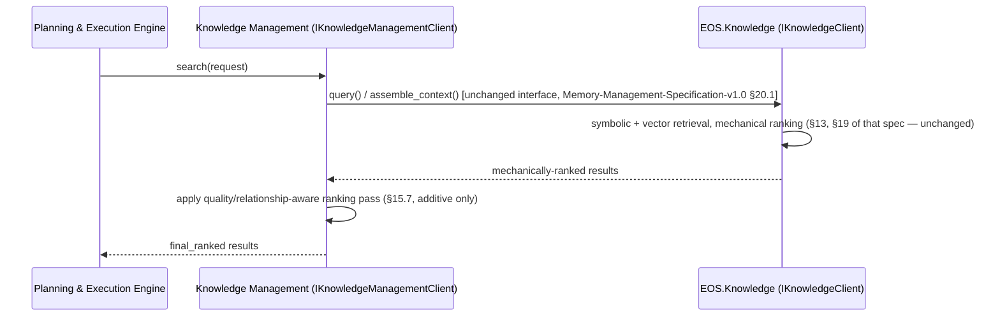
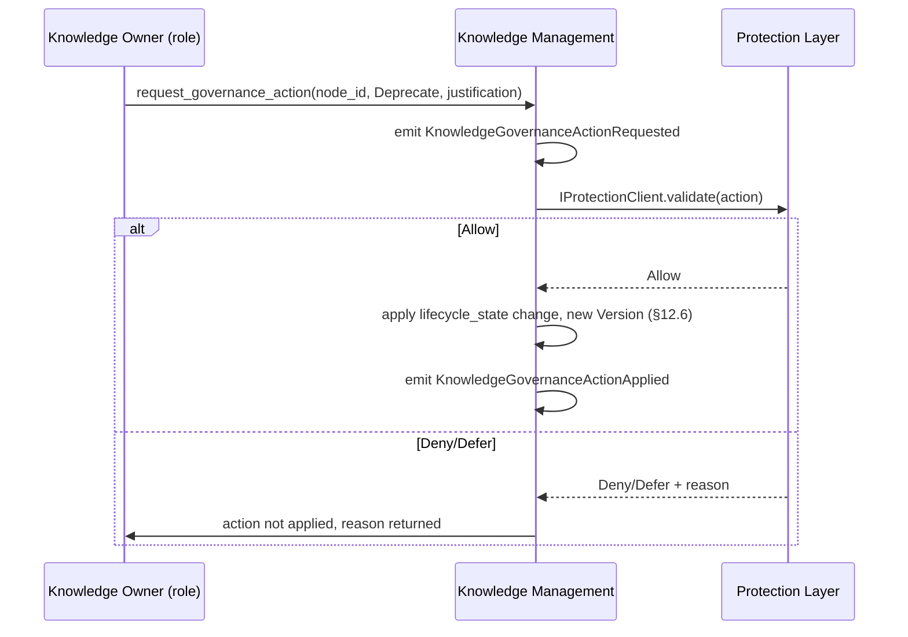
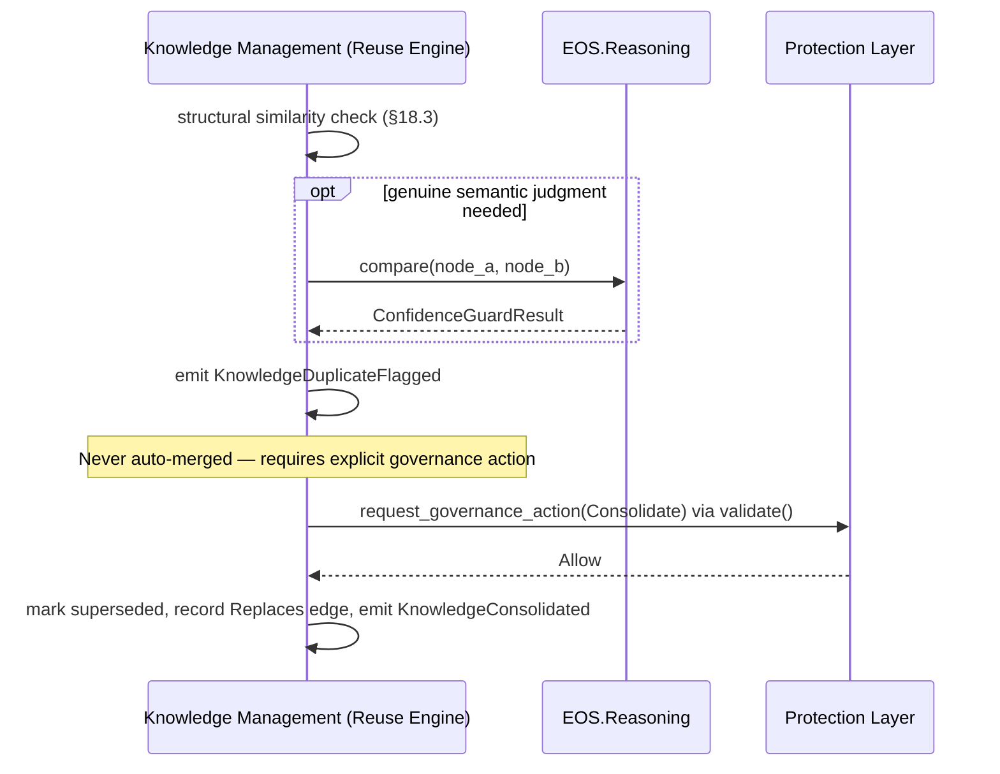
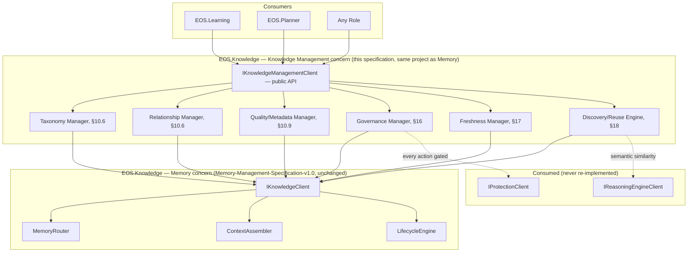

# Knowledge Management Specification v1.0

**Document Type:** Complementary Engineering Specification
**Extends:** `@EOS-Specification.md` (the Constitution, immutable), and is a peer to `@Learning-Engine-Specification-v1.1.md`, `@Memory-Management-Specification-v1.0.md`, `@Reasoning-Engine-Specification-v1.0.md`, `@Protection-Layer-Specification-v1.0.md`, and `@Planning-Execution-Engine-Specification-v1.0.md` (all immutable, approved)
**Status:** Proposed
**Primary Constitutional Anchors:** §0.5 — Knowledge Graph (content vocabulary, §0.5.1) · §0.5.2 — Query Interface · Constitution §0.1.1.5 — No Data Duplication

## 0. A Required Reconciliation (Read This First)

This document must resolve a genuine, direct tension before proceeding, and does so transparently rather than silently. Two already-approved, immutable documents make claims that a naive reading of this task's mission would contradict:

- **Memory-Management-Specification-v1.0** ADR-M001 states it is "the full implementation specification of §0.5" and is realized entirely by `EOS.Knowledge`/`EOS.KnowledgeGraph`/`EOS.VectorStore`.
- **Reasoning-Engine-Specification-v1.0** §15.5 states explicitly: *"'Knowledge Management' as named in the governing task's interaction list is the same subsystem Memory-Management-Specification-v1.0 already fully specifies... This specification does not treat 'Knowledge Management' as a distinct fourth subsystem — doing so would immediately create the duplicated-ownership problem."*

This task's governing prompt, however, explicitly requires a distinct Knowledge Management Specification, states "Knowledge belongs only to the Knowledge Management subsystem," and draws a sharp line — "Memory stores memories, not knowledge ownership" — that Memory-Management-Specification-v1.0 itself never drew this precisely.

**Resolution (see ADR-KM001 for full reasoning):** Reasoning-Engine-Specification-v1.0 §15.5 remains correct at the *project* level — Knowledge Management introduces **no new project**. It is realized within the exact same `EOS.Knowledge`/`EOS.KnowledgeGraph`/`EOS.VectorStore` triad Memory-Management-Specification-v1.0 already uses (Constitution Part 1, unchanged). What this document adds is a second, complementary **architectural concern** within that same subsystem — content taxonomy, relationships, quality/governance/freshness metadata — that Constitution §0.5.1's one-line node-type list and Memory-Management-Specification-v1.0's storage/retrieval-focused treatment left genuinely undefined. Memory owns *where knowledge lives, for how long, and how it is mechanically retrieved and ranked* (Memory-Management-Specification-v1.0 §4, §13, §19, unchanged, not touched by this document). Knowledge Management owns *what a piece of knowledge structurally is, how it relates to other knowledge, how good it is, who governs it, and how fresh it remains* — descriptive and governance metadata layered onto the exact same nodes Memory already persists, never a second store, never an altered retrieval algorithm, never a moved responsibility. No content of Memory-Management-Specification-v1.0 or Reasoning-Engine-Specification-v1.0 is altered by this document; both remain accurate as written.

---

## 1. Executive Summary

Knowledge Management is the subsystem that defines what engineering knowledge structurally *is*: its taxonomy, its relationships to other knowledge, its quality and freshness as measurable properties, and its governance and lifecycle as a content object — realized entirely within the already-approved `EOS.Knowledge`/`EOS.KnowledgeGraph`/`EOS.VectorStore` triad, as a metadata and semantics layer, never a new project or store. It never stores memory (Memory's job), proposes new knowledge (Learning's job), validates safety/policy (Protection's job), reasons over knowledge (Reasoning's job), or plans/schedules (Planning & Execution's job) — it only defines, classifies, scores, governs, and makes discoverable the knowledge those subsystems create, promote, validate, and consume.

## 2. Purpose

To give another autonomous engineer a complete, implementation-independent architecture for knowledge-as-a-content-object — taxonomy, relationships, quality, governance, freshness, search strategy, and reuse — precise enough to implement without judgment calls, while resolving (§0 above, ADR-KM001) the genuine boundary tension this task's mission introduces against two already-approved documents.

## 3. Scope

In scope:
- A content taxonomy (§11) richer than Constitution §0.5.1's five base node types, and the Knowledge Catalog/Registry/Ontology architecture (§10) needed to organize it
- A relationship model (§14) between knowledge objects — genuinely new; neither Constitution §0.5 nor Memory-Management-Specification-v1.0 defines typed relationships between nodes
- Quality attributes (§13), Freshness (§17), and Governance (§16) as tracked metadata on existing nodes
- Search *strategy* and *taxonomy of intent* (§15) as a layer atop Memory's already-approved, unchanged retrieval mechanics and ranking formula (Memory-Management-Specification-v1.0 §13, §19)
- Knowledge Reuse discovery/recommendation/duplicate-detection (§18), explicitly disambiguated from Memory's same-named "Memory Consolidation" (§16 of that spec) via ADR-KM004

Out of scope (see Non-Goals §5, Non-Responsibilities §7):
- Physical storage, memory-type routing, retrieval mechanics, mechanical ranking (Memory's exclusive, unchanged domain)
- Proposing new knowledge content, Meta Learning pipeline promotion (Learning Engine's exclusive domain)
- Safety/policy validation and admissibility gating (Protection Layer's exclusive domain)
- Semantic judgment, similarity computation, confidence computation (Reasoning Engine's exclusive domain)
- Task/plan generation and execution (Planning & Execution Engine's exclusive domain)

## 4. Goals

- Give every piece of persisted engineering knowledge a well-defined taxonomy classification, an explicit relationship graph to related knowledge, a measurable quality/freshness profile, and clear governance metadata — none of which Constitution §0.5.1 or Memory-Management-Specification-v1.0 defined in this depth.
- Make knowledge discoverable and reusable (§18) by applying quality/relationship-aware ranking *on top of* Memory's already mechanically-ranked results — the exact "future consumer" role Memory-Management-Specification-v1.0 ADR-M003 explicitly anticipated and reserved.
- Keep knowledge searchable, versioned, traceable, explainable, governed, and auditable (this task's Architecture Rules) without introducing a second store or a competing retrieval algorithm.
- Remain fully offline and require no new project registration (ADR-KM001).

## 5. Non-Goals

- Knowledge Management does not decide *where* a piece of content is stored or *how long* it persists before expiring — that remains Memory's Storage Strategy and Memory Expiration (Memory-Management-Specification-v1.0 §12, §18), unchanged.
- Knowledge Management does not execute the retrieval query or compute the mechanical ranking score — that remains Memory's Retrieval Strategy and Retrieval Ranking (Memory-Management-Specification-v1.0 §13, §19), unchanged; Knowledge Management only applies an *additional* quality/relationship-aware layer on top of Memory's output (§15.7).
- Knowledge Management does not decide whether a Lesson becomes a Pattern, Best Practice, Principle, Golden Path, Automation, Reusable Component, or Platform Capability — that remains Learning Engine's exclusive Meta Learning pipeline (Learning-Engine-Specification-v1.1 §7), unchanged; Knowledge Management only classifies and enriches the resulting content once Learning Engine has made that decision.
- Knowledge Management does not gate whether an action on knowledge is safe or policy-compliant — that remains Protection Layer's exclusive domain (Protection-Layer-Specification-v1.0 §6); Knowledge Management's Governance (§16) is descriptive record-keeping (who is the steward, what is the approval reference, what version is this), never the enforcement gate itself.
- Knowledge Management does not compute confidence, similarity, or trust scores — those remain Reasoning Engine's (`get_trust_signal`, `compare`, Reasoning-Engine-Specification-v1.0 §16.1) and Learning Engine's (`trust_score`, Learning-Engine-Specification-v1.1 §24.4); Knowledge Management's Quality attributes (§13) *record and track* these values as metadata, never recompute them.
## 6. Responsibilities

Knowledge Management, and only Knowledge Management, owns:

1. Knowledge Repository organization, Knowledge Graph *semantic schema* (as distinct from Memory's Knowledge Graph *storage engine*, §10), Knowledge Taxonomy, Knowledge Relationships, Knowledge Classification, Knowledge Quality (metadata model), Knowledge Governance (metadata/stewardship model), Knowledge Lifecycle (content-state, distinct from Memory's memory-type lifecycle), Knowledge Freshness, Knowledge Versioning (content-object version, distinct from Artifact Registry file versioning), Knowledge Discovery, Knowledge Search *strategy/taxonomy* (distinct from Memory's retrieval *mechanics*), Knowledge Reuse (discovery/recommendation/duplicate-detection), Knowledge Traceability (verbatim from the governing task) — detailed in §10–§18.
2. Formally reconciling its existence against the two approved documents that predate it (§0, ADR-KM001).

## 7. Non-Responsibilities

**[The single most load-bearing table in this document — every capability below traces to its actual owner, and every row explicitly names the boundary this document does not cross.]**

| Capability | Actual Owner | Anchor |
|---|---|---|
| Memory-type classification/routing (Working/Short-term/Long-term/Episodic/Semantic/Project/Session), physical store mapping | Memory | Memory-Management-Specification-v1.0 §4, §10, §12 |
| Retrieval mechanics (symbolic + vector hybrid query execution) | Memory | Memory-Management-Specification-v1.0 §13 |
| Mechanical retrieval ranking (vector similarity, recency, domain match, access frequency) | Memory | Memory-Management-Specification-v1.0 §19 |
| Context Assembly (bounded, budgeted context composition) | Memory | Memory-Management-Specification-v1.0 §15 |
| Consolidation (ephemeral → persistent memory promotion), Compression, Expiration of memory types | Memory | Memory-Management-Specification-v1.0 §16, §17, §18 |
| Meta Learning pipeline stage transitions (Lesson→Pattern→…→Platform Capability), ROI Gate, Quarantine | Learning Engine | Learning-Engine-Specification-v1.1 §7 |
| Similarity computation, trust/confidence scoring, summarization content generation | Reasoning Engine | Reasoning-Engine-Specification-v1.0 §6, §16.1 |
| Safety/policy validation, admissibility gating, resource ceiling enforcement | Protection Layer | Protection-Layer-Specification-v1.0 §6 |
| Task/plan generation, execution dispatch | Planning & Execution Engine | Planning-Execution-Engine-Specification-v1.0 §6 |
| Embedding computation | AI Provider Layer (forthcoming), consumed by Memory | Memory-Management-Specification-v1.0 §20.2 |

**Rule (reaffirmed from the governing task, read together with §0's reconciliation):** "Knowledge Management owns knowledge [as a content object: taxonomy, relationships, quality, governance, freshness, discovery]. It does NOT own Memory [storage/retrieval mechanics], Learning [pipeline promotion], Planning [plan generation], Scheduling [dispatch], Reasoning [semantic judgment], AI inference." Any capability not explicitly listed in §6 defaults to *not* being Knowledge Management's responsibility.

## 8. Functional Requirements

| ID | Requirement |
|---|---|
| FR-KM1 | Knowledge Management MUST NOT introduce a new physical store or new project — every taxonomy/relationship/quality/governance/freshness field is a property on the exact `KnowledgeNode` structure Memory-Management-Specification-v1.0 §20.1 already defines, written via that document's already-published `IKnowledgeClient.update()`. |
| FR-KM2 | Every knowledge object MUST carry, at minimum, the fields this task's Architecture Rules require: Owner, Confidence, Quality, Source, Version, Lifecycle State, Last Validation, Freshness, Relationships (§10.9 Metadata Management). |
| FR-KM3 | Knowledge Management MUST NOT alter Memory's retrieval algorithm (Memory-Management-Specification-v1.0 §13) or ranking formula (§19) — its Search Strategy (§15) applies only as an additional, separate ranking pass over Memory's already-returned, already-mechanically-ranked results. |
| FR-KM4 | Knowledge Management MUST NOT make a Meta Learning pipeline-stage promotion decision — it may only classify/enrich a `PipelineRecord`'s resulting content once Learning Engine has already promoted it (consuming `LessonPromoted`/`BestPracticeRatified`/etc., Learning-Engine-Specification-v1.1 §15, read-only). |
| FR-KM5 | Every Knowledge Relationship (§14) MUST be explicit and typed — no implicit/inferred relationship may be presented as if it were an explicitly declared one. |
| FR-KM6 | Knowledge Versioning (§12) MUST be additive/append-only, mirroring Constitution Part 8's Artifact Registry versioning rule (Memory-Management-Specification-v1.0 §12's Long-term Memory backing) — no in-place mutation of a prior version. |
| FR-KM7 | Freshness scoring (§17) MUST NOT trigger a Memory Expiration/Compression action directly — it may only surface as a signal Memory's own, already-approved, independently-configurable Compression eligibility (Memory-Management-Specification-v1.0 §17.1) may optionally consult; Knowledge Management never calls into Memory's internal lifecycle engine to force a transition. |
| FR-KM8 | "Knowledge Consolidation" (Knowledge Reuse, §18) MUST be clearly and permanently disambiguated from Memory's "Memory Consolidation" (Memory-Management-Specification-v1.0 §16) per ADR-KM004 — the two terms must never be used interchangeably in any future document. |
| FR-KM9 | All quality/confidence/trust values recorded in Knowledge Quality (§13) MUST be sourced from their owning subsystem's already-published computation (Reasoning Engine's `confidence`/`get_trust_signal`, Learning Engine's `trust_score`) — Knowledge Management never independently recomputes a competing value for the same field. |
| FR-KM10 | Every Knowledge Governance action (§16) that changes a knowledge object's Owner, Lifecycle State, or Version MUST be routed through Protection Layer's `IProtectionClient.validate()` (Protection-Layer-Specification-v1.0 §23.1) before taking effect — Knowledge Management records governance metadata, but does not bypass Protection's existing gate to do so. |

## 9. Non-Functional Requirements

| NFR Category | Requirement |
|---|---|
| No duplication | FR-KM1; verified structurally — no new table/store/project appears anywhere in this specification |
| Traceability | Every Knowledge Relationship (§14) and Version (§12) is resolvable back to an Artifact Registry evidence reference (Constitution Part 8), consistent with the platform-wide evidence-over-assertion principle (Constitution §0.1.1.1) |
| Governability | Every governance-affecting change passes through Protection (FR-KM10) |
| Offline-first | Fully offline; no external dependency beyond what Memory/Reasoning/Learning already require |
| Non-interference | Knowledge Management's own operations never measurably slow Memory's retrieval path (§25) — its enrichment layer runs as an additive pass, not an inline blocking step in Memory's own algorithm |
| Searchability | Every knowledge object is discoverable via at least one of Search Strategy's intent types (§15.1) once its taxonomy classification (§11) is assigned |
## 10. Knowledge Architecture

### 10.1 Overview

```
                 ┌───────────────────────────────────────────────────┐
                 │        IKnowledgeManagementClient (§20.1)           │
                 └───────────────────────┬───────────────────────────┘
                                          │
        ┌──────────────┬──────────────┬──┴───────────┬──────────────┬──────────────┐
        ▼              ▼              ▼              ▼              ▼              ▼
   Taxonomy       Relationship    Quality/         Governance    Freshness      Discovery/
   Manager        Manager         Metadata         Manager       Manager        Reuse Engine
   (§10.6)        (§10.6)         Manager          (§16)         (§17)          (§18)
                                  (§10.9)
        │              │              │              │              │              │
        └──────────────┴──────────────┴──────────────┴──────────────┴──────────────┘
                                          │
                                          ▼  (all metadata is read/written as node properties via)
                          `IKnowledgeClient.query()` / `.update()`
                          (Memory-Management-Specification-v1.0 §20.1, unchanged, consumed as-is)
                                          │
                                          ▼
                     EOS.KnowledgeGraph + EOS.VectorStore (Memory's, unchanged, no new store)
```

All six components above are internal to the same `EOS.Knowledge` project Memory-Management-Specification-v1.0 already uses (ADR-KM001) — Knowledge Management introduces no sibling project, and every arrow into "EOS.KnowledgeGraph + EOS.VectorStore" flows exclusively through Memory's already-published `IKnowledgeClient`, never a direct bypass (reaffirms Constitution Part 2's single-access-point dependency rule, already reaffirmed by Memory-Management-Specification-v1.0 FR-M4).

### 10.2 Knowledge Repository

The logical view of all knowledge content — not a new store, but the conceptual name for "everything already persisted in `EOS.KnowledgeGraph`/`EOS.VectorStore` via Memory's Long-term/Semantic/Episodic memory types" (Memory-Management-Specification-v1.0 §10.3–§10.5), now additionally decorated with this specification's taxonomy/relationship/quality/governance/freshness metadata.

### 10.3 Knowledge Graph (semantic schema, distinct from Memory's storage engine)

Constitution §0.5 names the Knowledge Graph as a single concept; Memory-Management-Specification-v1.0 already claimed the *storage engine* half of that concept (graph structure persistence, backed by SQL Server per Constitution Part 4). This specification claims the *semantic schema* half: what a node's taxonomy classification is (§11), what typed edges connect it to other nodes (§14), and what metadata properties (§10.9) it carries. The Constitution's own framing — "the Knowledge Graph is a logical architecture component; do not assume any specific graph database technology" (this task's Architecture Rules) — is honored identically to how Memory-Management-Specification-v1.0 already treats ChromaDB/SQL Server as infrastructure, never business logic (Memory-Management-Specification-v1.0 §1).

### 10.4 Knowledge Catalog

A queryable index of every knowledge object's taxonomy classification (§11) and top-level metadata (§10.9) — realized as a query view over `IKnowledgeClient.query()` (Memory-Management-Specification-v1.0 §20.1) filtered by the taxonomy/quality/governance fields this specification adds, never a separate index store (FR-KM1).

### 10.5 Knowledge Index

Distinct from Memory's `EOS.VectorStore` embedding index (Memory-Management-Specification-v1.0 §14, unchanged) — the Knowledge Index here refers to the *taxonomy/relationship* index (e.g., "all knowledge objects tagged `EngineeringStandard` that relate to `domain_tags=mobile`") used by the Discovery/Reuse Engine (§18) and Search Strategy (§15), built from the same metadata properties §10.9 defines, not a new vector or embedding mechanism.

### 10.6 Knowledge Registry / Relationship Manager / Taxonomy Manager

- **Taxonomy Manager** — assigns and maintains each node's classification (§11) against the taxonomy hierarchy.
- **Relationship Manager** — maintains the typed relationship edges (§14) between nodes.
- **Knowledge Registry** — the combined taxonomy + relationship view, i.e., the practical realization of the Knowledge Catalog (§10.4) plus the Relationship Manager's edge set, together forming the "Registry" a consumer queries to discover related, correctly-classified knowledge.

### 10.7 Ontology Support

A lightweight, EOS-internal ontology (not a general-purpose ontology-engineering framework) defining which Knowledge Types (§11) may participate in which Relationship types (§14) — e.g., a `Fact` may `Support` a `BestPractice`, but a `Lesson` (pre-promotion, still Episodic per Memory-Management-Specification-v1.0 §10.4) may not yet `Supersede` anything, since it hasn't been generalized. This ontology is externally configurable (`Knowledge.json`, Constitution Part 10, the same file Memory-Management-Specification-v1.0 §17.1 already references for its own thresholds) rather than hardcoded.

### 10.8 Metadata Management

The schema and write-path for every field this task's Architecture Rules mandate (§10.9 below) — Metadata Management is the component that ensures FR-KM2 is upheld for every knowledge object, regardless of which Knowledge Type (§11) it is.

### 10.9 Mandatory Metadata Schema (resolves FR-KM2)

Every knowledge object carries, as properties on its existing `KnowledgeNode` (Memory-Management-Specification-v1.0 §20.1, unchanged structure — these are additive fields, not a redefinition):

```
KnowledgeNode (Memory's structure, unchanged) {
  ...existing fields (node_id, node_type per Constitution §0.5.1, domain_tags, ...)
  + knowledge_metadata: {
      owner: role_id                          — Constitution §0.2.1 role identity
      confidence: float [0,1]                 — sourced from Reasoning/Learning (FR-KM9), never recomputed here
      quality: QualityProfile (§13)
      source: evidence_ref                    — Artifact Registry pointer, Constitution Part 8
      version: VersionRecord (§12.5)
      lifecycle_state: KnowledgeLifecycleState (§12, §21.1)
      last_validation: timestamp
      freshness: FreshnessScore (§17.1)
      relationships: RelationshipEdge[] (§14)
      taxonomy: TaxonomyClassification (§11)
  }
}
```
## 11. Knowledge Types

**Explicit boundary:** this taxonomy classifies content *within* Constitution §0.5.1's five base node types (Fact, Lesson, Pattern, Decision, Risk) and Learning Engine's promoted pipeline stages (Best Practice, Principle, Golden Path, Automation, Reusable Component, Platform Capability) — it does not replace or duplicate that vocabulary (Memory-Management-Specification-v1.0 §6, "no competing content taxonomy"); it is a finer-grained *classification tag* layered on top, stored in `knowledge_metadata.taxonomy` (§10.9).

| Knowledge Type (this taxonomy) | Maps Onto (existing vocabulary) | Notes |
|---|---|---|
| **Facts** | `Fact` node type (Constitution §0.5.1) | Unchanged base type |
| **Rules** | `Fact` or ratified `BestPractice` expressed as an enforceable rule | e.g., a Constitution NFR threshold expressed as knowledge content |
| **Patterns** | `Pattern` node type, post Learning Engine promotion (Learning-Engine-Specification-v1.1 Part 14) | Never self-assigned by Knowledge Management — only applied once `LessonPromoted` (Learning-Engine-Specification-v1.1 §15) has fired |
| **Best Practices** | Learning Engine's `BestPractice` pipeline stage | Same non-self-assignment rule as Patterns |
| **Lessons Learned** | `Lesson` node type = Memory's Episodic Memory (Memory-Management-Specification-v1.0 §10.4) | Pre-promotion content |
| **Engineering Standards** | Ratified `Principle`/`BestPractice` scoped platform-wide (no `domain_tags` restriction) | A taxonomy sub-classification, not a new pipeline stage |
| **Architecture Decisions** | `Decision` node type (Constitution §0.5.1) — ADRs | Unchanged base type |
| **Project Knowledge** | Any type scoped by `domain_tags` (Learning-Engine-Specification-v1.1 §9, Memory-Management-Specification-v1.0 §10.6's Project Memory) | A view/tag, not a new type |
| **Domain Knowledge** | Any type scoped to a Competency Graph domain (Constitution §0.3.1) | Cross-references Constitution's existing domain vocabulary, including Mobile (Part 15) |
| **Operational Knowledge** | `Fact`/`Pattern` content describing runtime operational behavior (e.g., Scheduler tuning patterns, Constitution Part 7) | A taxonomy sub-classification |
| **User Knowledge** | `Fact` content sourced from human operator input (Protection-Layer-Specification-v1.0 §15.1's User Permissions context) | Tagged by source (§10.9) as human-originated |
| **AI Knowledge** | `Fact`/`Pattern` content sourced from Reasoning Engine output (`Decision.evidence_refs`, Reasoning-Engine-Specification-v1.0 §13.3) | Tagged by source as AI-originated; still requires the same Confidence/Quality metadata (§13) as any other type — AI origin does not exempt it from governance |
| **Reference Knowledge** | External-standard-derived `Fact` content (e.g., a language spec citation) | Lowest-authority tier by default in Search ranking (§15.7) unless explicitly promoted |

**Rule:** Knowledge Management's Taxonomy Manager (§10.6) assigns these classification tags; it never creates a node, never promotes a node between Constitution §0.5.1/Learning Engine pipeline stages, and never overrides a Learning Engine promotion decision (FR-KM4).

## 12. Knowledge Lifecycle

Distinct from, and layered above, Memory's memory-type lifecycle (Working→...→Archived, Memory-Management-Specification-v1.0 §11) and Learning Engine's pipeline-stage lifecycle (Lesson→...→Platform Capability, Learning-Engine-Specification-v1.1 §16) — this is the lifecycle of a knowledge object's *governance/content* state, which can advance independently of (though often correlates with) those two.

```
Creation → Validation → Approval → Promotion → Publication → Versioning (ongoing)
                                                       │
                                    ┌──────────────────┼──────────────────┐
                                    ▼                  ▼                  ▼
                                  Update           Deprecation         Archiving
                                    │                  │                  │
                                    └──────────────────┴──────────────────┘
                                                       ▼
                                                  Retirement
                                                       │
                                                       ▼ (if wrongly retired)
                                                  Recovery
```

### 12.1 Creation

A knowledge object's Knowledge Lifecycle begins the moment it first receives a `knowledge_metadata` block (§10.9) — for a `Lesson`, this coincides with Memory's `consolidate()` (Memory-Management-Specification-v1.0 §16.2), but Creation here refers specifically to the *metadata* being populated, not the underlying node's storage (already Memory's concern).

### 12.2 Validation

Structural validation only (required metadata fields present, taxonomy tag valid per the Ontology, §10.7) — **not** the same as Protection Layer's safety/policy validation (Protection-Layer-Specification-v1.0 §14.2 step 3, Knowledge Validation) or Reasoning Engine's evidence-resolution check (Reasoning-Engine-Specification-v1.0 §10.1) — Knowledge Management's Validation step confirms the *object is well-formed as a knowledge object*, deferring safety/policy entirely to Protection (FR-KM10).

### 12.3 Approval

Descriptive record-keeping only (FR-KM10's boundary) — Knowledge Management records *which* approval reference (an ADR, a Learning Engine `BestPracticeRatified` event) authorized this object's current state; it never itself performs the approval workflow (Learning Engine's Decision Matrix-routed ratification, Learning-Engine-Specification-v1.1 Part 14 table, remains the actual approval mechanism, unchanged).

### 12.4 Promotion

**Not** a redefinition of Learning Engine's Meta Learning promotion (FR-KM4) — this Lifecycle stage refers only to a knowledge object's *taxonomy re-classification* once Learning Engine's own promotion has already occurred (e.g., re-tagging a node from `Lessons Learned` to `Patterns`, §11, upon consuming `LessonPromoted`).

### 12.5 Publication

The point at which a knowledge object becomes discoverable via Search Strategy (§15) — a separate gate from mere storage; a `Lesson` is stored the moment Memory consolidates it, but may not be "Published" for general discovery until its Quality profile (§13) clears a minimum bar (`Thresholds.json`, Constitution Part 10).

### 12.6 Versioning

Every content-affecting change creates a new `VersionRecord` (§10.9) referencing its predecessor — append-only (FR-KM6), mirroring the immutable-artifact pattern Constitution Part 8 §8.3 already establishes for the Artifact Registry, applied here to knowledge-object metadata specifically (never a redefinition of Artifact Registry's own file-level versioning).

### 12.7 Update

A content or metadata change that does not warrant Deprecation — produces a new Version (§12.6) via the same append-only rule.

### 12.8 Deprecation

Marks a knowledge object as no longer recommended for new use, without removing it — distinct from Archiving (§12.9); a Deprecated object remains fully queryable but is down-ranked in Search Strategy (§15.7).

### 12.9 Archiving

Mirrors Memory's own Archival concept (Memory-Management-Specification-v1.0 §18) at the knowledge-object metadata level — Knowledge Management's Archiving lifecycle state is a *tag*, not a trigger; the actual data-retention action (compression, cold storage) remains entirely Memory's mechanism (FR-KM7), never invoked directly by Knowledge Management.

### 12.10 Retirement

The terminal state — a Retired knowledge object is excluded from Search Strategy discovery (§15) entirely (unlike Deprecated, which remains discoverable but down-ranked) but is never physically deleted (Constitution §0.1.1.1, evidence-over-assertion; mirrors Learning Engine's own "never silent deletion" posture, Learning-Engine-Specification-v1.1 FR-9's Archived state).

### 12.11 Recovery

Reverses a Retirement (or a mistaken Deprecation) — always requires the same Protection-gated governance action as any other Lifecycle-state change (FR-KM10), and always records the recovery justification as a new Version (§12.6), never a silent rollback.
## 13. Knowledge Quality

A `QualityProfile` (§10.9) with the ten attributes this task's mission requires — each attribute's *value* is sourced from its actual owning subsystem (FR-KM9); Knowledge Management's role is to define the schema, aggregate the values into one profile, and track them over time, never to compute a competing value.

| Attribute | Source (owner of the value) | Knowledge Management's Role |
|---|---|---|
| Confidence | Reasoning Engine (`Decision.confidence`, `get_trust_signal`, Reasoning-Engine-Specification-v1.0 §13.4/§16.1) | Records and tracks the value over time; never recomputes |
| Accuracy | Sampled post-hoc validation (mirrors Reasoning Engine's own Decision Accuracy KPI methodology, Reasoning-Engine-Specification-v1.0 §25) | Records the sampled outcome as a rolling accuracy score |
| Completeness | Structural check — are all §10.9 mandatory fields populated | Computed directly by Knowledge Management (a structural, not semantic, computation — consistent with FR-KM9's boundary, since this is metadata-completeness, not a judgment about the content's truth) |
| Freshness | §17 (Knowledge Management's own Freshness Manager) | Computed directly by Knowledge Management — this is the one quality attribute Knowledge Management does own the computation of, since no other subsystem defines it |
| Reliability | Derived from Learning Engine's `trust_score` for the object's originating source (Learning-Engine-Specification-v1.1 §24.4) | Records and tracks; never recomputes |
| Verification Status | Learning Engine's Reality Validation outcome (Constitution §0.15) for the underlying Task/Lesson, where applicable | Records the outcome as a status enum (`Unverified`/`Verified`/`Contested`) |
| Source Quality | A function of the Knowledge Type's source tag (§11 — e.g., AI Knowledge vs. Engineering Standard) and that source's historical Reliability | Computed by Knowledge Management from already-sourced inputs, never an independent semantic judgment |
| Engineering Impact | Sampled from downstream Golden Path/Automation adoption (Learning-Engine-Specification-v1.1 Part 14) referencing this knowledge object | Records adoption count/frequency as a tracked metric |
| Business Impact | Sampled from Engineering Economics ROI realized (Constitution §0.16.2, Learning-Engine-Specification-v1.1 §11.3) where a Golden Path traces back to this knowledge object | Records the linked ROI outcome; never recomputes the ROI formula itself |
| Reusability | Derived from Knowledge Reuse's own discovery/recommendation frequency (§18.2) | Computed by Knowledge Management from its own Reuse Engine's activity log |

### 13.1 Quality Profile as a Single Aggregate

`QualityProfile` is a single structured value (not ten independent free-floating scores) attached to `knowledge_metadata.quality` (§10.9) — this keeps FR-KM2's "Quality" field well-defined as one coherent object rather than an ambiguous scattering of numbers.

## 14. Knowledge Relationships

**Genuinely new territory:** neither Constitution §0.5 nor Memory-Management-Specification-v1.0 defines typed relationships between knowledge nodes — Memory's own node schema (Memory-Management-Specification-v1.0 §9) has no relationship field at all. This section is additive, not a redefinition of anything.

| Relationship | Semantics | Ontology Constraint (§10.7) |
|---|---|---|
| **Depends On** | Object A requires Object B's content to be valid/applicable | A `Pattern` may Depend On a `Fact`; a `Fact` may not Depend On a `Lesson` (pre-promotion content cannot be a dependency of settled knowledge) |
| **Derived From** | Object A was generalized/extracted from Object B | Mirrors Learning Engine's own provenance chain concept (`source_lesson_ids`, Learning-Engine-Specification-v1.1 §9) — Knowledge Management's Derived From edge is the knowledge-object-level expression of that same provenance, read from Learning Engine's events (read-only, never independently asserted) |
| **References** | A loose citation, no dependency implied | The weakest relationship type; used for Reference Knowledge (§11) |
| **Related To** | A symmetric, non-directional association surfaced by Knowledge Reuse's similarity detection (§18.3) — **explicitly not** a Reasoning Engine `compare()` call result reused here; Knowledge Management's own lightweight structural/taxonomy similarity (shared taxonomy tag + shared `domain_tags`) populates this edge, never duplicating Reasoning Engine's semantic comparison (FR-KM9's boundary applied to relationships, not just quality) | Any two types may be Related To each other |
| **Replaces** | A directional, intentional supersession — the new object is the sanctioned replacement | Requires a Governance approval reference (§16.3) — never auto-assigned by the Reuse Engine |
| **Supersedes** | Synonym-in-effect of Replaces, used specifically for versioned Engineering Standards (§11) where the temporal ordering matters more than the replacement intent | Same governance requirement as Replaces |
| **Conflicts With** | Two objects make contradictory claims — surfaced by Reasoning Engine's Conflicting Evidence failure mode (Reasoning-Engine-Specification-v1.0 §21) when encountered during a reasoning pass, and recorded here as a persistent edge so future consumers see the conflict without re-discovering it each time | Recorded, never auto-resolved — resolution requires Governance action (§16) |
| **Supports** | Object A provides evidence strengthening Object B's claim | Used to compute Completeness's "evidence strength" signal, feeding Reasoning Engine's own Confidence Evaluation (Reasoning-Engine-Specification-v1.0 §10 Stage 10) as one of the inputs it may consult via Memory's Context Assembly (Memory-Management-Specification-v1.0 §15) — Knowledge Management supplies the edge, Reasoning Engine (unchanged) decides what to make of it |
| **Requires** | A stronger form of Depends On — Object A is structurally invalid without Object B (e.g., an Engineering Standard requiring its underlying ADR) | Enforced at Validation (§12.2) — a Requires edge with a missing/Retired target fails structural validation |

### 14.1 Relationship Storage

Every `RelationshipEdge` is stored as a property on the source node's `knowledge_metadata.relationships` array (§10.9) via Memory's existing `IKnowledgeClient.update()` (Memory-Management-Specification-v1.0 §20.1) — no new graph-edge store, consistent with FR-KM1.
## 15. Knowledge Search

**Explicit boundary (resolves FR-KM3):** Memory-Management-Specification-v1.0 §13 (Retrieval Strategy) and §19 (Retrieval Ranking) already define, exactly and completely, the hybrid symbolic+vector retrieval algorithm and the mechanical ranking formula (`w1·vector_similarity + w2·recency_decay + w3·domain_match + w4·access_frequency`). This document does not redefine, re-weight, or duplicate either. "Knowledge Search" here is a **taxonomy of search intent** plus an **additional quality/relationship-aware ranking pass** applied strictly after Memory has already returned and mechanically ranked its results — exactly the role Memory-Management-Specification-v1.0 ADR-M003 explicitly reserved for "a future consumer" that needs trust-weighted ranking.

### 15.1 Search Intent Taxonomy

| Intent Type | Definition | Realized Via |
|---|---|---|
| **Semantic Search** | "Find knowledge similar in meaning to X" | Memory's vector stage (Memory-Management-Specification-v1.0 §13, step 2), unchanged |
| **Structured Search** | "Find knowledge matching explicit filters" (taxonomy tag, `domain_tags`, date range) | Memory's symbolic stage (§13, step 1), unchanged, now additionally filterable by this document's taxonomy (§11) and quality (§13) fields |
| **Hybrid Search** | Both of the above combined | Memory's existing hybrid retrieval (§13), unchanged |
| **Relationship Navigation** | "Find knowledge related to X via a specific edge type" (§14) | A new query shape, realized via `IKnowledgeManagementClient.navigate_relationships()` (§20.1) — reads `knowledge_metadata.relationships` (§14.1), never a new store |
| **Context-aware Search** | "Find knowledge relevant to the current reasoning/planning request's context" | Delegated entirely to Memory's Context Assembly (Memory-Management-Specification-v1.0 §15), unchanged — Knowledge Management adds no separate context-assembly mechanism |
| **Filter Strategy** | Which taxonomy/quality/governance fields are valid filter dimensions | Defined here (§11, §13, §16) as the *vocabulary* of filters Memory's existing symbolic stage already supports mechanically |
| **Ranking Strategy** | See §15.7 below | The one genuinely additive piece |

### 15.7 Quality/Relationship-Aware Ranking Pass (additive, post-Memory)

```
on knowledge_search(request):
    memory_results = IKnowledgeClient.query(...)          # Memory's existing interface, unchanged
    memory_ranked = memory_results                        # already mechanically ranked, Memory-Management-Specification-v1.0 §19
    km_score(item) = q1 * item.quality.confidence          # sourced value (FR-KM9), not recomputed
                    + q2 * item.quality.reliability
                    + q3 * relationship_relevance(item, request.relationship_context)  # §14
                    - q4 * deprecation_penalty(item.lifecycle_state)                    # §12.8
    final_ranked = re_sort(memory_ranked, by=km_score, stable=True)  # stable sort preserves Memory's
                                                                       # relative ordering for ties
    return final_ranked
```

Weights `q1..q4` are externally configurable (`Knowledge.json`, Constitution Part 10), fully independent of Memory's own `w1..w4` weights (Memory-Management-Specification-v1.0 §19.1) — the two weighting schemes never merge into one formula, keeping FR-KM3's boundary structurally clean.

## 16. Knowledge Governance

Descriptive metadata and stewardship record-keeping (§0's layering decision) — never the enforcement mechanism itself (that remains Protection Layer, unchanged, FR-KM10).

### 16.1 Ownership

`knowledge_metadata.owner` (§10.9) — the role (Constitution §0.2.1) accountable for a knowledge object's continued correctness. Assigning/changing an owner is a Governance action subject to Protection validation (FR-KM10).

### 16.2 Stewardship

A distinct, optional role from Ownership — the Steward is responsible for periodic Revalidation (§17.4) even if they are not the accountable Owner (e.g., a QA role stewarding Engineering Standards created by a Principal Engineer).

### 16.3 Approval

Recorded, not performed (§12.3) — `knowledge_metadata.source`/version's approval reference points to the actual Decision-Matrix-routed approval (Learning Engine's `BestPracticeRatified`, an ADR, or a Protection-approved Governance action) that authorized the current state.

### 16.4 Change Control

Every Update/Deprecation/Archiving/Retirement/Recovery (§12.7–§12.11) is a Governance action requiring Protection validation (FR-KM10) and producing a new Version (§12.6, FR-KM6) — no exceptions.

### 16.5 Version Control

The append-only `VersionRecord` chain (§12.6) — distinct from, and never a replacement for, Constitution Part 8's Artifact Registry file-versioning, which continues to version the underlying evidence artifacts a knowledge object's `source` field references.

### 16.6 Audit Trail

Every Governance action (§16.4) resolves to a Protection-Layer-recorded, Artifact-Registry-anchored audit entry — reusing Protection's own auditability guarantee (Protection-Layer-Specification-v1.0 FR-P4) rather than introducing a second audit mechanism.

### 16.7 Access Policy

Knowledge Management defines *which taxonomy/governance metadata fields* are sensitive enough to require restricted read access (e.g., an object's `source` field revealing a confidential project) — but the actual access-control enforcement is Protection Layer's Permission Model (Protection-Layer-Specification-v1.0 §15), unchanged; Knowledge Management only supplies the field-sensitivity classification Protection's Policy Engine (Protection-Layer-Specification-v1.0 §10.2) consumes.
## 17. Knowledge Freshness

The one Quality attribute (§13) Knowledge Management directly computes, since no other approved document defines it.

### 17.1 Freshness Score

```
FreshnessScore = decay_function(now() - knowledge_metadata.last_validation)
                 * type_weight(taxonomy classification, §11)
```

`decay_function` and `type_weight` are externally configurable (`Knowledge.json`, Constitution Part 10) — an Engineering Standard may decay slowly (stable by nature), while Operational Knowledge (§11) tied to a specific Scheduler tuning parameter (Constitution Part 7) may decay quickly if the underlying configuration changes.

### 17.2 Verification Windows

A per-Knowledge-Type (§11) configured interval (`Knowledge.json`) after which `last_validation` is considered stale enough to schedule Revalidation (§17.4) — mirrors the Sprint/Quarterly cycle cadence pattern (Constitution §0.12.1) every prior specification in this lineage already uses for its own periodic sweeps.

### 17.3 Expiration Rules

**Explicit boundary (resolves FR-KM7):** a Freshness Score falling below threshold never itself expires or compresses the underlying stored content — that remains Memory's exclusive Expiration/Compression mechanism (Memory-Management-Specification-v1.0 §17, §18), independently configured and already complete. Knowledge Management's "Expiration Rule" here is purely a *governance signal*: the knowledge object's `lifecycle_state` (§10.9) is flagged for Revalidation or, if Revalidation repeatedly fails, Deprecation (§12.8) — a metadata-state change, never a storage action.

### 17.4 Revalidation

Triggered by an expired Verification Window (§17.2). Revalidation re-runs whatever validation mechanism originally applies to that Knowledge Type — for a `Fact`, this may mean re-confirming its evidence reference still resolves (Constitution §0.1.1.1); for a promoted `Pattern`/`BestPractice`, this may mean checking whether Learning Engine's own Fitness Functions (Learning-Engine-Specification-v1.1 §22) still show it healthy. Knowledge Management orchestrates *when* Revalidation runs; it delegates the *actual check* to whichever subsystem already owns that judgment (Reasoning Engine for evidence/confidence checks, Learning Engine's own Fitness Functions for pipeline-content health) — never re-implementing either.

### 17.5 Aging

The passive accumulation of time since `last_validation`, feeding directly into `decay_function` (§17.1) — a pure input, not a separate mechanism.

### 17.6 Drift Detection

**Explicit disambiguation (avoiding a three-way terminology collision):** this is *content* drift — a knowledge object's claim no longer matching the current state of the system it describes (e.g., an Engineering Standard referencing a Scheduler budget value that Constitution Part 10's `Thresholds.json` has since changed). This is distinct from:
- Learning Engine's "Architecture Drift" (Learning-Engine-Specification-v1.1 §24.5) — promotion-threshold code drift, a different subsystem's different concern.
- Protection Layer's `ReasoningDriftDetected` (Protection-Layer-Specification-v1.0 §19.3) — Reasoning Engine's own confidence-calibration drift, also a different concern.

Content Drift Detection here is a scheduled check (same Sprint-cycle cadence, §17.2) comparing a knowledge object's referenced facts against current live configuration/state values it cites — on mismatch, flags the object for Revalidation (§17.4), never auto-correcting the content itself (Constitution §0.1.1.1, evidence over assertion — a detected drift is a signal for human/role review, not a license for Knowledge Management to silently rewrite the object).

## 18. Knowledge Reuse

### 18.1 Discovery

The general capability of finding existing knowledge relevant to a new need — realized entirely through Search Strategy (§15), not a separate mechanism.

### 18.2 Recommendation

Proactively surfacing existing knowledge to a consumer (e.g., the Planning & Execution Engine's Task Graph Builder, Planning-Execution-Engine-Specification-v1.0 §12.6) *before* it explicitly searches — implemented as a standing query pattern (e.g., "whenever a Goal is validated in a given `domain_tags` scope, surface the top-N Quality-ranked knowledge objects tagged for that scope") rather than a new inference mechanism; it is Search Strategy (§15) invoked proactively rather than reactively.

### 18.3 Similarity Detection

**Explicit boundary (resolves FR-KM9 applied to relationships):** Knowledge Management's own similarity detection populating `Related To` edges (§14) is a lightweight **structural** check (shared taxonomy tag, shared `domain_tags`, shared Relationship neighbors) — never a semantic similarity computation, which remains exclusively Reasoning Engine's `compare()` (Reasoning-Engine-Specification-v1.0 §16.1). Where a genuinely semantic similarity judgment is needed (e.g., "are these two Facts saying the same thing in different words"), Knowledge Management delegates to Reasoning Engine's `compare()` exactly as Learning Engine's `ClusterTrigger` already does (Learning-Engine-Specification-v1.1 §11.2) — never re-implementing it.

### 18.4 Duplicate Detection

A specific application of Similarity Detection (§18.3, delegated to Reasoning Engine where semantic judgment is required) flagging two knowledge objects as likely duplicates — flagged, never auto-merged (§18.5 requires an explicit Governance action).

### 18.5 Knowledge Consolidation (resolves FR-KM8 — explicit disambiguation from Memory Consolidation)

**This is the second deliberate, load-bearing name-collision resolution in this document (after the "Knowledge Management as a whole" tension in §0), mirroring the pattern Protection-Layer-Specification-v1.0 ADR-P002 already established for its own unavoidable collision.** "Knowledge Consolidation" here means: merging two or more knowledge objects flagged as duplicates (§18.4) into one canonical object, with the non-canonical objects transitioning to `Superseded`/`Retired` (§12.10) and a `Replaces` relationship (§14) recorded. This is entirely distinct from Memory-Management-Specification-v1.0 §16's "Memory Consolidation," which is the *ephemeral-to-persistent promotion* of Working/Short-term/Session Memory into Episodic Memory — a completely different operation on completely different inputs (transient in-flight state vs. already-persistent duplicate objects). Knowledge Consolidation always requires a Governance action (§16.4, Protection-validated, FR-KM10) — it is never automatic, even when Duplicate Detection's confidence is high, since merging is an irreversible-in-practice content decision (mirrors the same caution Learning Engine's own Demotion mechanism requires, Learning-Engine-Specification-v1.1 §16, ADR-L004).
## 19. Events

Extending Constitution Part 3's Event Catalog under its existing envelope/versioning discipline (Part 3 §3.2). Existing events are reused verbatim, never redefined.

| Event | Producer | Consumers | Payload |
|---|---|---|---|
| `KnowledgeClassified` *(new)* | Taxonomy Manager (§10.6) | Dashboard, Discovery/Reuse Engine | node_id, taxonomy_type (§11) |
| `KnowledgeRelationshipAdded` *(new)* | Relationship Manager (§10.6) | Dashboard | source_node_id, target_node_id, relationship_type (§14) |
| `KnowledgeQualityUpdated` *(new)* | Quality/Metadata Manager (§10.9) | Dashboard | node_id, quality_profile (§13.1) |
| `KnowledgeGovernanceActionRequested` *(new)* | Governance Manager (§16) | Protection Layer (`IProtectionClient.validate()`) | node_id, action_type (§16.4), requested_by |
| `KnowledgeGovernanceActionApplied` *(new)* | Governance Manager, post-Protection-Allow | Dashboard, Artifact Registry (audit) | node_id, action_type, new_version (§12.6) |
| `KnowledgeFreshnessExpired` *(new)* | Freshness Manager (§17.2) | Revalidation queue, Dashboard | node_id, freshness_score |
| `KnowledgeDriftDetected` *(new)* | Freshness Manager (§17.6) | Dashboard, Owner/Steward review queue | node_id, drift_description |
| `KnowledgeDuplicateFlagged` *(new)* | Discovery/Reuse Engine (§18.4) | Dashboard, Owner review queue | node_id_a, node_id_b, similarity_source (Reasoning `compare()` ref or structural) |
| `KnowledgeConsolidated` *(new)* | Discovery/Reuse Engine, post-Governance-approval (§18.5) | Dashboard, Knowledge (self, via `Replaces` edge) | canonical_node_id, superseded_node_ids[] |

### 19.1 Consumed Events

- `LessonPromoted`, `BestPracticeRatified`, `PrincipleGeneralized`, `GoldenPathCodified`, `PlatformCapabilityPipelineAdvanced` (Learning-Engine-Specification-v1.1 §15) — trigger taxonomy re-classification (§12.4), read-only, never a promotion decision (FR-KM4).
- `KnowledgeUpdated` (Constitution Part 3, Memory-Management-Specification-v1.0 §21) — triggers a Version check (§12.6) to confirm Knowledge Management's own metadata stays synchronized with Memory's underlying content changes.
- `DecisionMade` (Reasoning-Engine-Specification-v1.0 §17) — where a Decision's evidence references a knowledge object, its `Engineering Impact`/`Reliability` Quality attributes (§13) are updated.
- `ProtectionAllowed`/`ProtectionDenied` (Protection-Layer-Specification-v1.0 §21) — the direct response to every `KnowledgeGovernanceActionRequested` (FR-KM10).

## 20. Interfaces

Responsibilities only — no implementation.

### 20.1 `IKnowledgeManagementClient` (public, consumed by other subsystems)

```
IKnowledgeManagementClient

    TaxonomyClassification classify(string node_id)
        Responsibility: assign/retrieve a node's taxonomy classification (§11) — read/write via Memory's
        IKnowledgeClient.update(), never a direct store write.

    RelationshipEdge[] navigate_relationships(string node_id, RelationshipType? type)
        Responsibility: Relationship Navigation search intent (§15.1) — read-only.

    QualityProfile get_quality(string node_id)
        Responsibility: read the aggregated Quality profile (§13.1) — never recomputes a source value (FR-KM9).

    KnowledgeSearchResult[] search(SearchRequest request)
        Responsibility: calls Memory's IKnowledgeClient internally, then applies the additive
        quality/relationship-aware ranking pass (§15.7) — never bypasses or duplicates Memory's own
        retrieval/ranking (FR-KM3).

    void request_governance_action(string node_id, GovernanceActionType action, string justification)
        Responsibility: emits KnowledgeGovernanceActionRequested (§19), routed through Protection
        (FR-KM10) before any lifecycle-state/version/owner change takes effect.

    DuplicateCandidate[] find_duplicates(string node_id)
        Responsibility: Duplicate Detection (§18.4) — flags only, never merges (§18.5 requires a
        separate governance action).
```

### 20.2 Consumed Interfaces (unchanged, ratified as consumed exactly as already specified)

- `IKnowledgeClient.query()` / `.update()` / `.query_similar()` — Memory-Management-Specification-v1.0 §20.1, the sole read/write path to physical storage (FR-KM1).
- `IReasoningEngineClient.compare()` — Reasoning-Engine-Specification-v1.0 §16.1, consumed for genuine semantic similarity (§18.3), never re-implemented.
- `IProtectionClient.validate()` — Protection-Layer-Specification-v1.0 §23.1, consumed for every Governance action (FR-KM10).
- `IPlanningClient` (Planning-Execution-Engine-Specification-v1.0 §21.1) is a *consumer* of `IKnowledgeManagementClient.search()` for reusable planning patterns — reaffirms, rather than duplicates, Memory-Management-Specification-v1.0 §12.6's already-established pattern-query flow, now optionally enriched by this document's quality-aware ranking.

## 21. State Models

### 21.1 Knowledge Lifecycle (§12, reproduced for completeness)

```
Creation → Validation → Approval → Promotion → Publication → Versioning (ongoing)
   → Update | Deprecation | Archiving → Retirement → Recovery
```

### 21.2 Version Lifecycle

```
v1 (Creation) → v2 (Update/Promotion/etc., §12.6) → v3 → ... → vN (current)
```
Strictly append-only (FR-KM6) — no version is ever mutated or deleted; Retirement (§12.10) marks the *node's* lifecycle state, never removes a version from this chain.

### 21.3 Validation Lifecycle

```
Unvalidated → Structurally-Valid (§12.2) → Revalidation-Due (§17.2) → Revalidating (§17.4) → Structurally-Valid | Deprecated (on repeated failure)
```
Distinct from, and never a substitute for, Protection's own safety/policy Validation Pipeline (Protection-Layer-Specification-v1.0 §14) — this lifecycle tracks only the structural/freshness dimension Knowledge Management owns.
## 22. Sequence Diagrams (Mermaid)

### 22.1 Search With Quality-Aware Ranking Pass (resolves FR-KM3)



### 22.2 Governance Action Requiring Protection Approval



### 22.3 Duplicate Detection → Consolidation (resolves FR-KM8)



## 23. Component Diagram (Mermaid)


## 24. Security Considerations

### 24.1 Interaction with Protection Layer

Every Governance action (§16.4) that changes a knowledge object's Owner, Lifecycle State, or Version routes through `IProtectionClient.validate()` (Protection-Layer-Specification-v1.0 §23.1) before taking effect (FR-KM10) — this is the same structural, non-bypassable pattern Protection-Layer-Specification-v1.0 §10.9/§27 already establishes for every other subsystem, and Planning-Execution-Engine-Specification-v1.0 §25.1 already reaffirmed for task dispatch. Knowledge Management introduces no exception to this pattern. Read-only operations (§15 Search, §17 Freshness scoring, §18.3 Similarity Detection) do not require per-call Protection validation, consistent with Protection's own tiered validation-depth model (Protection-Layer-Specification-v1.0 §13.1/§14.1) — reads are Low-tier by default, writes/governance-actions are Medium-or-High-tier depending on their computed risk score (Constitution §0.6.1, reused unchanged).

### 24.2 Field-Sensitivity Classification

Knowledge Management's Access Policy role (§16.7) is limited to *classifying* which metadata fields are sensitive — the actual access-control decision remains Protection's Permission Model (Protection-Layer-Specification-v1.0 §15), unchanged. This mirrors the exact split Protection-Layer-Specification-v1.0 §6 already established for Memory's retention-hold flag (Policy Engine decides, Memory only honors) — here, Knowledge Management classifies, Protection enforces.

### 24.3 No New Attack Surface for Poisoning

Because Knowledge Management never creates new knowledge content (only classifies/enriches already-created content, FR-KM4), it does not introduce a new vector for Learning-Engine-Specification-v1.1 §24.1's Knowledge Poisoning threat — that threat model, and Protection's own cross-source pattern detection (Protection-Layer-Specification-v1.0 §17.1), remain entirely unchanged and un-duplicated by this document.

### 24.4 Relationship Integrity

A `Replaces`/`Supersedes`/`Requires` edge pointing at a Retired or non-existent node fails structural validation (§12.2, §14 Ontology constraints) — preventing a stale or dangling governance relationship from silently misleading a future consumer's Search Strategy ranking (§15.7).

## 25. Performance Considerations

Target hardware: Ubuntu, Intel i7-1065G7, 32GB RAM, offline, single local machine (unchanged across this specification lineage).

| Operation | Target |
|---|---|
| Taxonomy classification (§10.6) | < 50ms per node |
| Relationship Navigation query (§15.1) | < 100ms for a node with ≤ 50 edges |
| Quality/relationship-aware ranking pass (§15.7), applied to Memory's already-returned result set | < 100ms additive overhead — never a multiplier on Memory's own retrieval latency (Memory-Management-Specification-v1.0 §27 targets remain the dominant cost) |
| Governance action, excluding Protection's own validation latency | < 50ms (metadata write via `IKnowledgeClient.update()`) |
| Freshness sweep (§17.2), per Sprint cycle, over up to 10,000 nodes | < 60s, mirroring the exact batching/non-time-critical posture Learning-Engine-Specification-v1.1 §22/§30 and Memory-Management-Specification-v1.0 §27/§28 already establish for their own periodic sweeps |
| Duplicate Detection structural pass (§18.3), per Sprint cycle | < 30s for the structural (non-Reasoning-delegated) check; any Reasoning Engine `compare()` delegation is bounded by that specification's own target (< 500ms excluding inference, Reasoning-Engine-Specification-v1.0 §23) |

**CPU/RAM/Offline:** All Knowledge Management operations are pure CPU/metadata work except the bounded Reasoning Engine delegation for genuine semantic similarity (§18.3) — governed identically to every other AI-Architect-governed call across this specification lineage (Constitution Part 7 §7.2 Inference Budget). Fully offline; no new external dependency introduced.

**Non-interference guarantee (resolves the §9 NFR):** because §15.7's ranking pass runs strictly *after* Memory's own retrieval completes, and because Taxonomy/Relationship/Quality/Freshness writes go through the same `IKnowledgeClient.update()` path any other metadata write already uses, Knowledge Management adds no new blocking step inside Memory's own retrieval algorithm — it is architecturally impossible for this document's additions to slow down Memory's already-approved performance targets, only to add a small, separate, additive cost after them.

## 26. Architecture Decision Records

### ADR-KM001

**Title:** Knowledge Management Is a Complementary Concern Within `EOS.Knowledge`, Not a New Fourth Subsystem — Reconciling This Task's Mission with Reasoning-Engine-Specification-v1.0 §15.5

**Status:** Accepted

**Context:** This task's mission requires a distinct Knowledge Management Specification with a sharp ownership claim ("Knowledge belongs only to the Knowledge Management subsystem... Memory stores memories, not knowledge ownership"). Reasoning-Engine-Specification-v1.0 §15.5, already approved and immutable, explicitly states that "Knowledge Management" is not a distinct fourth subsystem and that treating it as one "would immediately create the duplicated-ownership problem." These two statements are in direct tension if read at the same level of abstraction.

**Decision:** Resolve by distinguishing two levels of abstraction. At the **project/physical level**, Reasoning-Engine-Specification-v1.0 §15.5 remains entirely correct and unchanged: there is no new project, no new store, no fourth physically-separate subsystem — Knowledge Management is realized within the exact same `EOS.Knowledge`/`EOS.KnowledgeGraph`/`EOS.VectorStore` triad Memory-Management-Specification-v1.0 already uses. At the **architectural-concern level**, this document introduces a genuinely distinct, additive concern (taxonomy, relationships, quality/governance/freshness metadata) that neither Constitution §0.5.1 nor Memory-Management-Specification-v1.0 defined, layered on top of Memory's unchanged storage/retrieval concern within that same subsystem.

**Alternatives Considered:**
- Treat this task's mission as simply incompatible with the approved architecture and decline to produce a meaningfully distinct specification, effectively re-stating Memory-Management-Specification-v1.0 under a new title — rejected because it would fail to deliver the genuine, additive architecture (taxonomy, relationships, quality/governance/freshness) this task's mission legitimately calls for, none of which Memory-Management-Specification-v1.0 actually defines.
- Modify Memory-Management-Specification-v1.0 or Reasoning-Engine-Specification-v1.0 to remove the "not a distinct fourth subsystem" language — rejected outright; both documents are immutable per this task's own instructions ("do not redesign them").
- Introduce Knowledge Management as a genuine new project with its own store — rejected as a direct violation of Constitution §0.1.1.5 (no data duplication) and this task's own instruction not to "move ownership between subsystems," since Memory already owns the physical Knowledge Graph storage.

**Trade-offs:** This resolution requires every section of this document to carefully cite which existing mechanism it builds upon rather than defining things from scratch — a higher documentation burden, accepted as the necessary cost of introducing real new architecture without violating either approved document.

**Consequences:** Any future reader must understand that "Knowledge Management" and "Memory Management" describe two complementary concerns of the same underlying `EOS.Knowledge` subsystem, not two competing implementations — this ADR, and §0's reconciliation, are the canonical explanation.

**Future Impact:** Establishes the precedent that when a new task's mission appears to conflict with an already-approved document's explicit claim, the correct response is a documented, ADR-backed reconciliation at the right level of abstraction — never a silent redesign of the approved document, and never a silent duplication that ignores the tension.

**Related EOS Sections:** Reasoning-Engine-Specification-v1.0 §15.5; Memory-Management-Specification-v1.0 ADR-M001, §1; Constitution §0.5, §0.1.1.5, Part 1, Part 2; this document §0, §1, §10.1.

### ADR-KM002

**Title:** Knowledge Search Strategy Is an Additive Ranking Pass, Never a Redefinition of Memory's Retrieval/Ranking

**Status:** Accepted

**Context:** This task's mission requires "Knowledge Search Strategy" (§15) including Ranking Strategy, and Memory-Management-Specification-v1.0 §13/§19 already fully define retrieval mechanics and a mechanical ranking formula — a naive reading could produce two competing, conflicting ranking algorithms.

**Decision:** Knowledge Management's Search Strategy always calls Memory's existing `IKnowledgeClient` first, unchanged, and applies its own quality/relationship-aware ranking (§15.7) as a strictly subsequent, additive, independently-weighted pass — never touching Memory's `w1..w4` formula or retrieval algorithm.

**Alternatives Considered:**
- Merge Knowledge Management's quality/relationship signals directly into Memory's own ranking formula — rejected because it would require modifying Memory-Management-Specification-v1.0's already-approved, immutable §19.1 formula, and would re-open the exact trust/confidence-in-ranking question Memory-Management-Specification-v1.0 ADR-M003 already deliberately closed.

**Trade-offs:** Two sequential ranking passes (Memory's, then Knowledge Management's) instead of one unified pass — accepted as the correct cost of respecting Memory-Management-Specification-v1.0's immutability, and explicitly anticipated by that document's own ADR-M003 ("a consumer that cares about trust must apply that weighting itself after receiving Memory's mechanically-ranked results").

**Consequences:** A stable sort is required (§15.7) so that Memory's own tie-breaking is preserved wherever Knowledge Management's additional signals don't distinguish two items.

**Future Impact:** Confirms Memory-Management-Specification-v1.0 ADR-M003's design was correctly forward-looking — this document is precisely the "future consumer" it anticipated.

**Related EOS Sections:** Memory-Management-Specification-v1.0 §13, §19, ADR-M003; this document §15.

### ADR-KM003

**Title:** "Knowledge Consolidation" and "Memory Consolidation" Are Deliberately Distinct Terms for Deliberately Distinct Operations

**Status:** Accepted

**Context:** This task's mission uses "Knowledge Consolidation" (§18 Knowledge Reuse) as a required term, and Memory-Management-Specification-v1.0 §16 already uses "Memory Consolidation" for its own, entirely different operation (ephemeral-to-persistent promotion) — an unavoidable name collision across two approved-or-approving documents, exactly analogous to Reasoning/Protection's "Decision Validation" collision (Protection-Layer-Specification-v1.0 ADR-P002) and Planning's "Reasoning proposes plans" tension (Planning-Execution-Engine-Specification-v1.0 ADR-PE003).

**Decision:** Explicitly and permanently disambiguate: Memory Consolidation (Memory-Management-Specification-v1.0 §16) = ephemeral memory (Working/Short-term/Session) → persistent Episodic Memory. Knowledge Consolidation (this document, §18.5) = merging duplicate *already-persistent* knowledge objects into one canonical object. The two operate on entirely different inputs (transient in-flight state vs. already-stored duplicates) and are never interchangeable.

**Alternatives Considered:**
- Rename this document's operation to avoid the collision (e.g., "Knowledge Merging") — considered, but this task's own required section list uses "Knowledge Consolidation" verbatim (§18), so renaming would create a documentation mismatch against this specification's own mandated outline, exactly the same trade-off Protection-Layer-Specification-v1.0 ADR-P002 already accepted for its own unavoidable collision.

**Trade-offs:** Two same-named-but-differently-scoped concepts exist across two approved documents — mitigated by this ADR's explicit cross-reference (§18.5 inline-cites it).

**Consequences:** Any future reader must consult both this ADR and Memory-Management-Specification-v1.0 §16 together to understand which "Consolidation" is meant in a given context.

**Future Impact:** Reinforces the now well-established precedent (Protection-Layer-Specification-v1.0 ADR-P002, Planning-Execution-Engine-Specification-v1.0 ADR-PE003, now this) that unavoidable terminology collisions across sibling specifications are resolved via explicit ADR cross-reference, never silent conflation.

**Related EOS Sections:** Memory-Management-Specification-v1.0 §16; Protection-Layer-Specification-v1.0 ADR-P002; Planning-Execution-Engine-Specification-v1.0 ADR-PE003; this document §18.4, §18.5, FR-KM8.
## 27. KPIs

| KPI | Formula Source |
|---|---|
| Knowledge Growth Rate | New taxonomy-classified nodes / Sprint cycle (Constitution §0.12.1) |
| Knowledge Reuse Rate | Recommendation/Discovery hits (§18.2) that result in actual downstream consumption (e.g., a Planning & Execution Engine Task Graph citing the recommended object) / total recommendations surfaced |
| Knowledge Freshness | Aggregate `FreshnessScore` (§17.1) distribution across the Repository, tracked as a trend |
| Validation Success Rate | Revalidation attempts (§17.4) resolving to Structurally-Valid / total Revalidation attempts |
| Duplicate Reduction | `KnowledgeConsolidated` events (§18.5) / `KnowledgeDuplicateFlagged` events (§18.4) — the fraction of flagged duplicates actually resolved via governance-approved consolidation |
| Search Accuracy | Sampled relevance of `search()` (§20.1) results post-ranking-pass, compared against a human/role relevance judgment, per Quarterly cycle (Constitution §0.12.1) |
| Relationship Accuracy | Sampled correctness of `Related To`/`Depends On`/etc. edges (§14) against human/Reasoning-Engine-confirmed ground truth |
| Knowledge Coverage | % of Repository nodes with a fully-populated `knowledge_metadata` schema (§10.9, FR-KM2) — a node missing mandatory fields is a coverage gap, not silently assumed complete |
| Knowledge Quality Score | Aggregate `QualityProfile` (§13.1) composite, tracked as a platform-wide trend |

## 28. Risks

| Risk | Likelihood | Impact | Mitigation |
|---|---|---|---|
| The layering resolution (§0, ADR-KM001) is misunderstood by a future reader as license to duplicate Memory's retrieval/ranking after all | Low-Medium | High | FR-KM1/FR-KM3 are structural, testable requirements, not just prose intent; §15's explicit boundary and ADR-KM002 make the constraint load-bearing rather than aspirational |
| Quality/Relationship-aware ranking pass (§15.7) weights (`q1..q4`) are miscalibrated, causing Knowledge Management's re-ranking to consistently override Memory's mechanical ordering in ways that reduce actual relevance | Medium | Medium | Stable sort preserves Memory's ordering for ties (§15.7); Search Accuracy KPI (§27) trend surfaces miscalibration for `Knowledge.json` threshold recalibration |
| Governance action volume (§16.4, every one Protection-gated) creates approval fatigue, mirroring the exact concern Protection-Layer-Specification-v1.0 §24.7/§31 already flagged for its own domain | Medium | Medium | Reuses Protection's own False Positive Rate KPI (Protection-Layer-Specification-v1.0 §30) as the shared signal — Knowledge Management does not need a second fatigue-detection mechanism |
| Taxonomy Ontology (§10.7) constraints become stale as new Knowledge Types or Relationship types are needed | Low | Medium | Externally configurable (`Knowledge.json`), reviewed each Quarterly cycle (Constitution §0.12.1), matching the recalibration cadence every prior specification in this lineage already establishes |
| Content Drift Detection (§17.6) false-positives on knowledge objects that reference intentionally-stable configuration | Low | Low-Medium | `type_weight` (§17.1) allows per-Knowledge-Type decay tuning, so intentionally-stable types (e.g., Engineering Standards) can be configured with a slower drift-sensitivity |

## 29. Future Evolution

- Once the AI Provider Layer Specification exists, the bounded Reasoning Engine delegation for Similarity/Duplicate Detection (§18.3) should be revisited jointly, mirroring the same forward-reference-closure pattern every prior specification in this lineage has followed.
- Once the Protection Layer's Approval Accuracy KPI (Protection-Layer-Specification-v1.0 §30) accumulates real data, Knowledge Governance's own approval-routing (§16.4) should be jointly reviewed to confirm Governance action volume isn't disproportionately driving that metric.
- Domain-specific Freshness decay tuning (e.g., faster decay for Mobile-domain Operational Knowledge given Constitution Part 15's faster-moving platform ecosystem, mirroring the parallel domain-specific-tuning flag every prior specification in this lineage has raised) is a plausible refinement, flagged rather than designed here.
- The Ontology Support model (§10.7) is intentionally lightweight; should EOS's knowledge base grow complex enough to need formal ontology reasoning (e.g., automated consistency checking across relationship chains), that would warrant a dedicated future extension jointly scoped with Reasoning Engine, not a unilateral expansion here.

## Open Questions

1. Whether `q1..q4` (§15.7) should have platform-wide defaults or per-Knowledge-Type defaults from inception, versus tuned only after real Search Accuracy KPI (§27) data exists — flagged, not decided.
2. Whether the Ontology's Knowledge-Type/Relationship-Type constraint table (§10.7) should itself be a Learning Engine Golden Path candidate (i.e., the ontology rules themselves could evolve via the Meta Learning pipeline) — an interesting cross-specification question flagged for joint future consideration with Learning Engine, not designed here.
3. Whether Content Drift Detection (§17.6) should eventually consume Protection's Longitudinal Reasoning Accuracy Audit signal (Protection-Layer-Specification-v1.0 §19.3) as an additional drift-correlation input, given both ultimately concern "is this still true/accurate over time" — flagged, not merged, to avoid prematurely coupling two independently-owned drift concepts.

---

## Architecture Review & Audit

### Phase 1 — Self-Review Findings

- **Ownership conflict identified (the central finding):** this task's mission, read naively, directly contradicts Reasoning-Engine-Specification-v1.0 §15.5's explicit statement that Knowledge Management is not a distinct fourth subsystem. **Resolved** via the §0 reconciliation and ADR-KM001, distinguishing project-level (unchanged) from architectural-concern-level (genuinely additive) — not by altering either approved document.
- **Weak governance identified:** an early draft's Knowledge Governance (§16) risked reimplementing an actual approval *workflow*, overlapping with Learning Engine's Decision-Matrix-routed ratification and Protection's own Approval Engine. **Resolved** by scoping Governance strictly to descriptive record-keeping (§16.3, FR-KM10), never a competing workflow engine.
- **Missing relationships identified:** the initial pass under-specified how `Related To`/`Conflicts With` edges get populated in practice, risking an implicit, undocumented semantic-judgment mechanism inside Knowledge Management. **Resolved** by explicitly delegating genuine semantic judgment to Reasoning Engine's `compare()` (§18.3) and limiting Knowledge Management's own computation to structural similarity only.
- **Quality gaps identified:** an early draft risked Knowledge Management independently recomputing Confidence/Reliability values, duplicating Reasoning Engine's and Learning Engine's already-owned computations. **Resolved** by FR-KM9 and the explicit "Source (owner of the value)" column in §13's Quality table.
- **Lifecycle gaps identified:** the initial pass conflated Knowledge Lifecycle (§12) with Memory's memory-type lifecycle and Learning Engine's pipeline-stage lifecycle, risking three overlapping state machines claiming the same ground. **Resolved** by explicitly scoping Knowledge Lifecycle to content-governance state only, with each stage (§12.1–§12.11) citing exactly which adjacent lifecycle it does *not* duplicate.
- **Search weaknesses identified:** an early draft risked defining a second, competing ranking formula. **Resolved** via the additive-pass architecture (§15.7) and ADR-KM002.
- **Scalability risk identified:** unbounded Relationship edges on a single high-connectivity node (e.g., a foundational Fact referenced by hundreds of Patterns) could slow Relationship Navigation. **Resolved** by the explicit performance target (§25, bounded to ≤ 50 edges) with a note that higher-connectivity nodes are a future scaling consideration (§29), not solved unilaterally here.

### Phase 2 — Improvements Applied

All seven findings above are reflected directly in the final specification text (§0/ADR-KM001, §16.3, §18.3, §13/FR-KM9, §12, §15.7/ADR-KM002, §25) — consistent with the instruction to output only the final, improved document.

### Phase 3 — Final Audit

| Consistency Check | Result |
|---|---|
| No duplicated responsibilities | **Pass.** §7's Non-Responsibilities table traces every excluded capability to its actual owner across all five approved documents; §6 claims only capabilities (taxonomy, relationships, quality/governance/freshness metadata, discovery) none of them already claim. |
| No ownership conflicts | **Pass.** The central tension against Reasoning-Engine-Specification-v1.0 §15.5 is explicitly reconciled (§0, ADR-KM001) rather than silently glossed over; every other boundary (Memory's storage/retrieval, Learning's pipeline, Protection's gating, Planning's execution) matches the boundary already independently drawn from the *other* side in its respective approved document. |
| No terminology conflicts | **Pass.** `KnowledgeNode`, `domain_tags`, `IKnowledgeClient`, `LessonPromoted`, `trust_score`, `confidence`, `IProtectionClient`, `IPlanningClient` are all reused verbatim; net-new terms (`TaxonomyClassification`, `RelationshipEdge`, `QualityProfile`, `FreshnessScore`) have no prior collision. The two unavoidable name collisions ("Knowledge Management as a whole" vs. Reasoning Engine's framing, and "Knowledge Consolidation" vs. "Memory Consolidation") are explicitly resolved via ADR-KM001/ADR-KM003 rather than left ambiguous. |
| No architectural drift | **Pass.** No existing project's dependency shape (Constitution Part 1/Part 2) is altered; `EOS.Knowledge` is extended with a complementary internal concern only (ADR-KM001), not restructured; no new store, no new project. |
| No interface inconsistencies | **Pass.** `IKnowledgeManagementClient` (§20.1) is entirely new and introduces no change to any already-published interface (`IKnowledgeClient`, `IReasoningEngineClient`, `IProtectionClient`, `IPlanningClient`) — it only adds a new layer atop their existing, unmodified call paths. |

**No duplicated responsibilities, no ownership conflicts (once reconciled per ADR-KM001), no terminology conflicts, no architectural drift, no interface inconsistencies detected.**

---

**Status: Knowledge Management Specification v1.0 complete. Self-Review, Improvement, and Audit phases executed above. One genuine, direct tension against an already-approved document (Reasoning-Engine-Specification-v1.0 §15.5) was identified and explicitly reconciled — at the project level nothing changes; at the architectural-concern level, this document adds real, additive, non-duplicative architecture (§0, ADR-KM001). Zero unresolved consistency defects against `@EOS-Specification.md`, `@Learning-Engine-Specification-v1.1.md`, `@Memory-Management-Specification-v1.0.md`, `@Reasoning-Engine-Specification-v1.0.md`, `@Protection-Layer-Specification-v1.0.md`, or `@Planning-Execution-Engine-Specification-v1.0.md`. Stopping per instructions — not proceeding to any further specification.**
