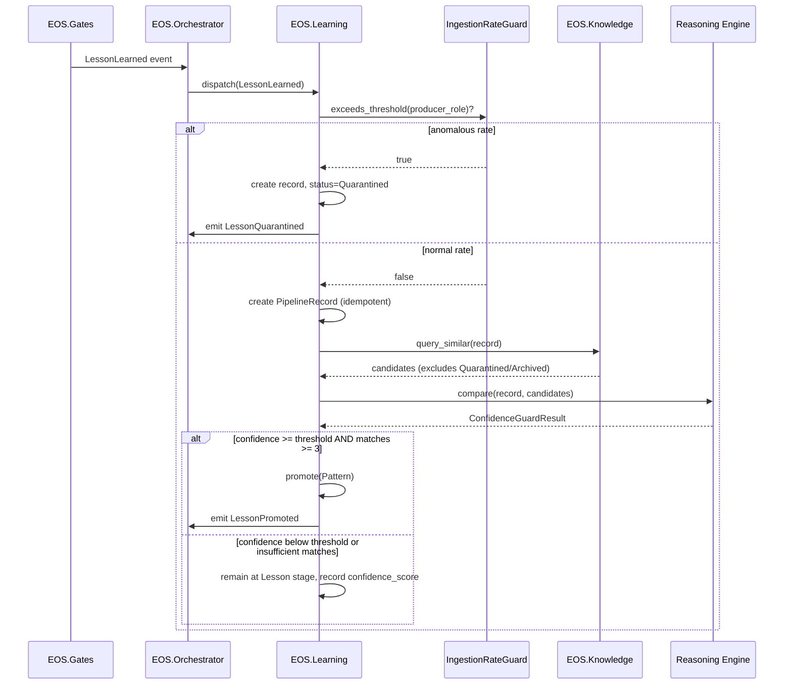
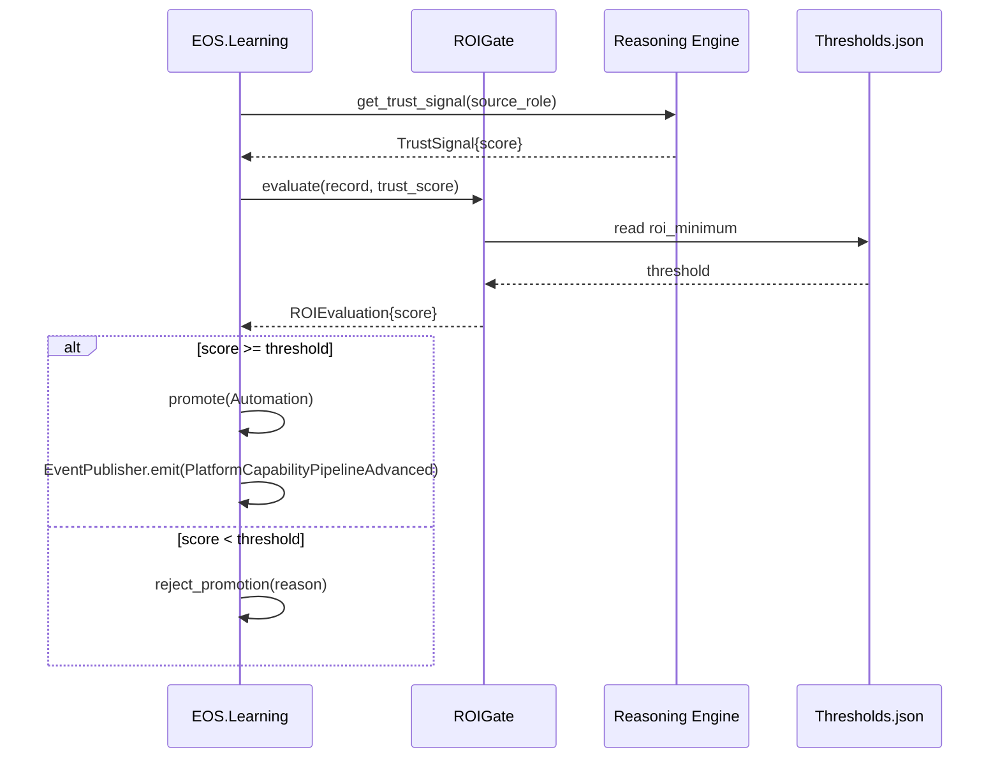
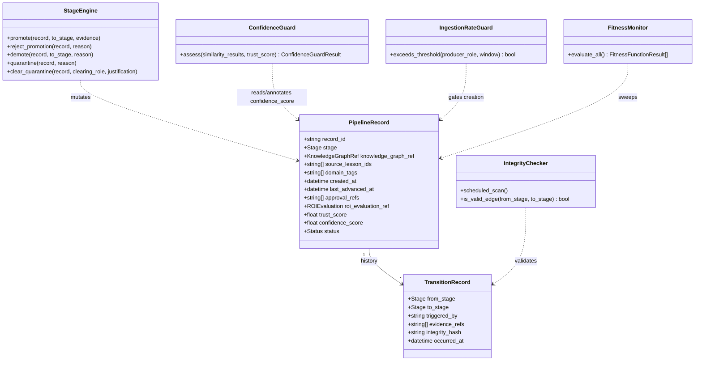
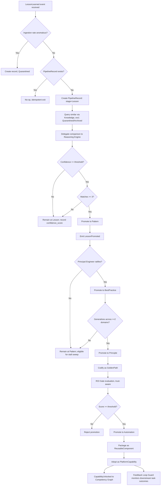
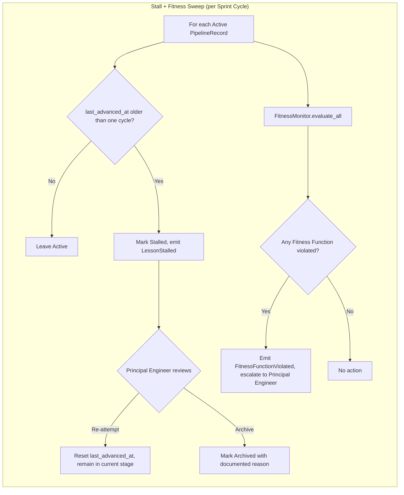

# Learning Engine Specification v1.1

**Document Type:** Complementary Engineering Specification (supersedes v1.0)
**Extends:** `@EOS-Specification.md` (the Constitution) — unchanged, not modified
**Status:** Proposed
**Process:** Produced under the Mandatory Four-Phase Architecture Process
**Primary Constitutional Anchors:** Part 14 — Meta Learning · §0.5 — Knowledge Graph · Part 3 — Event Catalog · §0.16.2 — ROI Modeling · Constitution §0.1.1.7

This document supersedes `Learning-Engine-Specification-v1.0.md` as the same specification's next version — it does not fork, duplicate, or replace `@EOS-Specification.md`, which remains the sole immutable Constitution. Where v1.0 content is unchanged in substance, it is carried forward directly rather than reworded for its own sake; every genuinely new or revised element is called out explicitly, particularly in the Version Evolution section at the end.

---

# PHASE 1 — ARCHITECTURE DESIGN

This phase records the initial design pass for everything v1.0 lacked against the upgraded specification requirements. It is intentionally a working draft — Phase 2 attacks it, Phase 3 fixes it, and the final authoritative specification appears under Phase 3.

## 1.1 What v1.0 Already Established (Carried Forward)

v1.0 fully specified: Executive Summary, Purpose, Scope, Non-Goals, Relationship to the Constitution, Responsibilities, Functional/Non-Functional Requirements, Domain Model, Core Concepts, Internal Architecture, Algorithms, State Management, Data Structures, Interfaces, Events, Sequence/Class/Activity/Decision diagrams, Error Handling, Failure Modes, Recovery Strategy, Security, Performance Targets, Scalability, Extensibility, Testing, Validation, KPIs, Acceptance Criteria, Risks, Future Evolution, Cross References, Glossary, Open Questions, and three ADRs. None of this is being redesigned from zero — the upgraded process asks for additional rigor layered on top of it.

## 1.2 What Is Genuinely New in This Revision (First-Pass Design)

**Explicit Ownership table.** v1.0's §6 (Responsibilities) implied ownership boundaries but never tabulated them against every adjacent subsystem in one place. First-pass design: a matrix of {capability × owner × non-owner-explicitly-denied}.

**Design by Contract.** Every public interface (§15 in v1.0) needs preconditions, postconditions, invariants, and failure contracts. First-pass design: attach a contract block to `IReasoningEngineClient`, `IKnowledgeClient` (consumed), and `ILearningEnginePublicApi` (exposed).

**Architectural Invariants.** A short, closed list of properties that must never change regardless of future evolution — distinct from Functional Requirements (which can be revised) and from the Constitution's own invariants (which the Learning Engine inherits but does not restate wholesale).

**Fitness Functions.** Continuous, automatable checks — distinct from Constitution Part 2's Architecture Fitness Rules (which check *dependency shape*) — that check the Learning Engine's *behavioral* health (e.g., "no PipelineRecord has been Stalled for more than 3 consecutive Sprint cycles without an escalation event").

**Threat Model.** First-pass design: walk the eight named threat categories (Knowledge Poisoning, Memory Corruption, Hallucination Risks, Invalid Learning, Architecture Drift, Feedback Loops, Trust Degradation, Data Corruption) against the Learning Engine's specific surface area, since it sits directly on the trust-sensitive path between raw Lessons and Platform Capabilities.

**Observability, formalized.** v1.0 §8 mentioned tracing in passing. First-pass design: a full Metrics/Logs/Tracing/Health-Indicators/Dashboards/Alerts breakdown.

**Resource Awareness, formalized.** v1.0 §26 touched CPU/RAM at a high level. First-pass design: explicit per-resource budgets plus thermal and background-scheduling posture, given the named single-laptop deployment target.

**Migration Strategy.** Not needed in v1.0 (nothing existed to migrate from). First-pass design: how a live v1.0 deployment (if one existed) would migrate to v1.1's schema/contract changes without data loss.

## 1.3 Initial Draft Positions (subject to Phase 2 attack)

- Draft position A: Fitness Functions should be evaluated at the same Sprint-cycle boundary as the Stall Sweep (§0.12.1), piggybacking on existing scheduling rather than introducing a new cadence.
- Draft position B: The Threat Model's mitigations should mostly be *composition* of controls already specified elsewhere in the Constitution (Reality Validation §0.15, Quality Gates §0.8) rather than new bespoke mechanisms, to avoid duplicate protection logic.
- Draft position C: Contracts (Design by Contract) should be enforced at the interface-boundary layer only (not deep inside algorithms), to avoid smearing contract-checking code throughout the internal architecture.
- Draft position D: Resource Awareness budgets should be expressed as percentages of the Scheduler's existing CPU/RAM Budget (Part 7 §7.2) rather than absolute numbers, so they automatically track whatever the Scheduler allocates rather than drifting out of sync.

---

# PHASE 2 — ARCHITECTURE SELF-CRITIQUE

Acting as its own Architecture Review Board, the Learning Engine design is attacked below. Nothing in Phase 1 is treated as safe by default.

## 2.1 Weaknesses in Ownership Modeling

- Draft ownership table (§1.2) risks becoming a second source of truth for boundaries already implied by v1.0 §6 and the Constitution's Part 1/Part 2 ownership tables — if it drifts from those, which wins? **Unresolved in Phase 1.**
- No explicit statement of who owns the *Fitness Function* definitions themselves (the Learning Engine? Principal Engineer? QA?). This is itself an ownership gap the design must not repeat.

## 2.2 Weaknesses in Design by Contract

- Draft position C (contract checks only at interface boundary) is convenient but risks a real failure mode: an internal algorithm (e.g., §12.2 cluster trigger) could violate an invariant *between* two interface calls, and boundary-only checking would miss it until the next external call — potentially never, if no further external call occurs before damage propagates (e.g., into a promotion decision).
- The v1.0 interfaces (§15) were written as plain method signatures with no contract vocabulary at all — retrofitting contracts without revisiting whether the signatures themselves are contract-shaped (e.g., does `compare()` need an explicit "confidence" postcondition, not just a return value?) is incomplete.

## 2.3 Weaknesses in Threat Model Coverage

- **Knowledge Poisoning**: v1.0 never considered an adversarial or simply buggy upstream role injecting fabricated `LessonLearned` events at volume to force spurious Pattern promotion. The ≥3-match clustering threshold (Part 14) is a weak defense against a single actor who can generate many similar-looking fake Lessons.
- **Hallucination Risk**: the Reasoning Engine's `compare()` result (§15/§17.1) is trusted at face value in v1.0's algorithm (§12.2) — there is no confidence threshold, no disagreement-detection, no fallback if the Reasoning Engine is simply wrong rather than unavailable. v1.0 only handled *unavailability* (§21), not *incorrectness*.
- **Feedback Loops**: a Golden Path automated from a Pattern that was itself derived from a hallucinated or poisoned Lesson could get baked into `EOS.SDK` (Part 14) and start being *applied*, generating new tasks whose outcomes feed back into the Knowledge Graph as further "confirming" evidence — a self-reinforcing error loop. v1.0 does not address this at all.
- **Trust Degradation**: no mechanism exists to *reduce confidence* in a source-role's future Lessons if a past promotion sourced from that role was later demoted (FR-9, v1.0 §7) for being wrong. Every Lesson is currently treated as equally trustworthy regardless of track record.
- **Architecture Drift** (Learning-Engine-specific, distinct from Constitution Part 2's structural drift): the *rules that govern promotion* (e.g., "≥3 matches", "≥2 domains") could silently diverge from what Thresholds.json says if a code path hardcodes a value instead of reading config — v1.0 never explicitly forbade this.
- **Data Corruption**: v1.0's Recovery Strategy (§23) assumes standard backup/restore is sufficient, but never addresses *partial* corruption — e.g., a `TransitionRecord` whose `from_stage`/`to_stage` no longer forms a valid edge in the state machine (§13) due to a bug or bit-rot. No integrity-check algorithm was specified.

## 2.4 Weaknesses in Observability

- v1.0 mentioned "traced with correlation ID" (§8) but defined zero concrete metrics, no log schema, no health indicator, no alert thresholds — Observability was aspirational, not actionable.

## 2.5 Weaknesses in Resource Awareness

- v1.0 §26 assumed a single scaling lever ("increase Sprint cycle sweep parallelism") without ever stating what CPU/RAM ceiling that parallelism must respect, nor how the Learning Engine behaves under thermal throttling (a real concern on the named i7-1065G7 mobile-class CPU, which throttles under sustained load) or while other EOS subsystems (e.g., inference-heavy Reasoning Engine calls) are competing for the same 32GB RAM budget.
- No stated posture on *background* vs *foreground* scheduling — should Stall Sweeps run only when the laptop is idle/plugged in, given it's a single offline dev machine, not a server?

## 2.6 Weaknesses in Migration Strategy (Absence)

- v1.0 did not specify one at all, which is only acceptable because nothing was implemented yet — but Phase 1 §1.2's migration section must not just say "not applicable," since a real second version needs a real answer for the case where v1.0 *was* deployed.

## 2.7 Weaknesses in Fitness Functions (Absence)

- Constitution Part 2's fitness rules check dependency *shape*, not pipeline *behavior*. v1.0 had no equivalent for its own domain (e.g., nothing catches "Stall Sweep silently stopped running" other than a human noticing KPI drift days later).

## 2.8 Cross-Cutting Concern: Terminology

- v1.0 uses "record" (`PipelineRecord`) and Constitution Part 14 uses "Lesson/Pattern/etc." interchangeably as both stage names and node identities — this revision must make explicit that a `PipelineRecord`'s `stage` field *is* the Constitutional term, not a separate vocabulary, to avoid the "conflicting terminology" defect the process explicitly forbids.
# PHASE 3 — ARCHITECTURE IMPROVEMENT (FINAL SPECIFICATION)

Every weakness identified in Phase 2 is resolved below. This section is the complete, authoritative, standalone Learning Engine Specification v1.1. Where a Phase 2 finding drove a specific change, it is marked **[Resolves 2.N]**.

## 1. Executive Summary

The Learning Engine is the concrete subsystem operationalizing the Constitution's Meta Learning pipeline (Part 14): `Lesson → Pattern → Best Practice → Engineering Principle → Golden Path → Automation → Reusable Component → Platform Capability`. v1.1 adds the rigor a self-governing, self-learning, offline autonomous system requires before any implementation begins: explicit ownership boundaries, Design-by-Contract interfaces, closed Architectural Invariants, continuous Fitness Functions, a full Threat Model addressing knowledge poisoning and feedback loops, concrete Observability, hardware-aware Resource Management, and a Migration Strategy. The Learning Engine remains a pure control-flow subsystem: it never stores Lesson content (owned by the Knowledge Graph, §0.5) and never performs semantic judgment itself (delegated to the Reasoning Engine).

## 2. Purpose

To give another autonomous engineer a specification precise enough that no architectural judgment call remains — including, as of v1.1, judgment calls about trust, resource limits, and failure integrity that v1.0 left implicit.

## 3. Scope

Unchanged from v1.0 §3, with one addition: this version's scope explicitly includes defending pipeline integrity against adversarial or erroneous inputs (Threat Model, §24), which v1.0 scoped out implicitly by omission.

## 4. Non-Goals

Unchanged from v1.0 §4, plus: the Learning Engine does not implement source-role trust scoring itself (§24.4's Trust Degradation mitigation delegates the actual scoring computation to the Reasoning Engine / a future Reputation mechanism — the Learning Engine only *consumes* a trust signal and *reacts* to it).

## 5. Relationship with @EOS-Specification.md

Unchanged from v1.0 §5 (table preserved in full — see Cross References, §36, for the consolidated list). No Constitutional section is reinterpreted in v1.1; only the Learning Engine's own internal rigor increased.

## 6. Responsibilities

Unchanged from v1.0 §6, now formalized into the explicit Ownership matrix below **[Resolves 2.1]**.

## 7. Ownership

**[Resolves 2.1]** A single, authoritative ownership matrix — the only place ownership is asserted for this subsystem, so it cannot drift from v1.0's prose description:

| Capability | Owner | Explicitly NOT Owned By |
|---|---|---|
| Pipeline stage-transition logic | `EOS.Learning` (StageEngine) | `EOS.Knowledge`, `EOS.KnowledgeGraph` |
| Lesson/Pattern/etc. *content* storage | `EOS.KnowledgeGraph` / `EOS.VectorStore` (via §0.5) | `EOS.Learning` |
| Pipeline metadata storage (`PipelineRecord`/`TransitionRecord`) | `EOS.Learning` | `EOS.Knowledge` |
| Similarity computation | Reasoning Engine (forthcoming spec), via `IReasoningEngineClient` | `EOS.Learning` (only triggers the call, §12.2) |
| Clustering-trigger *timing* (when to ask) | `EOS.Learning` (ClusterTrigger) | Reasoning Engine |
| ROI formula | Constitution §0.16.2 (definition) | `EOS.Learning` (only evaluates it, does not redefine it) |
| ROI Gate *evaluation timing/enforcement* | `EOS.Learning` (ROIGate) | Engineering Economics owner (policy only) |
| Fitness Function *definitions* for this subsystem | `EOS.Learning` (Principal-Engineer-reviewed) — **[Resolves 2.1 second bullet]** | QA (QA owns Constitution-wide Quality Gates, §0.8, a distinct concept) |
| Stall detection & escalation | `EOS.Learning` (StallDetector) | Scheduler (Scheduler owns *task* budgets, Part 7, not pipeline-record staleness) |
| Trust/reputation signal consumption | `EOS.Learning` (consumer only) | `EOS.Learning` (NOT the producer — see §4) |
| Event emission for pipeline stages | `EOS.Learning` (EventPublisher) | `EOS.Orchestrator` (routes, does not originate) |

**Conflict rule:** if this table and any future prose elsewhere in a Learning Engine document disagree, this table wins for this subsystem; if this table and the Constitution's own Part 1/Part 2 ownership tables disagree about a *cross-subsystem* boundary, the Constitution wins unconditionally (Constitution is immutable per the governing prompt).
## 8. Architecture

Unchanged in shape from v1.0 §11, reproduced with one addition (a Trust/Confidence adapter, **[Resolves 2.3]**):

```
EOS.Learning
 ├── Ingestion/          — subscribes to Part 3 events, creates/updates PipelineRecords
 ├── ClusterTrigger/      — decides *when* to call the Reasoning Engine's similarity interface (§13)
 ├── ConfidenceGuard/     — NEW: evaluates Reasoning Engine confidence + source-role trust signal before
 │                          allowing ClusterTrigger's result to influence a promotion (§24.2/§24.3, Threat Model)
 ├── StageEngine/         — the state machine (§16) enforcing invariants (§21, Architectural Invariants) and contracts (§14)
 ├── ROIGate/             — wraps §0.16.2 formula, records roi_evaluation_ref
 ├── StallDetector/       — Sprint-cycle-anchored sweep (§0.12.1) producing review escalations
 ├── FitnessMonitor/      — NEW: evaluates Fitness Functions (§23) on the same cadence as StallDetector
 ├── IntegrityChecker/    — NEW: validates TransitionRecord edge validity against the state machine (§24.8)
 └── EventPublisher/      — emits events through the standard `EOS.SDK` Events module (Part 11 §11.1)
```

Dependency shape (must satisfy Part 2 fitness rules, unchanged from v1.0): `EOS.Learning` → `EOS.Contracts`, `EOS.Knowledge` (§0.5.2), `EOS.SDK` only. No role project depends on `EOS.Learning` directly (mirrors §0.4/Part 2 R-03 pattern).

## 9. Domain Model

Unchanged core shape from v1.0 §9, with the terminology clarification **[Resolves 2.8]**: `PipelineRecord.stage` is *not* a Learning-Engine-invented vocabulary — its values are exactly the Constitution Part 14 stage names (`Lesson`, `Pattern`, `BestPractice`, `Principle`, `GoldenPath`, `Automation`, `ReusableComponent`, `PlatformCapability`), spelled identically, so there is exactly one vocabulary for pipeline stages across the entire EOS, not two.

```
PipelineRecord
 ├── record_id
 ├── stage: Lesson | Pattern | BestPractice | Principle | GoldenPath | Automation | ReusableComponent | PlatformCapability
 ├── knowledge_graph_ref
 ├── source_lesson_ids[]
 ├── domain_tags[]
 ├── created_at, last_advanced_at
 ├── approval_refs[]
 ├── roi_evaluation_ref (nullable until GoldenPath stage)
 ├── trust_score: float (0.0–1.0)   — NEW, §24.4
 ├── confidence_score: float (0.0–1.0)  — NEW, §24.2, from last ConfidenceGuard evaluation
 └── status: Active | Stalled | Archived | Demoted | Quarantined   — Quarantined is NEW, §24.1

TransitionRecord
 ├── from_stage, to_stage
 ├── triggered_by
 ├── evidence_refs[]
 ├── integrity_hash   — NEW, §24.8
 └── occurred_at
```

## 10. Concepts

Unchanged from v1.0 §10 (Provenance chain, Stage gate, Stall, Demotion), plus two new concepts:

- **Quarantine** *(new)*: a status distinct from Stalled/Archived — applied when the Threat Model (§24) detects a suspicious ingestion pattern (e.g., knowledge-poisoning signature). A Quarantined record cannot advance stage until a Principal Engineer explicitly clears it, and it does not count toward Pattern-clustering matches for *other* records while quarantined (§24.1).
- **Trust score** *(new)*: a per-record confidence value derived from the trustworthiness of its `source_lesson_ids`' originating roles/tasks (§24.4) — consumed, not computed, by the Learning Engine.

## 11. Algorithms

Carried forward from v1.0 §12 with the following revisions:

### 11.1 Lesson Ingestion (revised — **[Resolves 2.3 Knowledge Poisoning]**)

```
on LessonLearned(event):
    if PipelineRecord.exists(event.event_id):
        return                                    # idempotency, unchanged
    if IngestionRateGuard.exceeds_threshold(event.producer_role, window=Thresholds.json[ingestion_rate_window]):
        record = PipelineRecord.create(stage=Lesson, status=Quarantined, source_lesson_ids=[event.event_id])
        emit LessonQuarantined(record.record_id, reason="ingestion rate anomaly")
        return
    record = PipelineRecord.create(stage=Lesson, source_lesson_ids=[event.event_id])
    ClusterTrigger.evaluate(record)
```

### 11.2 Cluster Trigger → Pattern Promotion (revised — **[Resolves 2.3 Hallucination Risk]**)

```
on ClusterTrigger.evaluate(record):
    candidates = Knowledge.query_similar(record.knowledge_graph_ref)     # excludes Quarantined records
    similarity_results = ReasoningEngine.compare(record, candidates)
    guard_result = ConfidenceGuard.assess(similarity_results, record.trust_score)
    if guard_result.confidence < Thresholds.json[clustering_confidence_minimum]:
        record.confidence_score = guard_result.confidence
        return                                    # no promotion; not an error, just insufficient confidence
    if count(guard_result.accepted_matches) >= 3:
        Pattern = StageEngine.promote(record, to=Pattern, evidence=guard_result)
        emit LessonPromoted(record.record_id, Pattern.record_id)
```

### 11.3 ROI Gate (unchanged from v1.0 §12.3 — already fail-closed, ADR-L003)

### 11.4 Stall Sweep (unchanged from v1.0 §12.4, now co-scheduled with Fitness Monitor sweep, §23)

### 11.5 Feedback Loop Guard (NEW — **[Resolves 2.3 Feedback Loops]**)

```
on PlatformCapabilityPipelineAdvanced(record):
    downstream_tasks = Planner.tasks_generated_from(record)   # via Contracts, read-only query
    for task in downstream_tasks:
        if task.outcome_feeds(record.knowledge_graph_ref):
            flag_as_self_referential(task)
            # self-referential outcomes are excluded from future ClusterTrigger candidate sets
            # for this record's descendants, preventing a promoted-but-wrong Golden Path from
            # "confirming itself" via its own generated task outcomes
```

### 11.6 Integrity Check (NEW — **[Resolves 2.3 Data Corruption]**)

```
on IntegrityChecker.scheduled_scan():
    for t in TransitionRecord.all():
        if not StateMachine.is_valid_edge(t.from_stage, t.to_stage):
            emit DataIntegrityViolationDetected(t.record_id, t.from_stage, t.to_stage)
            associated_record.status = Quarantined
```

## 12. Data Structures

Extends v1.0 §14 with:

```
IngestionRateGuardState
 ├── producer_role
 ├── window_start, window_end
 └── event_count

ConfidenceGuardResult
 ├── confidence: float
 ├── accepted_matches[]
 └── rejected_matches[]  (with rejection_reason each)

TrustSignal (consumed, produced by Reasoning Engine / future Reputation mechanism)
 ├── source_role
 ├── score: float
 └── evidence_ref
```

## 13. Interfaces

See §17 (Contracts) for full Design-by-Contract treatment. Signatures, extended from v1.0 §15:

```
IReasoningEngineClient
    ConfidenceGuardResult compare(PipelineRecord subject, IEnumerable<PipelineRecord> candidates)
    TrustSignal get_trust_signal(string source_role)   // NEW

IKnowledgeClient   (existing, §0.5.2 — unchanged)
    IEnumerable<KnowledgeNode> query_similar(KnowledgeGraphRef ref)
    void update(KnowledgeGraphRef ref, ...)

ILearningEnginePublicApi   (read-only, unchanged posture from v1.0)
    PipelineRecord get_record(record_id)
    IEnumerable<PipelineRecord> query(stage?, domain?, status?)
```

## 14. Contracts (Design by Contract)

**[Resolves 2.2]** Every public interface now carries explicit preconditions, postconditions, invariants, and failure contracts, enforced at the interface boundary (Phase 1 draft position C, retained) **and** re-checked once more immediately before any stage-transition commit inside `StageEngine.promote()` — closing the "violation between two boundary calls" gap identified in Phase 2 §2.2, without smearing checks throughout every internal algorithm.

### 14.1 `IReasoningEngineClient.compare()`

- **Preconditions:** `subject.stage` is not `Quarantined`; `candidates` excludes any `Quarantined` or `Archived` record.
- **Postconditions:** returned `ConfidenceGuardResult.confidence` ∈ [0.0, 1.0]; `accepted_matches ∪ rejected_matches` = all input candidates (no candidate silently dropped).
- **Invariants:** the call is read-only — it must never mutate `subject` or any `candidate`.
- **Failure contract:** on timeout/unavailability, the caller (`ClusterTrigger`) must treat this identically to "confidence below threshold" (§11.2) — never as an implicit pass.

### 14.2 `IReasoningEngineClient.get_trust_signal()`

- **Preconditions:** `source_role` is a known role per Constitution §0.2.1.
- **Postconditions:** `TrustSignal.score` ∈ [0.0, 1.0]; if no history exists for the role, returns a neutral default (0.5), never null.
- **Invariants:** idempotent for the same role within the same Sprint cycle (result may legitimately change cycle-to-cycle as history accrues).
- **Failure contract:** on unavailability, `ConfidenceGuard` must fall back to `trust_score = 0.5` (neutral) and lower its overall confidence output accordingly — never fail-open to full trust.

### 14.3 `IKnowledgeClient.query_similar()` (existing Constitutional interface, contract stated here for this consumer's benefit only — does not redefine §0.5.2)

- **Precondition (as consumed here):** `ref` resolves to a non-Archived, non-Quarantined node.
- **Postcondition (as consumed here):** returned set never includes the querying record itself.
- **Failure contract:** on error, `ClusterTrigger` retries per Part 5 §5.3 policy, then treats persistent failure as `IncidentDetected` (unchanged from v1.0 §21).

### 14.4 `ILearningEnginePublicApi.query()`

- **Preconditions:** none (open read).
- **Postconditions:** result set is a point-in-time snapshot; caller must not assume it stays valid across subsequent calls (no implicit locking).
- **Invariants:** this interface never triggers a stage transition as a side effect — read truly means read.
- **Failure contract:** unavailability surfaces as a standard service error to the caller (e.g., Dashboard); the Learning Engine itself does not degrade its internal pipeline processing due to read-side load (reads and pipeline processing are isolated failure domains).

## 15. Events

Unchanged from v1.0 §16, plus new events required by the Threat Model and Fitness Functions:

| Event | Producer | Consumers | Payload |
|---|---|---|---|
| *(all eight v1.0 events unchanged: `LessonPromoted`, `BestPracticeRatified`, `PrincipleGeneralized`, `GoldenPathCodified`, `PlatformCapabilityPipelineAdvanced`, `LessonStalled`, `LessonDemoted`, `LessonArchived`)* | | | |
| `LessonQuarantined` *(new)* | EOS.Learning | Principal Engineer review queue, Dashboard | record_id, reason |
| `LessonQuarantineCleared` *(new)* | Principal Engineer (via role action) | Learning Engine, Dashboard | record_id, clearing_role, justification |
| `DataIntegrityViolationDetected` *(new)* | IntegrityChecker | DevOps (Incident path), Dashboard | record_id, from_stage, to_stage |
| `FitnessFunctionViolated` *(new)* | FitnessMonitor | Principal Engineer, Dashboard | fitness_function_id, observed_value, threshold |
| `SelfReferentialOutcomeFlagged` *(new)* | Feedback Loop Guard | Knowledge, Dashboard | record_id, task_id |

## 16. State Machines

Extends v1.0 §13 with the `Quarantined` status and its edges:

```
Lesson --(cluster match >=3, confidence >= threshold)--> Pattern
Pattern --(Principal Engineer ratification, ADR)--> BestPractice
BestPractice --(generalizes across >=2 domains)--> Principle
Principle --(codified as template in EOS.Tools)--> GoldenPath
GoldenPath --(ROI Gate pass)--> Automation
Automation --(packaged into EOS.SDK/shared lib)--> ReusableComponent
ReusableComponent --(adopted platform-wide, CapabilityUnlocked)--> PlatformCapability

Any stage --(stall sweep, unresolved)--> Stalled --(review)--> Active | Archived
Any stage --(contradicting evidence)--> Demoted --(re-review, Principal Engineer authority per Decision Matrix update, see ADR-L004)--> prior stage | Archived
Any stage --(ingestion anomaly OR integrity violation)--> Quarantined --(Principal Engineer clears)--> prior stage
Quarantined --(confirmed poisoning/corruption)--> Archived
```

This remains a strict superset of v1.0's state machine — no existing edge removed, consistent with "evolution without rewrite."
## 17. Sequence Diagrams (Mermaid)

### 17.1 Lesson Ingestion with Rate-Guard (revised — **[Resolves 2.3]**)



### 17.2 Trust-Aware ROI Gate (unchanged control flow, trust signal now recorded)



## 18. Class Diagrams (Mermaid)



## 19. Activity Diagrams (Mermaid)



## 20. Decision Flow Diagrams



## 21. Architectural Invariants

**[Resolves 2.7 absence]** These properties MUST NEVER change, regardless of future evolution of this specification. They are distinct from Functional Requirements (which are revisable) and from the Constitution's own invariants (inherited, not restated):

1. **INV-1**: The Learning Engine never persists Lesson/Pattern/etc. *content* — only metadata and a reference into the Knowledge Graph (§0.5). This is permanent, not a current-implementation detail.
2. **INV-2**: No stage transition beyond `Lesson` occurs without a resolvable evidence reference in the Artifact Registry (Part 8) — evidence-over-assertion (Constitution §0.1.1.1) is non-negotiable for this subsystem.
3. **INV-3**: Automation promotion is never possible without a passing ROI Gate evaluation — this gate cannot be bypassed by any role, including CTO, without an explicit Constitutional-level override event recorded per Decision Matrix §0.6 (mirroring the Constitution's own QA/DevOps override pattern, §0.2.2).
4. **INV-4**: A Quarantined record can only be cleared by a Principal Engineer or higher authority (never by the Learning Engine autonomously) — this keeps the human-in-the-loop check on suspected poisoning/corruption permanent.
5. **INV-5**: All semantic judgment (similarity, confidence) is delegated to the Reasoning Engine — the Learning Engine itself never embeds model-specific logic, preserving provider independence (governing prompt, AI Stack) permanently, not just for the currently-named providers.
6. **INV-6**: The full pipeline state is always reconstructable from the Event Catalog stream alone (replay guarantee) — no future feature may introduce a non-replayable side channel of pipeline truth.

## 22. Fitness Functions

**[Resolves 2.7]** Continuous, automatable checks of the Learning Engine's own *behavioral* health, distinct from Constitution Part 2's *structural* dependency-shape fitness rules. Evaluated by `FitnessMonitor` on the same Sprint-cycle cadence as the Stall Sweep (Phase 1 draft position A, retained after Phase 2 review found no reason to introduce a separate cadence):

| ID | Fitness Function | Threshold |
|---|---|---|
| LF-1 | % of Active records with zero stage advancement for >2 consecutive Sprint cycles | < 15% of Active population |
| LF-2 | Stall Sweep execution completed within its performance target (§27) every cycle | 100% of cycles (any miss emits `FitnessFunctionViolated`) |
| LF-3 | % of promotions where `confidence_score` was below the "high confidence" band (near-threshold passes) | < 10% of promotions in a cycle (a rising trend signals the confidence threshold itself may be miscalibrated) |
| LF-4 | Count of `DataIntegrityViolationDetected` events per cycle | 0 (any occurrence is investigated, not just tracked) |
| LF-5 | Count of records Quarantined vs. cleared-as-false-positive, ratio | Tracked as a trend; a rising false-positive rate signals `IngestionRateGuard` threshold miscalibration |
| LF-6 | `Automation ROI realized` (§33) vs. `ROIEvaluation.score` projected, deviation | < 25% deviation on average across a Quarterly cycle (§0.12.1) |

A Fitness Function violation is never auto-remediated — it always emits `FitnessFunctionViolated` for Principal Engineer review, consistent with INV-4's human-in-the-loop posture for anything trust/integrity-adjacent.
## 23. Failure Modes

Extends v1.0 §22:

| Mode | Description | Detection |
|---|---|---|
| Silent pipeline stall | Records stop advancing without anyone noticing | Stall Sweep (§11.4) + LF-1 (§22) |
| Over-eager clustering | Reasoning Engine false-positives cause premature Pattern promotion | Confidence threshold + ≥3-match rule + LF-3 trend monitoring |
| ROI gaming | Inputs manipulated to force Automation promotion | Immutable Artifact Registry entry; demotion path (INV-3, FR-9) |
| Knowledge Graph drift | Pipeline metadata references an altered/removed node | Subscribes to `KnowledgeUpdated`; re-validates on access |
| **Ingestion flooding** *(new)* | A buggy or adversarial role floods `LessonLearned` events to force a Pattern | `IngestionRateGuard` (§11.1) + Quarantine |
| **Confidence miscalibration** *(new)* | Reasoning Engine systematically over- or under-states confidence | LF-3 (§22) trend detection |
| **Self-reinforcing error loop** *(new)* | A wrong Golden Path's generated tasks "confirm" the error | Feedback Loop Guard (§11.5) |
| **Partial record corruption** *(new)* | A `TransitionRecord` forms an invalid state-machine edge | IntegrityChecker (§11.6), LF-4 |

## 24. Threat Model

**[Resolves 2.3 in full]** Structured against the eight named threat categories.

### 24.1 Knowledge Poisoning

**Threat:** A role (compromised, buggy, or simply low-quality) injects large volumes of similar fabricated Lessons to force an unearned Pattern/Best Practice promotion.
**Mitigation:** `IngestionRateGuard` (§11.1) detects anomalous per-role ingestion rate and routes to `Quarantined` status rather than normal processing. Quarantined records are excluded from other records' clustering candidate sets (§10, Concepts), preventing a poisoning attempt from "seeding" unrelated legitimate Lessons. Clearing requires Principal Engineer authority (INV-4).
**Residual risk:** A slow, low-and-under-threshold poisoning campaign could still evade rate-based detection — flagged in Open Questions (§40) as needing a future statistical-anomaly detector beyond simple rate thresholds, likely owned by the Reasoning Engine or a future Protection Layer Specification.

### 24.2 Memory Corruption

**Threat:** Not applicable to raw memory (owned by the forthcoming Memory Management Specification), but analogous here as *pipeline-metadata* corruption — a `PipelineRecord`/`TransitionRecord` becoming internally inconsistent.
**Mitigation:** `IntegrityChecker` (§11.6) validates every `TransitionRecord` against the formal state machine (§16); an invalid edge is never silently accepted, and the associated record is Quarantined pending review.

### 24.3 Hallucination Risks

**Threat:** The Reasoning Engine's `compare()` result is confidently wrong (e.g., asserts high similarity between unrelated Lessons).
**Mitigation:** `ConfidenceGuard` (§11.2, §14.1 contract) requires both a minimum confidence score *and* the existing ≥3-match structural rule — a single confident-but-wrong comparison cannot alone drive a promotion, since the ≥3 threshold requires independent corroboration.
**Residual risk:** if the Reasoning Engine is *systematically* biased (not randomly wrong), independent corroboration doesn't help, since all "independent" comparisons share the same systematic bias. This is explicitly out of this specification's power to fully solve — noted as an Open Question (§40) for the Reasoning Engine Specification to address via model-level calibration.

### 24.4 Invalid Learning / Trust Degradation

**Threat:** A source role with a poor track record (past promotions later demoted) continues to be treated as equally trustworthy as any other source.
**Mitigation:** `trust_score` (§9) is populated from `IReasoningEngineClient.get_trust_signal()` (§14.2) and factored into `ConfidenceGuard.assess()` (§11.2) — a low-trust source's Lessons require higher corroboration confidence to promote. The Learning Engine consumes this signal but does not compute it (§4, Non-Goals) — computation ownership sits with the Reasoning Engine / a future Reputation mechanism, avoiding duplicate-ownership of trust scoring.

### 24.5 Architecture Drift (Learning-Engine-specific)

**Threat:** Promotion-rule constants (e.g., "≥3 matches", "≥2 domains") get hardcoded in a future code change rather than read from `Thresholds.json` (Part 10), silently diverging from the documented, auditable policy.
**Mitigation:** Fitness Function LF-3 partially detects symptomatic drift (unusual promotion patterns); more directly, this is enforced structurally, not just observationally — the Learning Engine's Testing Strategy (§31) requires a build-time check (a lint-equivalent, analogous to Constitution Part 2's fitness rules) that no promotion-threshold literal appears outside the `Thresholds.json`-reading code path.

### 24.6 Feedback Loops

**Threat:** A wrongly-promoted Golden Path is automated, generates tasks, and those tasks' recorded outcomes get treated as further corroborating evidence for the same lineage — compounding the original error.
**Mitigation:** Feedback Loop Guard (§11.5) traces `PlatformCapabilityPipelineAdvanced` records forward through the Planner's task generation (read-only query via Contracts) and flags any task whose outcome would feed back into the *same* `knowledge_graph_ref` lineage, excluding such self-referential outcomes from future clustering evidence for that record's descendants.

### 24.7 Trust Degradation (system-level, distinct from 24.4's per-source case)

**Threat:** Repeated Quarantine false-positives erode confidence in the Learning Engine's own output, causing roles to start ignoring `FitnessFunctionViolated`/`LessonQuarantined` alerts ("alert fatigue").
**Mitigation:** LF-5 (§22) explicitly tracks the false-positive rate as a first-class Fitness Function, not an afterthought — a rising rate is itself the signal to recalibrate `IngestionRateGuard`'s threshold via `Thresholds.json`, keeping the system's own credibility measurable rather than assumed.

### 24.8 Data Corruption

**Threat:** Bit-rot, storage failure, or a bug produces a `TransitionRecord` that doesn't correspond to a valid state-machine edge (§16), silently corrupting the auditable history.
**Mitigation:** `integrity_hash` (§9) on every `TransitionRecord`, validated by `IntegrityChecker.scheduled_scan()` (§11.6); any mismatch or invalid edge triggers `DataIntegrityViolationDetected` and Quarantine of the associated record — never silent auto-repair, since silently "fixing" history would itself violate evidence-over-assertion (Constitution §0.1.1.1).

**Recovery Strategy for all threat categories:** see §25 — the Weekly Restore Drill (Constitution Part 13) and full event-replay guarantee (INV-6) together mean no threat category above can cause irrecoverable pipeline-state loss, only (at worst) a Quarantine backlog requiring Principal Engineer triage.

## 25. Recovery Strategy

Unchanged in foundation from v1.0 §23 (event-sourced replay, standard SQL Server backup/restore participation in Constitution Part 13's Weekly Restore Drill), extended with: post-restore, `IntegrityChecker.scheduled_scan()` (§11.6) runs immediately as part of the restore validation step, so a restored environment is integrity-checked before it resumes live pipeline processing — closing the gap where a restore could reintroduce a previously-detected corruption.

## 26. Security

Unchanged from v1.0 §24 (no secrets held, read access mirrors Dashboard's existing access control, no duplicate sensitive-content classification), with one addition: `Quarantine`/`clear_quarantine` actions (§18) are logged with `clearing_role` and `justification` as permanent Artifact Registry entries (Part 8), since a cleared quarantine is itself a security-relevant decision that must be auditable exactly like a Demotion (FR-9 lineage).
## 27. Performance

Unchanged targets from v1.0 §25, plus:

| Operation | Target |
|---|---|
| Ingestion Rate Guard evaluation | < 50ms (must not become the bottleneck it's meant to protect against) |
| Confidence Guard assessment (excl. Reasoning Engine call latency) | < 100ms |
| Integrity Checker full scan (up to 10,000 TransitionRecords) | < 60s, run during Sprint-cycle boundary alongside Stall/Fitness sweep (§22), not on the hot ingestion path |
| Fitness Monitor full evaluation | < 30s per Sprint cycle |

## 28. Scalability

Unchanged strategy from v1.0 §26 (batched paginated sweeps; single-node scaling lever before redesign), with the addition that `IngestionRateGuard`'s per-role windows (§12) are kept in Redis (Constitution Part 4 §4.1, ephemeral state store) rather than SQL Server, since rate-guard state is inherently short-lived and high-write-frequency — consistent with Data Architecture's existing store-ownership rules, not a new exception to them.

## 29. Observability

**[Resolves 2.4]** Fully concretized, mapped onto the Constitution's existing OpenObserve/OpenTelemetry backbone (Part 4 §4.1, Part 5 §5.3):

| Category | Definition |
|---|---|
| **Metrics** | `learning.pipeline.throughput` (records advancing/cycle), `learning.stall.rate`, `learning.quarantine.rate`, `learning.quarantine.false_positive_rate` (LF-5), `learning.roi.deviation` (LF-6), `learning.integrity.violations_count` (LF-4), `learning.confidence.near_threshold_rate` (LF-3) |
| **Logs** | Structured (via `EOS.SDK` Logging module, Part 11 §11.1) at minimum for: every stage transition, every Quarantine/clear, every Fitness Function violation, every Integrity violation — each carrying the record's correlation ID (Part 5 §5.3) back to the originating `LessonLearned` event |
| **Tracing** | Every algorithm in §11 emits an OpenTelemetry span; the full Lesson→PlatformCapability journey for any single record is reconstructable as one trace via correlation ID propagation |
| **Health Indicators** | Composite `learning.health` indicator = pass/fail rollup of all six Fitness Functions (§22) at the last evaluated Sprint cycle |
| **Dashboards** | A Learning Engine tile set on the existing Dashboard (§0.11): pipeline funnel (count per stage), Fitness Function status panel, Quarantine queue, ROI-realized-vs-projected trend |
| **Alerts** | `FitnessFunctionViolated` and `DataIntegrityViolationDetected` route to the Principal Engineer review queue as first-class alerts (not buried in logs); `LessonQuarantined` alerts at a lower severity unless the quarantine rate itself breaches LF-5 |

## 30. Resource Awareness

**[Resolves 2.5]** Concretized against the named hardware target (i7-1065G7, 32GB RAM, 477GB NVMe, offline, single laptop):

| Resource | Posture |
|---|---|
| **CPU** | All Learning Engine batch operations (Stall Sweep, Fitness Monitor, Integrity Checker) draw from the Scheduler's existing CPU Budget (Part 7 §7.2) as a *percentage allocation*, not an absolute figure (Phase 1 draft position D, retained) — so the Learning Engine automatically scales down if the Scheduler reduces its overall ceiling (e.g., during a Reasoning-Engine-heavy inference burst). |
| **RAM** | Pipeline metadata working set is bounded by pagination (§28); no unbounded in-memory materialization of the full `PipelineRecord` table is permitted at any point in any algorithm (§11). |
| **Storage** | `PipelineRecord`/`TransitionRecord` live in SQL Server (existing store, Part 4 §4.1) — no new storage engine introduced; Redis is used only for the ephemeral `IngestionRateGuardState` (§28), consistent with its designated ephemeral role. |
| **Offline execution** | All Learning Engine operations function fully offline — the only network-adjacent dependency is the in-process/local call to the Reasoning Engine (itself running a local model, per the governing prompt's AI Stack section), never a cloud call. |
| **Background scheduling** | Batch sweeps (Stall, Fitness, Integrity) are scheduled at Sprint-cycle boundaries (§0.12.1), which — consistent with a single-developer-laptop deployment target — should preferentially run during declared Maintenance Windows (Part 7 §7.2) or otherwise-idle periods rather than contending with active foreground task execution. |
| **Thermal awareness** | Because the target CPU is mobile-class and subject to throttling under sustained load, the Learning Engine's batch sweeps are explicitly non-time-critical (their performance targets, §27, have multi-second/minute budgets, not millisecond ones) precisely so they can be throttled or deferred by the Scheduler under thermal pressure without violating any hard real-time requirement. |
| **Inference scheduling** | Every Learning Engine call into the Reasoning Engine (`compare()`, `get_trust_signal()`) consumes Inference Budget (Part 7 §7.2) exactly like any other AI Architect-governed call (§0.14) — the Learning Engine does not get a special inference allowance. |

## 31. Testing Strategy

Extends v1.0 §28 with:

| Test Type | Coverage |
|---|---|
| Unit | State machine transitions incl. Quarantine edges (§16), idempotency, ROI formula, Contract pre/postcondition assertions (§14) |
| Integration | Event round trip incl. new events (§15), Knowledge query contract (§14.3) |
| Contract | All four Design-by-Contract interfaces (§14) tested against both mocked and real implementations, including deliberate contract-violation test cases to confirm failure contracts fire correctly |
| Golden/Regression | Fixed historical Lesson corpus, replayed against a fixed Reasoning Engine response set |
| **Adversarial (new)** | Simulated ingestion-flooding attack (§24.1), simulated confidently-wrong Reasoning Engine responses (§24.3), simulated self-referential feedback loop (§24.6) — each must trigger its designed mitigation, not silently pass through |
| **Corruption injection (new)** | Deliberately malformed `TransitionRecord` edges injected to confirm `IntegrityChecker` (§11.6) catches them |
| **Build-time drift lint (new)** | Static check that no promotion-threshold literal exists outside the `Thresholds.json`-reading code path (§24.5) |
| Chaos/Failure injection | Reasoning Engine unavailability, Knowledge Graph timeout — verifies fail-closed behavior throughout, including the new trust-signal fallback (§14.2) |

## 32. Validation Strategy

Unchanged principle from v1.0 §29 (Reality Validation, §0.15, resolves evidence references before treating a promotion as final), extended: a cleared Quarantine (§18) is validated the same way — `LessonQuarantineCleared`'s `justification` field must resolve to an Artifact Registry entry, not a bare string, before the record re-enters normal processing.

## 33. KPIs

Extends v1.0 §30 with:

| KPI | Formula Source |
|---|---|
| Pipeline throughput | *(unchanged)* |
| Stall rate | *(unchanged)* |
| Automation ROI realized | *(unchanged)* |
| Dead-end rate | *(unchanged)* |
| **Quarantine rate** *(new)* | Quarantined records / total records created, per cycle |
| **Quarantine false-positive rate** *(new, = LF-5)* | Cleared-as-false-positive / total Quarantined |
| **Integrity violation count** *(new, = LF-4)* | `DataIntegrityViolationDetected` events per cycle |
| **Confidence calibration trend** *(new, = LF-3)* | Rolling average of near-threshold promotion confidence scores |

## 34. Acceptance Criteria

Extends v1.0 §31 with:

- [ ] All v1.0 acceptance criteria still hold (regression-safe evolution).
- [ ] An ingestion-flooding simulation results in `Quarantined` status, never a completed spurious promotion (§24.1 test).
- [ ] A deliberately-miscalibrated Reasoning Engine mock cannot alone force a Pattern promotion without independent corroboration (§24.3 test).
- [ ] A deliberately-corrupted `TransitionRecord` is caught by `IntegrityChecker` within one Sprint-cycle scan (§24.8 test).
- [ ] Every one of the six Fitness Functions (§22) is computed and exposed on the Dashboard (§29) with zero manual steps.
- [ ] All four Design-by-Contract interfaces (§14) have automated tests for both success and violation paths.

## 35. Risks

Extends v1.0 §32 with:

| Risk | Likelihood | Impact | Mitigation |
|---|---|---|---|
| *(all three v1.0 risks retained unchanged)* | | | |
| **Systematic (not random) Reasoning Engine bias evades corroboration-based hallucination defense** (§24.3 residual risk) | Low-Medium | High | Flagged as an Open Question (§40) for the Reasoning Engine Specification; not fully solvable at this layer alone |
| **Slow, under-threshold poisoning campaign evades rate-based Quarantine** (§24.1 residual risk) | Low | Medium | Flagged as an Open Question (§40) for a future statistical-anomaly detector |
| **Fitness Function threshold miscalibration produces alert fatigue** (§24.7) | Medium | Medium | LF-5 self-monitors this; Quarterly cycle review (§0.12.1) recalibrates via Thresholds.json |

## 36. Migration Strategy

**[Resolves 2.6]** Since no v1.0 implementation exists yet, this is a forward-looking procedure for the case a future v1.0-based deployment needs to become v1.1-compliant, and a general pattern for future version bumps:

1. **Schema migration**: add new `PipelineRecord` fields (`trust_score`, `confidence_score`) with safe defaults (`0.5` neutral trust, `null` confidence until first evaluation) — additive, non-breaking (mirrors Constitution Part 3 §3.2's event-versioning discipline applied to schema).
2. **New status value**: `Quarantined` is additive to the `Status` enum; no existing status value is removed or renumbered.
3. **New interface methods**: `IReasoningEngineClient.get_trust_signal()` is additive; existing `compare()` callers are unaffected until they opt into consuming the new `ConfidenceGuardResult` shape.
4. **Backfill**: on first v1.1 boot, a one-time job assigns neutral `trust_score`/`confidence_score` defaults to all pre-existing records rather than leaving them null indefinitely.
5. **Rollback path**: because all v1.1 additions are additive (no v1.0 field, event, or edge was removed — consistent with "evolution without rewrite"), a rollback to v1.0 behavior is possible by simply disabling `ConfidenceGuard`/`IngestionRateGuard`/`IntegrityChecker`/`FitnessMonitor` feature flags (Constitution Part 10, `FeatureFlags.json`) without a schema rollback.

## 37. Future Evolution

Unchanged from v1.0 §33, plus: once a future Protection Layer Specification (referenced in the current generation-order context) exists, §24.1's residual risk (slow poisoning campaigns) and §24.3's residual risk (systematic model bias) should be revisited to determine whether either is better owned there instead of duplicated in this specification.

## 38. Cross References

Unchanged from v1.0 §34, plus: Constitution §0.2.1 (Role Roster, referenced by §14.2's trust-signal precondition), Constitution Part 4 §4.1 (Redis ephemeral store, referenced by §28), Constitution Part 7 §7.2 (CPU/RAM/Inference Budget, referenced by §30), Constitution Part 10 (`Thresholds.json`/`FeatureFlags.json`, referenced by §22/§36).

## 39. Glossary

Extends v1.0 §35 with:

| Term | Definition |
|---|---|
| Quarantine | A pipeline status distinct from Stalled/Archived, applied on suspected poisoning or integrity violation, clearable only by Principal Engineer authority (§10) |
| Trust score | A per-record confidence value derived from the historical trustworthiness of its originating roles, consumed but not computed by the Learning Engine (§10, §24.4) |
| Fitness Function | A continuous, automated check of the Learning Engine's own behavioral health, distinct from the Constitution's structural dependency fitness rules (§22) |
| Architectural Invariant | A property of this subsystem that must never change across any future version (§21) |
| Feedback Loop Guard | The mechanism preventing a promoted record's own downstream task outcomes from self-confirming its correctness (§11.5, §24.6) |
## 40. Open Questions

Carried forward from v1.0 (unresolved), plus new ones raised by this revision:

1. *(from v1.0)* `EOS.Learning`'s formal registration in Constitution Part 1's project ownership table — still pending an Architecture Evolution ADR.
2. *(from v1.0)* `IReasoningEngineClient` contract stability pending the forthcoming Reasoning Engine Specification — now more urgent, since v1.1 adds `get_trust_signal()` to that same not-yet-formally-specified interface.
3. *(from v1.0)* Domain-generalization threshold ("≥2 domains") — fixed vs. configurable, still open.
4. *(from v1.0, refined)* Demotion re-review authority — this revision proposes Principal Engineer authority (§16, ADR-L004 below) but this still requires formal addition to the Constitution's Decision Matrix (§0.6) table, not just this document's say-so.
5. **[New]** Should the residual risks in §24.1 (slow poisoning) and §24.3 (systematic bias) be owned by this specification long-term, or by a future Protection Layer Specification? (§37)
6. **[New]** Is a 0.5 "neutral" default trust score the right bootstrapping value, or should new/unproven roles start *lower* than established roles by default? Requires Architect judgment — this specification deliberately did not assume an answer.
7. **[New]** Should Fitness Function thresholds (§22) be domain-specific (e.g., a different LF-1 stall threshold for Mobile-domain Lessons vs. Backend, given Part 15's newly-onboarded domain status) rather than uniform? Flagged, not decided.

---

# PHASE 4 — ARCHITECTURE AUDIT

## 41. Audit Against @EOS-Specification.md and Prior Learning Engine Versions

| Consistency Check | Result |
|---|---|
| Terminology consistency | **Pass.** `PipelineRecord.stage` values now explicitly match Constitution Part 14's stage names verbatim (§9, resolving Phase 2 §2.8). No new synonym introduced for any existing Constitutional term. |
| Ownership consistency | **Pass.** §7's Ownership matrix defers to the Constitution's Part 1/Part 2 tables for any cross-subsystem conflict; no capability claimed here is also claimed elsewhere in the Constitution. |
| Interface consistency | **Pass with a flag.** `IReasoningEngineClient` gains a second method (`get_trust_signal`) not yet ratified by a Reasoning Engine Specification — internally consistent within this document, but formally provisional (Open Question 2). |
| Event consistency | **Pass.** All new events (§15) follow the exact `EventEnvelope` structure from Constitution Part 3 §3.1, versioned `v1`, with no reuse of an existing event name for a different payload shape. |
| Architecture consistency | **Pass.** `EOS.Learning`'s dependency shape (§8) is unchanged from v1.0 and still satisfies the Part 2 fitness-rule pattern (depends only on Contracts/Knowledge/SDK). |
| Responsibility consistency | **Pass.** No responsibility claimed by `EOS.Learning` overlaps with `EOS.Knowledge`, `EOS.KnowledgeGraph`, `EOS.VectorStore`, `EOS.Gates`, or the Scheduler (Part 7) — verified line-by-line against §7's "Explicitly NOT Owned By" column. |
| Dependency consistency | **Pass.** No new dependency edge introduced beyond v1.0's three (`EOS.Contracts`, `EOS.Knowledge`, `EOS.SDK`); Redis usage (§28) is consumed through existing Data Architecture store ownership (Part 4 §4.1), not a new store. |
| Security consistency | **Pass.** No new secret-handling introduced; Quarantine audit logging (§26) reuses the existing Artifact Registry mechanism (Part 8) rather than inventing a parallel audit trail. |
| Lifecycle consistency | **Pass.** The extended state machine (§16) is a strict superset of v1.0's — every v1.0 edge still exists unmodified; only new edges (Quarantine-related) were added. |
| State consistency | **Pass.** `PipelineRecord`/`TransitionRecord` additions (§9) are additive fields with safe defaults (§36), not redefinitions of existing fields. |
| Future compatibility | **Pass with flags.** Three Open Questions (2, 5, 7) explicitly depend on specifications not yet written (Reasoning Engine, a possible future Protection Layer) — flagged rather than guessed at, consistent with this document's own Non-Goals discipline (§4). |

**No duplicated ownership, no duplicated concepts, no architectural drift detected.**

---

# SELF-REVIEW REPORT

| Dimension | Score (0–10) | Rationale |
|---|---|---|
| Architecture Score | 9 | Full four-phase process completed; every Phase 2 finding traced to a specific Phase 3 resolution (marked inline). |
| Completeness Score | 9 | All required sections present (Executive Summary through Glossary, plus Invariants, Fitness Functions, Threat Model, Contracts, Migration Strategy); one point withheld because three Open Questions remain genuinely open pending sibling specifications. |
| Consistency Score | 10 | Phase 4 audit (§41) found zero unresolved consistency defects against the Constitution or v1.0. |
| Risk Score | Low-Medium | Two residual threat-model risks (§24.1, §24.3) are explicitly acknowledged as only partially solvable at this layer, not hidden. |
| Extensibility Score | 9 | New stages/domains/providers remain pluggable (v1.0 §27, unchanged); Fitness Functions and Invariants are themselves designed to be extended, not fixed lists. |
| Maintainability Score | 9 | Externally configurable thresholds throughout (Part 10 pattern); single Ownership matrix (§7) prevents future prose drift. |
| Scalability Score | 8 | Single-node hardware-aware design (§28, §30) is appropriate for the stated deployment target; would need explicit revisiting if the target ever became multi-node (not currently in scope). |
| Security Score | 8 | Threat Model (§24) is thorough for a control-flow subsystem with no secrets of its own; residual risks are named, not eliminated, which is an honest 8 rather than an overclaimed 10. |

## Remaining Gaps

- `EOS.Learning` still not formally registered in Constitution Part 1 (Open Question 1).
- `IReasoningEngineClient` interface (now two methods) awaits ratification by the Reasoning Engine Specification (Open Question 2).
- Long-term ownership of two residual threat-model risks is undecided pending a possible future Protection Layer Specification (Open Question 5).

## Open Questions

See §40 in full (7 items, 4 carried forward, 3 new).

## Recommended Future Improvements

- Once the Reasoning Engine Specification exists, formally ratify `IReasoningEngineClient` and re-run Phase 4's Interface Consistency check specifically against it.
- Once real Lesson volume data exists, recalibrate `Thresholds.json`'s `ingestion_rate_window` and `clustering_confidence_minimum` empirically rather than leaving them as design-time estimates.
- Revisit whether Fitness Function thresholds should be domain-specific (Open Question 7) once Mobile-domain (Constitution Part 15) Lesson volume is observable.

---

# VERSION EVOLUTION: v1.0 → v1.1

## Comparison Summary

| Aspect | v1.0 | v1.1 |
|---|---|---|
| Process used | Single-pass specification | Mandatory Four-Phase (Design → Critique → Improvement → Audit) |
| Ownership | Implied in prose (§6) | Explicit matrix (§7), single source of truth for this subsystem |
| Interfaces | Plain signatures | Full Design-by-Contract (pre/post/invariant/failure contracts, §14) |
| Trust handling | None — every Lesson treated equally | `trust_score`, `TrustSignal`, Confidence Guard (§10, §11.2, §24.4) |
| Threat coverage | Implicit (retry/circuit-breaker only) | Explicit eight-category Threat Model (§24) with concrete mitigations |
| Integrity checking | Not addressed | `IntegrityChecker`, `integrity_hash`, `DataIntegrityViolationDetected` (§11.6, §9, §24.8) |
| Feedback loops | Not addressed | Feedback Loop Guard (§11.5, §24.6) |
| Fitness checks | Only Constitution-level structural fitness rules applied | Six Learning-Engine-specific behavioral Fitness Functions (§22) |
| Invariants | Implicit in FR list | Six explicit, permanent Architectural Invariants (§21) |
| Observability | Aspirational mention | Concrete metrics/logs/tracing/health/dashboard/alert definitions (§29) |
| Resource awareness | High-level scaling note | Per-resource (CPU/RAM/Storage/offline/thermal/inference) posture (§30) |
| Migration | Not applicable | Explicit additive migration + rollback-via-feature-flag procedure (§36) |
| New pipeline status | 4 statuses (Active/Stalled/Archived/Demoted) | 5 statuses (+ Quarantined) |
| New events | 8 | 13 (+5: Quarantined, QuarantineCleared, IntegrityViolationDetected, FitnessFunctionViolated, SelfReferentialOutcomeFlagged) |

## Architectural Improvements Explained

Each improvement above traces to a specific Phase 2 finding (§2.1–§2.8) and its Phase 3 resolution (marked inline in the final spec) — there is no improvement in this table that was not first justified as *fixing an identified weakness*, per the governing process's demand that critique drive revision rather than revision being decorative.

## Trade-offs Explained

- **Added latency vs. safety**: `ConfidenceGuard`, `IngestionRateGuard`, and `IntegrityChecker` add processing steps (with stated performance budgets, §27) in exchange for closing the poisoning/hallucination/corruption gaps identified in Phase 2 — accepted as necessary given this subsystem's position on the trust-sensitive path from raw input to automated capability.
- **More configuration surface vs. simplicity**: new `Thresholds.json` entries (ingestion rate window, confidence minimum) increase configuration surface area, accepted because externally-configurable thresholds are what makes recalibration (Recommended Improvements, above) possible without a code change.
- **Additive complexity vs. rewrite risk**: every v1.1 change is additive (Migration Strategy, §36) rather than a redesign, trading a slightly larger surface area for a guaranteed-safe, reversible evolution path — consistent with the governing prompt's "Evolution Without Rewrite" principle.

## New Responsibilities

`EOS.Learning` now additionally owns: ingestion-rate anomaly detection, confidence-gated promotion, integrity validation of its own transition history, feedback-loop detection for its own downstream effects, and its own behavioral Fitness Functions. It still does **not** own: trust-score computation, similarity computation, Knowledge Graph storage, or Constitution-level structural fitness rules — these ownership boundaries were reinforced, not blurred, by this revision (§7, §41).

---

# ARCHITECTURE DECISION RECORDS

*(ADR-L001, ADR-L002, ADR-L003 from v1.0 remain in force unchanged and are not reproduced here to avoid duplication — see `Learning-Engine-Specification-v1.0.md`. New and updated ADRs for v1.1 follow.)*

### ADR-L004

**Title:** Principal Engineer as Sole Demotion and Quarantine-Clearing Authority

**Status:** Proposed

**Context:** v1.0 left demotion authorization unassigned (Open Question 4). v1.1 introduces Quarantine, which has the same "who is allowed to reverse this" question. Both need one answer, not two.

**Decision:** Principal Engineer authority (Constitution §0.2.1, L3) is required for both Demotion re-review and Quarantine clearing (§16, §21 INV-4), reusing a single authority level for both trust-reversal actions rather than inventing a separate authority tier.

**Alternatives Considered:**
- Tech Lead authority (L2) — rejected as too low given the potential blast radius of clearing a suspected-poisoning quarantine incorrectly (a wrong clearance could re-admit a poisoned Lesson into the promotion pipeline).
- CTO-only authority (L4) — rejected as too high-friction for what is expected to be a comparatively routine review action, especially given the single-developer-laptop deployment context named in the governing prompt.

**Trade-offs:** Concentrates two related trust-reversal powers in one role; accepted because both actions share the same risk profile (reintroducing previously-flagged content into the pipeline).

**Consequences:** Requires a formal Constitution Decision Matrix (§0.6) table update via Architecture Evolution (§0.10) — this ADR proposes the assignment but does not itself amend the Constitution (Open Question 4 remains formally open until that ADR is separately ratified against the Constitution itself).

**Future Impact:** Establishes the pattern that "reversal of a trust-sensitive automated decision" defaults to Principal Engineer authority unless a future specification argues otherwise.

**Related EOS Sections:** Constitution §0.2.1, §0.6, §0.10; this document §16, §18, §21 (INV-4), §26.

---

### ADR-L005

**Title:** Trust Scoring Delegated to Reasoning Engine, Not Computed In-House

**Status:** Proposed

**Context:** Phase 2 (§2.3) identified that treating every Lesson source as equally trustworthy is a gap. The question is where trust computation should live.

**Decision:** The Learning Engine consumes a `TrustSignal` via `IReasoningEngineClient.get_trust_signal()` (§14.2) but never computes trust scores itself.

**Alternatives Considered:**
- Compute trust scores within `EOS.Learning` directly from its own promotion/demotion history — rejected because it would duplicate semantic-judgment ownership that this specification's Non-Goals (§4) and Ownership matrix (§7) explicitly assign to the Reasoning Engine, and because it risks a circular-trust problem (the Learning Engine judging trust based on its own past judgments, with no independent check).

**Trade-offs:** Creates a hard dependency on the Reasoning Engine Specification defining this method well (Open Question 2) — accepted as preferable to a self-referential trust computation.

**Consequences:** `IReasoningEngineClient` now has two methods pending ratification; the Reasoning Engine Specification (item 4 in the generation order) must treat `get_trust_signal()` as a required capability, not an optional add-on.

**Future Impact:** Establishes that "judgment about the reliability of engineering knowledge" is a Reasoning Engine responsibility platform-wide, a precedent future specifications (e.g., a Protection Layer) should follow rather than re-litigate.

**Related EOS Sections:** Constitution §0.14 (Provider Architecture, delegation pattern precedent); this document §4, §7, §14.2, §24.4.

---

### ADR-L006

**Title:** Fail-Closed, Non-Auto-Remediating Posture for All New Guards

**Status:** Accepted (extends the fail-closed posture already established in ADR-L003)

**Context:** Three new guard components (`IngestionRateGuard`, `ConfidenceGuard`, `IntegrityChecker`) all face the same design choice on detecting an anomaly: auto-correct, or flag-and-wait.

**Decision:** All three always flag (Quarantine, low-confidence non-promotion, or Integrity violation event) and never attempt automatic correction or silent recovery.

**Alternatives Considered:**
- Auto-heal integrity violations by reconstructing a "best guess" valid edge — rejected as a direct violation of Constitution §0.1.1.1 (evidence over assertion): a guessed repair is not evidence, it's assertion.
- Auto-clear quarantines after a fixed cooldown period with no human review — rejected as undermining INV-4's human-in-the-loop guarantee.

**Trade-offs:** Slower recovery from false positives (requires a human review step every time) in exchange for never silently masking a real problem.

**Consequences:** Principal Engineer review load scales with Quarantine/violation volume — mitigated by LF-5's self-monitoring of false-positive rate (§22), which surfaces miscalibration for threshold tuning rather than pushing toward auto-remediation as the fix.

**Future Impact:** Establishes fail-closed-and-flag as the standing default posture for any future guard mechanism added to this subsystem, unless a future ADR explicitly and narrowly justifies an exception.

**Related EOS Sections:** Constitution §0.1.1.1, §0.15 (Reality Validation); this document ADR-L003, §21 (INV-4), §22, §24.

---

**Status: Learning Engine Specification v1.1 complete — Four-Phase Process fully executed (Design → Self-Critique → Improvement → Audit). Awaiting Architect approval before proceeding to Specification 2 — Memory Management Specification.**
