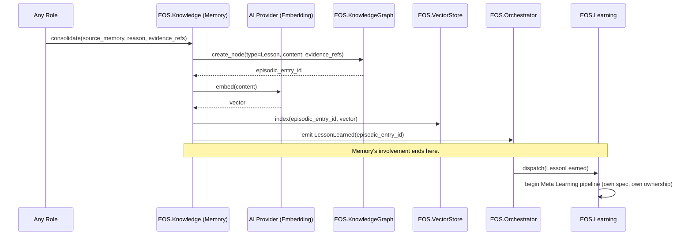
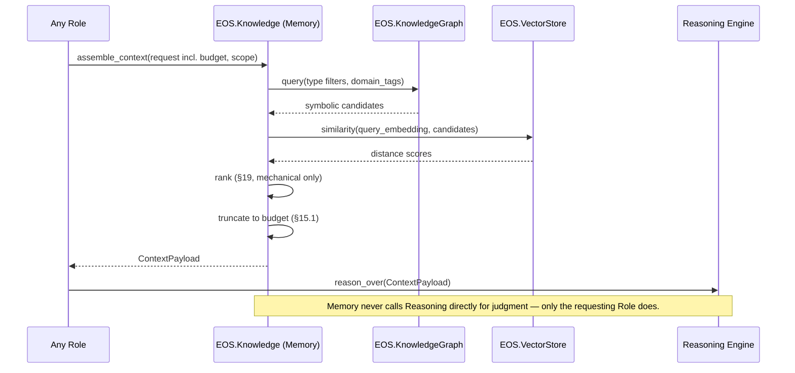
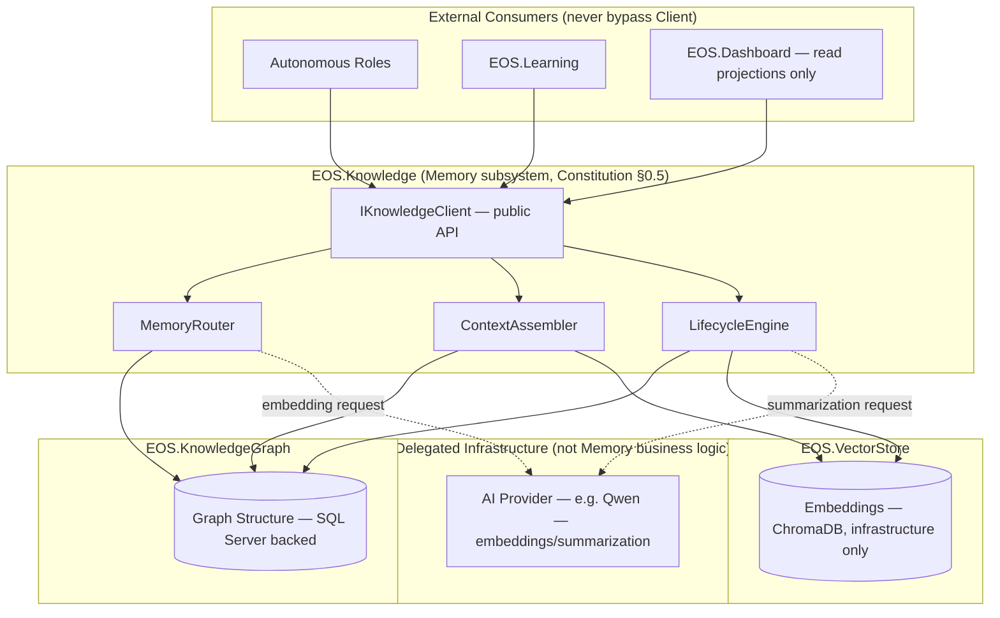

# Memory Management Specification v1.0

**Document Type:** Complementary Engineering Specification
**Extends:** `@EOS-Specification.md` (the Constitution, immutable) and is a peer to `@Learning-Engine-Specification-v1.1.md` (immutable, approved)
**Status:** Proposed
**Primary Constitutional Anchors:** §0.5 — Knowledge Graph · Part 4 — Data Architecture · Part 3 — Event Catalog · §0.1.1.5 — No Data Duplication · Part 8 — Artifact Registry · §0.12.1 — Execution Cycles

This document does not redesign, fork, or duplicate `@EOS-Specification.md` or `@Learning-Engine-Specification-v1.1.md`. It is the implementation-level architecture of one subsystem the Constitution already named but only sketched: the Knowledge Graph (§0.5), realized through the existing projects `EOS.Knowledge`, `EOS.KnowledgeGraph`, and `EOS.VectorStore` (Constitution Part 1). No new project is introduced — this specification gives those three already-registered projects their full internal architecture, exactly as the Learning Engine Specification did for Part 14 without needing a new project registration beyond the one flagged in its own Open Questions.

---

## 1. Executive Summary

The Memory subsystem is the single owner of storing, organizing, retrieving, evolving, and governing every type of engineering knowledge EOS produces or consumes — across a spectrum from momentary in-process context (Working Memory) to permanent, generalized engineering knowledge (Long-term/Semantic Memory). It is realized entirely by `EOS.Knowledge` (business logic / access layer), `EOS.KnowledgeGraph` (graph structure), and `EOS.VectorStore` (embeddings, ChromaDB-backed) — the same three projects the Constitution already names in §0.5 and Part 1. Memory owns *what is retained, how it is organized, and how it is retrieved*. It explicitly does not own *what gets promoted through the Meta Learning pipeline* (Learning Engine's exclusive responsibility, Learning-Engine-Specification-v1.1) or *any semantic judgment about correctness, similarity, or trust* (Reasoning Engine's exclusive responsibility, forthcoming). ChromaDB and any AI provider (e.g., Qwen) are infrastructure the Memory subsystem depends on, never business logic it contains.

## 2. Purpose

To define, without ambiguity, the complete architecture of the Memory subsystem so that another autonomous engineer can implement it with zero architectural judgment calls — including how the seven memory types relate to each other, to the Constitution's existing store ownership (Part 4), and to the Learning Engine's already-approved pipeline, without duplicating or contradicting either.

## 3. Scope

In scope:
- The full lifecycle of every memory type (§10) from creation to expiration/archival
- Storage, retrieval, indexing, consolidation, compression, and expiration strategy for all memory types
- Context Assembly — how Memory composes a bounded, relevant context for a consumer (e.g., a role invoking the Reasoning Engine) from across memory types
- The `EOS.Knowledge` query/access interface (`IKnowledgeClient`) already named — but not fully specified — in Constitution §0.5.2 and consumed as-is by Learning-Engine-Specification-v1.1 §14.3
- Memory-specific events, state transitions, and KPIs

Out of scope (see Non-Responsibilities, §5):
- Meta Learning pipeline stage transitions (Lesson → Pattern → … → Platform Capability) — exclusively Learning Engine's domain
- Semantic similarity computation, confidence judgment, trust scoring, and summarization *generation* — exclusively Reasoning Engine's domain (forthcoming)
- Physical store technology internals (SQL Server, Redis, SQLite, ChromaDB engine behavior) — owned by Data Architecture (Part 4) and the underlying infrastructure, not by Memory's business logic
- Protection/security governance beyond what's needed for Memory's own data-sensitivity handling — owned by the forthcoming Protection Layer Specification

## 4. Responsibilities

Memory, and only Memory, owns:

1. Classifying and routing every unit of retained information into the correct memory type (§10).
2. The full lifecycle state machine governing promotion/demotion/expiration between memory types (§11, §22).
3. Storage strategy — deciding, per memory type, which existing Constitutional store (Part 4 §4.1) is used, with zero new stores introduced.
4. Retrieval and indexing strategy — how content is found (§13, §14), including invoking (not owning) embedding generation via an AI Provider.
5. Context Assembly — composing a bounded, ranked, relevant context payload for any requesting consumer (§15).
6. Consolidation, compression, and expiration policy execution (§16–§18).
7. Retrieval ranking — the mechanical ordering of candidate results by recency, vector distance, and metadata signals (§19) — explicitly not a semantic-correctness judgment.
8. Emission of all Memory-specific events (§21).

## 5. Non-Responsibilities

Memory does **not** own, and must never duplicate:

| Capability | Actual Owner | Constitutional/Spec Anchor |
|---|---|---|
| Meta Learning pipeline stage transitions (Lesson→Pattern→…→Platform Capability) | Learning Engine (`EOS.Learning`) | Learning-Engine-Specification-v1.1 §7 (Ownership) |
| Pipeline metadata (`PipelineRecord`/`TransitionRecord`) | Learning Engine | Learning-Engine-Specification-v1.1 §9 |
| Similarity computation / semantic comparison | Reasoning Engine (forthcoming) | Learning-Engine-Specification-v1.1 §7, §15 |
| Trust/confidence scoring | Reasoning Engine (forthcoming) | Learning-Engine-Specification-v1.1 §24.4 |
| Summarization/compression *content generation* | Reasoning Engine (forthcoming), invoked by Memory | §17 below |
| ROI evaluation | Learning Engine (§0.16.2 formula, Learning Engine evaluation) | Constitution §0.16.2, Learning-Engine-Specification-v1.1 §11.3 |
| Quality Gate definitions/enforcement | `EOS.Gates` | Constitution §0.8 |
| Physical store engine behavior (SQL Server, Redis, SQLite, ChromaDB internals) | Data Architecture / Infrastructure | Constitution Part 4 |
| Embedding *model* / any AI provider behavior (e.g., Qwen) | AI Architect / Provider Architecture | Constitution §0.14 |
| Task Lifecycle state transitions | Task Lifecycle owner (roles + Scheduler) | Constitution Part 6 |
| Security/threat governance beyond data-sensitivity classification | Protection Layer (forthcoming) | (flagged, §32 Future Evolution) |

**Rule:** "Memory owns memory. Learning owns learning. Reasoning owns reasoning. Protection owns protection." Any capability not explicitly listed in §4 above defaults to *not* being Memory's responsibility.

## 6. Relationship with @EOS-Specification.md and @Learning-Engine-Specification-v1.1.md

| Anchor | Relationship |
|---|---|
| Constitution §0.5 (Knowledge Graph) | This document is the full implementation specification of §0.5. Node types (Fact, Lesson, Pattern, Decision, Risk, §0.5.1) are inherited verbatim as the *content* vocabulary that Memory's seven memory types (§10) organize and route — Memory does not invent a competing content taxonomy. |
| Constitution §0.5.2 (Query Interface) | `IKnowledgeClient` (this document, §20) is the concrete realization of "all roles query the Knowledge Graph through `EOS.Knowledge`" — exactly the interface Learning-Engine-Specification-v1.1 §14.3 already consumed by name; this document ratifies that consumption rather than changing it. |
| Constitution §0.5.3 (Consistency Guarantee) | Reaffirmed: Memory is still the only place Lesson/Pattern/Decision content lives; Learning Engine's `PipelineRecord` continues to hold only a reference (`knowledge_graph_ref`), never a copy (Learning-Engine-Specification-v1.1 ADR-L002, ownership matrix §7). |
| Constitution Part 4 (Data Architecture) | Every memory type (§10) is mapped onto an *existing* Part 4 store row — no new store is introduced anywhere in this document. |
| Constitution Part 3 (Event Catalog) | Memory's new events (§21) extend the existing envelope/versioning discipline (Part 3 §3.2), consuming `LessonLearned`/`KnowledgeUpdated` and producing new Memory-lifecycle events. |
| Learning-Engine-Specification-v1.1 §7 (Ownership) | That document's ownership matrix already states Learning Engine "never persists Lesson/Pattern/etc. content" (INV-1) — this document is the other half of that boundary: Memory is exactly where that content does live. |
| Learning-Engine-Specification-v1.1 §9 (`domain_tags`) | Reused verbatim as the tagging mechanism underlying Project Memory (§10.6) — Memory does not invent a second domain-tagging vocabulary. |
| Learning-Engine-Specification-v1.1 §14.1/§14.3 (Contracts on `IKnowledgeClient`/`query_similar`) | This document's §20 `IKnowledgeClient` specification is written to satisfy those already-published preconditions/postconditions/failure contracts without modification. |
## 7. Functional Requirements

| ID | Requirement |
|---|---|
| FR-M1 | Memory MUST classify every incoming unit of information into exactly one primary memory type (§10) at creation time. |
| FR-M2 | Memory MUST NOT introduce a new physical store — every memory type maps to an existing Part 4 store row. |
| FR-M3 | Memory MUST delegate all embedding generation and summarization *content* generation to an AI Provider (§0.14) via a defined client interface — never compute these itself. |
| FR-M4 | Memory MUST expose exactly one query interface (`IKnowledgeClient`, §20) to all consumers — no subsystem may reach `EOS.KnowledgeGraph`/`EOS.VectorStore` directly (Constitution Part 2 dependency rule, reaffirmed). |
| FR-M5 | Memory MUST support Context Assembly (§15) that respects a caller-specified size/token budget, never returning an unbounded payload. |
| FR-M6 | Memory MUST consolidate ephemeral memory (Working/Short-term/Session) into persistent memory (Episodic/Semantic/Long-term) only through an explicit, auditable consolidation decision (§16) — never silently. |
| FR-M7 | Memory MUST NOT make any Meta Learning pipeline-stage decision (Lesson→Pattern etc.) — it may only emit the `LessonLearned` event that *starts* that pipeline (already defined, Constitution Part 3), which Learning Engine alone consumes. |
| FR-M8 | Memory MUST support Project Memory (§10.6) as a filtered *view* over existing stored content (via `domain_tags`), never as a physically separate copy. |
| FR-M9 | Memory MUST expire or archive content according to declared retention policy per memory type (§18), with archival always producing an auditable record, never silent deletion. |
| FR-M10 | Memory MUST be able to reconstruct Episodic Memory (§10.4) entries from the Event Catalog stream alone (replay guarantee, Constitution Part 3 §3.2). |

## 8. Non-Functional Requirements

Mapped onto the Constitution's NFR Framework (§0.7):

| NFR Category | Requirement |
|---|---|
| Performance | Working Memory read/write < 20ms; Context Assembly for a typical role request < 2s on target hardware (i7-1065G7 class, §28) |
| Reliability | Long-term/Semantic/Episodic Memory survive process restart with zero content loss (event-sourced + durable store backing) |
| Security | No memory type stores raw secrets; sensitivity classification travels with content regardless of memory type (§26) |
| Maintainability | Memory-type-to-store mapping (§12) is externally configurable (Constitution Part 10, `Knowledge.json`/`Storage.json`) rather than hardcoded |
| Observability | Every memory-type transition traceable via correlation ID (Constitution Part 5 §5.3) |
| Offline-first | All Memory operations function fully offline; the only external-adjacent call is to a local AI Provider (embedding/summarization) |
| Resource-boundedness | No memory type's working set is allowed to grow unbounded in RAM at any point (§28) |

## 9. Memory Architecture

```
                         ┌───────────────────────────┐
                         │   IKnowledgeClient (§20)   │   ← sole external access point
                         │   (exposed by EOS.Knowledge)│     (FR-M4 / Constitution §0.5.2)
                         └─────────────┬─────────────┘
                                       │
        ┌──────────────────────────────┼──────────────────────────────┐
        │                              │                              │
┌───────▼────────┐           ┌─────────▼─────────┐          ┌─────────▼─────────┐
│  MemoryRouter   │           │  ContextAssembler  │          │  LifecycleEngine   │
│  (classifies    │           │  (§15 — composes   │          │  (§11 — governs    │
│  incoming units │           │  bounded, ranked    │          │  consolidation,     │
│  into memory     │           │  context payloads)  │          │  compression,       │
│  types, §10)     │           │                     │          │  expiration)        │
└───────┬─────────┘           └─────────┬──────────┘          └─────────┬─────────┘
        │                               │                                │
        └───────────────┬───────────────┴────────────────┬───────────────┘
                         │                                │
                ┌────────▼────────┐              ┌────────▼─────────┐
                │ EOS.KnowledgeGraph│              │  EOS.VectorStore  │
                │ (graph structure, │              │  (embeddings via  │
                │  SQL Server-backed│              │  ChromaDB —        │
                │  per Part 4)       │              │  infrastructure,   │
                │                    │              │  never business    │
                │                    │              │  logic)            │
                └────────────────────┘              └────────────────────┘
                         │                                │
                ┌────────▼────────────────────────────────▼────────┐
                │   Redis (ephemeral: Working/Short-term/Session)   │
                │   SQLite (offline/session cache, Part 4 §4.1)     │
                │   — all existing Part 4 rows, no new store        │
                └────────────────────────────────────────────────────┘
```

`MemoryRouter`, `ContextAssembler`, and `LifecycleEngine` are internal components of `EOS.Knowledge` — they are not new projects, consistent with §36's "no new project" constraint (analogous to how Learning-Engine-Specification-v1.1 §8 organized `EOS.Learning`'s internals without adding sibling projects).

## 10. Memory Types

Every memory type below maps to an existing Constitution Part 4 store — no new store is introduced (FR-M2).

### 10.1 Working Memory

**Definition:** The information actively held during a single Execution micro-cycle (Constitution §0.12.1) — the immediate context a role or the Reasoning Engine is reasoning over right now.
**Backing store:** Redis (ephemeral, Part 4 §4.1).
**Lifetime:** Exists only for the duration of the micro-cycle; never survives past it unless explicitly promoted to Short-term or Session memory (§11).
**Content:** Raw, unclassified — not yet tagged with `domain_tags` or linked to a `knowledge_graph_ref`.

### 10.2 Short-term Memory

**Definition:** State scoped to a single Task Lifecycle (Constitution Part 6) run — intermediate reasoning steps, retry context, task-scoped scratch data.
**Backing store:** Redis, keyed by `task_id`, TTL bound to the task's lifecycle.
**Lifetime:** Created at `TaskStarted`, expires automatically when the task reaches `Verified`, `Released`, `Archived`, or `Cancelled` (Constitution Part 6 §6.2) — unless explicitly consolidated into Episodic Memory first (§16).
**Content:** Task-scoped; may reference Working Memory snapshots.

### 10.3 Long-term Memory

**Definition:** The permanent content of the Knowledge Graph itself — Facts, ratified Patterns/Best Practices/Principles (post Learning Engine promotion), Decisions, Risks (Constitution §0.5.1, unchanged vocabulary).
**Backing store:** `EOS.KnowledgeGraph` (SQL Server-backed structure, Part 4 §4.1) + `EOS.VectorStore` (ChromaDB embeddings).
**Lifetime:** Permanent by default; only leaves via explicit archival governance (§18), never automatic time-based expiration.
**Content:** The terminal destination for content that has survived consolidation and, where applicable, the Learning Engine's promotion pipeline.

### 10.4 Episodic Memory

**Definition:** A record of a *specific occurrence* — "this exact incident/task happened, on this date, with this outcome" — as distinct from generalized (Semantic) knowledge extracted from it.
**Backing store:** SQL Server event store (Constitution Part 4 §4.1, the same append-only store backing the Event Catalog, Part 3) + a Lesson-stage node in `EOS.KnowledgeGraph` once consolidated (§16).
**Lifetime:** Reconstructable indefinitely from the Event Catalog replay guarantee (FR-M10); may be compressed (§17) once its generalizable content has been extracted into Semantic Memory, but the raw occurrence record is never deleted, only summarized.
**Content:** Maps directly onto the Knowledge Graph's `Lesson` node type (§0.5.1) *before* Learning Engine promotion — Episodic Memory is where a Lesson lives the moment it's created; what happens to it afterward (Pattern promotion, etc.) is Learning Engine's exclusive concern (§5).

### 10.5 Semantic Memory

**Definition:** Generalized, timeless engineering knowledge — Facts, and any Pattern/Best Practice/Principle that the Learning Engine has promoted (Learning-Engine-Specification-v1.1, Part 14 pipeline).
**Backing store:** `EOS.KnowledgeGraph` + `EOS.VectorStore`, identical physical backing to Long-term Memory — Semantic Memory is a *content-type view* over Long-term Memory (Facts + promoted pipeline stages), not a separately stored copy.
**Lifetime:** Permanent, same governance as Long-term Memory (§10.3).
**Content:** Explicitly excludes raw, unpromoted Lessons (those are Episodic, §10.4) — this boundary is what keeps Memory from duplicating Learning Engine's promotion judgment: Memory only reflects *already-made* promotion decisions, it never itself decides that a Lesson has "become" a Pattern.

### 10.6 Project Memory

**Definition:** A domain/project-scoped *view* over Long-term/Semantic/Episodic Memory, filtered by `domain_tags` — the same tagging field Learning-Engine-Specification-v1.1 §9 already defines on `PipelineRecord`.
**Backing store:** No new store — a query-time filter (`WHERE domain_tags CONTAINS ?`) over `EOS.KnowledgeGraph`, consistent with FR-M8.
**Lifetime:** N/A — it is a view, not a stored entity.
**Content:** Any memory type's content, scoped by project/domain tag.

### 10.7 Session Memory

**Definition:** State scoped to a single human-or-role interaction session (e.g., one authoring session, one Dashboard-driven review session) — broader than a single task (Short-term Memory, §10.2) but not intended to be permanent.
**Backing store:** Redis for backend sessions; SQLite for offline/mobile sessions (Constitution Part 4 §4.1, Part 15's existing mobile-cache pattern — reused, not redefined).
**Lifetime:** Expires at explicit session close, or after an idle-timeout policy (§18); may be explicitly consolidated into Episodic Memory before expiry if the session produced a Lesson-worthy occurrence (§16).
**Content:** Session-scoped state; may span multiple tasks (unlike Short-term Memory, which is single-task-scoped).
## 11. Memory Lifecycle

```
Working Memory
   │ (explicit promotion, e.g. task starts using this context)
   ▼
Short-term Memory  ──── (task ends without Lesson-worthy outcome) ───► Expired (silently discarded, FR-M9 does not apply — nothing "worth" retaining was ever created)
   │
   │ (consolidation decision, §16 — outcome deemed worth retaining)
   ▼
Episodic Memory  ── emits LessonLearned (Constitution Part 3) ──► [Learning Engine pipeline begins, out of Memory's scope]
   │
   │ (Learning Engine promotes Lesson → Pattern → ... , consumed as KnowledgeUpdated)
   ▼
Semantic Memory (reflects Learning Engine's promotion outcome; Memory does not decide this transition itself)
   │
   │ (age + Learning Engine promotion complete, §17)
   ▼
Compressed (raw Episodic detail summarized; Semantic content unaffected)
   │
   │ (retention policy elapsed, §18, governance-approved)
   ▼
Archived (never deleted outright — retained per Constitution Part 8 Artifact Registry "Permanent" class for Lessons)

Session Memory ── (explicit consolidation, §16) ───► Episodic Memory
Session Memory ── (session close, no consolidation) ───► Expired
Project Memory — a view, not a lifecycle participant (§10.6)
Long-term Memory — permanent superset containing Semantic Memory; governed identically to §10.3/§10.5
```

**Critical boundary (reaffirmed):** the arrow from Episodic → Semantic Memory above is *observed*, not *decided*, by Memory. The actual decision — whether a Lesson becomes a Pattern, Best Practice, etc. — is made exclusively by the Learning Engine (Learning-Engine-Specification-v1.1, Part 14 pipeline, §11 algorithms). Memory's `LifecycleEngine` (§9) only reacts to `LessonPromoted`/`KnowledgeUpdated` events by updating which *view* (Episodic vs. Semantic) a piece of content appears under — it never emits a promotion decision itself. This is the single most important non-duplication boundary in this specification.

## 12. Storage Strategy

| Memory Type | Store (Constitution Part 4 row) | Rationale |
|---|---|---|
| Working | Redis | Ephemeral, sub-cycle lifetime — exactly Redis's designated role (Part 4 §4.1) |
| Short-term | Redis (TTL = task lifetime) | Task-scoped, bounded lifetime; avoids polluting SQL Server with throwaway scratch data |
| Session | Redis (backend) / SQLite (offline/mobile) | Matches existing session/cache patterns already established for Mobile (Part 4 §4.3, Part 15) |
| Episodic | SQL Server event store + `EOS.KnowledgeGraph` Lesson node | Reuses the existing append-only event store (Part 4 §4.1) as the durable backing; no parallel store |
| Semantic | `EOS.KnowledgeGraph` + `EOS.VectorStore` | Identical to Long-term (§10.5) — a content-type view, not a separate store |
| Long-term | `EOS.KnowledgeGraph` + `EOS.VectorStore` | Constitution §0.5, unchanged |
| Project | *(view only — no store)* | Query-time filter over the above (§10.6) |

No memory type introduces a physical store beyond this table — satisfying FR-M2 and the Constitution's no-duplication rule (§0.1.1.5).

## 13. Retrieval Strategy

Retrieval is **hybrid**, matching Constitution §0.5.2's existing statement ("symbolic graph traversal + vector similarity re-ranking") — this specification adds the missing detail:

1. **Symbolic stage:** `EOS.KnowledgeGraph` resolves an initial candidate set via structured filters (memory type, `domain_tags`, node type per §0.5.1, time range).
2. **Vector stage:** `EOS.VectorStore` (ChromaDB, infrastructure only) computes embedding-distance scores for the candidate set against a query embedding.
3. **Re-ranking stage:** `MemoryRouter`/`ContextAssembler` combine symbolic recency/relevance signals with vector distance into a single ranked list (§19) — this is a *mechanical* ranking, not a semantic-correctness judgment (that remains Reasoning Engine's job, §5).

Retrieval never bypasses stage 1 (pure vector search with no symbolic pre-filter) for Long-term/Semantic queries, to bound the vector search space and keep latency predictable on the target hardware (§28).

## 14. Indexing Strategy

- Every unit of content entering Episodic, Semantic, or Long-term Memory is assigned an embedding at consolidation time (§16), generated by invoking an AI Provider's embedding model (Constitution §0.14) through a defined client interface (`IEmbeddingProviderClient`, §20) — Memory owns *when* to index, never *how* the embedding model computes the vector (FR-M3).
- Working/Short-term/Session Memory are **not** embedded/indexed by default (they are ephemeral and typically discarded, §11) — indexing only occurs for content that survives to Episodic Memory or beyond, avoiding wasted inference budget (Constitution Part 7 §7.2) on throwaway data.
- Index freshness: `EOS.VectorStore`'s index is updated synchronously with `EOS.KnowledgeGraph` writes for Episodic/Semantic/Long-term content — no eventual-consistency window is permitted between graph structure and its embedding for these permanent memory types (differs from the Constitution's general eventual-consistency posture, Part 5 §5.2, which applies to cross-service projections like Dashboard, not to Memory's own internal graph/embedding pairing).

## 15. Context Assembly

**Definition:** The process by which Memory composes a bounded, ranked, relevant payload of content — drawn from any combination of memory types — for a requesting consumer (e.g., a role about to invoke the Reasoning Engine, or the Learning Engine's `ClusterTrigger` requesting candidates via `query_similar`).

### 15.1 Assembly Algorithm

```
on assemble_context(request):
    budget = request.token_or_size_budget          # FR-M5, caller-specified, never unbounded
    candidates = []
    if request.includes_working:   candidates += Redis.read(current_micro_cycle)
    if request.includes_short_term: candidates += Redis.read(task_id=request.task_id)
    if request.includes_episodic:   candidates += KnowledgeGraph.query(type=Lesson, filters=request.filters)
    if request.includes_semantic:   candidates += KnowledgeGraph.query(type in [Fact, Pattern, BestPractice, Principle], filters=request.filters)
    if request.project_scope:       candidates = filter(candidates, domain_tags contains request.project_scope)  # §10.6

    ranked = RetrievalRanking.rank(candidates)      # §19, mechanical ranking only
    assembled = []
    running_size = 0
    for item in ranked:
        if running_size + item.size > budget:
            break                                    # hard budget cutoff, FR-M5
        assembled.append(item)
        running_size += item.size
    return ContextPayload(items=assembled, truncated=(len(assembled) < len(ranked)))
```

### 15.2 Truncation Transparency

`ContextPayload.truncated` is always populated truthfully — Memory never silently drops content without signaling that truncation occurred, so a consumer (e.g., Learning Engine, Reasoning Engine) can distinguish "there was nothing more relevant" from "there was more, but it didn't fit the budget."
## 16. Memory Consolidation

**Definition:** The explicit, auditable act of promoting ephemeral memory (Working/Short-term/Session) into persistent memory (Episodic). This is Memory's *only* promotion-like action — it stops exactly at "this occurrence is worth keeping," and never proceeds further into the Learning Engine's territory (Lesson→Pattern, etc.).

### 16.1 Consolidation Triggers

| Trigger | Source |
|---|---|
| Explicit role action ("this is worth remembering") | Any role, via `IKnowledgeClient.consolidate()` (§20) |
| Automatic, on Gate failure (novel failure) | Mirrors Constitution §0.8.3's existing rule that a novel gate failure emits `LessonLearned` — Memory's consolidation is what *produces* the Episodic Memory entry that event references |
| Automatic, on `IncidentResolved` | Constitution Part 3 — incident resolution is treated as an automatic consolidation trigger, since incident learnings are rarely discarded |
| Session close with flagged content | A role explicitly flags part of a Session as worth retaining before the session's natural expiration (§18) |

### 16.2 Consolidation Algorithm

```
on consolidate(source_memory, reason, evidence_refs):
    episodic_entry = KnowledgeGraph.create_node(type=Lesson, content=source_memory.content,
                                                  evidence_refs=evidence_refs)
    embedding = EmbeddingProvider.embed(episodic_entry.content)    # delegated, §14
    VectorStore.index(episodic_entry.id, embedding)
    emit LessonLearned(episodic_entry.id, source=source_memory.origin)   # Constitution Part 3, existing event
    # Memory's involvement ends here — Learning Engine takes over from LessonLearned onward
    source_memory.mark_consolidated()   # so it is not double-consolidated on natural expiry
```

Note the deliberate absence of any clustering/promotion logic in this algorithm — that would duplicate Learning-Engine-Specification-v1.1 §11.1/§11.2, which already owns everything from `LessonLearned` onward.

## 17. Memory Compression

**Definition:** Reducing the storage/retrieval footprint of Episodic Memory once its generalizable content has already been extracted into Semantic Memory by the Learning Engine — never applied to Semantic/Long-term content itself, and never a substitute for archival governance (§18).

### 17.1 Compression Policy

- Eligible: an Episodic entry whose corresponding `PipelineRecord` (Learning-Engine-Specification-v1.1 §9) has reached `Pattern` stage or beyond, **and** has not been read via `IKnowledgeClient` in the last N Sprint cycles (configurable, `Thresholds.json`).
- Not eligible: any entry still at `Lesson` stage (its raw detail may still matter for Learning Engine's clustering, §11.2 of that spec) or flagged with a legal/compliance retention hold (§26).

### 17.2 Compression Algorithm

```
on compression_sweep():   # Sprint-cycle cadence, Constitution §0.12.1
    for entry in EpisodicMemory.eligible_for_compression():
        summary = ReasoningEngine.summarize(entry.content)   # content generation delegated, §5/§20
        KnowledgeGraph.replace_content(entry.id, summary, original_ref=ArtifactRegistry.archive(entry.content))
        emit MemoryCompressed(entry.id, original_size, summary_size)
```

The original raw content is never destroyed — it is archived into the Artifact Registry (Constitution Part 8, "Evidence"/"Snapshots" retention classes) before replacement, preserving evidence-over-assertion (Constitution §0.1.1.1) even after compression.

## 18. Memory Expiration

| Memory Type | Expiration Trigger | Governance |
|---|---|---|
| Working | End of Execution micro-cycle | Automatic, no audit trail needed (never persisted) |
| Short-term | Task reaches terminal Task Lifecycle state (Part 6 §6.2) without consolidation | Automatic; if consolidated first, this trigger is moot (§16) |
| Session | Explicit session close, or idle-timeout policy (`Thresholds.json`) | Automatic; pre-expiry consolidation flag (§16) checked first |
| Episodic | Never expires outright — only compresses (§17) or archives (below) | Governed |
| Semantic / Long-term | Never expires automatically — only archived via explicit Architecture Evolution-style review (mirrors Constitution §0.10 Architecture Evolution workflow, applied to a knowledge-retirement decision instead of a code-architecture decision) | Requires Principal Engineer approval, ADR-logged |
| Project (view) | N/A — not a stored entity | N/A |

Archival (as distinct from expiration) always produces an `LessonArchived`-equivalent record (reusing the exact event Learning-Engine-Specification-v1.1 §15 already defines for its own Archived status, since a Memory-side archival of Semantic content and a Learning-Engine-side archival of a stalled pipeline record are the same conceptual action against the same underlying `knowledge_graph_ref` — reusing the event avoids inventing a redundant one) — never silent deletion (FR-M9).

## 19. Memory Retrieval Ranking

**Definition:** The mechanical (non-semantic-judgment) ordering of candidate results returned by Retrieval (§13) or consumed by Context Assembly (§15).

### 19.1 Ranking Formula

```
score(candidate) = w1 * vector_similarity        # from EOS.VectorStore, infrastructure-computed distance
                  + w2 * recency_decay(candidate.last_updated)
                  + w3 * domain_match(candidate.domain_tags, request.project_scope)
                  + w4 * access_frequency(candidate.id)
```

Weights (`w1..w4`) are externally configurable (`Thresholds.json`, Constitution Part 10) per the Constitution's existing pattern for tunable thresholds.

### 19.2 Explicit Non-Duplication of Trust/Confidence

This ranking formula deliberately excludes any "trust score" or "confidence" term. Learning-Engine-Specification-v1.1 §24.4 already defines `trust_score` as a Reasoning-Engine-computed signal consumed by the Learning Engine for *promotion* decisions — Memory's retrieval ranking is a separate, lower-stakes mechanical ordering for *result presentation*, and reusing the same trust vocabulary here would blur an already-established ownership boundary. If a future consumer needs trust-weighted ranking, it must apply that weighting itself after receiving Memory's mechanically-ranked results, not ask Memory to compute it.

## 20. Memory APIs

### 20.1 `IKnowledgeClient` (ratifies Constitution §0.5.2, consumed as-is by Learning-Engine-Specification-v1.1 §14.3)

```
IKnowledgeClient
    IEnumerable<KnowledgeNode> query_similar(KnowledgeGraphRef ref)
        // Precondition: ref resolves to a non-Archived, non-Quarantined node
        //   (identical precondition already assumed by Learning-Engine-Specification-v1.1 §14.3)
        // Postcondition: returned set never includes the querying record itself
        //   (identical postcondition already assumed by Learning-Engine-Specification-v1.1 §14.3)

    void update(KnowledgeGraphRef ref, ...)
        // emits KnowledgeUpdated (Constitution Part 3), unchanged

    ContextPayload assemble_context(ContextRequest request)     // NEW, §15
        // Precondition: request.token_or_size_budget > 0
        // Postcondition: sum(item.size for item in result.items) <= request.token_or_size_budget

    EpisodicEntryRef consolidate(MemoryRef source, string reason, string[] evidence_refs)   // NEW, §16
        // Precondition: source.status != already_consolidated
        // Postcondition: emits exactly one LessonLearned event; never emits a pipeline-stage event
        //   (that would violate the Learning Engine ownership boundary, §5)

    IEnumerable<KnowledgeNode> query(MemoryType type?, string[] domain_tags?, DateRange range?)  // NEW, §10
```

### 20.2 `IEmbeddingProviderClient` (consumed, delegated per FR-M3 / §14)

```
IEmbeddingProviderClient
    Vector embed(string content)
        // Precondition: content is non-empty
        // Postcondition: returned vector has the dimensionality configured for the active AI Provider
        // Failure contract: on provider unavailability, indexing is deferred and retried
        //   (Constitution Part 5 §5.3 retry/circuit-breaker policy) — never silently skipped
```
## 21. Events

Extending Constitution Part 3's Event Catalog under its existing envelope/versioning discipline (Part 3 §3.2). Events already defined by the Constitution or Learning Engine (`LessonLearned`, `KnowledgeUpdated`, `LessonArchived`) are reused, never redefined:

| Event | Producer | Consumers | Payload |
|---|---|---|---|
| `LessonLearned` *(existing, Constitution Part 3)* | Memory (`consolidate()`, §16) | Learning Engine, Knowledge | episodic_entry_id, source |
| `KnowledgeUpdated` *(existing, Constitution Part 3)* | Memory (`update()`, §20) | Dashboard, Planner | node_id, node_type, change_kind |
| `LessonArchived` *(existing, Learning-Engine-Specification-v1.1 §15, reused)* | Memory (§18 archival) | Knowledge, Dashboard | node_id, reason |
| `WorkingMemoryDiscarded` *(new)* | Memory (LifecycleEngine) | Dashboard (metrics only) | micro_cycle_id |
| `SessionMemoryClosed` *(new)* | Memory | Dashboard | session_id, consolidated: bool |
| `MemoryCompressed` *(new)* | Memory (§17) | Dashboard, Knowledge | node_id, original_size, summary_size, archive_ref |
| `MemoryConsolidated` *(new)* | Memory (§16) | Dashboard, Learning Engine (informational only — Learning Engine already reacts to `LessonLearned`, this is a supplementary metrics-only signal) | source_memory_type, episodic_entry_id |
| `ContextAssembled` *(new)* | Memory (§15) | Dashboard (observability only) | request_id, item_count, truncated: bool |

## 22. State Transitions

```
                    ┌──────────────┐
                    │   Working     │
                    └──────┬───────┘
                           │ promote (explicit)
                    ┌──────▼───────┐        idle-timeout / task-end
                    │  Short-term/  │───────────────────────────────► Expired
                    │   Session     │
                    └──────┬───────┘
                           │ consolidate() — §16 (explicit, auditable)
                    ┌──────▼───────┐
                    │   Episodic    │◄────────────────────┐
                    └──────┬───────┘                      │
                           │ (Learning Engine promotes —   │ (Learning Engine demotes —
                           │  observed via KnowledgeUpdated)│  observed via LessonDemoted,
                           ▼                                │  Learning-Engine-Spec-v1.1 §15)
                    ┌──────────────┐                       │
                    │   Semantic    │───────────────────────┘
                    │ (= Long-term) │
                    └──────┬───────┘
                           │ compression eligible (§17)
                    ┌──────▼───────┐
                    │  Compressed   │
                    └──────┬───────┘
                           │ retention elapsed + Principal Engineer approval (§18)
                    ┌──────▼───────┐
                    │   Archived    │
                    └──────────────┘
```

Every transition above that crosses from ephemeral (Working/Short-term/Session) to persistent (Episodic) is the single explicit consolidation boundary (§16) — no other transition in this diagram is silent or automatic without a corresponding event (§21).

## 23. Sequence Diagrams (Mermaid)

### 23.1 Consolidation → Learning Engine Handoff



### 23.2 Context Assembly for a Reasoning Engine Call



## 24. Component Diagrams (Mermaid)


## 25. Error Handling

| Failure | Handling |
|---|---|
| AI Provider unavailable during embedding (§14, §20.2) | Indexing deferred and retried per Constitution Part 5 §5.3 policy; content is still written to `EOS.KnowledgeGraph` immediately (structure is never blocked on embedding availability) — the vector index simply lags until the provider recovers |
| AI Provider unavailable during summarization (§17.2) | Compression sweep skips that entry this cycle and retries next cycle; the entry remains fully readable in its uncompressed form in the meantime — never a functional degradation, only a deferred storage-efficiency gain |
| Context Assembly budget exceeded before any item fits | Returns an empty `ContextPayload` with `truncated=true` rather than erroring — a caller can decide whether "nothing fit" is itself actionable information |
| Consolidation called on already-consolidated source | No-op with a warning log (idempotent, mirrors Learning-Engine-Specification-v1.1 FR-1's idempotency pattern) |
| Redis unavailable (Working/Short-term/Session Memory) | Constitution Part 5 §5.3 circuit breaker; degraded mode operates with reduced Working Memory (roles reason with less context) rather than failing outright — Long-term/Semantic/Episodic Memory (SQL-Server-backed) are unaffected since they live on a separate store |
| `EOS.KnowledgeGraph`/`EOS.VectorStore` inconsistency (a node exists without its embedding, or vice versa) | Detected via a scheduled reconciliation sweep (co-scheduled with the Sprint-cycle Stall/Fitness sweeps Learning-Engine-Specification-v1.1 §22 already establishes as a pattern); emits `KnowledgeUpdated` once reconciled |

## 26. Security Considerations

- Memory holds no secrets of its own; any sensitive content stored (e.g., a Lesson referencing customer data) carries a data-sensitivity classification that travels with the content regardless of which memory type it currently occupies — classification is set once at consolidation time (§16) and is never re-derived per memory type.
- `IKnowledgeClient` access control mirrors the existing Constitution §0.5.2 posture ("all roles query through `EOS.Knowledge`") — no new authentication mechanism introduced.
- Compression (§17) archives original content into the Artifact Registry (Part 8) rather than deleting it, so no compression event can be used to destroy evidence — consistent with Constitution §0.1.1.1 (evidence over assertion).
- A "legal/compliance retention hold" flag (§17.1) is honored by both compression eligibility and archival governance (§18) — Memory enforces the hold but does not itself decide when a hold applies (that determination belongs to whichever role/policy sets the flag, out of this specification's scope per §5).
- Full threat-model-style analysis (knowledge poisoning, hallucination, etc.) is explicitly **not** duplicated here — Learning-Engine-Specification-v1.1 §24 already owns that analysis for the pipeline; Memory's security posture here is limited to its own storage/access surface, consistent with "Protection owns protection" (this document's own Non-Responsibilities, §5) reserving deeper threat modeling for the forthcoming Protection Layer Specification.

## 27. Performance Considerations

| Operation | Target (i7-1065G7 class hardware, §28) |
|---|---|
| Working Memory read/write | < 20ms |
| Short-term/Session Memory read/write | < 30ms |
| Symbolic query stage (§13, step 1) | < 200ms for a 10,000-node candidate set |
| Vector similarity stage (§13, step 2), via ChromaDB | < 500ms for a pre-filtered candidate set of ≤500 |
| Full Context Assembly (§15) end-to-end | < 2s (NFR, §8) |
| Compression sweep (§17), per Sprint cycle | Bounded by the same batching approach Learning-Engine-Specification-v1.1 §28 establishes for its own sweeps — non-time-critical, deferrable under thermal pressure |

## 28. Resource Constraints

Concretized against the same named hardware target used throughout this EOS lineage (i7-1065G7, 32GB RAM, 477GB NVMe, offline, single laptop):

| Resource | Posture |
|---|---|
| CPU | Symbolic/vector query stages draw from the Scheduler's existing CPU Budget (Constitution Part 7 §7.2) as a percentage allocation, identical pattern to Learning-Engine-Specification-v1.1 §30 |
| RAM | Context Assembly (§15) never materializes more than the caller's requested budget in memory; the underlying candidate set is streamed/paginated from `EOS.KnowledgeGraph`, never fully loaded before ranking |
| Storage | No new store introduced (§12); NVMe budget is shared across SQL Server/ChromaDB/Redis/SQLite per existing Part 4 allocation, not a Memory-specific reservation |
| Offline execution | Fully offline; the only external-adjacent dependency is the local AI Provider embedding/summarization call (§20.2), itself running locally per the governing prompt's AI Stack |
| Background scheduling | Compression sweeps and reconciliation sweeps (§25) prefer Maintenance Windows / idle periods (Constitution Part 7 §7.2), identical posture to Learning-Engine-Specification-v1.1 §30 |
| Thermal awareness | All batch operations (compression, reconciliation) have multi-second/minute budgets, not millisecond ones, so they can be deferred under thermal throttling without violating a hard real-time requirement — reusing Learning-Engine-Specification-v1.1 §30's exact rationale |
| Inference scheduling | Every embedding/summarization call consumes Inference Budget (Constitution Part 7 §7.2) like any other AI-Architect-governed call (§0.14) — Memory gets no special allowance |

## 29. Architecture Decision Records

### ADR-M001

**Title:** Memory Is the Full Specification of Constitution §0.5, Not a New Subsystem

**Status:** Proposed

**Context:** The task requested a "Memory Management Specification" with a broad mandate ("storing, organizing, retrieving, evolving and governing every type of engineering knowledge"). Taken literally and in isolation, this could be read as a new subsystem competing with the Constitution's already-defined Knowledge Graph (§0.5).

**Decision:** Treat this specification as the implementation-level detail of §0.5, realized by the already-registered `EOS.Knowledge`/`EOS.KnowledgeGraph`/`EOS.VectorStore` projects (Constitution Part 1) — no new project introduced.

**Alternatives Considered:**
- Introduce a new `EOS.Memory` project alongside `EOS.Knowledge` — rejected because it would immediately create the exact duplicated-ownership problem the task's Architecture Rules explicitly forbid ("Memory owns memory" — singular owner, not a second one competing with §0.5's existing owner).

**Trade-offs:** This framing constrains creative naming (e.g., no `EOS.Memory` project to point to) in exchange for zero ownership ambiguity against already-approved architecture.

**Consequences:** Every memory type (§10) must map onto existing Part 4 stores and existing §0.5.1 node types — which this specification does throughout.

**Future Impact:** Establishes the precedent that a "management specification" for an already-Constitutionally-named subsystem is a detailing exercise, not a new-subsystem exercise — future specifications (e.g., a "Reasoning Management Specification") should follow the same pattern if a Constitutional anchor already exists.

**Related EOS Sections:** Constitution §0.5, Part 1, Part 4; this document §1, §6.

### ADR-M002

**Title:** Episodic Memory Terminates Exactly at `LessonLearned`; No Pipeline Logic in Memory

**Status:** Proposed

**Context:** The Meta Learning pipeline (Constitution Part 14) begins with a Lesson. Memory's Consolidation (§16) also produces a Lesson-type node. Without a firm boundary, Memory could drift into implementing clustering/promotion logic that Learning-Engine-Specification-v1.1 already fully owns.

**Decision:** Memory's `consolidate()` algorithm (§16.2) stops immediately after emitting `LessonLearned` — it contains zero clustering, promotion, or ROI logic, all of which live exclusively in `EOS.Learning`.

**Alternatives Considered:**
- Have Memory perform an initial "pre-clustering" pass before handing off to Learning Engine, as an optimization — rejected because it would duplicate `ClusterTrigger`'s responsibility (Learning-Engine-Specification-v1.1 §8/§11.2) and reintroduce exactly the "duplicated responsibilities" defect the governing prompt forbids.

**Trade-offs:** A small handoff latency (one extra event round-trip) versus perfect ownership clarity — accepted, since the Learning Engine's own performance targets (Learning-Engine-Specification-v1.1 §27) already budget for this.

**Consequences:** Any future desire to speed up clustering must be solved inside `EOS.Learning`, not by pushing logic back into Memory.

**Future Impact:** Establishes the general pattern that a "producer" subsystem (Memory) never peeks into a "consumer" subsystem's (Learning Engine) decision logic, even for optimization purposes.

**Related EOS Sections:** Constitution Part 3, Part 14; Learning-Engine-Specification-v1.1 §7, §11.1, §11.2; this document §16.

### ADR-M003

**Title:** Retrieval Ranking Excludes Trust/Confidence Scoring by Design

**Status:** Proposed

**Context:** Learning-Engine-Specification-v1.1 §24.4 introduced a `trust_score` concept for pipeline-promotion decisions. Memory's own Retrieval Ranking (§19) also orders results and could be tempted to reuse "trust" as a ranking signal.

**Decision:** Memory's ranking formula (§19.1) uses only mechanical signals (vector similarity, recency, domain match, access frequency) and explicitly excludes trust/confidence (§19.2).

**Alternatives Considered:**
- Fold `trust_score` into the ranking formula as a fifth weighted term — rejected because `trust_score` is a Reasoning-Engine-computed, Learning-Engine-consumed signal for a specific purpose (promotion gating); repurposing it for retrieval ordering would blur that ownership and create two divergent consumers of the same signal with different freshness/update semantics.

**Trade-offs:** Retrieval results may occasionally rank a low-trust-source item above a high-trust one on pure recency/similarity grounds; a consumer that cares about trust must apply that filter itself post-retrieval.

**Consequences:** No change needed in Memory if the Reasoning Engine Specification later revises how `trust_score` is computed — Memory's ranking is fully decoupled from that computation.

**Future Impact:** Establishes that "presentation ordering" (Memory) and "decision-gating scoring" (Learning Engine/Reasoning Engine) are permanently separate concerns, even when both happen to rank the same underlying content.

**Related EOS Sections:** Learning-Engine-Specification-v1.1 §24.4, §19; this document §19.

## 30. KPIs

| KPI | Formula Source |
|---|---|
| Consolidation rate | Episodic entries created / total ephemeral memory units created (Working+Short-term+Session), per Sprint cycle |
| Context Assembly truncation rate | `ContextPayload.truncated=true` responses / total assembly requests |
| Compression yield | Aggregate `original_size` − `summary_size` across `MemoryCompressed` events per Quarterly cycle (Constitution §0.12.1) |
| Index freshness lag | Time between `EOS.KnowledgeGraph` write and corresponding `EOS.VectorStore` index completion, for Episodic/Semantic/Long-term content |
| Retrieval latency (p95) | Time from `assemble_context()` call to response, sampled per Sprint cycle |
| Archival backlog | Content eligible for archival (§18) awaiting Principal Engineer approval, tracked as a queue depth |

## 31. Risks

| Risk | Likelihood | Impact | Mitigation |
|---|---|---|---|
| Memory's Consolidation boundary (§16) gets blurred in a future revision, reintroducing pipeline logic into `EOS.Knowledge` | Low | High | ADR-M002 explicitly documents the boundary; Phase 3 audit (§33) re-checks it every version |
| Vector index falls persistently behind graph structure under sustained AI Provider unavailability (§25) | Low-Medium | Medium | Reconciliation sweep (§25) surfaces drift; content remains queryable via symbolic stage alone in the interim (§13) |
| Retention-hold flag (§26) is set inconsistently by upstream roles, causing legally-sensitive content to be compressed/archived prematurely | Low | High | Flagged as an Open Question (§34) — the flag's *setting* logic is out of this specification's scope and needs a clear owner assigned |
| Session Memory (§10.7) idle-timeout default is miscalibrated, causing premature loss of not-yet-consolidated context | Medium | Low-Medium | Externally configurable via `Thresholds.json`; tracked via Consolidation rate KPI trend (§30) |

## 32. Future Evolution

- Once the Reasoning Engine Specification exists, its summarization (§17.2) and embedding (§14/§20.2) contracts should be formally ratified here, mirroring how Learning-Engine-Specification-v1.1 flagged the same dependency for `compare()`/`get_trust_signal()`.
- Once a Protection Layer Specification exists, the retention-hold mechanism (§26, §31) and any Memory-specific threat surface (e.g., could Working Memory itself be a poisoning vector before content ever reaches Episodic Memory?) should be revisited jointly with that specification rather than duplicated here.
- Domain-specific Context Assembly tuning (e.g., different ranking weights for Mobile-domain vs. Backend-domain queries, mirroring Constitution Part 15's domain-equality principle) is a plausible future refinement, not designed here to avoid scope creep.

## 33. Architecture Review & Audit

This section records the three-phase review process executed before finalizing this document, per the governing task's instructions.

### Phase 1 — Self-Review Findings

- **Weakness found:** an early draft of Consolidation (§16) risked including a rudimentary "is this similar to an existing Lesson?" pre-check, which would have duplicated Learning Engine's `ClusterTrigger`. **Resolved** by stripping all such logic and codifying the boundary explicitly as ADR-M002.
- **Weakness found:** an early draft of Retrieval Ranking (§19) considered including `trust_score` as a ranking input for consistency with Learning Engine's vocabulary. **Resolved** by explicitly excluding it (§19.2, ADR-M003), keeping mechanical ranking separate from decision-gating scoring.
- **Missing section identified:** the initial pass had no explicit mapping between memory types and Constitution Part 4 stores, risking an implicit new-store invention. **Resolved** via the Storage Strategy table (§12), which maps every memory type onto an existing row.
- **Missing section identified:** no reconciliation mechanism existed for `EOS.KnowledgeGraph`/`EOS.VectorStore` drift. **Resolved** by adding the reconciliation sweep (§25).
- **Scalability risk identified:** Context Assembly (§15) could materialize an unbounded candidate set before ranking/truncation on a large Knowledge Graph. **Resolved** by requiring streamed/paginated candidate retrieval (§28) rather than full materialization.
- **Terminology risk identified:** an early draft used "Memory Node" as a competing vocabulary to Constitution §0.5.1's "Fact/Lesson/Pattern/Decision/Risk" node types. **Resolved** by dropping "Memory Node" entirely and using the Constitution's existing node-type vocabulary throughout (§6, §10).

### Phase 2 — Improvements Applied

All six findings above were incorporated directly into the final specification text (§12, §16, §19, §25, §28) rather than left as open gaps — this document's body already reflects the post-improvement state; no separate "before/after" duplication is presented, consistent with the instruction to output only the final specification file.

### Phase 3 — Final Audit Against @EOS-Specification.md and @Learning-Engine-Specification-v1.1.md

| Consistency Check | Result |
|---|---|
| Terminology consistency | **Pass.** Node types (Fact/Lesson/Pattern/Decision/Risk) reused verbatim from Constitution §0.5.1; `domain_tags` reused verbatim from Learning-Engine-Specification-v1.1 §9; no competing vocabulary introduced. |
| Ownership consistency | **Pass.** Non-Responsibilities table (§5) traces every excluded capability to its actual owner in one of the two approved documents; no capability is claimed by both documents. |
| Interface consistency | **Pass.** `IKnowledgeClient.query_similar()`'s pre/postconditions exactly match what Learning-Engine-Specification-v1.1 §14.3 already assumed — no retroactive contract change required of that approved document. |
| Event consistency | **Pass.** `LessonLearned`, `KnowledgeUpdated`, and `LessonArchived` are reused, not redefined; all new events (§21) follow the existing envelope (Constitution Part 3 §3.2). |
| Architecture consistency | **Pass.** No new project introduced (ADR-M001); `EOS.Knowledge`/`EOS.KnowledgeGraph`/`EOS.VectorStore` dependency shape is unchanged from Constitution Part 1/Part 2. |
| Responsibility consistency | **Pass.** The Meta Learning pipeline boundary (§11, §16, ADR-M002) is drawn at exactly the same point Learning-Engine-Specification-v1.1 draws it from its own side (§7 Ownership matrix, INV-1) — both documents agree independently on where content-storage ends and pipeline-logic begins. |
| Dependency consistency | **Pass.** No new store introduced (§12); Redis/SQLite/SQL Server/ChromaDB usage all cite existing Part 4 rows. |
| Security consistency | **Pass.** No new authentication mechanism; reuses `EOS.Knowledge`'s existing access posture (§0.5.2). |
| Lifecycle consistency | **Pass.** Memory's lifecycle (§11, §22) hands off to Learning Engine's lifecycle (Learning-Engine-Specification-v1.1 §16) at exactly one well-defined seam (`LessonLearned`), with no overlapping states claimed by both. |
| Future compatibility | **Pass with flags.** Two Open Questions (§34) depend on specifications not yet written (Reasoning Engine, Protection Layer), flagged rather than guessed at — consistent with both prior documents' own practice of flagging rather than inventing. |

**No duplicated responsibilities, no ownership conflicts, no terminology conflicts, no architectural inconsistencies detected.**

## 34. Open Questions

1. Who owns setting the legal/compliance retention-hold flag (§26, §31)? This specification only specifies that Memory *honors* it, not who *sets* it — likely belongs to a forthcoming Protection Layer Specification.
2. `IEmbeddingProviderClient`/summarization contracts (§20.2, §17.2) are provisional pending the Reasoning Engine Specification, exactly as Learning-Engine-Specification-v1.1 flagged for its own AI-Provider-adjacent interfaces.
3. Should Context Assembly ranking weights (§19.1) be domain-specific (mirroring Constitution Part 15's domain-equality principle) rather than global defaults? Flagged in Future Evolution (§32), not decided here.

---

**Status: Memory Management Specification v1.0 complete. Self-Review, Improvement, and Audit phases executed (§33). Zero unresolved consistency defects against `@EOS-Specification.md` or `@Learning-Engine-Specification-v1.1.md`. Stopping per instructions — not proceeding to any further specification.**
