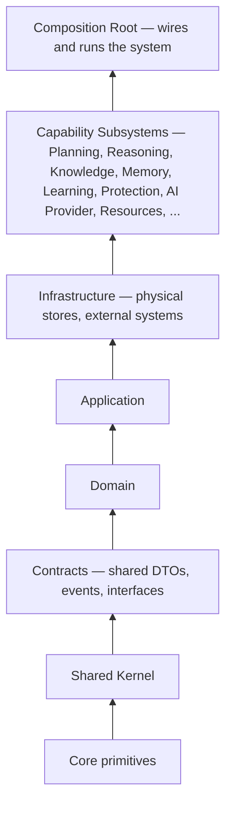
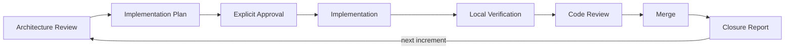

# EOS — Engineering Operating System

EOS is an autonomous engineering operating system: a governed, evidence-driven platform that turns engineering goals into planned, executed, validated, and continuously improved work — with architecture discipline, traceability, and human authority built in from the ground up, not layered on afterward.

This repository is the reference implementation of EOS, built strictly against an approved architecture specification (the *Constitution*) and a corresponding set of subsystem specifications. The architecture is fixed before implementation begins; the implementation exists to realize it, not to redefine it as it goes.

---

## Vision

Most engineering organizations run on tribal knowledge, ad hoc process, and decisions that are never traced back to the evidence that justified them. Automation efforts built on top of that foundation tend to automate the inconsistency along with the work.

EOS starts from a different premise: an engineering system should be **governed like a production system**, not just a collection of scripts and conventions. Every decision — human or automated — should be traceable to evidence, scoped by explicit authority, validated before it is trusted, and captured so the system gets measurably better over time.

EOS exists to make autonomous and AI-assisted engineering work **safe to delegate**, by giving it the same properties already demanded of well-run production software: explicit contracts, layered dependencies, gated changes, auditable history, and a hard separation between *what is allowed to change* and *what must not*.

---

## Core Principles

These principles are enforced structurally in this repository, not just documented:

- **Architecture-first.** A specification is approved before any code implementing it is written. Implementation realizes architecture; it does not invent it.
- **Governance by design.** Every autonomous action is subject to policy, risk, and approval checks proportional to its risk — never a uniform rubber stamp, never a silent bypass.
- **Traceability over assertion.** A claim of "done" is backed by evidence — a passing test, a resolvable artifact, a recorded decision — never taken on faith.
- **Incremental implementation.** The system is built as a sequence of small, independently verifiable increments, each fully integrated before the next begins.
- **Evidence-driven engineering.** Decisions, risk scores, and completion claims are grounded in data the system can actually produce and check, not in optimistic narration.
- **KISS and YAGNI as defaults.** No abstraction, interface, dependency, or configuration mechanism exists without a concrete, current requirement driving it.
- **Vertical slices over scaffolding.** Where a real end-to-end path can be proven, it is proven — placeholder-only implementations are the exception, not the pattern.
- **Small, verified changes.** Every change is scoped, reviewed, tested, and formally closed before the next change begins.
- **Continuous validation.** Build correctness, architectural conformance, and test coverage are checked on every change, not audited after the fact.

---

## What EOS Provides

EOS decomposes autonomous engineering work into distinct capabilities, each owned by a dedicated subsystem with a narrow, well-defined responsibility:

| Capability | Responsibility |
|---|---|
| **Planning** | Turns goals into task graphs, respecting dependencies, priority, and available capacity. |
| **Reasoning** | Produces explainable, evidence-backed decisions — never a bare answer without a rationale. |
| **Knowledge** | Owns the durable graph of what the system knows, how it was derived, and how it relates. |
| **Memory** | Manages working, episodic, and long-term recall across a task's lifetime and beyond it. |
| **Learning** | Turns outcomes into lessons, feeding back into future planning and reasoning quality. |
| **Protection** | Validates every autonomous action against policy, risk, and approval requirements before it executes. |
| **AI Provider Layer** | Abstracts inference and embedding access behind stable contracts, independent of any specific model or vendor. |
| **Resources** | Governs capacity — compute, memory, model usage — so autonomous work respects real operating limits. |
| **Execution** | Carries planned work through to completion under the guarantees Protection and Resources establish. |
| **Governance** | Encodes policy, authority levels, and decision routing as first-class, enforced concerns. |
| **Observability** | Makes system behavior, decisions, and outcomes inspectable — for humans and for the system itself. |

Each capability is deliberately scoped: it owns its own decisions and does not reach into another capability's internal state. Cross-cutting concerns like governance and observability are enforced at defined boundaries rather than woven ad hoc through every subsystem.

---

## Architecture

EOS is a layered, modular monolith by design — internal contracts and dependency direction give the same discipline a service boundary would, without paying network cost for capabilities that are natively co-located.

### Layering



Lower layers never depend on higher layers. A capability subsystem depends on `Contracts` and the infrastructure it genuinely needs — never on another subsystem's internals, and never on a concrete provider, model, or vendor SDK directly.

### Dependency Rules

- **Contracts are the only cross-subsystem language.** Subsystems communicate through shared contracts and events, never by referencing each other's implementation types.
- **One composition root.** Exactly one entry point is permitted to construct and wire every subsystem together; nothing else is allowed to reach across the whole graph.
- **No circular references, anywhere.** Dependency direction is validated as part of the build, not left to reviewer memory.
- **Public contracts are deliberately narrow.** A subsystem exposes the smallest interface that satisfies its consumers — internal engines, adapters, and state are never leaked across a boundary just because it would be convenient.
- **Structural enforcement over convention.** Where a boundary matters (e.g., "only this subsystem may call this capability"), it is enforced by dependency wiring and automated architecture tests, not by a comment asking people to be careful.

### Subsystem Separation

Each capability subsystem is independently buildable, independently testable, and owns exactly one responsibility. A subsystem that needs a capability owned elsewhere consumes it through a contract — it never duplicates the logic locally, and it never reaches past the contract into the other subsystem's implementation.

---

## Engineering Workflow

EOS is developed through a fixed, repeatable delivery cycle. The cycle itself is permanent; only its contents change from one increment to the next.



1. **Architecture Review** — the relevant specification sections are re-read from source, gaps are identified with evidence, and a design is proposed only where the architecture leaves room for one.
2. **Implementation Plan** — scope, files to create/modify, dependency and contract impact, test strategy, and rollback strategy are written down before any code is touched.
3. **Explicit Approval** — implementation begins only once the plan is reviewed and authorized.
4. **Implementation** — strictly scoped to the approved plan. A discovery that would require touching a forbidden file, adding a dependency, or changing a public contract stops implementation and triggers a fresh architecture review rather than being resolved silently.
5. **Local Verification** — the change is proven correct locally (build, full test suite, formatting, architecture tests) before it is ever pushed.
6. **Code Review** — every finding from automated and human review is independently classified as valid or invalid, with evidence; only valid findings are fixed, and only to the minimum necessary extent.
7. **Merge** — history is preserved; changes are merged, never squashed or rebased away.
8. **Closure Report** — what changed, why, and how it was verified is recorded permanently before the next increment begins.

No increment absorbs work that belongs to a later one. No architectural decision is made inside an implementation step — it is made, reviewed, and approved before implementation starts.

---

## Quality & Verification

A change is not "done" because it compiles. Every increment is expected to leave the repository in a state where:

- The full solution builds cleanly, with no warnings treated as acceptable noise.
- The complete automated test suite passes — unit, integration, and architecture-fitness tests alike.
- Code formatting is verified, not just applied.
- Architecture-fitness tests (dependency direction, circular-reference detection, contract-boundary enforcement) pass without exception.

Architecture validation is not a separate, optional audit — it is part of what "complete" means for any change in this repository.

---

## Repository Layout

```text
.
├── src/                     # Production source, one project per subsystem/layer
│   ├── EOS.Core/            # Foundational primitives
│   ├── EOS.SharedKernel/    # Shared low-level types, configuration
│   ├── EOS.Contracts/       # Cross-subsystem DTOs, interfaces, events
│   ├── EOS.Domain/          # Domain model
│   ├── EOS.Application/     # Application-layer logic
│   ├── EOS.Infrastructure/  # Physical data stores and external integrations
│   ├── EOS.Orchestrator/    # In-process coordination and event routing
│   ├── EOS.Runner/          # Composition root — the only entry point
│   ├── EOS.SDK/             # Narrow, stable interfaces for cross-cutting capabilities
│   └── EOS.<Capability>/    # One project per capability subsystem (Reasoning, Knowledge,
│                            # Memory, Learning, Protection, AI Provider, Resources, ...)
├── tests/                   # One test project per corresponding source project
│   └── EOS.ArchitectureTests/  # Automated dependency-direction and fitness-rule checks
├── config/                  # Externalized, environment-specific configuration
├── docs/                    # Governing specifications and delivery records
└── EOS.slnx                 # Solution file
```

Every source project has a corresponding test project. Architecture-fitness rules are themselves tested, not just documented.

---

## Documentation

Documentation in this repository is layered by authority, from immutable to transient:

| Document | Role |
|---|---|
| **Constitution / Core Specification** | The immutable architectural source of truth. Defines roles, dependency rules, governance model, and system-wide invariants. Changed only through a formal amendment process, never implicitly. |
| **Subsystem Specifications** | Detailed, approved architecture for each capability (Reasoning, Knowledge, Memory, Protection, AI Provider, and others). Each is internally consistent with the Constitution and with every other specification. |
| **Implementation Roadmap** | Decomposes the full approved architecture into an ordered sequence of independently deliverable increments. Describes *how* the architecture gets built, never a new design of its own. |
| **Implementation Plans** | Per-increment: scope, architecture decisions traced to specification sections, files affected, dependency and contract impact, and test strategy — written and approved before implementation. |
| **Completion Reports** | Per-increment: what was built, how it was verified, and what — if anything — remains as known, disclosed technical debt. |

When implementation and documentation appear to disagree, the Constitution and subsystem specifications are authoritative. A discrepancy is a signal to investigate, never a reason to quietly pick whichever is more convenient.

---

## Contributing

EOS is built architecture-first. Contributing follows the same discipline the core team uses internally:

- **Read the architecture before proposing code.** A specification exists for essentially every subsystem in this repository — a change that contradicts it needs an architecture discussion first, not a pull request.
- **One increment at a time.** Changes are scoped to a single, well-defined unit of work with its own plan and its own closure — not bundled with unrelated improvements.
- **No speculative engineering.** Don't add an abstraction, dependency, or configuration surface for a need that doesn't exist yet. If the architecture doesn't call for it, it doesn't belong yet.
- **No redesign without approval.** If part of the architecture seems wrong, that's a valid and welcome observation — raised and resolved as an architecture discussion, not smuggled in as an implementation detail.
- **Prove it, don't assert it.** A pull request is expected to include the evidence that it works: tests, verification steps, and a clear account of what was checked.

Issues and discussions are the right place to propose architectural changes or new capabilities before any code is written.

---

## License

Released under the [MIT License](LICENSE.md).
