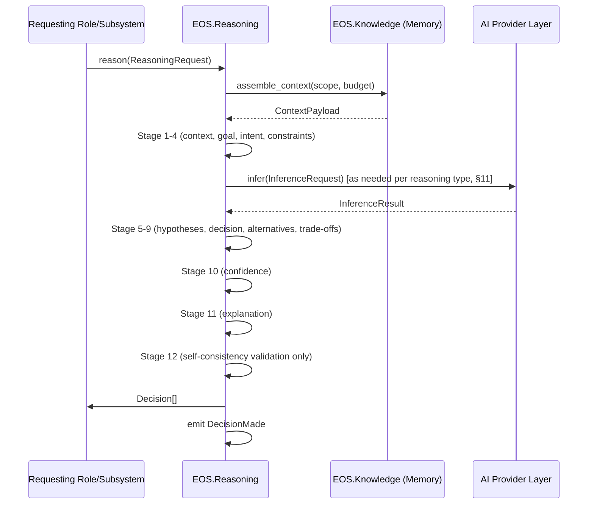
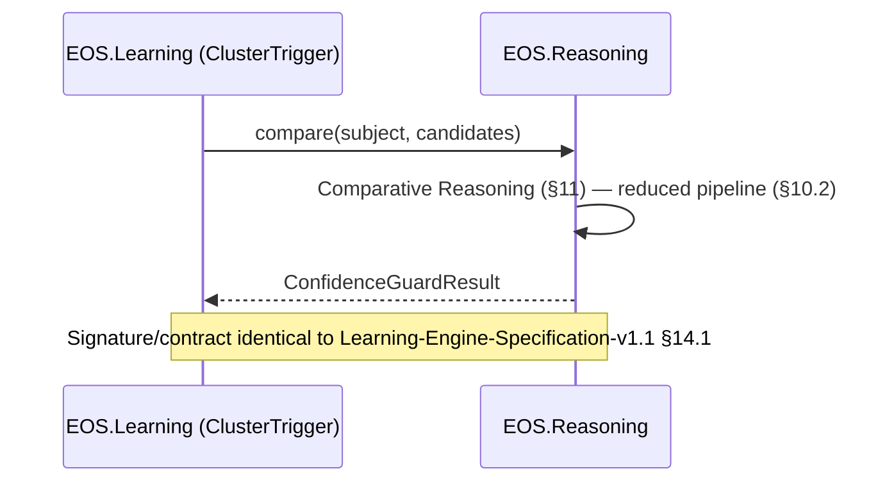
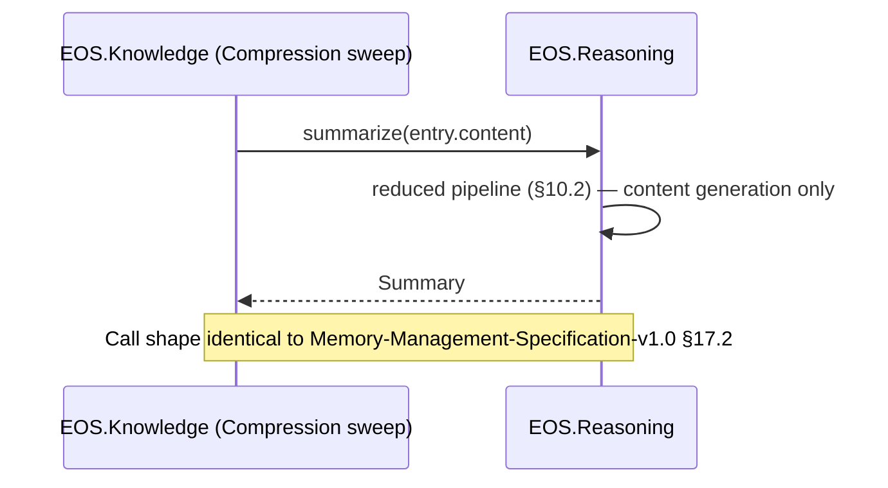
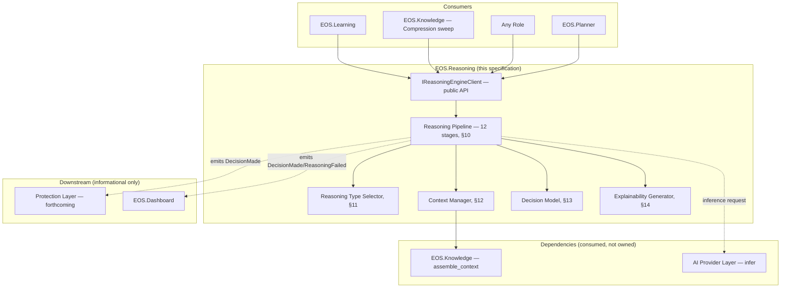

# Reasoning Engine Specification v1.0

**Document Type:** Complementary Engineering Specification
**Extends:** `@EOS-Specification.md` (the Constitution, immutable), and is a peer to `@Learning-Engine-Specification-v1.1.md` and `@Memory-Management-Specification-v1.0.md` (both immutable, approved)
**Status:** Proposed
**Primary Constitutional Anchors:** §0.14 — Provider Architecture · §0.6 — Decision Matrix · §0.6.1 — Risk Scoring · §0.2.1 — AI Architect role · Part 3 — Event Catalog · §0.1.1.1 — Evidence over Assertion

This document does not redesign, fork, or duplicate `@EOS-Specification.md`, `@Learning-Engine-Specification-v1.1.md`, or `@Memory-Management-Specification-v1.0.md`. It introduces exactly one net-new project, `EOS.Reasoning`, following the same pattern `EOS.Learning` established (Learning-Engine-Specification-v1.1, ADR-L001) — a project named but not yet registered in Constitution Part 1, flagged as an Open Question requiring a future Architecture Evolution ADR (§0.10), not added unilaterally here. It formally ratifies two interfaces already consumed, by name, in the two approved documents above (`IReasoningEngineClient.compare()`/`get_trust_signal()` from Learning-Engine-Specification-v1.1 §14.1/§14.2, and the informally-named `ReasoningEngine.summarize()` from Memory-Management-Specification-v1.0 §17.2) — their existing signatures and contracts are preserved verbatim, never changed.

---

## 1. Executive Summary

The Reasoning Engine is the subsystem that transforms knowledge (from Memory), goals, and constraints into explainable, evidence-backed, confidence-scored decisions. It is the sole owner of semantic judgment across EOS: similarity comparison, trust/confidence scoring, summarization, and general-purpose multi-step reasoning — capabilities that Learning-Engine-Specification-v1.1 and Memory-Management-Specification-v1.0 already named as belonging to it and delegated to it by name, without themselves defining it. This specification is that definition. The Reasoning Engine never stores knowledge (Memory's job), never governs pipeline promotion (Learning Engine's job), never plans or schedules (Planner/Scheduler's job), and never makes the final safety/policy call on a decision (Protection Layer's job, forthcoming) — it only reasons, and it explains every reasoning step it takes.

## 2. Purpose

To give another autonomous engineer a complete, implementation-independent architecture for the Reasoning Engine precise enough to implement without architectural judgment calls — and, critically, to formally close the two open interface dependencies (`IReasoningEngineClient`, embedding/summarization contracts) that both approved documents explicitly flagged as pending this specification.

## 3. Scope

In scope:
- The complete reasoning pipeline (§10): context processing through decision validation
- All named reasoning types (§11) and when each applies
- Context management as consumed *from* Memory (§12) — not Memory's own internal context assembly logic (Memory-Management-Specification-v1.0 §15), which remains Memory's
- The full Decision Model (§13) and Explainability model (§14)
- Formal ratification of `IReasoningEngineClient` (§16), including the two methods already in use (`compare`, `get_trust_signal`) and the summarization capability Memory already assumed
- Interaction boundaries with every adjacent subsystem (§15)

Out of scope (see Non-Goals, §5, and Non-Responsibilities, §7):
- Raw model inference mechanics, prompt design, or model internals (explicitly forbidden by the governing task; delegated to a forthcoming AI Provider Layer Specification)
- Knowledge storage, retrieval mechanics, or memory-type lifecycle (Memory's exclusive domain)
- Meta Learning pipeline stage transitions (Learning Engine's exclusive domain)
- Task/plan generation and scheduling (Planner/Scheduler's exclusive domain)
- Safety/policy gating of decisions before they are acted upon (Protection Layer's exclusive domain, forthcoming)

## 4. Goals

- Provide one coherent reasoning surface (`IReasoningEngineClient`) for every subsystem that needs semantic judgment, rather than each subsystem embedding its own ad hoc reasoning logic.
- Make every decision explainable, evidence-backed, confidence-scored, and reproducible whenever possible (governing task's Architecture Rules, reaffirmed as Architectural Invariants, §22 below is folded into §9 NFRs and §13).
- Remain fully provider-independent: the reasoning *logic* (goal understanding, constraint evaluation, trade-off analysis, etc.) lives in `EOS.Reasoning`; the AI model performs inference only, exactly as the governing task's Architecture Rules require.
- Operate fully offline on the named single-laptop hardware target.

## 5. Non-Goals

- The Reasoning Engine does not decide *whether* a decision is safe or policy-compliant enough to act on — it produces the decision, its confidence, and its evidence; the forthcoming Protection Layer decides whether to gate it (§15.4, §21).
- The Reasoning Engine does not decide *what* to plan or *when* to schedule it — Planner/Scheduler remain the owners of task graphs and dispatch (Constitution §0.4, Part 7); the Reasoning Engine may be consulted by the Planner for a judgment call, but never generates a plan itself.
- The Reasoning Engine does not persist any of its own inputs or outputs as canonical knowledge — a Decision's evidence lives in the Artifact Registry (Constitution Part 8) via the same mechanism every other subsystem already uses; the Reasoning Engine does not introduce a second decision-history store (§13.6, §18).
- The Reasoning Engine does not compute embeddings (Memory-Management-Specification-v1.0 §20.2's `IEmbeddingProviderClient` is consumed directly by Memory from the AI Provider Layer, not routed through Reasoning) — embeddings are a mechanical vector computation, not a reasoning act.

## 6. Responsibilities

The Reasoning Engine, and only the Reasoning Engine, owns:

1. Context Processing, Goal Understanding, Intent Analysis, Constraint Evaluation, Hypothesis Generation, Multi-Step Reasoning, Decision Making, Alternative Exploration, Trade-off Analysis, Confidence Evaluation, Explainability generation, and Decision self-consistency validation (§10) — the full reasoning pipeline.
2. Similarity comparison (`compare()`), already consumed by Learning Engine (Learning-Engine-Specification-v1.1 §14.1).
3. Trust signal computation (`get_trust_signal()`), already consumed by Learning Engine (Learning-Engine-Specification-v1.1 §14.2).
4. Summarization content generation (`summarize()`), already consumed by Memory (Memory-Management-Specification-v1.0 §17.2).
5. Selection of *which* reasoning type (§11) applies to a given request.
6. Emission of Reasoning-specific events (§17) and maintenance of Decision History as a queryable projection (§13.6) — not a second canonical store (§9, Non-Responsibilities boundary).

## 7. Non-Responsibilities

**[Ownership boundary table — the single source of truth for what the Reasoning Engine explicitly does not own, mirroring the pattern Memory-Management-Specification-v1.0 §5 established]**

| Capability | Actual Owner | Anchor |
|---|---|---|
| Meta Learning pipeline stage transitions | Learning Engine | Learning-Engine-Specification-v1.1 §7 |
| Knowledge/memory storage, retrieval, ranking, lifecycle | Memory | Memory-Management-Specification-v1.0 §4 |
| Embedding computation | AI Provider Layer (forthcoming), consumed directly by Memory | Memory-Management-Specification-v1.0 §20.2 |
| Task/plan generation, scheduling, resource budgeting | Planner / Scheduler | Constitution §0.4, Part 7 |
| Safety/policy gating of a decision before action | Protection Layer (forthcoming) | §15.4 below |
| Raw model inference / prompt construction / model internals | AI Provider Layer (forthcoming) | §15.6 below |
| Quality Gate definitions/enforcement | `EOS.Gates` | Constitution §0.8 |
| Canonical evidence/artifact storage | Artifact Registry | Constitution Part 8 |
| ROI evaluation | Learning Engine (formula owned by Constitution §0.16.2) | Learning-Engine-Specification-v1.1 §11.3 |
| Ingestion-rate/poisoning/integrity guarding | Learning Engine (its own Threat Model) | Learning-Engine-Specification-v1.1 §24 |

**Rule (reaffirmed from the governing task):** "The Reasoning Engine owns reasoning only. Learning owns learning. Memory owns memory. Planner owns planning. Protection owns validation and safety." Any capability not explicitly listed in §6 defaults to *not* being the Reasoning Engine's responsibility.
## 8. Functional Requirements

| ID | Requirement |
|---|---|
| FR-R1 | The Reasoning Engine MUST expose exactly one public interface (`IReasoningEngineClient`, §16) — no consumer may reach any internal reasoning component directly. |
| FR-R2 | Every Decision (§13) MUST carry at least one evidence reference, a confidence score, and an explanation — no decision may be returned without all three (Architecture Rule: "every decision must have evidence," "every decision must have confidence"). |
| FR-R3 | The Reasoning Engine MUST NOT persist knowledge content — all context it reasons over is requested from Memory (§12) per-call, never cached as a second canonical copy. |
| FR-R4 | The Reasoning Engine MUST NOT generate or execute a task plan — a request that requires planning MUST be rejected with an `UnsupportedTask` failure (§21) directing the caller to the Planner. |
| FR-R5 | The Reasoning Engine MUST delegate all raw model inference to the AI Provider Layer (forthcoming) via a defined client interface (§15.6) — it must never embed provider-specific logic (mirrors Learning-Engine-Specification-v1.1 INV-5, reused verbatim as a principle here). |
| FR-R6 | The Reasoning Engine MUST record which reasoning type (§11) was applied to every Decision, for auditability. |
| FR-R7 | The Reasoning Engine MUST make every Decision reproducible whenever possible — given the same context, goal, and constraints, a re-run SHOULD converge on the same decision or explicitly flag non-determinism (§13.7). |
| FR-R8 | The Reasoning Engine MUST NOT make the final safety/policy determination on a Decision — high-risk decisions (per Constitution §0.6.1 risk scoring, reused) MUST be flagged for Protection Layer review rather than self-approved (§15.4). |
| FR-R9 | `compare()` and `get_trust_signal()` MUST preserve the exact preconditions/postconditions/failure contracts already published in Learning-Engine-Specification-v1.1 §14.1/§14.2 — no breaking change to an already-approved contract. |
| FR-R10 | `summarize()` MUST preserve compatibility with Memory-Management-Specification-v1.0 §17.2's usage (`ReasoningEngine.summarize(entry.content)`) — the ratified signature (§16) must accept at minimum that call shape. |

## 9. Non-Functional Requirements

Mapped onto the Constitution's NFR Framework (§0.7):

| NFR Category | Requirement |
|---|---|
| Performance | See §23 — latency budgets scaled to the named single-laptop hardware target |
| Reliability | A Reasoning Engine failure never corrupts Memory or Learning Engine state — it is a pure function of its inputs, with no durable side effects of its own beyond Decision History (§13.6) |
| Explainability | Every Decision's explanation (§14) is generated as part of the same reasoning pass that produced the decision — never reconstructed after the fact from incomplete logs |
| Traceability | Every Decision carries a correlation ID (Constitution Part 5 §5.3) linking it back to the originating request |
| Reproducibility | See FR-R7; non-deterministic outcomes are explicitly flagged, never silently presented as reproducible |
| Offline-first | Fully offline; the only external-adjacent dependency is the local AI Provider Layer call (§15.6) |
| Provider independence | No reasoning-type implementation (§11) is coupled to a specific model family — swapping the underlying AI Provider (Qwen → Llama/DeepSeek/Gemma/GLM) must not require a change to any reasoning-type's logic, only to the AI Provider Layer binding |

## 10. Core Architecture

The Reasoning Engine implements a single **Reasoning Pipeline** with twelve named stages. Every request to `IReasoningEngineClient.reason()` (§16.1) passes through all applicable stages in order; narrower entry points (`compare()`, `get_trust_signal()`, `summarize()`) invoke a reduced subset of the same pipeline rather than separate logic paths, so there is exactly one reasoning engine internally, not several.

```
1. Context Processing        — normalize/structure the ContextPayload received from Memory (§12.1)
2. Goal Understanding         — extract the request's intended outcome from its stated goal
3. Intent Analysis            — disambiguate what the caller actually wants when the goal is underspecified
4. Constraint Evaluation       — enumerate hard/soft constraints (NFRs, budgets, policy) the decision must respect
5. Hypothesis Generation       — propose one or more candidate resolutions
6. Multi-Step Reasoning        — chain intermediate inferences where a single-step judgment is insufficient
7. Decision Making             — select a primary candidate from the hypotheses
8. Alternative Exploration      — retain and record rejected hypotheses, not just the winner
9. Trade-off Analysis           — articulate what the selected decision sacrifices relative to alternatives
10. Confidence Evaluation        — compute a confidence score for the selected decision (§13.4)
11. Explainability               — generate the Decision's explanation (§14) as a first-class output, not an afterthought
12. Decision Validation          — self-consistency check only (§10.1) — NOT a safety/policy check (that is Protection Layer's job, §7, §15.4)
```

### 10.1 Decision Validation — Explicit Boundary

**This is the single most important boundary in this specification, given the governing task's explicit rule "Protection owns validation and safety."** Stage 12 ("Decision Validation") checks only that the Decision object is *well-formed*: every referenced evidence item resolves (Constitution §0.1.1.1), the confidence score was actually computed (not defaulted), at least one alternative was considered and recorded (§10, stage 8), and the explanation (§14) references the actual constraints/evidence used rather than being generic boilerplate. It never asks "is this decision safe, policy-compliant, or acceptable to act on" — that question belongs entirely to the forthcoming Protection Layer (§15.4). See ADR-R003 for the full rationale.

### 10.2 Pipeline Invocation by Entry Point

| Entry Point | Stages Invoked |
|---|---|
| `reason()` (general-purpose, §16.1) | All 12 stages |
| `compare()` (Learning-Engine-Specification-v1.1 §14.1) | Stages 1, 5–7, 10–12 (context processing of the two inputs, hypothesis = "these are/aren't related," confidence, explainability, validation) — no goal/intent/constraint stages needed since the request itself fully specifies the comparison |
| `get_trust_signal()` (Learning-Engine-Specification-v1.1 §14.2) | Stages 1, 6, 10–12 (multi-step reasoning over historical track record, confidence, explainability, validation) |
| `summarize()` (Memory-Management-Specification-v1.0 §17.2) | Stages 1, 6, 11–12 (content generation is a reasoning act — condensing meaning — but carries no independent "decision," so stages 2–5, 7–10 do not apply) |
## 11. Reasoning Types

Each type below is a specific configuration of the pipeline (§10) — none introduces a separate implementation, only a different weighting/subset of stages and a different evidence expectation.

| Type | When Used | Pipeline Emphasis |
|---|---|---|
| **Deterministic Reasoning** | The answer follows mechanically from stated rules with no ambiguity (e.g., "does this value exceed the configured threshold?") | Stages 4, 7, 12 dominate; stages 5/6/8/9 are trivial (single hypothesis, no real alternative) |
| **Analytical Reasoning** | Breaking a complex question into component parts before answering (e.g., analyzing why a KPI trend shifted) | Stages 1, 3, 6 dominate — heavy multi-step decomposition |
| **Rule-Based Reasoning** | Applying an explicit, pre-defined engineering rule or policy (e.g., Constitution Quality Gate criteria) to a specific case | Stage 4 dominates; used when Constraint Evaluation alone determines the outcome |
| **Goal-Oriented Reasoning** | The request is framed as "help me achieve X" rather than "what is true" | Stages 2, 3, 7 dominate |
| **Contextual Reasoning** | The correct answer depends heavily on situational context assembled from Memory (e.g., project-specific conventions) | Stage 1 dominates; heavy reliance on Memory's Context Assembly (§12) |
| **Architectural Reasoning** | Evaluating architecture-level trade-offs (e.g., "should this module depend on that one") | Stages 4, 8, 9 dominate — this is where Reasoning Engine may be consulted by Principal Engineer-level roles, never replacing their Decision Matrix authority (Constitution §0.6) |
| **Engineering Reasoning** | General software-engineering judgment calls not covered by a more specific type below | Balanced use of all stages |
| **Diagnostic Reasoning** | Identifying *what* is wrong given observed symptoms (e.g., a failing gate, an incident) | Stages 1, 5, 6 dominate — hypothesis generation over candidate causes |
| **Root Cause Analysis** | A deeper diagnostic pass tracing a symptom back through causal chains to its origin | Extends Diagnostic Reasoning with heavier Stage 6 (multi-step causal chaining); typically invoked after an `IncidentDetected`/`IncidentResolved` pair (Constitution Part 3) to inform a Memory Consolidation decision — Reasoning provides the analysis, Memory decides whether to consolidate it (Memory-Management-Specification-v1.0 §16), preserving that ownership boundary |
| **Comparative Reasoning** | Judging similarity/difference between two or more items — the exact shape `compare()` uses (§10.2) | Stages 5–7 dominate; minimal goal/intent analysis since the comparison itself is the request |
| **Risk Reasoning** | Estimating likelihood/impact of a candidate decision — feeds the risk score consumed by Constitution §0.6.1's Decision Matrix, reusing that formula rather than inventing a new one | Stages 4, 9, 10 dominate |
| **Optimization Reasoning** | Selecting the best option among many along one or more explicit objective dimensions (e.g., cost vs. speed) | Stages 5, 7, 9 dominate |
| **Strategic Reasoning** | Longer-horizon judgment spanning multiple Execution Cycles (Constitution §0.12.1) — e.g., informing a CTO-level architecture direction | All stages, with Stage 9 (Trade-off Analysis) weighted most heavily; always routed through Constitution §0.6's Decision Matrix consensus requirements for CTO/Principal Engineer-scoped decisions — the Reasoning Engine informs, the Decision Matrix still governs who may act on it |

## 12. Context Management

**Explicit boundary:** this section governs how the Reasoning Engine *consumes* context handed to it by Memory — it is not a redefinition of Memory-Management-Specification-v1.0 §15's Context Assembly, which remains entirely Memory's responsibility. The Reasoning Engine never queries `EOS.KnowledgeGraph`/`EOS.VectorStore` directly (Constitution Part 2 dependency rule, reaffirmed) — it only ever receives a `ContextPayload` (Memory-Management-Specification-v1.0 §15.1) via `IKnowledgeClient`.

### 12.1 Context Collection

The Reasoning Engine issues one `assemble_context()` call (Memory-Management-Specification-v1.0 §20.1) per reasoning request, specifying the token/size budget and scope (project/domain) appropriate to the request's reasoning type (§11) — it never issues multiple uncoordinated Memory calls to "gather more" mid-reasoning, keeping the Memory/Reasoning boundary a single clean request/response seam.

### 12.2 Context Prioritization

Within the `ContextPayload` already ranked by Memory (Memory-Management-Specification-v1.0 §19, mechanical ranking), the Reasoning Engine may apply a *second*, reasoning-specific prioritization pass — but only over *which already-returned items to actually reason about first*, never re-ranking or re-querying Memory. This second pass is semantic (e.g., "this piece of context directly addresses the stated goal, that one is tangential") — exactly the kind of judgment Memory's mechanical ranking explicitly excludes (Memory-Management-Specification-v1.0 §19.2), so there is no overlap, only a clean handoff from mechanical ranking to semantic prioritization.

### 12.3 Context Filtering

Removing context items that, on reasoning-level inspection, are irrelevant to the specific goal/intent (Stages 2–3, §10) despite having passed Memory's mechanical relevance ranking — recorded in the Decision's explanation (§14) as "considered but filtered," never silently dropped.

### 12.4 Context Expansion

If the initially assembled context is insufficient (e.g., Stage 5's hypotheses cannot be evaluated with what was provided), the Reasoning Engine may issue exactly one follow-up `assemble_context()` call with an expanded scope/budget — bounded to prevent unbounded back-and-forth (max 1 expansion per request, configurable via `Thresholds.json`, Constitution Part 10).

### 12.5 Context Reduction

The inverse of Expansion — if the assembled context exceeds what the current reasoning type (§11) actually needs (e.g., a Deterministic Reasoning request received a large context payload), the Reasoning Engine reduces its working set before proceeding, both for performance (§23) and to avoid the Reasoning Engine's own Explainability output (§14) citing irrelevant evidence.

### 12.6 Context Validation

Before Stage 1 completes, the Reasoning Engine verifies structural integrity of the received `ContextPayload` (non-corrupt, resolvable evidence references) — this is a structural check, not a semantic-poisoning check (Learning-Engine-Specification-v1.1 §24.1's Knowledge Poisoning defenses already run upstream, in Memory's ingestion path via Learning Engine; the Reasoning Engine does not re-implement that defense, only fails cleanly if it receives already-Quarantined content by mistake, per §21 Missing/Invalid Context handling).
## 13. Decision Model

### 13.1 Decision Lifecycle

```
Requested → Contextualized → Hypothesized → Decided → Validated → Explained → Delivered
                                                            │
                                                            ▼ (self-consistency failure, §10.1)
                                                        Rejected (returns a ReasoningFailure, §21)
```

`Delivered` is the terminal state from the Reasoning Engine's own perspective — what happens to the Decision afterward (acted upon, gated by Protection, consumed by Planner, etc.) is the receiving subsystem's concern, not tracked as a further Reasoning Engine lifecycle state (avoids the Reasoning Engine claiming ownership over post-delivery outcomes, which belong to the consumer).

### 13.2 Decision Inputs

```
ReasoningRequest
 ├── request_id, correlation_id
 ├── reasoning_type: one of §11 (may be inferred if unspecified, §10 Stage 2/3)
 ├── goal: string (may be structured for Goal-Oriented Reasoning)
 ├── constraints[]: explicit hard/soft constraints supplied by the caller
 ├── context_scope: { domain_tags[], project_scope, budget }  — passed to Memory's assemble_context()
 └── requesting_role: string (Constitution §0.2.1 role identity)
```

### 13.3 Decision Outputs

```
Decision
 ├── decision_id
 ├── request_id (traceability back to §13.2)
 ├── reasoning_type_applied: one of §11 (FR-R6)
 ├── selected_hypothesis
 ├── rejected_hypotheses[]  (§10 Stage 8 — never empty unless only one hypothesis was ever possible, e.g. Deterministic Reasoning)
 ├── evidence_refs[]  (Artifact Registry pointers, Constitution Part 8 — FR-R2, never empty)
 ├── confidence: float [0.0, 1.0]  (§13.4, FR-R2, never empty)
 ├── explanation: Explanation object (§14, FR-R2)
 ├── trade_offs: string (§10 Stage 9)
 ├── risk_score: float [0, 100]  (reuses Constitution §0.6.1's formula, not reinvented)
 ├── reproducible: bool  (FR-R7)
 └── occurred_at
```

### 13.4 Decision Confidence

Computed at Stage 10 (§10) as a function of: evidence strength (how many independent evidence items support the selected hypothesis), context completeness (was Context Expansion, §12.4, needed and did it help), and — for entry points that pull in a Learning Engine `trust_score` (e.g., `get_trust_signal()` itself, or a `reason()` call whose context includes trust-scored content) — the trust signal of the underlying source, without recomputing or overriding trust scoring ownership (Learning-Engine-Specification-v1.1 §24.4 still owns *what* trust score a source has; the Reasoning Engine only *computes* it when asked via `get_trust_signal()`, and *consumes* it as one input among several when reasoning generally).

### 13.5 Decision Ranking

When a request's Stage 5 (Hypothesis Generation) produces multiple viable hypotheses that Stage 7 does not clearly resolve to one winner (e.g., Optimization Reasoning with close-scoring alternatives, §11), the Reasoning Engine returns a **ranked** list of Decisions rather than forcing a single answer — the caller (a role, Planner, etc.) retains the choice among near-equally-ranked options, consistent with the Constitution's general posture that autonomy is bounded by explicit authority (§0.2.3) rather than the Reasoning Engine silently picking for a human-scoped choice.

### 13.6 Decision Traceability

Every `Decision.evidence_refs` entry resolves to an Artifact Registry entry (Constitution Part 8) — the Reasoning Engine introduces no second evidence store. `correlation_id` propagation (Constitution Part 5 §5.3) links a Decision back through its `ReasoningRequest` to whatever upstream event (e.g., a `TaskBlocked`, an `IncidentDetected`) triggered the request in the first place.

### 13.7 Decision History

A read-only, queryable projection of past Decisions (`IReasoningEngineClient.query_history()`, §16.3) — explicitly a *projection*, not a canonical store: the canonical record of a Decision's evidence remains the Artifact Registry (Part 8); Decision History is a convenience index over `decision_id → evidence_refs/confidence/explanation`, rebuildable at any time from the Artifact Registry and Event Catalog (mirrors the Constitution's general "Dashboard reads projections, never owns data" pattern, §0.11, applied here to Decision History instead of Dashboard specifically).

## 14. Explainability

Every Decision's `explanation` (§13.3) answers, in a single structured object, exactly the questions the governing task enumerates:

```
Explanation
 ├── why: string                     — "Why was this decision made" — references selected_hypothesis and the
 │                                      constraints/goal that drove its selection (Stages 2–4, 7)
 ├── evidence_used: evidence_refs[]  — "What evidence was used" — identical list to Decision.evidence_refs (§13.3),
 │                                      never a separate/divergent list
 ├── assumptions: string[]           — "Which assumptions were made" — explicit gaps in the context that were
 │                                      filled by inference rather than direct evidence (surfaced honestly, not hidden)
 ├── alternatives_rejected: { hypothesis, reason }[]  — "Which alternatives were rejected" — sourced directly
 │                                      from Decision.rejected_hypotheses (§13.3, Stage 8), each with its rejection reason
 ├── confidence_rationale: string    — "Confidence level" — a plain explanation of what drove the numeric
 │                                      confidence score up or down (§13.4), not just the number itself
 └── risks: string[]                 — "Risks" — surfaced from Trade-off Analysis (Stage 9) and Risk Reasoning
                                        (§11) where applicable; never left blank when risk_score (§13.3) is non-trivial
```

**Explainability is generated, never reconstructed.** The `Explanation` object is produced as a direct output of Stage 11 (§10) during the same reasoning pass that produced the Decision — there is no separate "explain this past decision" code path that has to guess at reasoning that already happened, which would risk fabricating a plausible-sounding but inaccurate justification (a form of the hallucination risk Learning-Engine-Specification-v1.1 §24.3 already warns about in an adjacent context).
## 15. Interaction with Other Subsystems

### 15.1 Learning Engine

**Direction:** Learning Engine calls Reasoning Engine (not the reverse). Learning Engine's `ClusterTrigger` invokes `compare()` (Learning-Engine-Specification-v1.1 §11.2, §14.1); its `ConfidenceGuard` invokes `get_trust_signal()` (§14.2). The Reasoning Engine never initiates a call into `EOS.Learning`, and never sees or influences Meta Learning pipeline stage state directly — it only ever receives the specific `PipelineRecord`/candidate data passed as call arguments (§16.1).
**Boundary:** Reasoning computes; Learning decides what to do with the result (promote, reject, quarantine). This is unchanged from Learning-Engine-Specification-v1.1's own description of the boundary (§7 Ownership matrix) — this specification does not alter it, only fulfills the Reasoning-side half of it.

### 15.2 Memory Management

**Direction:** Bidirectional, but asymmetric in kind. The Reasoning Engine calls Memory's `IKnowledgeClient.assemble_context()` (Memory-Management-Specification-v1.0 §20.1) to obtain context (§12.1) — it never queries `EOS.KnowledgeGraph`/`EOS.VectorStore` directly. Memory calls the Reasoning Engine's `summarize()` (Memory-Management-Specification-v1.0 §17.2) during its own Compression sweep — the Reasoning Engine does not initiate compression decisions, it only performs the content-generation step Memory asks for.
**Boundary:** Memory owns *what* content exists and *when* it's retained/compressed/expired; Reasoning owns *producing* a summary or comparison *when asked*. Neither subsystem decides the other's internal policy.

### 15.3 Planner & Scheduler

**Direction:** Planner may call the Reasoning Engine (`reason()`, §16.1, typically Architectural/Strategic/Optimization Reasoning types, §11) for a judgment call feeding into plan construction (e.g., "which of these two implementation approaches better fits current competency availability"). The Reasoning Engine never generates a task graph, sets priorities, or touches the Scheduler's budgets (Constitution §0.4, Part 7) — a request that asks it to do so is rejected as `UnsupportedTask` (§21, FR-R4).
**Boundary:** Planner/Scheduler retain full ownership of *what gets scheduled and when*; the Reasoning Engine only ever answers a bounded question put to it.

### 15.4 Protection Layer (forthcoming)

**Direction:** The Reasoning Engine emits `DecisionMade` (§17) for every delivered Decision; the forthcoming Protection Layer is expected to subscribe to this event and apply safety/policy gating for decisions above a risk threshold (reusing Constitution §0.6.1's existing risk-scoring escalation pattern) before any consumer treats the Decision as approved for action. The Reasoning Engine does not call into Protection synchronously as part of its own pipeline (§10) — Decision Validation (§10.1) is explicitly limited to self-consistency, never safety.
**Boundary (Open Question, §26):** the exact mechanics of Protection's gating (synchronous veto vs. asynchronous post-hoc review) are not yet defined, since the Protection Layer Specification does not yet exist — flagged, not guessed at, consistent with both prior approved documents' practice.

### 15.5 Knowledge Management

**Note:** "Knowledge Management" as named in the governing task's interaction list is the same subsystem Memory-Management-Specification-v1.0 already fully specifies (that document's own §1 states it *is* the implementation of Constitution §0.5's Knowledge Graph). This specification does not treat "Knowledge Management" as a distinct fourth subsystem — doing so would immediately create the duplicated-ownership problem both prior documents were carefully structured to avoid. See §15.2 above for the actual interaction.

### 15.6 AI Provider Layer (forthcoming)

**Direction:** The Reasoning Engine is the primary consumer of the AI Provider Layer's inference capability — every reasoning-type implementation (§11) that requires model inference calls through a to-be-fully-specified `IAIProviderClient` (name provisional, Open Question §26), never embedding provider selection, prompt construction, or model-specific logic itself (FR-R5, mirrors Learning-Engine-Specification-v1.1 INV-5). The AI model performs inference only; the Reasoning Engine owns interpreting the result and folding it into the pipeline (§10).
**Boundary:** Provider Architecture (Constitution §0.14) already governs *which* provider/model is selected (AI Architect role); the Reasoning Engine consumes whatever the AI Architect has configured without embedding a preference of its own.

## 16. Interfaces

Responsibilities only — no implementation, per the governing task's instruction.

### 16.1 `IReasoningEngineClient` (public, consumed by all other subsystems)

```
IReasoningEngineClient

    Decision[] reason(ReasoningRequest request)
        Responsibility: run the full 12-stage pipeline (§10) for a general-purpose reasoning request;
        returns one Decision, or a ranked list when Decision Ranking (§13.5) applies.

    ConfidenceGuardResult compare(PipelineRecord subject, IEnumerable<PipelineRecord> candidates)
        Responsibility: Comparative Reasoning (§11) over the supplied items; identical signature,
        preconditions, postconditions, and failure contract already published in
        Learning-Engine-Specification-v1.1 §14.1 — ratified verbatim, not modified.

    TrustSignal get_trust_signal(string source_role)
        Responsibility: compute a trust signal for the named role via Multi-Step Reasoning over its
        historical track record (§10.2); identical signature, preconditions, postconditions, and failure
        contract already published in Learning-Engine-Specification-v1.1 §14.2 — ratified verbatim.

    Summary summarize(string content, int? size_budget)
        Responsibility: produce a condensed representation of the supplied content; satisfies the call
        shape already assumed by Memory-Management-Specification-v1.0 §17.2 (`ReasoningEngine.summarize
        (entry.content)`) — the optional size_budget parameter is additive and does not break that
        existing call shape (FR-R10).

    Decision[] query_history(string? decision_id, string? correlation_id, DateRange? range)
        Responsibility: read-only Decision History projection (§13.7) — never mutates state.
```

### 16.2 `IAIProviderClient` (consumed, provisional pending the AI Provider Layer Specification)

```
IAIProviderClient   — name and full shape provisional (Open Question, §26)

    InferenceResult infer(InferenceRequest request)
        Responsibility: perform raw model inference and return a result; the Reasoning Engine treats this
        as an opaque capability — no prompt structure or model behavior is defined by this specification
        (explicitly forbidden by the governing task).
```

### 16.3 Consumed Interfaces (unchanged, ratified as consumed exactly as already specified)

- `IKnowledgeClient.assemble_context()` — Memory-Management-Specification-v1.0 §20.1, consumed per §12.1 above, unmodified.
- `IKnowledgeClient.query_similar()` / `.update()` — Constitution §0.5.2 / Memory-Management-Specification-v1.0 §20.1, consumed only where a specific reasoning type (§11) requires direct graph traversal rather than assembled context (rare — most reasoning consumes an already-assembled `ContextPayload`).
## 17. Events

Extending Constitution Part 3's Event Catalog under its existing envelope/versioning discipline (Part 3 §3.2). No existing event is redefined.

| Event | Producer | Consumers | Payload |
|---|---|---|---|
| `DecisionMade` *(new)* | EOS.Reasoning | Protection Layer (forthcoming, §15.4), Dashboard, requesting subsystem | decision_id, request_id, confidence, risk_score, reasoning_type_applied |
| `ReasoningFailed` *(new)* | EOS.Reasoning | Dashboard, requesting subsystem | request_id, failure_mode (§21), reason |
| `LowConfidenceDecisionFlagged` *(new)* | EOS.Reasoning | Dashboard, requesting subsystem | decision_id, confidence, threshold |
| `ContextExpansionRequested` *(new)* | EOS.Reasoning | Memory (informational), Dashboard | request_id, original_scope, expanded_scope |

### 17.1 Consumed Events

- `KnowledgeUpdated` (Constitution Part 3) — the Reasoning Engine subscribes only to invalidate any transient per-request caching of context it may hold mid-pipeline (§12); it never persists Knowledge Graph content itself (§9, Non-Goals).
- The Reasoning Engine does **not** subscribe to `LessonLearned`, `TaskCreated`, or any Task Lifecycle event directly — it is invoked synchronously via `IReasoningEngineClient`, not event-driven for its primary reasoning work, keeping its interaction model simple and traceable (one request in, one Decision out).

## 18. State Model

The Reasoning Engine itself is **stateless between requests** — no `ReasoningRequest` carries state forward into a future unrelated request. The only "state model" that exists is the per-request Decision Lifecycle already defined in §13.1:

```
Requested → Contextualized → Hypothesized → Decided → Validated → Explained → Delivered
                                                            │
                                                            ▼
                                                        Rejected
```

This is a request-scoped state machine, not a subsystem-wide one — consistent with FR-R3's prohibition on the Reasoning Engine persisting its own knowledge state, and with §9's Reliability NFR ("no durable side effects of its own beyond Decision History").

## 19. Sequence Diagrams (Mermaid)

### 19.1 General-Purpose Reasoning Request



### 19.2 Learning Engine Comparison Call (already-approved contract, unchanged)



### 19.3 Memory Compression Summarization Call (already-approved usage, unchanged)



## 20. Component Diagram (Mermaid)


## 21. Failure Handling

| Failure Mode | Handling |
|---|---|
| **Missing Context** | Memory returns an empty/insufficient `ContextPayload` (Memory-Management-Specification-v1.0 §15.2, `truncated=true` or empty). The Reasoning Engine attempts one Context Expansion (§12.4); if still insufficient, returns `ReasoningFailed(failure_mode=MissingContext)` rather than guessing — never fabricates evidence to fill the gap (Constitution §0.1.1.1). |
| **Conflicting Evidence** | Stage 5/6 (§10) surfaces genuinely contradictory evidence items. The Reasoning Engine does not silently pick a side — it either lowers confidence sharply (§13.4) and surfaces the conflict explicitly in `Explanation.assumptions`/`risks` (§14), or, if the conflict is irreconcilable, returns `ReasoningFailed(failure_mode=ConflictingEvidence)`. |
| **Low Confidence** | If Stage 10's computed confidence falls below a configurable floor (`Thresholds.json`, Constitution Part 10), the Decision is still returned (not rejected) but flagged via `LowConfidenceDecisionFlagged` (§17) — a low-confidence decision is information, not necessarily a failure, and the caller decides how to treat it. |
| **Invalid Goal** | Stage 2 (Goal Understanding) cannot parse/resolve a stated goal into anything actionable → `ReasoningFailed(failure_mode=InvalidGoal)`, returned before any Memory context call is even made (fail fast, avoid wasted Inference Budget). |
| **Ambiguous Request** | Stage 3 (Intent Analysis) identifies genuinely multiple plausible intents with no basis to prefer one → the Reasoning Engine does not guess; it returns `ReasoningFailed(failure_mode=AmbiguousRequest)` with the candidate interpretations listed, so the caller can resubmit a disambiguated request. |
| **Unsupported Task** | The request asks for something outside Reasoning's ownership (e.g., "generate a task plan," Constitution §0.4/Planner's job) → `ReasoningFailed(failure_mode=UnsupportedTask)` (FR-R4), directing the caller to the correct subsystem rather than attempting it anyway. |
| **Reasoning Failure** | An internal pipeline error (e.g., AI Provider Layer returns a malformed `InferenceResult`) → `ReasoningFailed(failure_mode=InternalError)`, retried per Constitution Part 5 §5.3 policy before surfacing to the caller; never silently returns a partially-formed Decision (violates FR-R2). |

**Cross-cutting rule:** every failure mode above returns a structured `ReasoningFailed` outcome (§17) rather than throwing an unstructured exception — failure is a first-class, explainable outcome of the Reasoning Engine, consistent with its own Explainability principle (§14) applying even when it fails to decide.

## 22. Security Considerations

| Concern | Mitigation |
|---|---|
| **Prompt Injection Resistance** | Because the Reasoning Engine never constructs prompts itself (that is explicitly out of scope, forbidden by the governing task, and delegated to the AI Provider Layer, §15.6), prompt-injection resistance is primarily an AI Provider Layer concern; the Reasoning Engine's contribution is structural: it treats all context content (§12) as untrusted data, never as instructions to itself, and validates that `InferenceResult` (§16.2) is interpreted strictly as a data payload for Stages 5-11, never as a directive that changes pipeline control flow. |
| **Context Poisoning** | The Reasoning Engine relies on Memory/Learning Engine's existing upstream defenses (Learning-Engine-Specification-v1.1 §24.1's Quarantine mechanism) rather than re-implementing poisoning detection — Context Validation (§12.6) only confirms it did not receive already-Quarantined content by mistake; a deeper statistical poisoning defense remains explicitly out of scope here (flagged as an Open Question in both prior documents, not re-litigated). |
| **Invalid Memory Usage** | The Reasoning Engine never writes to Memory (it only calls `assemble_context()`, a read operation, §12.1) — this eliminates an entire class of "Reasoning corrupts Memory" risk by construction, not by a runtime check. |
| **Unsafe Decisions** | Explicitly not the Reasoning Engine's job to prevent (§7, §15.4) — it computes `risk_score` (§13.3, reusing Constitution §0.6.1's formula) and emits `DecisionMade` for the forthcoming Protection Layer to act on; this specification does not claim to mitigate unsafe decisions itself, only to surface the information a downstream gate needs to. |
| **Hallucination Mitigation** | Every Decision requires resolvable evidence (FR-R2) and an honest `assumptions` list (§14) rather than presenting inferred content as fact; low-confidence outcomes are flagged, not hidden (§21); `reproducible` (§13.3) is honestly reported false when a decision cannot be reliably reproduced, rather than always claiming determinism it doesn't have. |

## 23. Performance Considerations

Target hardware: Ubuntu, Intel i7-1065G7, 32GB RAM, local execution only (unchanged target from both prior specifications).

| Operation | Target |
|---|---|
| Context Processing (Stage 1) | < 100ms (excluding the Memory `assemble_context()` call itself, budgeted separately per Memory-Management-Specification-v1.0 §27) |
| Full `reason()` pipeline, simple reasoning types (Deterministic, Rule-Based) | < 1s excluding inference latency |
| Full `reason()` pipeline, complex reasoning types (Strategic, Architectural) | < 5s excluding inference latency — these types are not expected to be real-time-critical |
| `compare()` | < 500ms excluding inference latency (matches the responsiveness Learning-Engine-Specification-v1.1 §27 already budgets for the caller side) |
| `get_trust_signal()` | < 300ms excluding inference latency |
| `summarize()` | Bounded by Memory's own Compression sweep cadence (Sprint-cycle, non-time-critical, Memory-Management-Specification-v1.0 §27) — not a hot-path operation |

**CPU/RAM/Offline:** All inference calls (§15.6) consume Inference Budget (Constitution Part 7 §7.2) exactly like every other AI-Architect-governed call — the Reasoning Engine gets no special allowance, reusing the same posture Learning-Engine-Specification-v1.1 §30 and Memory-Management-Specification-v1.0 §28 already established. Non-inference pipeline stages (context processing, constraint evaluation, explanation formatting) are pure CPU work with no special RAM footprint beyond the single in-flight `ContextPayload` (bounded by Memory's own budget cap, Memory-Management-Specification-v1.0 §15.1). All execution is fully offline; the only network-adjacent hop is the local AI Provider Layer call (§15.6), itself running locally per the governing prompt's AI Stack.

## 24. Architecture Decision Records

### ADR-R001

**Title:** Reasoning Engine as a Dedicated New Project, Ratifying Two Already-In-Use Interfaces

**Status:** Proposed

**Context:** Learning-Engine-Specification-v1.1 and Memory-Management-Specification-v1.0 both already call into "the Reasoning Engine" by name and by specific method signature (`compare`, `get_trust_signal`, `summarize`) without it having been formally specified — a form of forward-reference debt this specification must resolve without breaking either caller.

**Decision:** Introduce `EOS.Reasoning` as a new project (mirroring the `EOS.Learning` precedent, Learning-Engine-Specification-v1.1 ADR-L001), and ratify `compare()`/`get_trust_signal()`/`summarize()` with their exact existing signatures and contracts, adding only backward-compatible extensions (`reason()`, `query_history()`, an optional `size_budget` parameter on `summarize()`).

**Alternatives Considered:**
- Redefine `compare()`/`get_trust_signal()` with improved signatures now that a full spec exists — rejected because Learning-Engine-Specification-v1.1 is approved and immutable; changing an already-consumed contract would be a breaking change to approved architecture, which the governing task forbids ("do not redesign them").

**Trade-offs:** Slightly less elegant interface design than a from-scratch pass might have produced, in exchange for zero breakage of already-approved architecture.

**Consequences:** `EOS.Reasoning`'s formal registration in Constitution Part 1 remains an Open Question (§26), exactly as `EOS.Learning`'s was and, per its own Open Questions, still is.

**Future Impact:** Establishes that ratifying a forward-referenced interface takes precedence over redesigning it, for any future specification that inherits a similar forward-reference situation.

**Related EOS Sections:** Learning-Engine-Specification-v1.1 ADR-L001, §14.1, §14.2; Memory-Management-Specification-v1.0 §17.2, ADR-M001.

### ADR-R002

**Title:** One Pipeline, Multiple Entry Points — Not Separate Implementations Per Capability

**Status:** Proposed

**Context:** `compare()`, `get_trust_signal()`, `summarize()`, and the new general-purpose `reason()` could each be implemented as independent logic paths, risking drift and duplicated reasoning logic within the same subsystem.

**Decision:** All four entry points invoke the same 12-stage pipeline (§10), each using a different subset of stages (§10.2) — there is exactly one reasoning engine internally.

**Alternatives Considered:**
- Separate bespoke implementations per entry point, optimized individually — rejected because it would make future reasoning-type additions (§11) require N parallel updates instead of one, and would risk the four entry points silently diverging in how they compute confidence/evidence over time.

**Trade-offs:** The shared pipeline must be general enough to serve narrow, already-contracted entry points (`compare`, `get_trust_signal`) without over-fitting to them — accepted as the right cost for long-term consistency.

**Consequences:** Any future change to Stage 10 (Confidence Evaluation) automatically affects `compare()`'s confidence computation too — intentional, since both should compute confidence the same way.

**Future Impact:** Establishes the precedent that new reasoning capabilities are added as new *entry points into the existing pipeline*, not as new pipelines.

**Related EOS Sections:** §10, §10.2, §11, §16.1.

### ADR-R003

**Title:** Decision Validation (Stage 12) Is Self-Consistency Only, Never Safety — Protection Owns Safety

**Status:** Proposed

**Context:** The governing task's required section list explicitly includes "Decision Validation" as part of the Reasoning Engine's own Core Architecture (§10), while its Architecture Rules simultaneously state "Protection owns validation and safety." Read naively, these two instructions conflict.

**Decision:** Resolve the tension by scoping "Decision Validation" narrowly to self-consistency checks intrinsic to producing a well-formed `Decision` object (evidence resolves, confidence was computed, an alternative was considered, the explanation is non-generic) — never a safety/policy/harm judgment, which remains entirely the forthcoming Protection Layer's domain.

**Alternatives Considered:**
- Have Stage 12 also perform a basic safety check "just in case" Protection isn't available yet — rejected outright, since it would duplicate ownership the governing task explicitly assigns elsewhere, and would create two divergent safety-judgment code paths once Protection does exist.

**Trade-offs:** Until the Protection Layer Specification exists, no subsystem actually performs safety gating on a `DecisionMade` event — an acknowledged, explicitly flagged gap (§26), not a silently-assumed one.

**Consequences:** Any consumer treating an ungated `Decision` as automatically safe to act on today is doing so at its own risk until Protection Layer exists — this specification does not claim otherwise.

**Future Impact:** When the Protection Layer Specification is written, it should subscribe to `DecisionMade` (§17) and define its own gating state machine, rather than this specification's Stage 12 being retroactively expanded to cover it.

**Related EOS Sections:** §10.1, §15.4, §17, §26.
## 25. KPIs

| KPI | Formula Source |
|---|---|
| Decision Accuracy | Sampled post-hoc validation (e.g., a later-observed outcome confirms or contradicts the Decision) / total sampled Decisions, per Quarterly cycle (Constitution §0.12.1) |
| Reasoning Success Rate | Delivered Decisions / total `ReasoningRequest`s (i.e., 1 − failure rate across §21's failure modes) |
| Average Reasoning Time | Mean wall-clock time from `reason()` call to `Decision` delivery, broken out by reasoning type (§11) |
| Confidence Accuracy | Correlation between reported `confidence` (§13.4) and Decision Accuracy (above) — a well-calibrated Reasoning Engine shows high-confidence decisions proving correct more often than low-confidence ones |
| Explainability Coverage | % of delivered Decisions with a fully-populated `Explanation` (§14, all six fields non-empty where applicable) |
| Context Utilization | % of assembled `ContextPayload` items actually referenced in the final `Decision.evidence_refs` (a persistently low ratio may indicate Memory's ranking or the Reasoning Engine's Context Filtering, §12.3, needs recalibration) |
| Decision Reuse Rate | % of `reason()` calls whose context/goal/constraints closely match a prior entry in Decision History (§13.7), signaling potential for future caching/optimization (not implemented here, flagged in Future Evolution, §27) |

## 26. Risks

| Risk | Likelihood | Impact | Mitigation |
|---|---|---|---|
| Protection Layer does not yet exist, leaving `DecisionMade` events ungated in practice | High (current state) | High | Explicitly flagged (ADR-R003, §15.4) rather than silently assumed safe; downstream consumers are on notice |
| `IAIProviderClient` (§16.2) shape is provisional pending the AI Provider Layer Specification | Medium | Medium | Kept minimal and opaque by design (§15.6) to absorb future refinement without touching the reasoning pipeline itself |
| Shared-pipeline design (ADR-R002) means a regression in one stage (e.g., Confidence Evaluation) affects all four entry points simultaneously | Low-Medium | Medium | Testing Strategy should include regression suites per entry point (flagged for the eventual Testing Strategy detail a future revision may add, mirroring Learning-Engine-Specification-v1.1 §31's adversarial testing pattern) |
| Reasoning Engine's Context Expansion (§12.4) could be used to indirectly exhaust Inference/Memory query budgets if misconfigured | Low | Medium | Bounded to 1 expansion per request by default (`Thresholds.json`); tracked via Context Utilization KPI (§25) trend |
| Decision Ranking (§13.5) returning multiple near-equal Decisions could be misused by a caller to "shop" for the answer it prefers rather than respecting the ranking | Low | Low-Medium | Ranking order is preserved in the returned list and is part of the auditable Decision History (§13.7) — a caller's choice among ranked options is itself traceable |

## 27. Future Evolution

- Once the AI Provider Layer Specification exists, `IAIProviderClient` (§16.2) should be formally ratified here, exactly as this document ratified Learning Engine's and Memory's forward references — completing the chain.
- Once the Protection Layer Specification exists, `DecisionMade`'s consumption contract (§15.4, §17) should be jointly reviewed to confirm the gating mechanics (synchronous vs. asynchronous) don't require a change to the Reasoning Engine's own Decision Lifecycle (§13.1).
- Decision Reuse Rate (§25) suggests a plausible future caching layer for repeated/similar reasoning requests — explicitly not designed here (would need its own consistency analysis against FR-R7's reproducibility requirement) to avoid scope creep.
- Domain-specific reasoning-type calibration (e.g., different confidence-floor thresholds for Mobile-domain vs. Backend-domain requests, mirroring Constitution Part 15's domain-equality principle, and Learning-Engine-Specification-v1.1 Open Question 7's parallel flag) is a plausible refinement, flagged rather than designed here.

## Open Questions

1. `EOS.Reasoning`'s formal registration in Constitution Part 1 — pending a future Architecture Evolution ADR (mirrors `EOS.Learning`'s still-open equivalent question).
2. Exact mechanics of Protection Layer's gating of `DecisionMade` (§15.4, ADR-R003) — pending the Protection Layer Specification.
3. `IAIProviderClient`'s full shape (§16.2, §15.6) — pending the AI Provider Layer Specification.
4. Whether Decision Reuse (§25, §27) should eventually become an actual caching mechanism, and if so, how it would be reconciled with FR-R7's reproducibility requirement — flagged, not decided.

---

## Architecture Review & Audit

### Phase 1 — Self-Review Findings

- **Responsibility conflict identified:** the governing task's required §10 list includes "Decision Validation" as part of Reasoning's own architecture, while the Architecture Rules state "Protection owns validation and safety" — a direct textual tension. **Resolved** by scoping Stage 12 to self-consistency only and documenting the boundary explicitly as ADR-R003, rather than silently picking one interpretation without explanation.
- **Hidden assumption identified:** an early draft implicitly treated "Knowledge Management" (named in the governing task's §15 interaction list) as a fourth subsystem distinct from Memory. **Resolved** by explicitly stating (§15.5) that this is the same subsystem Memory-Management-Specification-v1.0 already specifies, preventing an accidental ownership fork.
- **Weak architecture identified:** an early draft considered giving `compare()`/`get_trust_signal()`/`summarize()` each their own bespoke internal implementation for expedience. **Resolved** by unifying all entry points behind one 12-stage pipeline (ADR-R002), preventing future drift between them.
- **Missing section identified:** the initial pass did not address what happens when Context Expansion (§12.4) itself fails or is insufficient — risked an infinite expansion loop. **Resolved** by bounding expansion to one attempt by default and routing persistent insufficiency to the `MissingContext` failure mode (§21).
- **Scalability concern identified:** unbounded `reason()` calls with large `context_scope` on the target single-laptop hardware (§23) could stall the whole pipeline. **Resolved** via Context Reduction (§12.5) and the explicit performance targets differentiating simple vs. complex reasoning types (§23).
- **Maintainability risk identified:** if `IAIProviderClient` were specified concretely now, it would likely need rework once the actual AI Provider Layer Specification is written, risking a breaking change to this document later. **Resolved** by deliberately keeping §16.2 minimal/opaque and flagging it as provisional (Open Question 3) rather than over-specifying prematurely.

### Phase 2 — Improvements Applied

All six findings above are already reflected in the specification text above (§10.1, §15.5, §10/§10.2, §12.4, §12.5/§23, §16.2) — consistent with the instruction to output only the final, improved document rather than a separate before/after draft.

### Phase 3 — Final Audit

| Consistency Check | Result |
|---|---|
| No duplicated responsibilities | **Pass.** §7's Non-Responsibilities table traces every excluded capability to its actual owner in the Constitution or one of the two approved documents; §6 lists only capabilities not claimed elsewhere. |
| No ownership conflicts | **Pass.** The Learning Engine/Reasoning boundary (§15.1) and Memory/Reasoning boundary (§15.2) each independently match the boundary already drawn from the *other* side in the respective approved documents (Learning-Engine-Specification-v1.1 §7 Ownership matrix; Memory-Management-Specification-v1.0 §5 Non-Responsibilities) — both sides agree without this document needing to alter either. |
| No terminology conflicts | **Pass.** `ContextPayload`, `IKnowledgeClient`, `domain_tags`, `trust_score`, `PipelineRecord`, `KnowledgeUpdated`, `LessonLearned` are all reused verbatim from the approved documents; no competing synonym introduced. `Decision`, `ReasoningRequest`, `Explanation` are net-new terms with no prior collision. |
| No interface inconsistencies | **Pass.** `compare()` and `get_trust_signal()` (§16.1) preserve the exact signatures and Design-by-Contract clauses already published in Learning-Engine-Specification-v1.1 §14.1/§14.2 (FR-R9); `summarize()` preserves the exact call shape already used in Memory-Management-Specification-v1.0 §17.2 (FR-R10), extended only additively. |
| No architectural drift | **Pass.** `EOS.Reasoning` is introduced following the exact precedent `EOS.Learning` already established (ADR-R001 mirrors ADR-L001); no existing project's dependency shape (Constitution Part 1/Part 2) is altered. |

**No duplicated responsibilities, no ownership conflicts, no terminology conflicts, no interface inconsistencies, no architectural drift detected.**

---

**Status: Reasoning Engine Specification v1.0 complete. Self-Review, Improvement, and Audit phases executed above. Zero unresolved consistency defects against `@EOS-Specification.md`, `@Learning-Engine-Specification-v1.1.md`, or `@Memory-Management-Specification-v1.0.md`. Stopping per instructions — not proceeding to any further specification.**
