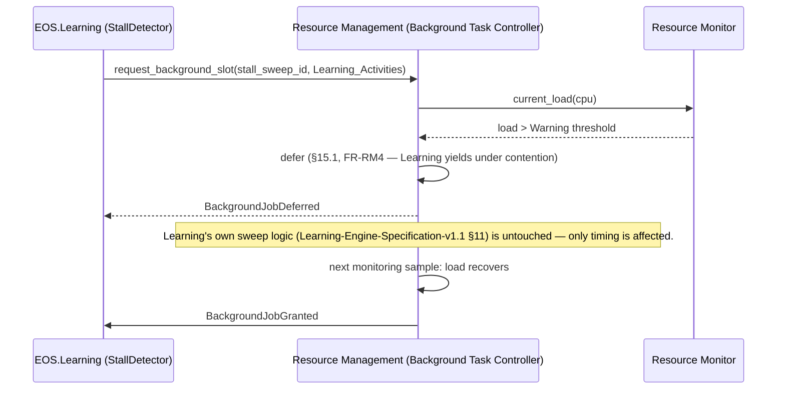
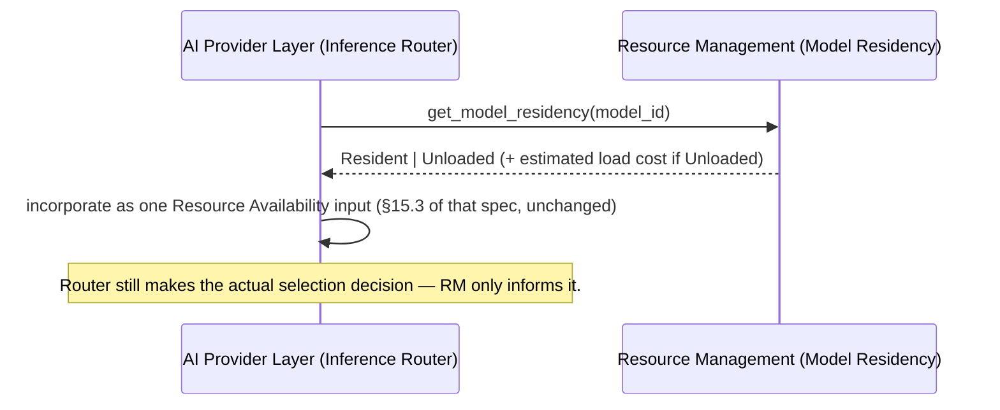
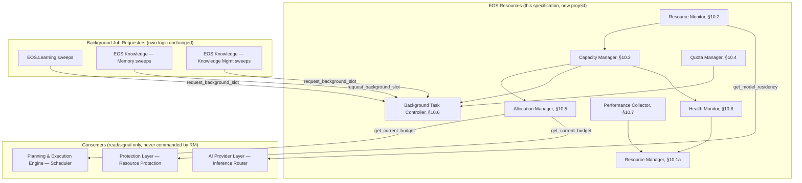

# Resource Management Specification v1.0

**Document Type:** Complementary Engineering Specification
**Extends:** `@EOS-Specification.md` (the Constitution, immutable), and is a peer to `@Learning-Engine-Specification-v1.1.md`, `@Memory-Management-Specification-v1.0.md`, `@Reasoning-Engine-Specification-v1.0.md`, `@Protection-Layer-Specification-v1.0.md`, `@Planning-Execution-Engine-Specification-v1.0.md`, `@Knowledge-Management-Specification-v1.0.md`, and `@AI-Provider-Layer-Specification-v1.0.md` (all immutable, approved)
**Status:** Proposed
**Primary Constitutional Anchors:** Part 7 — Scheduler (Resource Budget, CPU/RAM/Inference Budget, Daily Capacity, Concurrency, Maintenance Windows) · §0.12.1 — Execution Cycles

## 0. A Required Reconciliation (Read This First)

Three already-approved documents already touch "resources" extensively, and this document must slot in beside them without duplicating any of the three:

- **Planning-Execution-Engine-Specification-v1.0** §10.6 already details Constitution Part 7's Scheduler as the **dispatch algorithm** that *consumes* budget values (Priority Queue, Dependency Graph, Resource/CPU/RAM/Inference Budget checks) to decide which Task runs next.
- **Protection-Layer-Specification-v1.0** §16 already details Resource Protection as the **ceiling enforcement** function that *consumes* the same budget values to block/allow a specific action, explicitly stating "Protection does not allocate the budget... only refuses to let an action exceed it."
- **AI-Provider-Layer-Specification-v1.0** §15.3 already details Routing by Resource Availability as a *consumer* of Inference Budget headroom for provider/model selection.

**None of the three defines where the budget numbers themselves come from** — Constitution Part 7 §7.2 names "CPU Budget: per-cycle compute ceiling" as if it were a given input, never explaining how it is measured, computed, or adjusted against the real, physical, single-laptop hardware this entire specification lineage targets. **Resolution (ADR-RM001):** Resource Management is the missing third facet — it measures real system resource state (Monitoring) and computes/maintains the actual budget *values* (Capacity Planning) that Planning & Execution Engine's Scheduler and Protection Layer's Resource Protection already consume, unchanged, as configured inputs. It never dispatches a Task (Planning & Execution Engine's job, unchanged), never gates a specific action's execution (Protection's job, unchanged), and never selects a provider/model (AI Provider Layer's job, unchanged) — it only measures, computes, and publishes the capacity numbers those three subsystems already rely on.

---

## 1. Executive Summary

Resource Management is the subsystem that measures real CPU, RAM, storage, and model-residency state on the target hardware, computes safe/warning/critical/emergency capacity thresholds from that measurement, and publishes the budget values Constitution Part 7's Scheduler (detailed in Planning-Execution-Engine-Specification-v1.0) and Protection Layer's Resource Protection (Protection-Layer-Specification-v1.0 §16) already consume as configured inputs. It additionally owns two genuinely new concerns no prior document touches: local model residency management (loading/unloading models within the RAM ceiling) and fair-share resource-class quotas across concurrent background/interactive/autonomous/learning workloads. It never dispatches tasks, never gates a specific action, never selects a model for inference, and never stores or reasons over knowledge — it only measures, plans capacity, allocates raw resource slices, and reports.

## 2. Purpose

To give another autonomous engineer a complete, implementation-independent architecture for system resource measurement, capacity planning, allocation, and background-workload governance — precise enough to implement without judgment calls — while explicitly reconciling its scope against the three approved documents that already touch "resources" from their own, different, non-overlapping angles (§0, ADR-RM001).

## 3. Scope

In scope:
- Resource Monitoring (§18): real-time CPU/RAM/Storage/Model/Queue/Background-Task/Cache measurement
- Capacity Planning (§17): Safe/Warning/Critical/Emergency threshold computation, feeding the budget values Scheduler and Protection already consume
- Model Residency Management (§14): loading/unloading/concurrency of locally-resident models within the RAM ceiling — genuinely new territory
- Fair-share resource-class Quotas (§16, §19): a new, priority-class-based allocation-fairness mechanism distinct from Planning & Execution Engine's task-dispatch-order priority scoring
- Background Workload resource governance (§15): a live, measurement-driven "may this pending sweep run now" gate, complementing Constitution Part 7's static Maintenance Windows concept

Out of scope (see Non-Goals §5, Non-Responsibilities §7):
- Task dispatch order/algorithm, dependency resolution, Task Lifecycle (Planning & Execution Engine's exclusive domain, unchanged)
- Action-level safety/policy ceiling enforcement (Protection Layer's exclusive domain, unchanged)
- Provider/model selection for a specific inference request (AI Provider Layer's exclusive domain, unchanged)
- Knowledge/memory content storage, retrieval, or lifecycle (Memory Management's and Knowledge Management's exclusive domains, unchanged) — "Memory (RAM) Allocation" in this document refers exclusively to system RAM hardware resource, never to Memory-Management-Specification-v1.0's knowledge-content "Memory" concept (governing task's own explicit note, honored throughout)

## 4. Goals

- Guarantee EOS never consumes all available system resources (Architecture Rule) — Capacity Planning's Emergency threshold (§17.4) always reserves headroom.
- Guarantee interactive user requests always outrank background tasks, and Learning jobs yield to interactive work (Architecture Rules) — realized as the Resource Prioritization class hierarchy (§16).
- Support future GPU acceleration without redesign (Architecture Rule) — realized via a resource-type-agnostic Allocation Manager (§10.5, ADR-RM003), directly closing the GPU deferral both Protection-Layer-Specification-v1.0 §16/§32 and Constitution Part 7 already flagged.
- Make resource allocation observable and auditable (Architecture Rule) — every allocation decision is a metric/event, never a silent internal state change (§20, §26).

## 5. Non-Goals

- Resource Management does not decide *which Task* runs next — that remains Planning & Execution Engine's Scheduler (Planning-Execution-Engine-Specification-v1.0 §10.6), unchanged; Resource Management only supplies the budget *values* that Scheduler's existing algorithm (Constitution Part 7 §7.3) already consumes.
- Resource Management does not decide *whether a specific action may proceed* — that remains Protection Layer's Resource Validation (Protection-Layer-Specification-v1.0 §14.2 step 5, §16), unchanged; Resource Management only supplies the ceiling *values* Protection's enforcement check already consumes.
- Resource Management does not select *which provider/model* serves a given inference request — that remains AI Provider Layer's Inference Router (AI-Provider-Layer-Specification-v1.0 §10.4/§15), unchanged; Resource Management only supplies model-residency *availability* signals that Router's Routing by Resource Availability (§15.3 of that spec) already consumes as an external input.
- Resource Management does not store, classify, or reason over knowledge content — "Memory" in this document means system RAM hardware exclusively, never Memory-Management-Specification-v1.0's or Knowledge-Management-Specification-v1.0's knowledge-content concept (governing task's own explicit note).

## 6. Responsibilities

Resource Management, and only Resource Management, owns:

1. CPU Allocation, Memory (RAM) Allocation, Storage Management, Model Resource Allocation, Task Prioritization (resource-class fairness, distinct from Scheduler's dispatch-order priority — §16, ADR-RM002), Resource Scheduling (raw resource-slice governance, distinct from Task dispatch — §10.6, ADR-RM002), Resource Monitoring, Resource Quotas, Background Workload Control, Cache Resource Policies, Resource Health Monitoring, Capacity Planning, Performance Metrics (verbatim from the governing task) — detailed in §10–§19.
2. Formally supplying the budget values Planning & Execution Engine's Scheduler and Protection Layer's Resource Protection already consume as configured inputs (§0, ADR-RM001).

## 7. Non-Responsibilities

| Capability | Actual Owner | Anchor |
|---|---|---|
| Task dispatch algorithm, dependency resolution, Task Lifecycle | Planning & Execution Engine | Planning-Execution-Engine-Specification-v1.0 §6, §10.6 |
| Action-level ceiling enforcement (allow/deny a specific action) | Protection Layer | Protection-Layer-Specification-v1.0 §16 |
| Provider/model selection for a specific inference request | AI Provider Layer | AI-Provider-Layer-Specification-v1.0 §10.4, §15 |
| Knowledge/memory content storage, retrieval, lifecycle | Memory Management | Memory-Management-Specification-v1.0 §4 |
| Knowledge taxonomy, relationships, quality/governance/freshness | Knowledge Management | Knowledge-Management-Specification-v1.0 §6 |
| Meta Learning pipeline stage transitions | Learning Engine | Learning-Engine-Specification-v1.1 §7 |
| Semantic reasoning, decision content | Reasoning Engine | Reasoning-Engine-Specification-v1.0 §6 |
| Safety/policy validation, permission gating | Protection Layer | Protection-Layer-Specification-v1.0 §6 |

**Rule (reaffirmed from the governing task):** "The Resource Management subsystem owns CPU Allocation, Memory (RAM) Allocation, Storage Management, Model Resource Allocation, Task Prioritization, Resource Scheduling, Resource Monitoring, Resource Quotas, Background Workload Control, Cache Resource Policies, Resource Health Monitoring, Capacity Planning, Performance Metrics. It does NOT own Learning, Memory Knowledge, Planning Logic, AI Inference, Protection Policies, Business Logic." Any capability not explicitly listed in §6 defaults to *not* being Resource Management's responsibility.
## 8. Functional Requirements

| ID | Requirement |
|---|---|
| FR-RM1 | Resource Management MUST NOT dispatch a Task, gate a specific action's execution, or select a provider/model — it only computes and publishes the values Planning & Execution Engine, Protection Layer, and AI Provider Layer already consume (§0). |
| FR-RM2 | Every computed budget value (CPU/RAM/Inference/Daily Capacity, Constitution Part 7 §7.2) MUST be derived from real, measured system state (§18), never a static hardcoded guess. |
| FR-RM3 | Resource Management MUST guarantee a reserved headroom margin at all times (Architecture Rule: "never consume all available system resources") — the Emergency threshold (§17.4) is never zero-headroom. |
| FR-RM4 | Interactive user requests MUST always be assigned the highest resource-class priority (§16); Learning jobs MUST yield resource-class priority whenever interactive work is present (Architecture Rules, verbatim). |
| FR-RM5 | The Allocation Manager (§10.5) MUST treat resource type (CPU/RAM/Disk/Model/future GPU) as an open, extensible enumeration — adding GPU support MUST require no redesign (Architecture Rule), only a new resource-type registry entry (ADR-RM003). |
| FR-RM6 | Every allocation decision MUST be observable (emitted as a metric/event, §20) and auditable (resolvable in the Artifact Registry, Constitution Part 8) — no silent internal-only state change (Architecture Rule). |
| FR-RM7 | All quotas and thresholds MUST be externally configurable (`Thresholds.json`, Constitution Part 10), never hardcoded (Architecture Rule, verbatim). |
| FR-RM8 | No subsystem MAY monopolize system resources (Architecture Rule) — the Quota Manager (§10.4) enforces a fair-share ceiling per resource-class (§16) that no single background job or role can exceed, even if otherwise eligible. |
| FR-RM9 | Model Residency Management (§14) MUST NOT itself decide which model an inference request should use — it only reports residency/availability state that AI Provider Layer's Router already consumes (§0, Non-Goals). |
| FR-RM10 | The Background Task Controller (§10.6) MUST NOT alter what a background job does — it only gates *when* an already-fully-specified job (Learning Engine's Stall Sweep, Memory's Compression sweep, Knowledge Management's Freshness sweep, etc.) is allowed to actually run, based on live measured capacity (§15). |

## 9. Non-Functional Requirements

| NFR Category | Requirement |
|---|---|
| No duplication | FR-RM1; verified structurally — no new dispatch algorithm, gating mechanism, or model-selection logic appears anywhere in this specification |
| Observability | FR-RM6; every KPI (§28) is derived from published metrics/events, never a hidden internal counter |
| Configurability | FR-RM7 |
| Fairness | FR-RM8; Starvation Prevention (§19.4) guarantees no resource-class is permanently denied |
| Extensibility | FR-RM5; GPU addition requires a Model/Resource Registry entry only |
| Offline-first | Fully offline; all measurement and computation is local to the target hardware |
| Non-bottleneck | Monitoring/Capacity Planning computation itself must not measurably compete with the workloads it measures — sampling-based, not continuously blocking (§18.1) |

## 10. Core Architecture

### 10.1 Overview

```
                    ┌─────────────────────────────────────┐
                    │         Resource Manager (§10.1a)      │   (composition root)
                    └──────────────────────┬───────────────┘
                                           │
     ┌──────────────┬──────────────┬──────┴───────┬──────────────┬──────────────┬──────────────┐
     ▼              ▼              ▼              ▼              ▼              ▼              ▼
Resource        Capacity        Allocation      Quota          Background      Performance    Health
Monitor         Manager         Manager         Manager        Task           Collector      Monitor
(§10.2)         (§10.3)         (§10.5)         (§10.4)        Controller     (§10.7)        (§10.8)
                                                                (§10.6)
     │              │              │              │              │              │              │
     └──────────────┴──────────────┴──────────────┴──────────────┴──────────────┴──────────────┘
                                           │
                              published budget values / signals
                                           │
              ┌────────────────────────────┼────────────────────────────┐
              ▼                            ▼                            ▼
    Planning & Execution Engine   Protection Layer                AI Provider Layer
    Scheduler (§10.6 of that      Resource Protection (§16         Inference Router
    spec) — consumes, unchanged   of that spec) — consumes,        (§15.3 of that spec) —
                                  unchanged                        consumes, unchanged
```

All eight components below are internal to a new `EOS.Resources` project (ADR-RM001-adjacent registration note, §29) — no existing project's internals are modified.

### 10.1a Resource Manager

The composition root — receives measurement from the Resource Monitor, delegates threshold computation to the Capacity Manager, and publishes the resulting budget values/signals that Planning & Execution Engine, Protection Layer, and AI Provider Layer already consume, unchanged (§0).

### 10.2 Resource Monitor

Performs Monitoring (§18) — real-time sampling of CPU/RAM/Disk/Model/Queue/Background-Task/Cache state. Sampling-based, not continuous instrumentation, to satisfy the Non-Bottleneck NFR (§9).

### 10.3 Capacity Manager

Performs Capacity Planning (§17) — computes Safe/Warning/Critical/Emergency thresholds from the Resource Monitor's live samples plus configured baselines (`Thresholds.json`), and derives the actual CPU/RAM/Inference/Daily Capacity budget *values* Constitution Part 7 §7.2 names but never itself computes.

### 10.4 Quota Manager

Enforces fair-share resource-class quotas (§16, §19) — the genuinely new mechanism preventing any single resource-class (or, within a class, any single role/job) from monopolizing allocated capacity (FR-RM8), distinct from Protection's per-action ceiling check (Protection-Layer-Specification-v1.0 §16, which checks one action against the *total* budget, not fairness *across* concurrent classes).

### 10.5 Allocation Manager

Translates Capacity Manager's computed thresholds into the concrete budget values published to Planning & Execution Engine/Protection/AI Provider Layer (§0) — resource-type-agnostic by design (FR-RM5, ADR-RM003), the component responsible for GPU extensibility without redesign.

### 10.6 Background Task Controller

Performs Background Workload Control (§15) — the live, measurement-driven gate deciding whether a pending background job (already fully owned and specified by its own subsystem, FR-RM10) may actually run right now, complementing Constitution Part 7 §7.2's static Maintenance Windows concept with real-time capacity awareness.

### 10.7 Performance Collector

Aggregates the metrics (§18, §28 KPIs) every other component publishes — a read-oriented aggregation layer, never a decision-maker itself.

### 10.8 Health Monitor

Performs Resource Health Monitoring (§17.5-adjacent, distinct from AI Provider Layer's per-provider Health Monitor, AI-Provider-Layer-Specification-v1.0 §10.8, which tracks provider/model availability specifically) — tracks system-level CPU/RAM/Disk health (e.g., sustained thermal throttling, disk near-capacity) as a distinct, hardware-level signal.
## 11. CPU Management

### 11.1 Core Allocation

Assigns available CPU cores/cycles across resource-classes (§16) proportionally to their configured fair-share quota (§10.4) — a raw hardware-slice allocation, distinct from Planning & Execution Engine's Task-level Concurrency ceiling (Constitution Part 7 §7.2, "Max simultaneous `Running` tasks per role/domain"), which bounds *how many tasks* run concurrently, not *how much CPU* each already-running task/job may consume.

### 11.2 Priority Classes

The same five-tier hierarchy defined in §16 (User Requests, Interactive Sessions, Autonomous Tasks, Background Maintenance, Learning Activities) — CPU Core Allocation always favors a higher class over a lower one when contention occurs (FR-RM4).

### 11.3 Background Scheduling

The CPU-specific instance of the Background Task Controller's (§10.6) live gating — a background job's own Scheduling mode (e.g., Idle-Time Execution, Planning-Execution-Engine-Specification-v1.0 §14) becomes actually eligible only once the Resource Monitor (§10.2) confirms genuine CPU idle capacity exists, not merely that a calendar-based Maintenance Window (Constitution Part 7 §7.2) is open.

### 11.4 CPU Limits

The computed ceiling value (Capacity Manager, §10.3) published as Constitution Part 7 §7.2's "CPU Budget" — Protection Layer's Resource Protection (Protection-Layer-Specification-v1.0 §16) continues to enforce this value unchanged; Resource Management only computes and publishes it (§0).

### 11.5 CPU Reservation

A configured minimum CPU headroom (`Thresholds.json`) permanently reserved for Interactive Sessions/User Requests regardless of background/autonomous load — the concrete mechanism realizing FR-RM3's "never consume all available system resources" guarantee at the CPU level specifically.

## 12. Memory (RAM) Management (System Resource — Distinct from Knowledge Memory)

**Restated per the governing task's own note:** every "Memory" reference in this section means system RAM hardware exclusively. Memory-Management-Specification-v1.0's knowledge-content "Memory" concept (Working/Short-term/Long-term/Episodic/Semantic/Project/Session Memory) is an entirely separate, unrelated vocabulary owned by that document — this section never touches it (§5, Non-Goals).

### 12.1 RAM Allocation

Analogous to CPU Core Allocation (§11.1) — raw RAM slices allocated across resource-classes (§16) by fair-share quota (§10.4), computed by the Capacity Manager (§10.3) and published as Constitution Part 7 §7.2's "RAM Budget."

### 12.2 Cache Limits

A configured maximum RAM footprint for cache-backed infrastructure (e.g., the Redis instance backing Memory's Working/Short-term/Session Memory, Memory-Management-Specification-v1.0 §12) — Resource Management sets the *size ceiling*; Memory continues to own *what* is cached and *when* it expires (Memory-Management-Specification-v1.0 §18), unchanged. This is the same policy/mechanism split already established between Protection's Policy Engine and Memory's retention-hold honoring (Protection-Layer-Specification-v1.0 §6).

### 12.3 Context Limits

A RAM-footprint ceiling on any single in-flight context payload (e.g., Memory's Context Assembly output, Memory-Management-Specification-v1.0 §15.1, or an `InferenceRequest`'s packaged payload, AI-Provider-Layer-Specification-v1.0 §14.6) — Resource Management enforces *how large a payload is allowed to be held in RAM at once*, distinct from Memory's own caller-specified token/size budget (which bounds *content relevance*, not *hardware footprint*).

### 12.4 Memory Thresholds

The RAM-specific instantiation of Capacity Planning's Safe/Warning/Critical/Emergency tiers (§17).

### 12.5 Low Memory Handling

On crossing the Critical threshold (§17.3), the Health Monitor (§10.8) emits a signal that triggers: (a) Background Task Controller (§10.6) suspending all Background Maintenance/Learning-class work immediately (FR-RM4), (b) Model Residency Management (§14.3) considering unloading a non-actively-serving resident model to free RAM, and (c), only on crossing Emergency (§17.4), a signal to Protection Layer that may inform its own Emergency Shutdown consideration (Protection-Layer-Specification-v1.0 §26.1) — Resource Management surfaces the signal; Protection retains sole authority over whether Emergency Shutdown actually activates (§0, Non-Goals; Protection-Layer-Specification-v1.0 §26.1 remains unchanged).

## 13. Storage Management

### 13.1 Storage Allocation

Raw disk-space budget allocated across the Constitution's existing Part 4 store rows (SQL Server, SQLite, File Storage/Artifacts, Backups) — Resource Management allocates *space budget*; Data Architecture (Constitution Part 4) continues to own *what* lives in each store, unchanged.

### 13.2 Disk Usage Policies

Configured warning/critical disk-capacity thresholds (`Thresholds.json`), feeding Capacity Planning (§17) identically to CPU/RAM.

### 13.3 Temporary Storage

A bounded scratch-space allocation for in-flight, non-durable work (e.g., a Task's intermediate build artifacts before they're either promoted to the Artifact Registry, Constitution Part 8, or discarded) — cleaned up per §13.5, never itself a durable store.

### 13.4 Cache Storage

The disk-backed counterpart to §12.2's RAM cache ceiling (e.g., a disk-backed cache tier, if the underlying infrastructure uses one) — same policy/mechanism split: Resource Management sets the size ceiling, the owning subsystem (Memory, Knowledge Management, AI Provider Layer) decides what's cached within it.

### 13.5 Cleanup Strategy

A scheduled (Background Task Controller-gated, §10.6) reclamation of Temporary Storage (§13.3) and any storage-tier content already marked Expired/Archived by its owning subsystem (Memory's Expiration, Memory-Management-Specification-v1.0 §18; Knowledge Management's Archiving, Knowledge-Management-Specification-v1.0 §12.9) — Resource Management executes the *physical reclamation*, never the *decision* that something is eligible for reclamation, which remains each owning subsystem's call.

## 14. Model Resource Management

**Explicit boundary (resolves FR-RM9):** this section governs the RAM/CPU *footprint lifecycle* of locally-resident models — a genuinely new concern neither AI-Provider-Layer-Specification-v1.0 nor any other approved document addresses, since that specification deliberately stayed abstract about model internals and focused on routing/capability matching, not physical residency.

### 14.1 Model Loading

Bringing a registered model (AI-Provider-Layer-Specification-v1.0 §10.3's Model Registry entry) into active RAM residency — triggered either proactively (a frequently-used model kept warm) or reactively (on first `infer()`/`embed()` request requiring it, AI-Provider-Layer-Specification-v1.0 §20).

### 14.2 Model Unloading

Evicting a resident model from RAM under memory pressure (§12.5) or after a configured idle-residency timeout — always checked against Concurrent Model Policies (§14.4) to avoid evicting a model another in-flight request still needs.

### 14.3 Model Residency

The tracked state of which models are currently RAM-resident — exposed as a read-only signal AI Provider Layer's Inference Router already consumes for Routing by Resource Availability (AI-Provider-Layer-Specification-v1.0 §15.3, FR-RM9) — Resource Management never itself decides *which* model should serve a request, only reports *whether* a given model is currently resident and what loading it would cost.

### 14.4 Concurrent Model Policies

A configured ceiling on how many models may be simultaneously RAM-resident, given the 32GB RAM target — enforced by the Quota Manager (§10.4) as a Model-resource-class quota, identical in mechanism to CPU/RAM fair-share quotas (§16).

### 14.5 Resource-aware Model Selection

**Not owned here (FR-RM9):** despite the section title in the governing task's required outline, the actual *selection* of which model serves a request remains AI Provider Layer's Inference Router (AI-Provider-Layer-Specification-v1.0 §15.3) — this document's contribution is exclusively the residency/availability *signal* (§14.3) that selection already consumes as one of its existing "Resource Availability" inputs.
## 15. Background Workloads

**Explicit boundary (resolves FR-RM10):** every workload type below is already fully specified and owned by its own approved document — this section governs only *when*, resource-wise, an already-defined job is allowed to actually execute, never *what the job does*.

| Workload Type | Owning Specification (unchanged) | Resource Management's Role |
|---|---|---|
| Learning Jobs | Learning Engine's Stall/Fitness/Integrity sweeps (Learning-Engine-Specification-v1.1 §11) | Gates execution timing via Background Task Controller (§10.6); lowest resource-class priority (§16, FR-RM4) |
| Indexing Jobs | Memory's embedding indexing (Memory-Management-Specification-v1.0 §14) | Gates timing; consumes Model Resource Management's residency state (§14.3) if indexing requires an embedding model |
| Knowledge Maintenance | Knowledge Management's Freshness/Duplicate Detection sweeps (Knowledge-Management-Specification-v1.0 §17, §18) | Gates timing |
| Cleanup Tasks | Resource Management's own Cleanup Strategy (§13.5) — the one workload type this specification itself owns the *content* of, not just the timing | Both gates timing and defines the task |
| Compression Tasks | Memory's Compression sweep (Memory-Management-Specification-v1.0 §17) | Gates timing |
| Validation Tasks | Knowledge Management's Revalidation (Knowledge-Management-Specification-v1.0 §17.4), Constitution's Reality Validation (§0.15) | Gates timing |

### 15.1 Background Task Controller Algorithm (summary)

```
on background_job_pending(job, resource_class=Background_Maintenance_or_Learning):
    if ResourceMonitor.current_load(cpu) > CapacityManager.warning_threshold(cpu):
        defer(job)                                    # never runs under contention, FR-RM4
        return
    if QuotaManager.class_quota_exhausted(resource_class):
        defer(job)                                    # FR-RM8, fair-share respected
        return
    if not within_maintenance_window(job) and job.mode != IdleTime:
        defer(job)                                    # Constitution Part 7 §7.2, unchanged
        return
    grant_resource_slice(job, resource_class)           # §11.1/§12.1
    emit BackgroundJobGranted(job.id)
```

## 16. Resource Prioritization

**The five-tier hierarchy required by the governing task's Architecture Rules, verbatim:**

| Priority Class | Rank | Rule |
|---|---|---|
| User Requests | 1 (highest) | Always preempts every other class (FR-RM4) |
| Interactive Sessions | 2 | Outranks all autonomous/background/learning work |
| Autonomous Tasks | 3 | Planning & Execution Engine-dispatched Task execution (Planning-Execution-Engine-Specification-v1.0, unchanged) — resource-class priority only, never re-ordering *which* task dispatches (that remains Scheduler's Priority Queue, Constitution Part 7 §7.2) |
| Background Maintenance | 4 | Cleanup/Compression/Validation-type sweeps (§15) |
| Learning Activities | 5 (lowest) | Learning Engine's own sweeps — must always yield to any class above (Architecture Rule, verbatim) |

**Explicit disambiguation (avoiding a terminology collision with Planning & Execution Engine's Priority Manager):** this is a fixed, five-value **resource-allocation-class** hierarchy governing *how much raw CPU/RAM/Model-slot a concurrently-running thing gets*, never the fine-grained numeric **task-dispatch-order** priority score Planning-Execution-Engine-Specification-v1.0 §10.5's Priority Manager already computes and feeds into the unchanged Scheduler Priority Queue (Constitution Part 7 §7.2). A Task may have a high dispatch-order priority score (queued to run soon) while still belonging to the "Autonomous Tasks" resource class (rank 3) for allocation-fairness purposes — the two concepts operate on different axes and are never merged (ADR-RM002).

## 17. Capacity Planning

The concrete mechanism computing the budget *values* Constitution Part 7 §7.2 names but never itself derives (§0, ADR-RM001).

### 17.1 Safe Operating Thresholds

The baseline range within which all resource-classes (§16) may draw allocation freely, computed from measured steady-state load (Resource Monitor, §18) plus the CPU/RAM Reservation margins (§11.5).

### 17.2 Warning Thresholds

Crossing this threshold triggers Background Task Controller (§10.6) deferral of Background Maintenance/Learning-class work (§15.1's algorithm) — a soft, automatically-reversible throttle, never itself an error condition.

### 17.3 Critical Thresholds

Crossing this threshold triggers Low Memory/CPU Handling (§12.5-style response, generalized across resource types) — suspending all Background Maintenance/Learning work immediately and considering Model Unloading (§14.2).

### 17.4 Emergency Thresholds

The reserved-headroom boundary (FR-RM3) that must never be crossed in practice — if measurement shows it has been, Resource Management surfaces the signal to Protection Layer (§0, Non-Goals; Protection-Layer-Specification-v1.0 §26.1's Emergency Shutdown remains the sole authority to act on it) and to Dashboard, never taking an autonomous shutdown action itself (that would duplicate Protection's exclusive authority, Protection-Layer-Specification-v1.0 FR-P9).

### 17.5 Threshold Configuration

All four tiers, per resource type, are defined in `Thresholds.json` (Constitution Part 10, FR-RM7) — reviewed each Quarterly cycle (Constitution §0.12.1), consistent with the recalibration cadence every prior specification in this lineage already establishes for its own thresholds.
## 18. Monitoring

### 18.1 Sampling Model

All monitored dimensions below are sampled at a bounded cadence (configurable, `Thresholds.json`), never continuously instrumented in a way that would itself compete for the CPU it measures (Non-Bottleneck NFR, §9) — mirroring the same "batched, non-time-critical" posture every prior specification's own periodic sweeps already establish (e.g., Learning-Engine-Specification-v1.1 §22, Memory-Management-Specification-v1.0 §25).

### 18.2 Monitored Dimensions

| Dimension | What Is Measured | Consumed By |
|---|---|---|
| CPU | Utilization %, per-core and aggregate | Capacity Manager (§10.3), Background Task Controller (§10.6) |
| RAM | Utilization, available headroom | Capacity Manager, Model Residency (§14) |
| Disk | Free space, I/O contention | Capacity Manager, Cleanup Strategy (§13.5) |
| Model Usage | Which models are resident, per-model RAM footprint | Model Residency Management (§14.3) |
| Queue Length | Depth of Planning & Execution Engine's Priority Queue (Constitution Part 7 §7.2, read-only observation) | Performance Collector (§10.7), Queue Latency KPI (§28) |
| Background Tasks | Count/duration of currently-running background jobs (§15) | Background Task Controller, Quota Manager |
| Cache Usage | RAM/Disk cache-tier occupancy vs. configured ceiling (§12.2, §13.4) | Capacity Manager |

### 18.3 Read-Only Observation Boundary

Queue Length monitoring (§18.2) is strictly read-only against Planning & Execution Engine's existing Priority Queue (Constitution Part 7 §7.2) — Resource Management never writes to or reorders that queue, only observes its depth as a monitoring signal (consistent with FR-RM1).

## 19. Resource Policies

### 19.1 Fair Resource Usage

The Quota Manager (§10.4) guarantees each resource-class (§16) receives at least its configured minimum share even under contention — no class's minimum can be starved by another class's burst demand, except User Requests' unconditional preemption (§16, by design, matching the Architecture Rule that interactive work always outranks background work).

### 19.2 Quotas

Per-resource-class, per-resource-type (CPU/RAM/Model-slot) numeric ceilings, configured in `Thresholds.json` (FR-RM7).

### 19.3 Limits

The hard ceiling values ultimately published to Protection Layer's Resource Protection (Protection-Layer-Specification-v1.0 §16) — Limits and Quotas are related but distinct: a Quota bounds one resource-class's *share*; a Limit is the *absolute ceiling* Protection enforces per individual action, regardless of class.

### 19.4 Starvation Prevention

A resource-class that has been denied allocation for more than a configured number of consecutive Sprint cycles (Constitution §0.12.1) is guaranteed a minimum allocation slice on the next cycle regardless of contention — preventing Learning Activities (rank 5, §16) from being permanently starved even under sustained Interactive/Autonomous load, while still respecting FR-RM4's yield rule in the common case.

### 19.5 Resource Recovery

After a Critical/Emergency threshold crossing (§17.3/§17.4) resolves (measured load returns below Warning, §17.2), previously-suspended Background Maintenance/Learning-class work (§15) resumes automatically — no manual re-enablement required, consistent with Constitution's general posture that autonomous recovery is preferred wherever safe (mirrors Protection-Layer-Specification-v1.0 §26's Emergency Shutdown clearing posture, though Resource Recovery here is a lower-stakes, fully-automatic action since it only concerns background-workload throttling, never Protection's own Emergency Shutdown authority).
## 20. Events

Extending Constitution Part 3's Event Catalog under its existing envelope/versioning discipline (Part 3 §3.2).

| Event | Producer | Consumers | Payload |
|---|---|---|---|
| `ResourceThresholdCrossed` *(new)* | Capacity Manager (§17) | Background Task Controller, Health Monitor, Dashboard | resource_type, tier (Safe/Warning/Critical/Emergency) |
| `BackgroundJobGranted` *(new)* | Background Task Controller (§15.1) | Dashboard, the requesting subsystem's own sweep component | job_id, resource_class |
| `BackgroundJobDeferred` *(new)* | Background Task Controller | Dashboard, requesting subsystem | job_id, reason |
| `ModelLoaded` / `ModelUnloaded` *(new)* | Model Residency Management (§14) | AI Provider Layer's Health Monitor (informational), Dashboard | model_id, ram_footprint |
| `ResourceQuotaExhausted` *(new)* | Quota Manager (§10.4) | Dashboard, Background Task Controller | resource_class, resource_type |
| `EmergencyCapacitySignal` *(new)* | Capacity Manager, on Emergency threshold (§17.4) | Protection Layer (informational — Protection retains sole Emergency Shutdown authority), Dashboard | resource_type, measured_value |
| `ResourceRecovered` *(new)* | Capacity Manager (§19.5) | Background Task Controller, Dashboard | resource_type |

### 20.1 Consumed Events

- `TaskStarted`/`TaskCompleted`/`TaskBlocked` (Constitution Part 3, unchanged) — inform the Resource Monitor's Queue Length/Background Task observation (§18.2), read-only.
- `InferenceRouted`/`InferenceCompleted` (AI-Provider-Layer-Specification-v1.0 §19) — inform Model Residency's usage tracking (§14.3), read-only.
- `ProtectionAllowed`/`ProtectionDenied` (Protection-Layer-Specification-v1.0 §21) — where a denial cites a resource-related reason, informs Capacity Planning's calibration (§17.5) trend data.

## 21. Interfaces

Responsibilities only — no implementation.

### 21.1 `IResourceManagementClient` (public, consumed by other subsystems as a read/signal interface — never a command interface that dispatches or gates anything, FR-RM1)

```
IResourceManagementClient

    ResourceBudget get_current_budget(ResourceType type)
        Responsibility: returns the currently computed budget value (§17) for the given resource type —
        consumed by Planning & Execution Engine's Scheduler (Planning-Execution-Engine-Specification-v1.0
        §10.6) and Protection Layer's Resource Protection (Protection-Layer-Specification-v1.0 §16),
        both unchanged in how they use this value.

    ModelResidencyStatus get_model_residency(string model_id)
        Responsibility: read-only residency/availability signal (§14.3) — consumed by AI Provider
        Layer's Inference Router (AI-Provider-Layer-Specification-v1.0 §15.3) as one Resource
        Availability input among several, never a selection command.

    CapacityTier get_current_tier(ResourceType type)
        Responsibility: returns the current Safe/Warning/Critical/Emergency tier (§17) — read-only,
        consumed by Dashboard and by any subsystem's own background-sweep component deciding whether
        to voluntarily defer (in addition to, never instead of, the Background Task Controller's own
        gating, §10.6).

    void request_background_slot(string job_id, ResourceClass resource_class)
        Responsibility: the one write-shaped call in this interface — a subsystem's own sweep component
        (e.g., Learning Engine's StallDetector) requests a resource slot; Resource Management's
        Background Task Controller (§10.6) grants or defers it (§15.1) — never alters what the job does.
```

### 21.2 Consumed Interfaces (unchanged, ratified as consumed exactly as already specified)

- None requiring ratification — Resource Management is a pure supplier of read signals to the other three subsystems' already-published, unchanged interfaces; it does not itself call into `IPlanningClient`, `IProtectionClient`, or `IAIProviderClient` in a way that requires a new contract on their side. Where Resource Management needs to *surface* a signal (e.g., `EmergencyCapacitySignal` to Protection), it does so via the standard Event Catalog (§20), not a direct interface call, keeping the dependency direction one-way (§0, Non-Goals).

## 22. State Models

Resource Management maintains two kinds of persistent-across-cycles state, both small and bounded:

```
Per-resource-type Capacity State (persists, recomputed each monitoring sample, §18.1):
Safe ⇄ Warning ⇄ Critical ⇄ Emergency   (§17, transitions driven by live measurement)

Per-model Residency State (persists until explicitly changed, §14):
Unloaded → Loading → Resident → (Idle-Timeout | Memory-Pressure) → Unloading → Unloaded

Per-job Background Execution State (per-request, §15.1):
Pending → Granted | Deferred → (Deferred jobs re-evaluated next monitoring sample)
```

No state model here duplicates Planning & Execution Engine's Task Lifecycle (Constitution Part 6, unchanged) or AI Provider Layer's per-request lifecycle (AI-Provider-Layer-Specification-v1.0 §21, unchanged) — all three state models above are exclusively Resource Management's own bookkeeping.
## 23. Sequence Diagrams (Mermaid)

### 23.1 Budget Value Computation → Scheduler/Protection Consumption

```mermaid
sequenceDiagram
    participant Monitor as Resource Monitor
    participant Capacity as Capacity Manager
    participant Alloc as Allocation Manager
    participant Sched as Planning & Execution Engine Scheduler
    participant Prot as Protection Layer

    Monitor->>Capacity: live CPU/RAM/Disk samples (§18)
    Capacity->>Capacity: compute Safe/Warning/Critical/Emergency tiers (§17)
    Capacity->>Alloc: derived budget values
    Alloc->>Alloc: publish (resource-type-agnostic, ADR-RM003)
    Sched->>Alloc: get_current_budget(CPU) [unchanged Constitution Part 7 §7.2 usage]
    Alloc-->>Sched: current CPU Budget value
    Prot->>Alloc: get_current_budget(CPU) [unchanged Protection-Layer-Specification-v1.0 §16 usage]
    Alloc-->>Prot: current CPU Budget value
    Note over Sched,Prot: Both consume the same published value; neither's own algorithm changes.
```

### 23.2 Background Job Request Under Contention



### 23.3 Model Residency Signal Consumed by AI Provider Layer Routing



## 24. Component Diagram (Mermaid)



## 25. Security Considerations

### 25.1 Interaction with Protection Layer

Resource Management never bypasses or duplicates Protection Layer's ceiling enforcement (Protection-Layer-Specification-v1.0 §16) — it only supplies the budget *values* Protection's Resource Validation (§14.2 step 5 of that spec) already consumes as configured input (§0). Resource Management holds no authority to allow or deny a specific action; that remains Protection's exclusive, unchanged domain. Where a resource-state signal is severe enough to warrant consideration of Emergency Shutdown, Resource Management only emits `EmergencyCapacitySignal` (§20) — Protection Layer's own Emergency Shutdown mechanism (Protection-Layer-Specification-v1.0 §26.1) retains sole authority over whether to activate, consistent with Protection's FR-P9 and this document's own Non-Goals (§5).

### 25.2 No New Bypass Surface

Because `IResourceManagementClient` (§21.1) is read/signal-only (FR-RM1) — it contains exactly one write-shaped method (`request_background_slot`, which only grants/defers timing, never alters what a job does) — this specification introduces no new path by which a subsystem could execute an action or bypass Protection's gate. Every actual execution still passes through Planning & Execution Engine's Execution Coordinator and Protection's `IProtectionClient.validate()` (Planning-Execution-Engine-Specification-v1.0 §25.1, unchanged) exactly as before this specification existed.

### 25.3 Auditability

Every `ResourceThresholdCrossed`, `BackgroundJobGranted`/`Deferred`, `ModelLoaded`/`Unloaded`, and `ResourceQuotaExhausted` event (§20) is persisted via the standard Event Catalog (Constitution Part 3), satisfying the Architecture Rule that "resource allocation must be observable and auditable" without introducing a second audit mechanism (reuses Constitution Part 8's Artifact Registry indirectly via the same event-sourcing pattern every prior specification in this lineage already relies on).

## 26. Performance Considerations

Target hardware: Ubuntu, Intel i7-1065G7, 32GB RAM, single machine, offline-first (unchanged across this specification lineage). Future GPU support must be extensible without redesign (Architecture Rule, resolved by ADR-RM003's resource-type-agnostic design).

| Operation | Target |
|---|---|
| Resource Monitor sampling cycle (§18.1) | < 100ms per sample, sampled at a configurable interval (default: every micro-cycle, Constitution §0.12.1), never continuous polling |
| Capacity Manager threshold computation (§17) | < 50ms per sample |
| `get_current_budget()` / `get_model_residency()` / `get_current_tier()` (§21.1) | < 10ms — these are simple reads of already-computed state, never triggering a fresh measurement synchronously |
| Background Task Controller grant/defer decision (§15.1) | < 20ms |
| Model Load/Unload (§14.1/§14.2) | Bounded by the model's own size/disk-read characteristics — Resource Management's own decision logic contributes negligible overhead; the dominant cost is the underlying model-loading mechanism itself (infrastructure, out of scope per the governing task's "do not describe Linux internals") |

**CPU/RAM/Offline:** All Resource Management computation is lightweight bookkeeping — sampling, threshold comparison, quota arithmetic — with no inference cost of its own. Fully offline. Because Resource Monitor sampling is itself bounded and infrequent (§18.1), it does not become a resource consumer significant enough to require its own resource-class in §16's hierarchy — it is treated as fixed platform overhead, budgeted outside the five-tier contention model entirely.

**GPU extensibility (resolves the Architecture Rule and Protection-Layer-Specification-v1.0's deferred GPU item):** because the Allocation Manager (§10.5) and Quota Manager (§10.4) treat resource type as an open enumeration (ADR-RM003), adding a GPU resource type requires only: a new `ResourceType.GPU` registry entry, a new `Thresholds.json` tier configuration, and a new Model Registry capability flag (AI-Provider-Layer-Specification-v1.0 §13) for GPU-accelerated models — no change to the Resource Manager, Capacity Manager, Quota Manager, or Background Task Controller's own logic.
## 27. Architecture Decision Records

### ADR-RM001

**Title:** Resource Management Is the Missing Capacity-Determination Facet, Complementing (Not Duplicating) Scheduler, Protection, and AI Provider Layer's Existing Resource-Adjacent Roles

**Status:** Accepted

**Context:** Three already-approved documents already touch "resources" extensively — Planning & Execution Engine's Scheduler (dispatch algorithm consuming budgets), Protection Layer's Resource Protection (ceiling enforcement consuming budgets), and AI Provider Layer's Routing by Resource Availability (provider selection consuming budgets) — yet none of them explains where the budget *values* themselves come from. Constitution Part 7 §7.2 names "CPU Budget: per-cycle compute ceiling" as a given input without ever defining its computation.

**Decision:** Resource Management owns exactly this missing facet — real measurement (Monitoring, §18) and threshold/value computation (Capacity Planning, §17) — publishing budget values the three existing consumers already use unchanged. It additionally owns two genuinely new concerns (Model Residency, §14; fair-share resource-class Quotas, §16/§19) that no prior document addresses at all.

**Alternatives Considered:**
- Fold this specification's architecture into Planning & Execution Engine's existing Scheduler section — rejected because that document's own ADR-PE001/ADR-PE002 already carefully scoped `EOS.Planner`/`EOS.Orchestrator`'s boundaries, and retroactively expanding an approved document to compute budget values would be a redesign, forbidden by this task's own instructions.
- Fold this specification into Protection Layer's Resource Protection section — rejected because Protection-Layer-Specification-v1.0 §16 explicitly and correctly states "Protection does not allocate the budget," a boundary this document reinforces rather than crosses.

**Trade-offs:** Introduces a fourth facet of "resources" across the specification lineage (after Scheduler, Protection, AI Provider Layer) — mitigated by the explicit §0 reconciliation and the consistent "measures/computes vs. consumes" boundary drawn throughout this document.

**Consequences:** Every consumer of a Resource Management-published value (Scheduler, Protection, AI Provider Layer) requires zero change to its own already-approved algorithm — only a new, additive source for a value it previously treated as a given configuration input.

**Future Impact:** Establishes the precedent that when multiple approved documents each consume a Constitutional value without ever defining its computation, a later specification may legitimately supply that missing computation as new, non-duplicative architecture — provided it never alters how the existing consumers use the value.

**Related EOS Sections:** Constitution Part 7 §7.2; Planning-Execution-Engine-Specification-v1.0 §10.6; Protection-Layer-Specification-v1.0 §16; AI-Provider-Layer-Specification-v1.0 §15.3; this document §0, §10, §17.

### ADR-RM002

**Title:** Resource-Class Priority (Fair-Share Allocation) Is a Distinct Axis from Task-Dispatch-Order Priority

**Status:** Accepted

**Context:** This task's mission requires "Task Prioritization" and "Resource Scheduling" (§16 governing task outline), while Planning-Execution-Engine-Specification-v1.0 §10.5 already fully owns a Priority Manager computing task-dispatch-order priority scores for Constitution Part 7 §7.2's existing Priority Queue — an unavoidable terminology overlap if not explicitly disambiguated.

**Decision:** Resource Management's "Task Prioritization" (§16) is a fixed, five-value **resource-allocation-class** hierarchy (User Requests > Interactive Sessions > Autonomous Tasks > Background Maintenance > Learning Activities) governing raw CPU/RAM/Model-slot fair-share, entirely distinct from Planning & Execution Engine's fine-grained numeric **task-dispatch-order** priority score. A Task's dispatch-order priority and its resource-class are independent, co-existing properties.

**Alternatives Considered:**
- Merge the two into one priority concept — rejected because dispatch-order priority (which task runs *next*) and resource-class priority (how much raw hardware a *currently-running* thing gets) answer genuinely different questions; merging them would require Planning-Execution-Engine-Specification-v1.0's already-approved Priority Manager to be redesigned, which this task forbids.

**Trade-offs:** Two named "priority" concepts across two documents — mitigated by explicit disambiguation in §16 and this ADR, mirroring the now well-established pattern for unavoidable terminology overlaps in this lineage (Protection-Layer-Specification-v1.0 ADR-P002, Planning-Execution-Engine-Specification-v1.0 ADR-PE003, Knowledge-Management-Specification-v1.0 ADR-KM003, AI-Provider-Layer-Specification-v1.0 ADR-AI003).

**Consequences:** A future reader must know which "priority" is meant in a given context — resolved by always qualifying it ("resource-class priority" vs. "dispatch-order priority") throughout this document.

**Future Impact:** Reinforces the now five-time-repeated precedent that unavoidable terminology collisions across sibling specifications in this lineage are resolved via explicit ADR cross-reference, never silent conflation.

**Related EOS Sections:** Planning-Execution-Engine-Specification-v1.0 §10.5, Constitution Part 7 §7.2; this document §16, §11.2.

### ADR-RM003

**Title:** Resource-Type-Agnostic Allocation Manager, Closing Protection Layer's Deferred GPU Item

**Status:** Accepted

**Context:** This task's Architecture Rules require future GPU support without redesign, and Protection-Layer-Specification-v1.0 §16/§32/§34 already explicitly deferred GPU resource protection "until the hardware target changes," flagging it as an open item.

**Decision:** The Allocation Manager (§10.5) and Quota Manager (§10.4) treat `ResourceType` as an open enumeration (CPU, RAM, Disk, Model-slot, and any future type including GPU) rather than a fixed, hardcoded set — adding GPU requires only a new registry entry and `Thresholds.json` tier configuration (§26), never a change to either manager's own logic.

**Alternatives Considered:**
- Hardcode CPU/RAM/Disk/Model as the complete resource type set, deferring the extensibility question entirely to a future redesign — rejected because it would directly violate this task's own Architecture Rule ("must support future GPU acceleration without redesign") and would leave Protection Layer's already-flagged deferred item unaddressed by the specification best positioned to close it.

**Trade-offs:** A slightly more abstract Allocation/Quota Manager design (generic over resource type) than a CPU/RAM-specific one would be — accepted as the direct, necessary cost of satisfying the extensibility requirement.

**Consequences:** Protection Layer's own Resource Protection (Protection-Layer-Specification-v1.0 §16) can add a `GPU` row to its existing table, consuming a `get_current_budget(GPU)` call from this specification's §21.1 interface, whenever GPU hardware is actually added — with zero change required to Protection-Layer-Specification-v1.0's own approved text beyond that additive table row.

**Future Impact:** Closes Protection-Layer-Specification-v1.0's Open Question/Risk item on GPU deferral (that document's §32/§34/§28) — future hardware-target changes are a configuration and registry-entry exercise, not an architectural one, for both this document and Protection's.

**Related EOS Sections:** Protection-Layer-Specification-v1.0 §16, §32, §34, §28 (GPU risk row); this document §10.4, §10.5, §26.
## 28. KPIs

| KPI | Formula Source |
|---|---|
| CPU Utilization | Resource Monitor's sampled CPU load (§18.2), aggregated per Sprint cycle (Constitution §0.12.1) |
| RAM Utilization | Resource Monitor's sampled RAM load, aggregated per cycle |
| Storage Utilization | Resource Monitor's sampled disk usage (§13), aggregated per cycle |
| Resource Contention Rate | `ResourceThresholdCrossed(Warning|Critical)` events / total monitoring samples, per cycle |
| Queue Latency | Time a Task spends in Planning & Execution Engine's Priority Queue (Constitution Part 7 §7.2) before dispatch, observed read-only (§18.3) |
| Background Job Completion Rate | Background jobs (§15) reaching completion (per their own owning subsystem's success signal) / total `BackgroundJobGranted` events, per cycle |
| Cache Efficiency | Cache Usage (§18.2) relative to configured Cache Limits (§12.2/§13.4) — a persistently near-ceiling value signals the ceiling itself may need recalibration |
| Resource Recovery Time | Mean time from `ResourceThresholdCrossed(Critical)` to `ResourceRecovered` (§19.5) |

## 29. Risks

| Risk | Likelihood | Impact | Mitigation |
|---|---|---|---|
| Capacity Manager's computed budget values drift from what Scheduler/Protection actually need, causing either under-utilization (values too conservative) or contention (values too generous) | Medium | Medium | Resource Contention Rate and Queue Latency KPIs (§28) surface miscalibration trends; `Thresholds.json` recalibrated each Quarterly cycle (§17.5) |
| Model Residency Management's unload decisions (§14.2) evict a model an in-flight request still needs, due to a race between AI Provider Layer's routing decision and Resource Management's own pressure response | Low-Medium | Medium | Concurrent Model Policies (§14.4) check in-flight usage before unloading; AI Provider Layer's own Retry/Failover (AI-Provider-Layer-Specification-v1.0 §17.5) provides a further safety net if a race does occur |
| Fair-share Quotas (§16, §19) are miscalibrated such that Learning Activities (rank 5) are so heavily throttled that Learning Engine's own Fitness Functions (Learning-Engine-Specification-v1.1 §22) never get to run, silently degrading platform self-improvement | Medium | Medium | Starvation Prevention (§19.4) guarantees a minimum periodic allocation regardless of contention; Background Job Completion Rate KPI (§28) surfaces a starvation trend |
| The resource-class priority / dispatch-order priority distinction (ADR-RM002) is misunderstood by a future reader as one unified concept | Low-Medium | Low-Medium | Explicit disambiguation in §16 and the ADR itself make the distinction load-bearing, not just prose |
| Resource Monitor's own sampling overhead (§18.1) becomes non-negligible on the target hardware under sustained heavy load | Low | Low | Explicitly excluded from the five-tier contention model as fixed platform overhead (§26); sampling interval is itself configurable, allowing further reduction if ever needed |

## 30. Future Evolution

- `EOS.Resources`'s Part 1 registration — recommend bundling with `EOS.Learning`'s, `EOS.Reasoning`'s, and `EOS.AIProvider`'s own still-open registration items (Learning-Engine-Specification-v1.1 Open Question 1, Reasoning-Engine-Specification-v1.0 Open Question 1, AI-Provider-Layer-Specification-v1.0 Open Question 1) into a single future Architecture Evolution ADR covering all four, extending the same bundling recommendation those documents already made for each other.
- GPU resource type addition (ADR-RM003) — when hardware changes, add the registry entry/configuration per §26's closing note; no further architectural design needed here.
- Domain-specific resource-class tuning (e.g., a different Learning Activities throttle for Mobile-domain vs. Backend-domain sweeps, mirroring the parallel domain-specific-tuning flag every prior specification in this lineage has raised) is a plausible refinement, flagged rather than designed here.
- Once real usage data exists, Capacity Planning's Safe/Warning/Critical/Emergency thresholds (§17) should move from initial estimated baselines to empirically-derived ones, mirroring the same "estimate now, recalibrate empirically later" posture Learning-Engine-Specification-v1.1 and Memory-Management-Specification-v1.0 already adopted for their own thresholds.

## Open Questions

1. `EOS.Resources`'s Part 1 registration (ADR-RM001-adjacent) — pending a future Architecture Evolution ADR, recommended to be bundled with the three other still-open project registrations in this lineage.
2. Whether Model Residency Management's unload decisions (§14.2) should eventually consult AI Provider Layer's own per-provider Health signal (AI-Provider-Layer-Specification-v1.0 §17) before evicting, to avoid unloading a model whose provider is already under health-related strain — flagged, not designed here, to avoid prematurely coupling two independently-owned health concepts.
3. Whether Starvation Prevention's (§19.4) "consecutive Sprint cycles" threshold should itself be resource-type-specific rather than uniform — flagged, not decided.

---

## Architecture Review & Audit

### Phase 1 — Self-Review Findings

- **Missing section identified (the central finding):** an early draft risked simply re-describing Constitution Part 7's Scheduler and Protection Layer's Resource Protection under a new title, without adding any genuinely new architecture — which would have been a documentation exercise, not a real specification. **Resolved** via the §0 reconciliation and ADR-RM001, identifying and filling the genuine gap (where do budget values actually come from) plus two wholly new concerns (Model Residency, fair-share Quotas).
- **Resource bottleneck identified:** an early draft's Resource Monitor (§18) risked continuous, unbounded polling, which would itself become a resource consumer on the target single-laptop hardware. **Resolved** by making sampling bounded and configurable (§18.1), explicitly excluded from the contention model as fixed overhead (§26).
- **Scalability concern identified:** an early draft's Model Unloading (§14.2) had no safeguard against evicting an in-flight-needed model. **Resolved** by requiring Concurrent Model Policies (§14.4) to check in-flight usage first, with AI Provider Layer's own Retry/Failover as a documented secondary safety net.
- **Hardware assumption identified:** an early draft implicitly hardcoded CPU/RAM/Disk/Model as the complete resource type set, which would have directly violated the Architecture Rule requiring GPU extensibility without redesign. **Resolved** via ADR-RM003's resource-type-agnostic design.
- **Monitoring gap identified:** the initial pass had no distinct system-level Health Monitor (§10.8) separate from AI Provider Layer's own per-provider Health Monitor, risking either duplication or an unaddressed gap (system-level thermal/disk health vs. provider-specific availability). **Resolved** by explicitly distinguishing the two in §10.8's own definition.
- **Performance risk identified:** an early draft's Background Task Controller (§10.6) risked gating decisions synchronously on the same hot path as Task dispatch, potentially slowing Scheduler's own algorithm. **Resolved** by keeping Background Task Controller decisions entirely separate from and non-blocking to Planning & Execution Engine's unchanged Task dispatch algorithm (§15.1's algorithm operates only on background-job requests, never on the Scheduler's own Ready→Running path).

### Phase 2 — Improvements Applied

All six findings above are reflected directly in the final specification text (§0/ADR-RM001, §18.1/§26, §14.4, §10.4/§10.5/ADR-RM003, §10.8, §10.6/§15.1) — consistent with the instruction to output only the final, improved document.

### Phase 3 — Final Audit

| Consistency Check | Result |
|---|---|
| No duplicated responsibilities | **Pass.** §7's Non-Responsibilities table traces every excluded capability to its actual owner across all seven approved documents; §6 claims only capabilities (measurement, capacity computation, model residency, fair-share quotas) none of them already claim. |
| No ownership conflicts | **Pass.** The central "who owns resources" tension is explicitly reconciled (§0, ADR-RM001) by identifying the genuine, previously-undefined gap (budget-value computation) rather than re-claiming any of the three existing consumers' own territory; every boundary (Scheduler's dispatch, Protection's ceiling enforcement, AI Provider Layer's routing) matches the boundary already independently drawn from the *other* side in its respective approved document. |
| No terminology conflicts | **Pass.** `CPU Budget`, `RAM Budget`, `Inference Budget`, `Maintenance Windows`, `IProtectionClient`, `IPlanningClient`, `IAIProviderClient` are all reused verbatim; net-new terms (`ResourceType`, `CapacityTier`, `ModelResidencyStatus`) have no prior collision. The one unavoidable name collision ("Task Prioritization"/resource-class priority vs. Planning & Execution Engine's dispatch-order priority) is explicitly resolved via ADR-RM002 rather than left ambiguous. |
| No architectural drift | **Pass.** No existing project's dependency shape (Constitution Part 1/Part 2) is altered; `EOS.Resources` is a new project depended upon only as a read/signal source by the three existing consumers, none of which change their own internal algorithms. |

**No duplicated responsibilities, no ownership conflicts, no terminology conflicts, no architectural drift detected.**

---

**Status: Resource Management Specification v1.0 complete. Self-Review, Improvement, and Audit phases executed above. The central "who owns resources" tension against three already-approved documents was identified and resolved by locating the genuine, previously-undefined gap (real measurement and budget-value computation) rather than re-claiming any existing territory (§0, ADR-RM001). Zero unresolved consistency defects against `@EOS-Specification.md`, `@Learning-Engine-Specification-v1.1.md`, `@Memory-Management-Specification-v1.0.md`, `@Reasoning-Engine-Specification-v1.0.md`, `@Protection-Layer-Specification-v1.0.md`, `@Planning-Execution-Engine-Specification-v1.0.md`, `@Knowledge-Management-Specification-v1.0.md`, or `@AI-Provider-Layer-Specification-v1.0.md`. Stopping per instructions — not proceeding to any further specification.**
