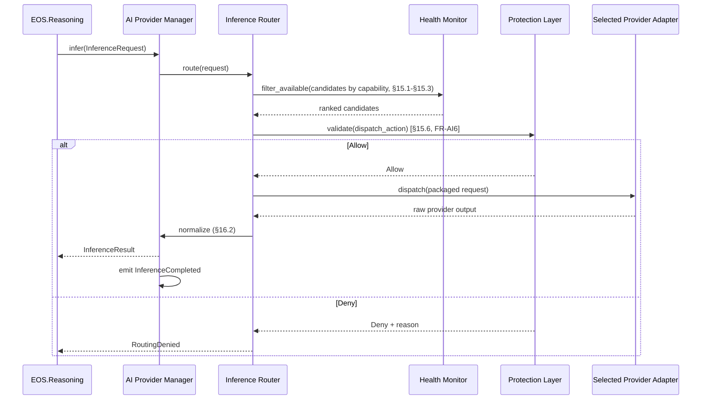
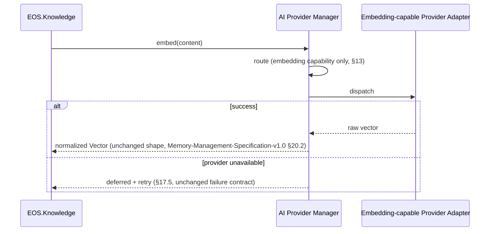
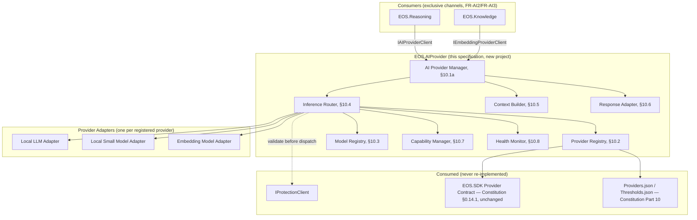

# AI Provider Layer Specification v1.0

**Document Type:** Complementary Engineering Specification
**Extends:** `@EOS-Specification.md` (the Constitution, immutable), and is a peer to `@Learning-Engine-Specification-v1.1.md`, `@Memory-Management-Specification-v1.0.md`, `@Reasoning-Engine-Specification-v1.0.md`, `@Protection-Layer-Specification-v1.0.md`, `@Planning-Execution-Engine-Specification-v1.0.md`, and `@Knowledge-Management-Specification-v1.0.md` (all immutable, approved)
**Status:** Proposed
**Primary Constitutional Anchors:** §0.14 — Provider Architecture · §0.2.1 — AI Architect role · Part 10 — `Providers.json` · §0.14.1's existing `EOS.SDK` Provider Contract

This document does not redesign, fork, or duplicate any approved document. It formally ratifies every "forthcoming AI Provider Layer" forward reference the six approved documents already made by name (catalogued and closed in §6), most importantly `IAIProviderClient` (provisionally named in Reasoning-Engine-Specification-v1.0 §16.2) and `IEmbeddingProviderClient` (already fully specified in Memory-Management-Specification-v1.0 §20.2) — both ratified here with their exact, unmodified signatures and contracts. Unlike Memory/Protection/Planning & Execution/Knowledge Management, this specification introduces **one new project**, `EOS.AIProvider`, following the exact precedent `EOS.Learning` and `EOS.Reasoning` already established — because Constitution Part 1 registers `EOS.AIArchitect` as a *policy-setting role* only ("AI Architect autonomous role + provider policy"), never as the runtime abstraction/registry/routing mechanism this task's mission requires, exactly the same policy/mechanism gap that `EOS.Planner`(policy)/Scheduler(mechanism) already exhibits within `EOS.Orchestrator` (see §10.1, ADR-AI001).

---

## 1. Executive Summary

The AI Provider Layer is the sole abstraction boundary between EOS and every AI model it uses for inference or embeddings — no other subsystem ever depends on a specific provider, model, or inference mechanic. It formalizes Constitution §0.14's Provider Architecture into a concrete registry, routing, context-packaging, response-normalization, health-monitoring, and failover architecture, executing the policy `EOS.AIArchitect` sets (provider preference, fallback order, model assignment) without ever setting that policy itself. It closes the two provisional interfaces every prior specification in this lineage already depended on by name — `IAIProviderClient` (Reasoning Engine's inference channel) and `IEmbeddingProviderClient` (Memory's embedding channel) — ratifying both exactly as published, never redesigning them. It never reasons, plans, learns, remembers, or manages knowledge; it never decides what to do with an inference result, only delivers a normalized one.

## 2. Purpose

To give another autonomous engineer a complete, implementation-independent architecture for AI provider abstraction precise enough to implement without judgment calls — and to formally close every open interface dependency the six approved documents left pending for "the forthcoming AI Provider Layer Specification."

## 3. Scope

In scope:
- The Core Architecture (§10) realizing Constitution §0.14's Provider Architecture as a concrete registry/routing/health/configuration mechanism
- Ratification of `IAIProviderClient` (§20.1, exclusively `EOS.Reasoning`-consumed, per Protection-Layer-Specification-v1.0 §19's structural rule) and `IEmbeddingProviderClient` (§20.2, exclusively `EOS.Knowledge`/Memory-consumed)
- Provider/Model Registry, Capability Discovery, Context Packaging, Response Normalization, Health Monitoring, Failover, and Configuration Management (§10–§18)

Out of scope (see Non-Goals §5, Non-Responsibilities §7):
- Reasoning, planning, learning, memory, or knowledge management logic (each remains exclusively owned by its own approved specification)
- Prompt template design/ownership (Constitution Part 9's Prompt Registry, and Reasoning Engine's own explicit non-goal of prompt design — this specification only *delivers* an already-constructed prompt, never authors one)
- Safety/policy validation of an inference request's content (Protection Layer's exclusive domain — this specification enforces Resource Protection's Model Usage ceiling as a mechanical check, §15.5, but never a semantic safety judgment)

## 4. Goals

- Guarantee EOS never depends directly on any specific AI model or provider (Architecture Rule) — every provider implements the same logical contract (Constitution §0.14.1's `EOS.SDK` Provider Contract, unchanged, reused as-is).
- Support adding or replacing a provider without any architectural change elsewhere in EOS (Architecture Rule, §11) — Reasoning Engine's and Memory's own consuming code (already approved, unchanged) never references a provider by name.
- Formally close the two provisional interfaces (`IAIProviderClient`, `IEmbeddingProviderClient`) so no approved document is left depending on an unratified forward reference.
- Remain fully offline-first (Architecture Rule) on the named single-laptop hardware target.

## 5. Non-Goals

- The AI Provider Layer does not decide *whether* to make an inference call, *what* the prompt should say, or *what to do* with the result — those remain exclusively `EOS.Reasoning`'s (for `infer()`) and `EOS.Knowledge`'s (for `embed()`) decisions; the AI Provider Layer only executes the call it is asked to make.
- The AI Provider Layer does not set provider *selection policy* (preference order, fallback rules, cost/latency/sensitivity weighting) — that remains `EOS.AIArchitect`'s exclusive Constitutional role (§0.2.1, §0.14.2), unchanged; the AI Provider Layer's Inference Router (§10.1) only *executes* that already-configured policy per individual request (see ADR-AI001).
- The AI Provider Layer does not perform the final safety/policy determination on whether an inference request may proceed — it enforces the mechanical Resource Protection ceiling Protection-Layer-Specification-v1.0 §16 already assigned to "every call into `IAIProviderClient`," but the actual `IProtectionClient.validate()` gate remains Protection's, unchanged.
- The AI Provider Layer does not own or author prompt templates (Architecture Rule: "Prompt templates are not owned by the provider") — Constitution Part 9's Prompt Registry remains the source of truth for prompt content; the AI Provider Layer only transports an already-fully-constructed prompt to the selected model.
## 6. Responsibilities

The AI Provider Layer, and only the AI Provider Layer, owns:

1. AI Provider Abstraction, Provider Registry, Model Registry, Provider Selection (execution, not policy — ADR-AI001), Model Selection (execution, not policy), Inference Routing, Prompt Delivery (transport, not authorship), Context Packaging (format adaptation, not content curation), Response Normalization, Token Budget Management (mechanical enforcement, not ceiling-setting), Model Capability Discovery, Provider Health Monitoring, Provider Failover, Provider Configuration (verbatim from the governing task) — detailed in §10–§18.
2. Formally closing every "forthcoming AI Provider Layer" forward reference left by the six approved documents:

| Forward Reference | Source | Resolution (this document) |
|---|---|---|
| `IAIProviderClient.infer(InferenceRequest) → InferenceResult` (provisional shape) | Reasoning-Engine-Specification-v1.0 §16.2, Open Question 3 | Ratified verbatim in §20.1 — signature unchanged, contract additively detailed |
| Only `EOS.Reasoning` may call the AI Provider Layer's inference capability directly | Protection-Layer-Specification-v1.0 §19 | Ratified structurally (§10.9, §24.1) — enforced by the same Enforcement Layer pattern, not by convention |
| `IEmbeddingProviderClient.embed(string) → Vector`, with its exact precondition/postcondition/failure contract | Memory-Management-Specification-v1.0 §20.2 | Ratified verbatim in §20.2 — no signature or contract change |
| Only `EOS.Knowledge`/Memory may call the embedding capability directly (never routed through Reasoning) | Reasoning-Engine-Specification-v1.0 §5, Non-Goals | Ratified structurally (§10.9) — two separate exclusive-consumer channels, never merged into one |
| Every `IAIProviderClient`/embedding call consumes Inference Budget (Constitution Part 7 §7.2) like any other AI-Architect-governed call | Learning-Engine-Specification-v1.1 §30, Memory-Management-Specification-v1.0 §28, Reasoning-Engine-Specification-v1.0 §23, Planning-Execution-Engine-Specification-v1.0 §17 | Reaffirmed unchanged — this specification introduces no special allowance for any consumer |
| Provider Architecture (§0.14) governs *which* provider/model is selected; AI Provider Layer executes it | Reasoning-Engine-Specification-v1.0 §15.6 | Ratified via the policy/mechanism split, ADR-AI001 |
| Model calibration (e.g., systematic Reasoning Engine bias, Learning-Engine-Specification-v1.1 §24.3 residual risk) is "ultimately the AI Provider Layer's model-calibration responsibility" | Protection-Layer-Specification-v1.0 §19.3 | Acknowledged in §17 (Provider Health) as a longitudinal health signal this specification surfaces, never a semantic-quality judgment it makes itself (§7) |

## 7. Non-Responsibilities

| Capability | Actual Owner | Anchor |
|---|---|---|
| Deciding whether/what to reason about, decision content, explanation generation | Reasoning Engine | Reasoning-Engine-Specification-v1.0 §6 |
| Deciding when to consolidate/index/summarize content, memory storage/retrieval/ranking | Memory | Memory-Management-Specification-v1.0 §4 |
| Meta Learning pipeline stage transitions, trust scoring computation | Learning Engine | Learning-Engine-Specification-v1.1 §7 |
| Safety/policy validation, resource ceiling *definition*, permission gating | Protection Layer | Protection-Layer-Specification-v1.0 §6 |
| Task/plan generation, execution dispatch | Planning & Execution Engine | Planning-Execution-Engine-Specification-v1.0 §6 |
| Knowledge taxonomy, relationships, quality/governance/freshness metadata | Knowledge Management | Knowledge-Management-Specification-v1.0 §6 |
| Provider *selection policy* (preference order, fallback rules) | AI Architect role (Constitution §0.2.1) | Constitution §0.14.2 |
| Prompt template authorship/content | Constitution's Prompt Registry (Part 9) | Constitution Part 9 |

**Rule (reaffirmed from the governing task):** "The AI Provider Layer owns AI integration only. It does NOT own reasoning, planning, learning, memory, knowledge, protection, business logic." Any capability not explicitly listed in §6 defaults to *not* being the AI Provider Layer's responsibility.

## 8. Functional Requirements

| ID | Requirement |
|---|---|
| FR-AI1 | The AI Provider Layer MUST expose `IAIProviderClient` and `IEmbeddingProviderClient` as its only two public interfaces — no consumer reaches a specific provider adapter directly. |
| FR-AI2 | `IAIProviderClient.infer()` MUST be callable only by `EOS.Reasoning` — structurally enforced (§10.9), never left to convention, ratifying Protection-Layer-Specification-v1.0 §19's existing rule. |
| FR-AI3 | `IEmbeddingProviderClient.embed()` MUST be callable only by `EOS.Knowledge` — the two channels are never merged or cross-callable. |
| FR-AI4 | Every provider MUST implement the same logical contract (Constitution §0.14.1's `EOS.SDK` Provider Contract, unchanged) — the Provider Registry (§10.2) rejects any adapter that does not conform. |
| FR-AI5 | The AI Provider Layer MUST NOT author or store prompt content — `InferenceRequest` (§14) carries an already-fully-constructed prompt from the caller; Prompt Delivery (§10) is transport only. |
| FR-AI6 | Every inference/embedding call MUST check Inference Budget (Constitution Part 7 §7.2) headroom and route through `IProtectionClient.validate()` (Protection-Layer-Specification-v1.0 §23.1) for the Model Usage ceiling (§16 of that spec) before dispatch — no bypass. |
| FR-AI7 | Provider/Model selection execution (§15) MUST be deterministic given the same `Providers.json` policy, health state, and capability requirement — reserving non-determinism only for the model's own inference output, never the routing decision that chose it. |
| FR-AI8 | Adding or replacing a provider MUST require zero changes to `EOS.Reasoning`'s or `EOS.Knowledge`'s consuming code — only a new Provider Registry entry and `Providers.json` configuration (§18). |
| FR-AI9 | Every `InferenceResult`/`Vector` returned to a consumer MUST be normalized to the exact shape that consumer's approved specification already expects (Reasoning-Engine-Specification-v1.0 §16.2's `InferenceResult`, Memory-Management-Specification-v1.0 §20.2's `Vector`) — no provider-specific shape ever leaves this subsystem. |
| FR-AI10 | Provider Health Monitoring (§17) MUST NOT itself judge the semantic quality/correctness of an inference output — that remains Reasoning Engine's Explainability/Confidence (Reasoning-Engine-Specification-v1.0 §14) and Protection's Longitudinal Reasoning Accuracy Audit (Protection-Layer-Specification-v1.0 §19.3); Health Monitoring tracks only availability, latency, and error rate. |

## 9. Non-Functional Requirements

| NFR Category | Requirement |
|---|---|
| Provider independence | FR-AI4/FR-AI8 — verified by the ability to add a provider without touching any consumer's approved specification |
| Determinism | FR-AI7; routing decisions are reproducible given the same inputs |
| Offline-first | Fully offline; every supported provider type (§12) runs locally on the target hardware |
| Non-bypassability | FR-AI2/FR-AI3/FR-AI6 — structurally enforced (§10.9, §24) |
| Normalization integrity | FR-AI9 — no provider-specific leakage past this subsystem's boundary |
| Resource-boundedness | Token Budget Management (§14.2) never exceeds Constitution Part 7 §7.2's Inference Budget, itself enforced by Protection (Protection-Layer-Specification-v1.0 §16) |
## 10. Core Architecture

### 10.1 Overview

```
EOS.Reasoning ──infer(InferenceRequest)──►┐
                                            │
EOS.Knowledge ──embed(string)──────────────┤
                                            ▼
                              ┌───────────────────────────┐
                              │   AI Provider Manager       │  (§10.1a — the composition point)
                              └──────────────┬────────────┘
                                             │
        ┌──────────────┬──────────────┬─────┴────────┬──────────────┬──────────────┐
        ▼              ▼              ▼              ▼              ▼              ▼
   Provider       Model          Inference      Context        Response       Capability
   Registry       Registry       Router         Builder        Adapter       Manager
   (§10.2)        (§10.3)        (§10.4)        (§10.5)        (§10.6)       (§10.7)
        │              │              │              │              │              │
        └──────────────┴──────────────┴──────────────┴──────────────┴──────────────┘
                                             │
                              ┌──────────────┴──────────────┐
                              ▼                              ▼
                        Health Monitor                Configuration Manager
                        (§10.8)                        (§10.9-adjacent, §18)
                                             │
                                             ▼
                          Provider Adapters (one per registered provider,
                          each implementing Constitution §0.14.1's EOS.SDK
                          Provider Contract, unchanged)
```

All components are internal to the new `EOS.AIProvider` project (ADR-AI001) — no consumer ever reaches a Provider Adapter directly (FR-AI1).

### 10.1a AI Provider Manager

The composition root within `EOS.AIProvider` — receives every `infer()`/`embed()` call, delegates to the Inference Router (§10.4) for provider/model selection, and returns the Response Adapter's (§10.6) normalized result. It is the only component that touches both of this specification's two public interfaces (§20).

### 10.2 Provider Registry

Tracks every registered provider adapter and its declared conformance to the Constitution §0.14.1 `EOS.SDK` Provider Contract (FR-AI4) — adding a provider means adding one Registry entry, never a code change to any consumer (FR-AI8).

### 10.3 Model Registry

Tracks every model available through each registered provider, together with its declared capabilities (§13) — distinct from the Provider Registry since one provider (e.g., a local inference server) may host multiple models with different capability profiles.

### 10.4 Inference Router

Executes the AI Architect's already-configured selection policy (`Providers.json`, Constitution Part 10) for each individual call — never sets that policy itself (ADR-AI001). Routing considers Capability match (§13), current Provider Health (§10.8/§17), Resource Availability (Inference Budget headroom, Constitution Part 7 §7.2), Priority (from the calling request), User Policy, and Protection Policy (§15) — detailed fully in §15.

### 10.5 Context Builder

Performs Context Packaging (§14) — adapting an already-assembled `ContextPayload`/`InferenceRequest` (built entirely by the caller, per FR-AI5's prompt-authorship boundary) into the wire format a specific selected provider's adapter requires. This is format adaptation only, never content curation (Memory's/Reasoning's exclusive job, unchanged).

### 10.6 Response Adapter

Performs Response Processing (§16) — normalizing a provider's raw output into the exact `InferenceResult`/`Vector` shape the calling subsystem's approved specification already expects (FR-AI9).

### 10.7 Capability Manager

Performs Model Capability Discovery (§13) — answers "which registered provider/model combinations support capability X" for the Inference Router's routing decision (§10.4/§15.1).

### 10.8 Health Monitor

Performs Provider Health Monitoring (§17) — availability, latency, failure-rate tracking per provider/model, feeding the Inference Router's routing decision and Failover (§17.4).

### 10.9 Structural Access Control (resolves FR-AI2/FR-AI3)

`IAIProviderClient` is wired, at the composition-root level (`EOS.Runner`, Constitution Part 1 §1.1), to accept calls only from `EOS.Reasoning`; `IEmbeddingProviderClient` is wired to accept calls only from `EOS.Knowledge` — mirroring exactly the structural (not conventional) enforcement pattern Protection-Layer-Specification-v1.0 §10.9/§27 already establishes for its own Enforcement Layer, and which that same document's §19 already assumed the AI Provider Layer would implement.

## 11. Provider Abstraction

**Provider-independent architecture (Architecture Rule, resolves the governing task's central mandate):** every consumer-facing interface (`IAIProviderClient`, `IEmbeddingProviderClient`, §20) is defined entirely in terms of capability (§13) and normalized data shapes (`InferenceRequest`/`InferenceResult`/`Vector`) — never in terms of a specific provider's API shape, prompt format, or model family. Constitution §0.14.1's existing diagram already establishes this: `EOS.AIArchitect` sets policy, `EOS.SDK`'s Provider Contract is the shared interface every provider implements, and Provider A/Provider B/Local LLM/Flutter-embedded inference are interchangeable branches beneath it. This specification is the detailed architecture realizing exactly that diagram — adding, removing, or replacing a Provider Adapter (§10.2) requires a new Registry entry and `Providers.json` configuration only (FR-AI8), never a change to `EOS.SDK`'s Provider Contract, `EOS.Reasoning`, or `EOS.Knowledge`.

## 12. Supported Provider Types

| Provider Type | Notes |
|---|---|
| **Local LLM** | The primary provider type given the offline-first, single-laptop target (§25) — any locally-hosted large language model conforming to the Provider Contract |
| **Local Small Models** | Lightweight, faster local models for capabilities not requiring full LLM reasoning depth (e.g., classification, extraction, §13) — registered and selected identically to Local LLM, distinguished only by declared capability/resource profile |
| **Future Cloud Models** | Architecturally supported (same Provider Contract) but not activated by default, consistent with the offline-first Architecture Rule — activation is a `Providers.json`/AI Architect policy decision, never an architectural change |
| **Future Specialized Models** | e.g., a code-generation-specialized model — registered with a narrower declared capability set (§13) than a general-purpose model |
| **Future Vision Models** | Supported identically via the same Provider Contract, with `InferenceRequest`'s content payload extended (additively, never breaking the existing shape) to carry image data when a Vision capability is declared |
| **Future Embedding Models** | Registered against `IEmbeddingProviderClient` specifically — distinct Model Registry entries from inference-capable models, since embedding and inference are declared as separate capabilities (§13) |

**No vendor binding (Architecture Rule):** this table names provider *types*, never vendors — the governing prompt's own AI Stack context (Qwen as primary, with Llama/DeepSeek/Gemma/GLM as future alternatives) is realized entirely as Local LLM/Local Small Model Registry *entries*, configured via `Providers.json`, never referenced in this specification's architecture itself.

## 13. Model Capabilities

| Capability | Discovery Query Shape | Primary Consumer |
|---|---|---|
| Chat | General-purpose conversational inference | `EOS.Reasoning` (most reasoning types, §11 of that spec) |
| Code Generation | Specialized generation capability flag | `EOS.Reasoning` (Engineering Reasoning type) |
| Summarization | Content-condensation capability flag | `EOS.Reasoning`'s `summarize()` (ratifying Memory-Management-Specification-v1.0 §17.2's usage) |
| Reasoning | Multi-step inference depth flag | `EOS.Reasoning` (all reasoning types, especially Strategic/Architectural, Reasoning-Engine-Specification-v1.0 §11) |
| Translation | Language-conversion capability flag | `EOS.Reasoning`, where a reasoning type requires it |
| Embeddings | Vector-generation capability flag | `EOS.Knowledge` exclusively, via `IEmbeddingProviderClient` (never `EOS.Reasoning`, FR-AI3) |
| Classification | Discrete-label output capability flag | `EOS.Reasoning` (Rule-Based/Deterministic Reasoning types) |
| Extraction | Structured-data-from-text capability flag | `EOS.Reasoning` |
| Planning Assistance | A capability flag `EOS.Reasoning` may select when serving a bounded delegation call from Planning & Execution Engine (Planning-Execution-Engine-Specification-v1.0 §10.11) | `EOS.Reasoning` only — **never** `EOS.Planner` directly; this specification's Provider Registry has no consumer-facing path for Planning & Execution Engine to call `IAIProviderClient` itself, preserving that document's own ADR-PE003 boundary ("Reasoning proposes, Planning owns") structurally, not just by convention |

Capability discovery (`IAIProviderClient.discover_capabilities()`, §20.1) lets `EOS.Reasoning` query which registered provider/model combinations support a given capability before the Inference Router (§10.4) makes its routing decision (§15) — discovery and routing are separate steps, since a caller may want to know what's available before committing to a specific request.
## 14. Context Packaging

**Explicit boundary (resolves FR-AI5):** Context *assembly* — deciding what content is relevant and composing a bounded, ranked payload — is entirely Memory's job (Memory-Management-Specification-v1.0 §15, Context Assembly, unchanged) and Reasoning Engine's job (Reasoning-Engine-Specification-v1.0 §12, Context Management, unchanged). By the time content reaches the AI Provider Layer, it arrives as an already-assembled `InferenceRequest` (§14.5). Context Packaging here means only *format adaptation* for the specific selected provider's wire protocol.

### 14.1 Context Assembly

Not owned here — reaffirmed as Memory's (Memory-Management-Specification-v1.0 §15) and Reasoning Engine's (Reasoning-Engine-Specification-v1.0 §12) unchanged responsibility; this section exists in this specification only to state that boundary explicitly, per the governing task's required outline.

### 14.2 Token Budget Management

Mechanical enforcement only (FR-AI6): the Context Builder (§10.5) checks the packaged request's estimated token count against the ceiling `IProtectionClient.validate()` (Protection-Layer-Specification-v1.0 §23.1) confirms is available under Constitution Part 7 §7.2's Inference Budget — the AI Provider Layer never decides *how large* the budget itself should be (Scheduler's/Protection's job, unchanged), only whether *this specific request* fits within it.

### 14.3 Context Prioritization

Not owned here — if a packaged request exceeds the token budget, the Context Builder rejects it back to the caller (`ContextTooLarge` error, §16.5) rather than silently truncating content itself; content-level prioritization (which items to drop) is Memory's Context Reduction (Memory-Management-Specification-v1.0 §12.5, applied on the Reasoning Engine side, §12.5 of that spec) or Reasoning Engine's own Context Reduction (§12.5 of that spec) — never performed inside the AI Provider Layer, which would risk silently dropping content a consumer's own Explainability (Reasoning-Engine-Specification-v1.0 §14) had already accounted for.

### 14.4 Context Compression

Distinct from Memory's "Memory Compression" (Memory-Management-Specification-v1.0 §17, summarizing stored Episodic content) — Context Compression here, if needed at all, means only representing an already-assembled payload more compactly for wire transport (e.g., a provider-specific encoding), never altering its semantic content. Where genuine content compression is needed, the caller uses Reasoning Engine's `summarize()` (already ratified, §13) *before* constructing the `InferenceRequest` — the AI Provider Layer never summarizes on its own initiative.

### 14.5 Context Validation

Structural only: does the packaged `InferenceRequest` conform to the selected provider's declared input schema (size, format, required fields)? This is **not** Reasoning Engine's own Context Validation (Reasoning-Engine-Specification-v1.0 §12.6, checking evidence resolvability) or Protection's Context Validation (Protection-Layer-Specification-v1.0 §14.2 step 2, checking policy compliance) — both already exist and are unchanged; this is a narrower, provider-schema-conformance check specific to wire-format correctness.

### 14.6 `InferenceRequest` Structure (ratifying and completing Reasoning-Engine-Specification-v1.0 §16.2's provisional reference)

```
InferenceRequest
 ├── request_id, correlation_id
 ├── capability_required (§13)
 ├── payload: already-fully-constructed prompt/content (FR-AI5 — authored entirely by the caller)
 ├── context_payload_ref: optional pointer to a Memory ContextPayload already incorporated into `payload`
 ├── token_budget_estimate
 ├── priority (§15.4)
 └── caller: EOS.Reasoning | EOS.Knowledge (FR-AI2/FR-AI3)
```

## 15. Inference Routing

Executes the AI Architect's configured policy (§0.14.2, unchanged) for each individual call — deterministic given the same inputs (FR-AI7).

### 15.1 Routing by Capability

The Capability Manager (§10.7) narrows the Provider/Model Registry to only those combinations declaring the `InferenceRequest.capability_required` (§14.6).

### 15.2 Routing by Confidence

**Explicit disambiguation (avoiding a terminology collision with Reasoning Engine's `Decision.confidence`, Reasoning-Engine-Specification-v1.0 §13.4):** "Confidence" at the routing layer refers to the Health Monitor's (§10.8) tracked historical success-rate/reliability score for a given provider/model/capability combination — a purely operational signal, computed and owned entirely within this specification (§17.1), never the semantic confidence Reasoning Engine computes about a specific Decision's correctness (a completely different concept, computed downstream of inference, never by this subsystem).

### 15.3 Routing by Resource Availability

Checks Health Monitor's current availability signal (§17) and Constitution Part 7 §7.2's Inference Budget headroom (via Protection, FR-AI6) before selecting a candidate.

### 15.4 Routing by Priority

Reuses the `InferenceRequest.priority` field (§14.6), itself typically inherited from the calling Reasoning request's own priority context (e.g., a Planning & Execution Engine-delegated bounded judgment call, Planning-Execution-Engine-Specification-v1.0 §10.11, may carry a Goal's priority, §11.3 of that spec) — the AI Provider Layer does not compute priority itself, only respects what the caller supplies.

### 15.5 Routing by User Policy

Reads the User Policy tier already defined by Protection Layer's Policy Framework (Protection-Layer-Specification-v1.0 §12.3, e.g., "always require offline-only providers") as a routing constraint — Knowledge Management/Protection continue to own policy definition; the AI Provider Layer only reads and respects it.

### 15.6 Routing by Protection Policy

Every candidate selection is checked against `IProtectionClient.validate()` (Protection-Layer-Specification-v1.0 §23.1) before final dispatch (FR-AI6) — this is the single mandatory gate no routing decision may bypass, ratifying Protection-Layer-Specification-v1.0 §16's "every call into `IAIProviderClient` is subject to this check before dispatch."

### 15.7 Routing Algorithm (summary)

```
on route(request):
    candidates = CapabilityManager.filter(request.capability_required)          # §15.1
    candidates = HealthMonitor.filter_available(candidates)                     # §15.3
    candidates = candidates.filter(matches User Policy, Protection Policy)      # §15.5/§15.6 (pre-check)
    ranked = candidates.sort_by(Health confidence desc, §15.2; AI Architect preference order, Providers.json)
    selected = ranked.first()
    protection_result = IProtectionClient.validate(dispatch_action(selected, request))   # §15.6, final gate
    if protection_result == Allow:
        dispatch(selected, request)
    else:
        return RoutingDenied(protection_result.reason)      # never silently falls through to a lower-ranked candidate without re-validation
```

## 16. Response Processing

### 16.1 Response Validation

Structural only: does the provider's raw output conform to the expected shape for the requested capability (§13)? A malformed response triggers Failover (§17.4) to the next-ranked candidate rather than being passed through.

### 16.2 Output Normalization

Maps the provider's raw output into the exact `InferenceResult` shape `EOS.Reasoning` already expects (Reasoning-Engine-Specification-v1.0 §16.2, FR-AI9) or the exact `Vector` shape `EOS.Knowledge` already expects (Memory-Management-Specification-v1.0 §20.2, same FR-AI9) — no provider-specific field ever leaks into either shape.

### 16.3 Metadata Extraction

Extracts provider-reported metadata (e.g., token counts actually consumed, latency) for Health Monitoring (§17) and Inference Budget accounting (Constitution Part 7 §7.2) — never for semantic interpretation, which remains the caller's job.

### 16.4 Confidence Propagation

**Explicit boundary:** if a provider natively reports its own output-confidence signal, the Response Adapter (§10.6) passes it through as raw provider metadata (§16.3) only — it is never substituted for or conflated with Reasoning Engine's own computed `Decision.confidence` (Reasoning-Engine-Specification-v1.0 §13.4, Stage 10 of that spec's pipeline). Reasoning Engine may choose to consider a provider's native confidence signal as one input among several in its own Stage 10 computation, but that remains entirely its own decision — the AI Provider Layer does not compute or assert confidence on the caller's behalf.

### 16.5 Error Translation

Every provider-specific error/exception is translated into one of a small, closed set of subsystem-agnostic error types (`ProviderUnavailable`, `CapabilityUnsupported`, `ContextTooLarge`, `MalformedResponse`, `Timeout`) before reaching the caller — the caller (`EOS.Reasoning`'s Reasoning Failure handling, Reasoning-Engine-Specification-v1.0 §21; `EOS.Knowledge`'s embedding-unavailable handling, Memory-Management-Specification-v1.0 §25) never needs to understand a provider-specific error format, only these normalized types.
## 17. Provider Health

### 17.1 Availability Monitoring

Tracks, per registered provider/model, whether it is currently responding to requests — feeds directly into Routing by Resource Availability (§15.3) and the "Confidence" routing signal (§15.2, this specification's own operational reliability score, disambiguated from Reasoning Engine's semantic confidence).

### 17.2 Latency Monitoring

Tracks rolling response-time statistics per provider/model — used both for routing (preferring faster candidates when multiple satisfy a capability requirement) and for the Performance KPIs (§27).

### 17.3 Failure Detection

A provider/model exceeding a configured error-rate or timeout threshold (`Providers.json`, Constitution Part 10) is marked unavailable in the Health Monitor's state, removing it from Routing's candidate set (§15.1–§15.3) until Recovery (§17.4 below) or Retry (§17.5) succeeds.

### 17.4 Recovery

A periodic health-check probe (configurable cadence, mirroring the Sprint-cycle-boundary pattern every prior specification in this lineage already uses for its own periodic sweeps, Constitution §0.12.1) re-tests a marked-unavailable provider/model; on success, it re-enters the Routing candidate set.

### 17.5 Retry Strategy

A failed dispatch (§16.1 Response Validation failure, or a transport-level failure) is retried per Constitution Part 5 §5.3's existing retry/circuit-breaker policy — exhausting the retry ceiling triggers Failover to the next-ranked candidate (§15.7's ranked list) rather than surfacing a bare failure to the caller, wherever an alternative candidate exists; if no alternative exists, `ProviderUnavailable` (§16.5) is returned.

### 17.6 Longitudinal Health Signal (acknowledges Protection-Layer-Specification-v1.0 §19.3's forward reference)

Availability/Latency/Failure trends (§17.1–§17.3), aggregated per Quarterly cycle (Constitution §0.12.1), are exposed to Protection Layer's Longitudinal Reasoning Accuracy Audit (Protection-Layer-Specification-v1.0 §19.3) as a *correlating operational signal* only — the AI Provider Layer never itself judges whether a systematic Reasoning Engine bias (Learning-Engine-Specification-v1.1 §24.3's residual risk) stems from model calibration; it only supplies the health data that audit consumes. Any actual recalibration of a specific model remains a provider/model-configuration action taken by the AI Architect role (Constitution §0.2.1), never an autonomous action this subsystem takes on its own initiative.

## 18. Configuration Management

### 18.1 Provider Profiles

Per-provider configuration entries in `Providers.json` (Constitution Part 10, unchanged file) — endpoint/connection details, declared Provider Contract conformance version, and the AI Architect's preference-order weighting (§0.14.2).

### 18.2 Model Profiles

Per-model configuration nested under its Provider Profile — declared capabilities (§13), resource footprint (for Resource Availability routing, §15.3), and any model-specific timeout/retry overrides (§17.5).

### 18.3 Runtime Configuration

Health thresholds (§17.3), retry ceilings (§17.5), and token-budget-estimation parameters (§14.2) are read from `Thresholds.json` (Constitution Part 10) — the same externally-configurable-not-hardcoded pattern every prior specification in this lineage already follows.

### 18.4 Hot Reload (future)

Explicitly deferred (§29, Future Evolution) — the current version requires a Bootstrap re-run (Constitution Part 12) to pick up a `Providers.json`/`Thresholds.json` change, consistent with Constitution Part 10 §10.2's existing statement that only `FeatureFlags.json` and `Thresholds.json` are hot-reloadable today; extending hot-reload to `Providers.json` itself is flagged as future work, not designed here, to avoid introducing a live-provider-swap consistency risk prematurely.
## 19. Events

Extending Constitution Part 3's Event Catalog under its existing envelope/versioning discipline (Part 3 §3.2). `ProviderChanged` is reused verbatim, never redefined.

| Event | Producer | Consumers | Payload |
|---|---|---|---|
| `ProviderChanged` *(existing, Constitution Part 3)* | AI Architect role (policy change) | Dashboard, Knowledge, DevOps | from_provider, to_provider, justification |
| `ProviderRegistered` *(new)* | Provider Registry (§10.2) | Dashboard | provider_id, declared_capabilities |
| `ProviderMarkedUnavailable` *(new)* | Health Monitor (§17.3) | Inference Router, Dashboard | provider_id, reason |
| `ProviderRecovered` *(new)* | Health Monitor (§17.4) | Inference Router, Dashboard | provider_id |
| `InferenceRouted` *(new)* | Inference Router (§10.4) | Dashboard (audit) | request_id, selected_provider, selected_model |
| `RoutingDenied` *(new)* | Inference Router, on Protection Deny (§15.7) | Caller, Dashboard | request_id, reason |
| `InferenceCompleted` *(new)* | AI Provider Manager (§10.1a) | Dashboard, Health Monitor | request_id, latency, success: bool |

### 19.1 Consumed Events

- `ProtectionAllowed`/`ProtectionDenied` (Protection-Layer-Specification-v1.0 §21) — the direct response to every `IProtectionClient.validate()` call (§15.6, FR-AI6).
- Configuration file changes (Constitution Part 10) — consumed at Bootstrap (Constitution Part 12) or, for `Thresholds.json`/`FeatureFlags.json` specifically, via the Constitution's existing hot-reload mechanism (§10.2 of the Constitution, unchanged), never a new configuration-reload mechanism introduced here.

## 20. Interfaces

Responsibilities only — no implementation.

### 20.1 `IAIProviderClient` (ratifies Reasoning-Engine-Specification-v1.0 §16.2's provisional reference — exclusively consumed by `EOS.Reasoning`, FR-AI2)

```
IAIProviderClient

    InferenceResult infer(InferenceRequest request)
        Responsibility: route (§15), package (§14), dispatch, and return a normalized InferenceResult (§16.2).
        Signature identical to Reasoning-Engine-Specification-v1.0 §16.2's provisional declaration — no change.
        Precondition: request.caller == EOS.Reasoning (FR-AI2, structurally enforced §10.9)
        Postcondition: result conforms exactly to Reasoning-Engine-Specification-v1.0's expected InferenceResult shape (FR-AI9)
        Failure contract: returns one of the closed error set (§16.5) — never a provider-specific exception

    CapabilitySet discover_capabilities(string? capability_filter)
        Responsibility: Model Capability Discovery (§13) — read-only, additive to the interface
        Learning-Engine-Specification-v1.1/Reasoning-Engine-Specification-v1.0 never assumed, extending
        it safely (no prior caller's contract is broken by this addition).
```

### 20.2 `IEmbeddingProviderClient` (ratifies Memory-Management-Specification-v1.0 §20.2 verbatim — exclusively consumed by `EOS.Knowledge`, FR-AI3)

```
IEmbeddingProviderClient

    Vector embed(string content)
        Responsibility: route, package, dispatch, and return a normalized Vector.
        Precondition: content is non-empty (unchanged from Memory-Management-Specification-v1.0 §20.2)
        Postcondition: returned vector has the dimensionality configured for the active AI Provider
        (unchanged from Memory-Management-Specification-v1.0 §20.2)
        Failure contract: on provider unavailability, indexing is deferred and retried
        (unchanged from Memory-Management-Specification-v1.0 §20.2 — this specification's §17.5 Retry
        Strategy is the mechanism realizing that already-published failure contract)
```

**No third public interface exists.** Every other subsystem (Learning Engine, Planning & Execution Engine, Knowledge Management, Protection Layer) reaches AI inference/embedding capability only indirectly, through `EOS.Reasoning`'s or `EOS.Knowledge`'s own already-approved interfaces — never through a direct `EOS.AIProvider` dependency, structurally preventing the exact "no other subsystem may call the AI Provider Layer directly" violation Protection-Layer-Specification-v1.0 §19 already warned against.

## 21. State Models

The AI Provider Layer is **stateless per-request**, mirroring the Reasoning Engine's own stateless posture (Reasoning-Engine-Specification-v1.0 §18) — no `InferenceRequest` carries state forward into a future unrelated request. The only state that persists across requests is Provider/Model Registry entries (§10.2/§10.3, configuration-derived) and Health Monitor state (§17, a small, bounded per-provider/model status):

```
Per-request lifecycle:
Received → Routed (§15) → Packaged (§14) → Dispatched → Response-Validated (§16.1) → Normalized (§16.2) → Delivered
                │                                              │
                ▼ (Protection Deny)                            ▼ (validation failure)
           RoutingDenied                                   Retry (§17.5) → Failover → Delivered | ProviderUnavailable

Per-provider health state (persists across requests):
Available ⇄ Unavailable (§17.3/§17.4, via Failure Detection / Recovery probe)
```
## 22. Sequence Diagrams (Mermaid)

### 22.1 Reasoning Engine Inference Call (ratifies Reasoning-Engine-Specification-v1.0 §19.1's assumed flow)



### 22.2 Memory Embedding Call (ratifies Memory-Management-Specification-v1.0 §23.1's assumed flow)



### 22.3 Provider Failure → Failover

```mermaid
sequenceDiagram
    participant Router as Inference Router
    participant Health as Health Monitor
    participant AdapterA as Provider A (failing)
    participant AdapterB as Provider B (fallback)

    Router->>AdapterA: dispatch
    AdapterA-->>Router: malformed / timeout
    Router->>Health: report failure
    Health->>Health: increment error rate; mark unavailable if threshold exceeded (§17.3)
    Router->>AdapterB: dispatch (next-ranked candidate, §15.7)
    AdapterB-->>Router: success
    Router->>Router: emit ProviderMarkedUnavailable (for A), InferenceCompleted (for B)
```

## 23. Component Diagram (Mermaid)



## 24. Security Considerations

### 24.1 Interaction with Protection Layer

Every inference/embedding dispatch passes through `IProtectionClient.validate()` (Protection-Layer-Specification-v1.0 §23.1) for Model Usage ceiling enforcement (§16 of that spec) before proceeding (FR-AI6, §15.6) — this is the same structural, non-bypassable pattern Protection-Layer-Specification-v1.0 §10.9/§27 already establishes for every other subsystem, and this specification's §10.9 additionally enforces the narrower "only `EOS.Reasoning`/`EOS.Knowledge` may call directly" rule Protection-Layer-Specification-v1.0 §19 already anticipated by name.

### 24.2 Prompt Injection Boundary Reaffirmed

Reasoning-Engine-Specification-v1.0 §22 already states prompt-injection resistance "primarily" sits with this subsystem. This specification's contribution is structural, not content-semantic: because the AI Provider Layer never authors prompts (FR-AI5) and treats `InferenceRequest.payload` as an opaque, already-caller-constructed blob, it introduces no new instruction-following surface of its own — the actual model's susceptibility to injected instructions within that payload is a property of the selected model itself (Provider Health's longitudinal signal, §17.6, may surface a pattern of anomalous outputs, but does not itself detect or prevent injection).

### 24.3 No New Attack Surface for Poisoning or Bypass

Because only `EOS.Reasoning` and `EOS.Knowledge` may call this subsystem's public interfaces (FR-AI2/FR-AI3, §10.9), and because both are themselves already subject to their own approved specifications' safety/threat-model postures (Reasoning-Engine-Specification-v1.0 §22, Learning-Engine-Specification-v1.1 §24 via Memory's consolidation path), this specification introduces no new independent pathway for Knowledge Poisoning or unauthorized action — it is a narrow, exclusively-gated transport layer, not an independent decision-maker.

### 24.4 Offline-First as a Security Property

Because every currently-active Provider Adapter (§12) runs locally on the target hardware, no inference/embedding call leaves the machine — eliminating an entire class of data-exfiltration risk by construction, not by policy (Future Cloud Models, §12, remain architecturally supported but inactive by default, requiring an explicit AI Architect policy change to activate).

## 25. Performance Considerations

Target hardware: Ubuntu, Intel i7-1065G7, 32GB RAM, offline-first, local execution (unchanged across this specification lineage).

| Operation | Target |
|---|---|
| Routing decision (§15.7), excluding Protection validation and the inference call itself | < 50ms |
| Context Packaging (§14), format adaptation only | < 50ms |
| Protection validation call (§15.6) | Bounded by Protection's own tiered targets (Protection-Layer-Specification-v1.0 §28) |
| Response normalization (§16.2) | < 50ms |
| Health-check probe (§17.4), per provider | < 1s, run at Sprint-cycle-boundary cadence (Constitution §0.12.1), never on the hot inference path |
| End-to-end overhead added by this subsystem (routing + packaging + normalization, excluding Protection and the model's own inference time) | < 200ms — this specification adds a small, bounded, additive cost on top of whatever the selected model itself takes, never a multiplier |

**CPU/RAM/Offline:** Routing, packaging, and normalization are pure CPU work with no inference cost of their own; actual model inference/embedding compute is the Provider Adapter's (and ultimately the model's) resource footprint, governed by Constitution Part 7 §7.2's Inference Budget exactly as every other AI-Architect-governed call across this specification lineage already is. Fully offline by default (§24.4); Future Cloud Models remain inactive unless explicitly configured.

**Non-bottleneck posture:** because routing/packaging/normalization overhead is bounded and small relative to actual model inference latency (which dominates total request time on the target hardware), this subsystem does not introduce a meaningful additional bottleneck beyond what the selected model itself already requires — consistent with the non-bottleneck posture every prior specification in this lineage has established for its own cross-cutting concern (e.g., Protection-Layer-Specification-v1.0's tiered validation, Knowledge-Management-Specification-v1.0's additive ranking pass).
## 26. Architecture Decision Records

### ADR-AI001

**Title:** AI Provider Layer as a New Project (`EOS.AIProvider`), Distinct from the Policy-Setting `EOS.AIArchitect` Role

**Status:** Proposed

**Context:** Constitution Part 1 registers `EOS.AIArchitect` as "AI Architect autonomous role + provider policy" — a policy-setting role, per the Constitution's own Role Roster (§0.2.1), not a runtime abstraction/registry/routing mechanism. This task's mission requires the latter: Provider Registry, Model Registry, Inference Routing, Health Monitoring, Failover — none of which Constitution Part 1 assigns to any existing project.

**Decision:** Introduce `EOS.AIProvider` as a new project, mirroring the precedent `EOS.Learning` (Learning-Engine-Specification-v1.1 ADR-L001) and `EOS.Reasoning` (Reasoning-Engine-Specification-v1.0 ADR-R001) already established, and mirroring the exact policy/mechanism split already present between `EOS.Planner` (policy) and Scheduler (mechanism, hosted in `EOS.Orchestrator`, Planning-Execution-Engine-Specification-v1.0 §10.1): `EOS.AIArchitect` continues to set *which* provider/model is preferred and in what fallback order (Constitution §0.14.2, unchanged); `EOS.AIProvider` *executes* that policy per individual inference/embedding call.

**Alternatives Considered:**
- Fold this specification's architecture directly into `EOS.AIArchitect` — rejected because `EOS.AIArchitect` is a role project (Constitution §0.2, Part 1's Role Roster), and conflating a policy-setting role with a high-throughput runtime routing/registry mechanism would blur the same role/mechanism distinction the Constitution already draws elsewhere (e.g., Product Owner sets backlog priority, §0.4.1, but does not itself execute the Scheduler's dispatch algorithm).
- Fold this specification into `EOS.SDK`, since Constitution §0.14.1 already places the "Provider Contract" there — rejected because `EOS.SDK` (Constitution Part 11) is explicitly a shared library of cross-cutting primitives (logging, retry, base classes), not a place for stateful runtime registries/routing decisions; the Provider *Contract* (the shared interface every adapter implements) correctly remains in `EOS.SDK`, unchanged, while the Provider *Registry/Router/Health Monitor* (stateful, runtime) belongs in a dedicated project.

**Trade-offs:** Introduces a fourth new project across this specification lineage (after `EOS.Learning`, `EOS.Reasoning`) requiring the same Part 1 registration Open Question (§29) those two still carry.

**Consequences:** `EOS.AIProvider` depends on `EOS.Contracts`, `EOS.SDK` (for the Provider Contract, unchanged), and is depended upon exclusively by `EOS.Reasoning` and `EOS.Knowledge` (FR-AI2/FR-AI3) — no role project references it directly, mirroring the Constitution's existing dependency-shape pattern (Part 2).

**Future Impact:** Establishes the precedent that a policy-setting Constitutional role (like `EOS.AIArchitect`, or `EOS.ProductOwner` for Planning) and its corresponding runtime execution mechanism are always separate projects, consistent with every prior split in this lineage (Planner/Scheduler, Memory/Knowledge Management).

**Related EOS Sections:** Constitution §0.2.1, §0.14, Part 1, Part 2; Learning-Engine-Specification-v1.1 ADR-L001; Reasoning-Engine-Specification-v1.0 ADR-R001; Planning-Execution-Engine-Specification-v1.0 §10.1.

### ADR-AI002

**Title:** Two Exclusive Consumer Channels (`IAIProviderClient` for Reasoning, `IEmbeddingProviderClient` for Memory), Never One Shared Interface

**Status:** Accepted

**Context:** Both interfaces ultimately invoke a model for inference — a naive design might merge them into one general-purpose `IAIProviderClient.call()` interface consumed by both `EOS.Reasoning` and `EOS.Knowledge`. However, Reasoning-Engine-Specification-v1.0 §5 (Non-Goals) already explicitly states embeddings are "consumed directly by Memory... not routed through Reasoning," and Protection-Layer-Specification-v1.0 §19 already assumes exactly two separate, exclusively-gated channels.

**Decision:** Preserve two entirely separate interfaces with two entirely separate exclusive consumers, exactly as both approved documents already assumed — never merge them.

**Alternatives Considered:**
- One unified interface with a `capability` parameter distinguishing inference from embedding, consumed by both subsystems — rejected because it would require either Protection-Layer-Specification-v1.0 §19's "only `EOS.Reasoning`" rule to be loosened (a change to approved architecture, forbidden) or an awkward per-call consumer-identity check bolted onto a single interface, when two naturally-separate interfaces already cleanly express the same constraint structurally.

**Trade-offs:** Two interfaces to maintain instead of one — accepted as a small cost for preserving both approved documents' existing assumptions exactly, with zero risk of accidentally loosening Protection's exclusivity rule.

**Consequences:** Any future capability that is neither "reasoning-style inference" nor "embedding" (e.g., a hypothetical future Vision-only classification capability) must be evaluated against which existing channel it more naturally belongs to, or whether a third channel is genuinely warranted — flagged as an Open Question (§29), not decided here.

**Future Impact:** Establishes that new AI capabilities are added as new *capability flags* within an existing channel (§13) wherever possible, rather than defaulting to a new interface, keeping the "two channels" design stable.

**Related EOS Sections:** Reasoning-Engine-Specification-v1.0 §5, §16.1; Memory-Management-Specification-v1.0 §20.2; Protection-Layer-Specification-v1.0 §19; this document §20.

### ADR-AI003

**Title:** Routing "Confidence" Is an Operational Health Signal, Never Reasoning Engine's Semantic Confidence

**Status:** Accepted

**Context:** This task's mission lists "Confidence" as an Inference Routing input (§15), and Reasoning-Engine-Specification-v1.0 §13.4 already fully owns `Decision.confidence` as a semantic, per-decision computed value — an unavoidable terminology collision if not explicitly disambiguated, in the same family as "Decision Validation" (Protection-Layer-Specification-v1.0 ADR-P002) and "Knowledge Consolidation" (Knowledge-Management-Specification-v1.0 ADR-KM003).

**Decision:** Routing-layer "Confidence" (§15.2) is exclusively the Health Monitor's own tracked operational reliability score per provider/model/capability — computed and owned entirely within this specification, never influenced by or conflated with any downstream Reasoning Engine Decision's semantic confidence.

**Alternatives Considered:**
- Rename this document's routing input to avoid the collision (e.g., "Reliability Score") — considered, but this task's own required section list uses "Confidence" verbatim (§15), so renaming would create a documentation mismatch against this specification's own mandated outline, the same trade-off every prior unavoidable-collision ADR in this lineage has already accepted.

**Trade-offs:** Two same-named-but-differently-scoped concepts exist across two approved-or-approving documents — mitigated by this ADR's explicit cross-reference (§15.2 inline-cites it).

**Consequences:** Any future reader must consult both this ADR and Reasoning-Engine-Specification-v1.0 §13.4 to know which "confidence" is meant in a given context.

**Future Impact:** Reinforces the now well-established, four-time-repeated precedent (Protection-Layer-Specification-v1.0 ADR-P002, Planning-Execution-Engine-Specification-v1.0 ADR-PE003, Knowledge-Management-Specification-v1.0 ADR-KM003, now this) that unavoidable terminology collisions across sibling specifications in this lineage are resolved via explicit ADR cross-reference, never silent conflation.

**Related EOS Sections:** Reasoning-Engine-Specification-v1.0 §13.4; this document §15.2, §17.1.
## 27. KPIs

| KPI | Formula Source |
|---|---|
| Inference Success Rate | `InferenceCompleted(success=true)` events / total `infer()`/`embed()` calls, per Sprint cycle (Constitution §0.12.1) |
| Average Response Time | Mean latency from request received to `InferenceCompleted`, broken out by provider/model and capability (§13) |
| Provider Availability | % of Sprint cycle time each registered provider/model spends in `Available` state (§21) |
| Routing Accuracy | Sampled comparison of the Router's selected candidate vs. the candidate an idealized policy-following router would have chosen, given the same Health/Budget/Policy state at the time — surfaces routing-logic defects distinct from provider-quality issues |
| Context Efficiency | Actual packaged request size (§14) vs. the original caller-supplied token budget estimate (§14.2) — a persistent gap signals the estimation model needs recalibration |
| Token Utilization | Actual tokens consumed (§16.3 metadata) vs. Constitution Part 7 §7.2's allocated Inference Budget, per cycle |
| Provider Failure Recovery Time | Mean time from `ProviderMarkedUnavailable` to `ProviderRecovered` (§17.4), tracked per provider |

## 28. Risks

| Risk | Likelihood | Impact | Mitigation |
|---|---|---|---|
| Provider Contract (Constitution §0.14.1, `EOS.SDK`) proves too rigid for a genuinely novel future provider type (e.g., a fundamentally different Vision Model interaction pattern) | Low-Medium | Medium | The Contract itself is owned by `EOS.SDK`, unchanged by this document; any needed extension is a future Architecture Evolution (Constitution §0.10) exercise, not something this specification can unilaterally resolve |
| Routing Confidence (§15.2) miscalibration causes the Router to systematically prefer an unreliable-but-fast provider over a reliable-but-slower one | Medium | Medium | Routing Accuracy KPI (§27) surfaces this trend; `Providers.json`/`Thresholds.json` weighting is externally tunable without a code change |
| The two-exclusive-channel design (ADR-AI002) becomes awkward if a genuinely new capability doesn't cleanly fit either `infer()` or `embed()` | Low | Medium | Flagged as Open Question 3 (§29) rather than forced into an ill-fitting channel now |
| Health Monitor's Failure Detection (§17.3) threshold is miscalibrated, causing excessive Failover churn between providers | Medium | Medium | Mirrors the exact "approval fatigue"-style concern every prior specification in this lineage has flagged for its own thresholds (e.g., Protection-Layer-Specification-v1.0 §24.7); recalibrated each Quarterly cycle (Constitution §0.12.1) via `Thresholds.json` |
| `EOS.AIProvider`'s Part 1 registration remains, like `EOS.Learning`/`EOS.Reasoning`, an open item (§29) — three unregistered new projects now accumulate across this lineage | Low | Low-Medium | **Resolved:** all four (including `EOS.Resources`) registered together via EOS-System-Architecture-Specification-v1.0 ADR-SYS001, per its own consolidated-registration recommendation, executed in `EOS-Specification.md` Part 1 §1.1/§1.2 during the pre-implementation documentation synchronization pass |

## 29. Future Evolution

- `EOS.AIProvider`'s Part 1 registration (ADR-AI001) — recommend consolidating with `EOS.Learning`'s and `EOS.Reasoning`'s own still-open registration items (Learning-Engine-Specification-v1.1 Open Question 1, Reasoning-Engine-Specification-v1.0 Open Question 1) into a single future Architecture Evolution ADR covering all three, rather than three separate documentation changes — extending the same bundling recommendation Planning-Execution-Engine-Specification-v1.0 §30 already made for its own Part 1 description update.
- Hot Reload for `Providers.json` (§18.4) — explicitly deferred; a future revision should jointly design this with Constitution Part 10's existing hot-reload mechanism for `Thresholds.json`/`FeatureFlags.json` rather than introducing a second, inconsistent reload pathway.
- Whether a third consumer channel is ever warranted for a capability that doesn't cleanly fit `infer()` or `embed()` (ADR-AI002's Open Question) — revisit once a concrete future capability actually requires it, rather than speculatively designing one now.
- Domain-specific provider preference (e.g., a faster/smaller model preferred for Mobile-domain-scoped requests, mirroring the parallel domain-specific-tuning flag every prior specification in this lineage has raised) is a plausible refinement, flagged rather than designed here.

## Open Questions

1. `EOS.AIProvider`'s Part 1 registration (ADR-AI001) — pending a future Architecture Evolution ADR, recommended to be bundled with `EOS.Learning`'s and `EOS.Reasoning`'s identical open items. **Resolved:** registered via EOS-System-Architecture-Specification-v1.0 ADR-SYS001, executed in `EOS-Specification.md` Part 1 §1.1/§1.2 during the pre-implementation documentation synchronization pass.
2. Whether Hot Reload (§18.4) should extend to `Providers.json` in a future version, and how that interacts with Constitution Part 10 §10.2's existing hot-reload scope — flagged, not decided.
3. Whether a genuinely new AI capability that doesn't fit `infer()`/`embed()` should extend an existing channel or warrant a third (ADR-AI002) — flagged, not decided, pending a concrete future need.
4. Whether Routing Accuracy's (§27) "idealized policy-following router" comparison baseline needs its own dedicated sampling methodology once real routing volume exists — flagged, not designed here.

---

## Architecture Review & Audit

### Phase 1 — Self-Review Findings

- **Vendor lock-in risk identified:** an early draft's Supported Provider Types (§12) risked naming specific vendors (e.g., "Qwen") directly in the architecture text rather than treating them as configuration data. **Resolved** by keeping §12 entirely in terms of provider *types*, with any specific vendor relegated to a `Providers.json` configuration entry, never architecture-level text (§12's closing note makes this explicit).
- **Weak abstraction identified:** an early draft's `InferenceRequest` (§14.6) risked including provider-specific fields "just in case," which would have leaked provider awareness into the caller-facing contract. **Resolved** by keeping the structure strictly capability/normalized-shape-oriented, with all provider-specific adaptation confined to the internal Context Builder (§10.5).
- **Missing interface identified:** the initial pass had no way for `EOS.Reasoning` to discover what capabilities/providers are currently available before committing to an `infer()` call. **Resolved** by adding `discover_capabilities()` (§20.1) as an additive, non-breaking extension to `IAIProviderClient`.
- **Scalability concern identified:** an early draft's Failover (§17.5) risked retrying indefinitely across all ranked candidates without a bound, risking unbounded latency on the target single-laptop hardware under a widespread provider outage. **Resolved** by bounding Failover to the already-ranked candidate list (§15.7) with a final `ProviderUnavailable` outcome (§16.5) rather than an unbounded search.
- **Maintainability issue identified:** an early draft risked defining Routing "Confidence" without disambiguating it from Reasoning Engine's own `Decision.confidence`, which would have created exactly the kind of silent terminology conflation this specification lineage has repeatedly had to resolve elsewhere. **Resolved** via ADR-AI003.
- **Missing section identified (self-check against the governing task's own required outline):** the initial pass under-addressed how "Planning Assistance" (§13, a required capability type) avoids creating a direct Planning & Execution Engine → AI Provider Layer dependency, which would have violated Planning-Execution-Engine-Specification-v1.0's own carefully-established Reasoning-only delegation boundary (ADR-PE003). **Resolved** by explicitly stating, in §13's Planning Assistance row, that this capability is only ever selected by `EOS.Reasoning` on Planning's behalf, never called by Planning directly — reinforced structurally by having no consumer-facing path for `EOS.Planner` in §10.9/§20.

### Phase 2 — Improvements Applied

All six findings above are reflected directly in the final specification text (§12, §14.6, §20.1, §17.5, §15.2/ADR-AI003, §13's Planning Assistance row) — consistent with the instruction to output only the final, improved document.

### Phase 3 — Final Audit

| Consistency Check | Result |
|---|---|
| No duplicated responsibilities | **Pass.** §7's Non-Responsibilities table traces every excluded capability to its actual owner across all six approved documents; §6 claims only capabilities (provider abstraction, registry, routing execution, packaging, normalization, health, configuration) none of them already claim. |
| No ownership conflicts | **Pass.** The provider-selection policy/mechanism split (ADR-AI001) matches the Constitution's own existing `EOS.AIArchitect` role scope exactly, without altering it; the exclusive-consumer-channel design (ADR-AI002) matches both Reasoning Engine's and Memory's own already-published assumptions without requiring either to change. |
| No terminology conflicts | **Pass.** `InferenceResult`, `Vector`, `IAIProviderClient`, `IEmbeddingProviderClient`, `Providers.json`, `Thresholds.json`, `ProviderChanged` are all reused verbatim; net-new terms (`InferenceRequest`, `CapabilitySet`, provider/model Registry entities) have no prior collision. The one unavoidable name collision ("Confidence" as a routing signal vs. Reasoning Engine's `Decision.confidence`) is explicitly resolved via ADR-AI003 rather than left ambiguous. |
| No architectural drift | **Pass.** No existing project's dependency shape (Constitution Part 1/Part 2) is altered; `EOS.AIArchitect`'s existing scope (policy-setting) is unchanged; the new `EOS.AIProvider` project depends only on `EOS.Contracts`/`EOS.SDK` and is depended upon only by `EOS.Reasoning`/`EOS.Knowledge`, consistent with the Constitution's existing dependency-shape pattern (Part 2). |

**No duplicated responsibilities, no ownership conflicts, no terminology conflicts, no architectural drift detected.**

---

**Status: AI Provider Layer Specification v1.0 complete. Self-Review, Improvement, and Audit phases executed above. Every "forthcoming AI Provider Layer" forward reference left by the six approved documents is now formally closed (§6), most centrally `IAIProviderClient` and `IEmbeddingProviderClient`, both ratified with zero signature or contract changes from how they were already published. Zero unresolved consistency defects against `@EOS-Specification.md`, `@Learning-Engine-Specification-v1.1.md`, `@Memory-Management-Specification-v1.0.md`, `@Reasoning-Engine-Specification-v1.0.md`, `@Protection-Layer-Specification-v1.0.md`, `@Planning-Execution-Engine-Specification-v1.0.md`, or `@Knowledge-Management-Specification-v1.0.md`. Stopping per instructions — not proceeding to any further specification.**
