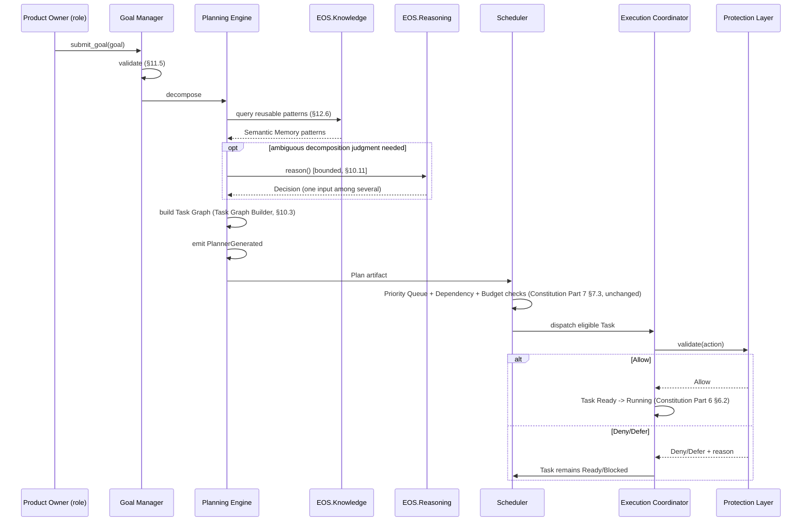
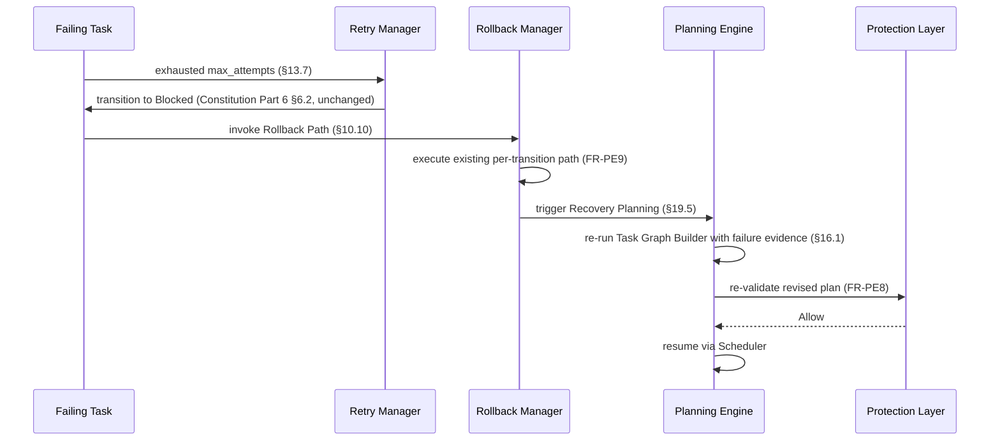
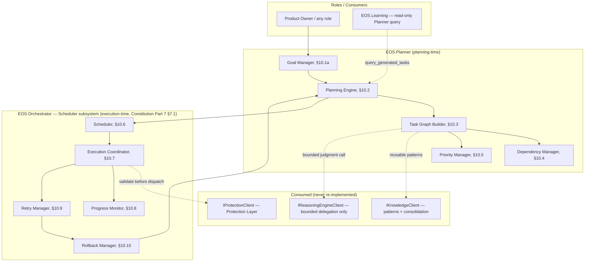

# Planning & Execution Engine Specification v1.0

**Document Type:** Complementary Engineering Specification
**Extends:** `@EOS-Specification.md` (the Constitution, immutable), and is a peer to `@Learning-Engine-Specification-v1.1.md`, `@Memory-Management-Specification-v1.0.md`, `@Reasoning-Engine-Specification-v1.0.md`, and `@Protection-Layer-Specification-v1.0.md` (all immutable, approved)
**Status:** Proposed
**Primary Constitutional Anchors:** §0.4 — Capability Planner (`EOS.Planner`) · Part 6 — Task Lifecycle · Part 7 — Scheduler (`EOS.Orchestrator`-hosted) · §0.12.1 — Execution Cycles · Part 14 §14.1 — Meta Learning's Automation-to-Planner wiring

This document does not redesign, fork, or duplicate any approved document. Like the Memory Management and Protection Layer Specifications before it, it requires **no new project**: Constitution Part 1 already registers `EOS.Planner` (Capability Planner) and `EOS.Orchestrator` (which Part 7 §7.1 already states hosts the Scheduler). This specification is the full implementation-level architecture behind Constitution §0.4 (Capability Planner), Part 6 (Task Lifecycle), and Part 7 (Scheduler) — unified into one Planning & Execution Engine, exactly as prior specifications detailed their own Constitutional anchors. It also formally ratifies every reference to "Planner"/"Scheduler" already made, by name, in the four approved documents (catalogued in §6), and resolves one genuine tension between this task's Architecture Rules and the already-approved Reasoning Engine Specification (§10.11, ADR-PE003).

---

## 1. Executive Summary

The Planning & Execution Engine transforms engineering goals into executable task graphs and safely orchestrates their execution, from decomposition through completion, retry, rollback, and dynamic replanning. It is the sole owner of Constitution §0.4's Capability Planner and Part 7's Scheduler, unified with Part 6's Task Lifecycle into one coherent architecture. It is the **only** subsystem permitted to execute an action (this task's Architecture Rule, reaffirmed as FR-PE1) — every dispatch passes through the Protection Layer's `IProtectionClient.validate()` (Protection-Layer-Specification-v1.0 §23.1) first, every plan may draw on Reasoning Engine judgment calls and Memory's reusable knowledge patterns, and every completed or failed execution feeds Memory's planning history and, ultimately, Learning Engine's Meta Learning pipeline. It never learns, remembers, reasons, stores knowledge, performs inference, or sets protection policy — it only plans and executes, deferring every adjacent judgment to the subsystem that already owns it.

## 2. Purpose

To give another autonomous engineer a complete, implementation-independent architecture for planning and execution precise enough to implement without judgment calls — and to formally detail what Constitution §0.4/Part 6/Part 7 only sketched, exactly as the four prior specifications did for their own Constitutional anchors, while resolving the one genuine boundary tension this task's rules introduce against the already-approved Reasoning Engine Specification.

## 3. Scope

In scope:
- Goal Management (§11): a new formalized entity — Constitution §0.4.1 names "Backlog items" as a planning input but never models a Goal as a first-class, decomposable, hierarchical entity; this specification introduces that model without altering the Constitution's existing Planning Inputs/Outputs.
- The full Planning Model (§12), Task Management (§13), Scheduling (§14), Execution Orchestration (§15), Dynamic Replanning (§16), Progress Tracking (§18), and Failure Handling (§19) detail the Constitution's Part 6/Part 7 only sketched.
- Formal ratification of every already-in-use reference to "Planner"/"Scheduler" across the four approved documents (§6).

Out of scope (see Non-Goals §5, Non-Responsibilities §7):
- Any semantic judgment about *what* the right engineering answer is (Reasoning Engine's exclusive domain)
- Knowledge/memory storage, retrieval, or lifecycle (Memory's exclusive domain)
- Meta Learning pipeline stage transitions (Learning Engine's exclusive domain)
- Safety/policy/permission determination (Protection Layer's exclusive domain) — the Planning & Execution Engine consumes Protection's verdicts, never issues its own competing ones
- Raw model inference (AI Provider Layer's domain, forthcoming)

## 4. Goals

- Provide one coherent architecture for turning a Goal into a validated, executable, monitorable Task Graph, and for safely orchestrating that graph's execution end to end.
- Ensure execution is deterministic whenever possible (Architecture Rule) — scheduling and dependency resolution are deterministic algorithms (§10), reserving genuine judgment calls for Reasoning Engine delegation (§10.11) only where Planning cannot resolve something itself.
- Guarantee no action executes without passing through the Protection Layer (Architecture Rule, FR-PE2) and that no subsystem other than the Planning & Execution Engine executes an action directly (Architecture Rule, FR-PE1).
- Make Learning Engine's promoted Automations (Constitution Part 14 §14.1) and Memory's reusable Semantic patterns (Memory-Management-Specification-v1.0 §10.5) first-class planning inputs, without owning either's underlying promotion/storage logic.

## 5. Non-Goals

- The Planning & Execution Engine does not decide *what* to learn from an execution outcome (Learning Engine's job) — it only emits the same `LessonLearned`-triggering signals any other role already can (via Memory's `consolidate()`, Memory-Management-Specification-v1.0 §16.1).
- The Planning & Execution Engine does not store its own parallel history of past plans/executions as canonical memory — Memory already owns that (§9, and see ADR-PE002).
- The Planning & Execution Engine does not perform the semantic judgment behind "which of these two approaches is better" itself — it may delegate a bounded judgment call to the Reasoning Engine (§10.11), but the Reasoning Engine never returns a task graph, and Planning never treats a Reasoning Engine response as anything more than one input among several (§10.11, ADR-PE003).
- The Planning & Execution Engine does not decide whether an action is safe/policy-compliant to execute — it always defers to the Protection Layer's verdict (§10.10) and never overrides a Deny.

## 6. Responsibilities

The Planning & Execution Engine, and only the Planning & Execution Engine, owns:

1. Goal decomposition, Task planning, Execution planning, Dependency resolution, Priority management, Scheduling, Workflow orchestration, Execution monitoring, Progress tracking, Dynamic replanning, Retry strategy, Rollback planning, Resource-aware scheduling (verbatim from the governing task) — detailed in §10–§19.
2. Formally ratifying every already-in-use reference to Planner/Scheduler across the four approved documents:

| Reference | Source | Resolution (this document) |
|---|---|---|
| `Planner.tasks_generated_from(record)` (read-only query) | Learning-Engine-Specification-v1.1 §11.5 | Ratified verbatim as part of `IPlanningClient.query_generated_tasks()` (§21.1) |
| Planner emits `PlannerGenerated`; Scheduler consumes it, dispatches respecting budgets/dependencies | Constitution §0.4, Part 7 §7.1 | Unchanged — detailed in §10.2/§10.6 |
| "Planner may call `reason()` for a judgment call feeding into plan construction... Reasoning never generates a task graph" | Reasoning-Engine-Specification-v1.0 §15.3, FR-R4 | Ratified verbatim in §10.11 — this specification's Planning Engine is the only component that ever produces a Task Graph |
| "Resource-budget and policy compliance check on a generated plan before Scheduler dispatch... Planner (Constitution §0.4) owns Task graph generation, prioritization" | Protection-Layer-Specification-v1.0 §11 (Planning domain row) | Ratified — every dispatch passes through `IProtectionClient.validate()` (§10.10) exactly as Protection's own component diagram already depicts |
| "Learning Engine's Feedback Loop Guard traces `PlatformCapabilityPipelineAdvanced` records forward through the Planner's task generation" | Learning-Engine-Specification-v1.1 §11.5, §24.6 | Ratified — `query_generated_tasks()` (§21.1) is the exact read-only interface that call already assumed |
| "Automation → wired into Planner/Scheduler as an auto-invocable capability" | Constitution Part 14 §14.1 | Detailed in §16.2 (Dynamic Replanning after new knowledge) — Planning consumes `GoldenPathCodified`/`PlatformCapabilityPipelineAdvanced` (Learning-Engine-Specification-v1.1 §15) as new planning inputs, never producing them itself |

## 7. Non-Responsibilities

| Capability | Actual Owner | Anchor |
|---|---|---|
| The 12-stage reasoning pipeline, decision content | Reasoning Engine | Reasoning-Engine-Specification-v1.0 §6 |
| Meta Learning pipeline stage transitions, Golden Path/Automation promotion | Learning Engine | Learning-Engine-Specification-v1.1 §7 |
| Knowledge/memory storage, retrieval, ranking, consolidation, lifecycle, planning-history persistence | Memory | Memory-Management-Specification-v1.0 §4 |
| Safety/policy/permission determination, risk scoring formula, resource *ceiling* enforcement | Protection Layer | Protection-Layer-Specification-v1.0 §6 |
| Resource *ceiling definition* (what the ceiling is) — Planning only respects it | Protection Layer (enforcement) / Constitution Part 7 (budget definition) | Protection-Layer-Specification-v1.0 §16 |
| Raw model inference | AI Provider Layer (forthcoming) | Reasoning-Engine-Specification-v1.0 §15.6 |

**Rule (reaffirmed from the governing task):** "The Planning & Execution Engine owns Goal decomposition, Task planning, Execution planning, Dependency resolution, Priority management, Scheduling, Workflow orchestration, Execution monitoring, Progress tracking, Dynamic replanning, Retry strategy, Rollback planning, Resource-aware scheduling. It does NOT own Learning, Memory, Reasoning, Knowledge storage, AI inference, Protection policies." Any capability not explicitly listed in §6 defaults to *not* being this subsystem's responsibility.
## 8. Functional Requirements

| ID | Requirement |
|---|---|
| FR-PE1 | No subsystem other than the Planning & Execution Engine may execute an action directly (Architecture Rule) — every execution path is structurally routed through the Execution Coordinator (§10.7). |
| FR-PE2 | Every execution MUST pass through `IProtectionClient.validate()` (Protection-Layer-Specification-v1.0 §23.1) before dispatch — no exceptions, no bypass (Architecture Rule). |
| FR-PE3 | Planning decisions (dependency resolution, scheduling order, retry timing) MUST be deterministic given the same Task Graph, budgets, and policy state — reserving non-determinism only for the bounded Reasoning Engine delegation case (§10.11). |
| FR-PE4 | The Planning Engine MUST NOT generate a Task Graph from a Reasoning Engine response alone — a Reasoning Engine judgment (§10.11) is one input the Planning Engine incorporates, never a substitute for its own Task Graph Builder (§10.3). |
| FR-PE5 | Every Task Graph MUST resolve to a `Plan` artifact in the Artifact Registry (Constitution Part 8), identical to Constitution §0.4.2's existing definition — no second, parallel plan store. |
| FR-PE6 | The Scheduler MUST respect Constitution Part 7 §7.2's existing budget structures (CPU/RAM/Inference/Daily Capacity/Concurrency/Retry Windows/Maintenance Windows) unchanged — this specification adds execution-mode detail (§14) on top, never a competing budget model. |
| FR-PE7 | Every Task Lifecycle transition MUST match Constitution Part 6 §6.2's existing transition table exactly — this specification adds Goal- and Workflow-level state (§22) above it, never altering a Task-level transition rule. |
| FR-PE8 | Dynamic Replanning (§16) MUST always re-validate the revised plan through Protection (FR-PE2) and MUST NOT silently resume execution without re-checking dependency/resource state. |
| FR-PE9 | Rollback actions MUST be requested from, and executed only via, the Task Lifecycle's existing "Rollback Path" column (Constitution Part 6 §6.2) — the Rollback Manager (§10.10) never invents a rollback path not already defined there. |
| FR-PE10 | The Planning & Execution Engine MUST NOT persist a competing copy of planning history — Memory owns that (§9); the Planning & Execution Engine only triggers Memory's existing `consolidate()` (Memory-Management-Specification-v1.0 §16.1) for plan/execution outcomes worth retaining. |

## 9. Non-Functional Requirements

| NFR Category | Requirement |
|---|---|
| Determinism | FR-PE3; scheduling/dependency algorithms (§10.4/§10.6) are pure functions of Task Graph + budget + policy state |
| Auditability | Every dispatch, retry, and rollback resolves to Constitution Part 8's Artifact Registry — no parallel audit trail (mirrors Protection-Layer-Specification-v1.0 FR-P4's pattern) |
| Non-bypassability | FR-PE1/FR-PE2 — structurally enforced (§10.7, §25), not by convention |
| Resource-boundedness | §17; never exceeds Constitution Part 7 §7.2's existing budget ceilings, themselves enforced by Protection (Protection-Layer-Specification-v1.0 §16) |
| Offline-first | Fully offline; the only external-adjacent dependency is the bounded, already-offline Reasoning Engine delegation (§10.11) |
| Replanning responsiveness | A Dynamic Replanning cycle (§16) completes within one Execution micro-cycle (Constitution §0.12.1) of its trigger, wherever possible |
| Reproducibility | Given the same Task Graph, budget state, and policy state, the Scheduler's dispatch order is reproducible (FR-PE3) — supports post-hoc audit and debugging |

## 10. Core Architecture

### 10.1 Overview

```
   Goal (§11) ──► Goal Manager (§10.1a) ──► Planning Engine (§10.2)
                                                    │
                          ┌─────────────────────────┼─────────────────────────┐
                          ▼                         ▼                         ▼
                 Task Graph Builder (§10.3)  Dependency Manager (§10.4)  Priority Manager (§10.5)
                          │                         │                         │
                          └─────────────────────────┴─────────────────────────┘
                                                    │
                                                    ▼
                                          Plan artifact (Constitution §0.4.2, Artifact Registry Part 8)
                                                    │
                                                    ▼
                                            Scheduler (§10.6)
                                                    │
                                                    ▼
                                   Execution Coordinator (§10.7) ──► IProtectionClient.validate() (FR-PE2)
                                                    │
                                  ┌─────────────────┼─────────────────┐
                                  ▼                 ▼                 ▼
                      Progress Monitor (§10.8)  Retry Manager (§10.9)  Rollback Manager (§10.10)
```

All ten components below are internal to `EOS.Planner` (planning-time components) and `EOS.Orchestrator`'s Scheduler subsystem (execution-time components, per Constitution Part 7 §7.1's existing statement) — no new project (§1).

### 10.1a Goal Manager

Owns the Goal lifecycle (§11.1) and hierarchy (§11.2) — the entity Constitution §0.4.1 refers to only as "Backlog items." The Goal Manager is where a stakeholder-level intent is validated (§11.5) and handed to the Planning Engine for decomposition. It does not itself decompose a Goal into tasks (that is the Task Graph Builder's job, §10.3) — it only manages the Goal's own state and its relationship to sibling/child Goals.

### 10.2 Planning Engine

The concrete realization of Constitution §0.4's Capability Planner. Consumes the same Planning Inputs table (§0.4.1, unchanged: Available competencies, Backlog items — now formalized as Goals, §11 — Resource budgets, Historical velocity, Risk tolerance, Domain-specific constraints) and produces the same Planning Outputs (§0.4.2, unchanged: an ordered Task Graph with dependencies, competency requirements, estimated resource cost, risk-adjusted confidence score). This specification adds the missing internal detail — the Task Graph Builder, Dependency Manager, and Priority Manager below are its sub-components.

### 10.3 Task Graph Builder

Decomposes a validated Goal (§11.5) into a DAG of Tasks (§13), assigning each Task the competency requirements Constitution §0.4.2 already requires. May consult Memory's Semantic Memory (Memory-Management-Specification-v1.0 §10.5) for reusable planning patterns (Constitution's Architecture Rule "Knowledge provides reusable planning patterns," resolved in §12.6) and may issue a single bounded Reasoning Engine delegation (§10.11) for a specific ambiguous decomposition judgment call — but the Task Graph Builder itself is the only component that ever assembles the final DAG (FR-PE4).

### 10.4 Dependency Manager

Maintains the Task-level DAG exactly as Constitution Part 7 §7.2 already defines it ("Dependency Graph — ensuring a task only becomes `Ready` when its prerequisite tasks are `Verified`/`Released`") — this specification adds Goal-level dependencies (§11.4, a genuinely new concept, since Constitution never modeled cross-Goal dependencies) as a layer above the unchanged Task-level graph.

### 10.5 Priority Manager

Computes the priority score Constitution Part 7 §7.2's existing Priority Queue already consumes ("Orders `Ready` tasks by priority score from Planner + Decision Matrix risk weighting") — this specification formalizes that score's inputs (§11.3 Goal prioritization, deadline proximity, dependency criticality, resource cost) without altering the Priority Queue structure itself.

### 10.6 Scheduler

Unchanged from Constitution Part 7 in structure (Priority Queue, Dependency Graph, Resource/CPU/RAM/Inference Budgets, Daily Capacity, Concurrency, Retry Windows, Maintenance Windows, §7.2) and algorithm (§7.3) — this specification adds the Scheduling execution-mode detail (§14: immediate/delayed/background/scheduled/periodic/event-driven/idle-time) Constitution Part 7 never enumerated.

### 10.7 Execution Coordinator

The single structural chokepoint through which every Task dispatch passes (FR-PE1) — it calls `IProtectionClient.validate()` (FR-PE2) before any Task transitions `Ready → Running` (Constitution Part 6 §6.2), and orchestrates Workflow-level execution (§15: parallel/conditional branches, pause/resume/cancel/recovery) above the unchanged Task-level Lifecycle.

### 10.8 Progress Monitor

Tracks Task/Goal/Workflow status (§18) and computes ETA estimation and completion metrics — a read-oriented component that never itself transitions a Task's state (that remains the Task Lifecycle's existing actor-gated transitions, Constitution Part 6 §6.2); it only observes and reports.

### 10.9 Retry Manager

Implements Constitution Part 6 §6.2's existing `Blocked → Retry → Running` transitions and Part 7 §7.2's Retry Windows, adding the detailed retry-rule/timeout-rule architecture (§13.7–§13.8) Constitution never enumerated in full.

### 10.10 Rollback Manager

Executes the "Rollback Path" already defined per-transition in Constitution Part 6 §6.2 (FR-PE9) — never inventing a new rollback path. Also the designated recipient of Protection's `RollbackRequested` event (Protection-Layer-Specification-v1.0 §21) for execution-scoped rollbacks, exactly as that specification's §20 already anticipated ("directed at the owning subsystem").

### 10.11 Reasoning Engine Delegation Boundary — Explicit Resolution (see ADR-PE003)

This task's Architecture Rules state "Reasoning proposes plans. Planning owns plans." Read literally and in isolation, this could be misconstrued as Reasoning Engine generating plan structures — which would directly contradict the already-approved Reasoning-Engine-Specification-v1.0 FR-R4 ("MUST NOT generate or execute a task plan... rejected as `UnsupportedTask`") and §15.3's explicit statement that Reasoning "never generates a task graph, sets priorities, or touches the Scheduler's budgets." Because that specification is immutable, this specification resolves the tension as follows: "Reasoning proposes plans" means the Planning Engine (§10.2/§10.3) may call `IReasoningEngineClient.reason()` (Reasoning-Engine-Specification-v1.0 §16.1) for a **bounded, single judgment call** feeding one specific decomposition or sequencing decision (e.g., "which of these two implementation approaches better fits current competency availability," already the exact example Reasoning-Engine-Specification-v1.0 §15.3 itself gives) — never for the plan as a whole. "Planning owns plans" is the operative, literal rule: the Task Graph Builder (§10.3) alone assembles, and the Planning Engine alone finalizes, every `Plan` artifact.
## 11. Goal Management

### 11.1 Goal Lifecycle

```
Proposed → Validated → Decomposing → Planned → Executing → (Paused|Blocked) → Completed
                                                                        ↘
                                                                     Cancelled (from any state)
```

`Planned` is the state in which a Goal has a corresponding `Plan` artifact (Constitution §0.4.2); `Executing` mirrors the Task Lifecycle's `Running` state at the aggregate level (§22.1 defines the precise Goal↔Task state relationship).

### 11.2 Goal Hierarchy

A Goal may have child Goals (e.g., a Strategic Goal decomposing into several Tactical Goals, §12) — the hierarchy is a DAG, not merely a tree, since two child Goals may share a common dependency (§11.4). A Goal's Task Graph (§10.3) is always built from its own leaf-level decomposition; parent Goals never have their own Tasks directly, only via their children's Task Graphs, keeping the Goal↔Task relationship unambiguous.

### 11.3 Goal Prioritization

Feeds the Priority Manager (§10.5) with: stated business priority (from Product Owner, Constitution §0.4.1's existing "Backlog items" source), deadline proximity, and the aggregate priority of dependent Goals (§11.4) — never overriding the existing Priority Queue mechanics (Constitution Part 7 §7.2), only supplying one of its inputs.

### 11.4 Goal Dependencies

A genuinely new concept this specification introduces: Goal A depends on Goal B if any Task in A's eventual Task Graph requires evidence or capability only available once B completes. The Dependency Manager (§10.4) tracks this at the Goal level, distinct from and layered above the unchanged Task-level Dependency Graph (Constitution Part 7 §7.2).

### 11.5 Goal Validation

Before decomposition, a Goal is checked for: a resolvable, non-ambiguous statement of intent (delegating this specific judgment to Reasoning Engine's Goal Understanding/Intent Analysis stages where genuinely ambiguous, Reasoning-Engine-Specification-v1.0 §10 Stages 2–3, per the bounded-delegation pattern in §10.11), feasibility against known competencies (Competency Graph, Constitution §0.3), and Protection Layer policy compliance (Protection-Layer-Specification-v1.0 §11, Planning domain) before any Task Graph is built — validating early avoids wasted planning effort on an unactionable Goal.

### 11.6 Goal Cancellation

Mirrors Constitution Part 6 §6.2's "Any → Cancelled" Task transition rule, applied at the Goal level: cancelling a Goal cancels every incomplete descendant Task via the existing Task Lifecycle rule, never a new bespoke cancellation mechanism — Goal cancellation is a cascading application of an already-Constitutional rule, not a new one.

### 11.7 Goal Completion

A Goal reaches `Completed` only when every leaf Task in its Task Graph has reached `Released` or `Archived` (Constitution Part 6 §6.1) — Reality Validation (Constitution §0.15) already governs whether a Task's own completion claim is trustworthy; Goal Completion adds no additional validation layer, it only aggregates already-validated Task states.

## 12. Planning Model

Each planning type below configures the Planning Engine (§10.2) differently — none introduces a separate implementation, mirroring the pattern Reasoning-Engine-Specification-v1.0 §11 already established for its own reasoning types (one engine, multiple configurations).

| Type | Scope | Notes |
|---|---|---|
| **Strategic Planning** | Multi-Goal, multi-cycle horizon (e.g., a quarter's technical direction) | Typically invokes Reasoning Engine's Strategic Reasoning type (Reasoning-Engine-Specification-v1.0 §11) for the bounded judgment calls it needs (§10.11); always routed through Constitution §0.6's Decision Matrix consensus for CTO/Principal-Engineer-scoped Goals, exactly as that Reasoning type's own description already states |
| **Tactical Planning** | Single-Goal, cross-Task-Graph horizon | May invoke Architectural/Optimization Reasoning types (Reasoning-Engine-Specification-v1.0 §11) for approach selection |
| **Operational Planning** | Single Task Graph, day-to-day dispatch | The default mode; almost entirely deterministic (FR-PE3), rarely needs Reasoning Engine delegation |
| **Project Planning** | Scoped by `domain_tags` (Learning-Engine-Specification-v1.1 §9, Memory-Management-Specification-v1.0 §10.6) | Reuses the same Project-scoping vocabulary already established, never inventing a second tagging scheme |
| **Session Planning** | Scoped to a single interaction session | Maps directly onto Memory's Session Memory (Memory-Management-Specification-v1.0 §10.7) as its natural boundary — a Session-scoped Goal's Task Graph is discarded (not persisted as a `Plan` artifact) unless the session's outcome is explicitly consolidated, mirroring Memory's own Session Memory expiry/consolidation rule |
| **Background Planning** | Opportunistic, idle-time-scoped (§14.7) | Runs only within declared Maintenance Windows (Constitution Part 7 §7.2) or genuine CPU idle time — never competing with foreground Operational Planning for the same cycle's budget |

### 12.6 Reusable Planning Patterns (resolves the Architecture Rule "Knowledge provides reusable planning patterns")

The Task Graph Builder (§10.3) queries Memory's `IKnowledgeClient.query()`/`assemble_context()` (Memory-Management-Specification-v1.0 §20.1) for Semantic Memory content tagged as a planning-relevant Pattern/Best Practice/Principle (Memory-Management-Specification-v1.0 §10.5) — this is a **read-only consumption** of already-promoted Learning Engine output (Learning-Engine-Specification-v1.1 Part 14 pipeline) via Memory's existing interface; the Planning & Execution Engine never queries `EOS.KnowledgeGraph`/`EOS.VectorStore` directly (Constitution Part 2 dependency rule, reaffirmed) and never promotes a pattern itself.
## 13. Task Management

### 13.1 Task Decomposition

Performed exclusively by the Task Graph Builder (§10.3) from a validated Goal (§11.5) — output Tasks are exactly Constitution Part 6's existing Task entity (unchanged state machine, §22.2); this specification adds the decomposition *process* Constitution never detailed.

### 13.2 Parent / Child Tasks

A Task may itself decompose into child Tasks (e.g., a large Task split for parallel execution, §13.5) — child Tasks inherit their parent's Goal association; a parent Task's own Lifecycle state (Constitution Part 6 §6.1) is derived from its children (`Verified` only once all children are `Verified`), the same aggregation pattern §11.7 already uses at the Goal level, applied one level down.

### 13.3 Dependencies

Unchanged from Constitution Part 7 §7.2's Dependency Graph — a Task becomes `Ready` (Part 6 §6.2) only when prerequisites are `Verified`/`Released`. This specification's Dependency Manager (§10.4) is the component that maintains this graph; the rule itself is not altered.

### 13.4 Blocking Tasks

Unchanged from Constitution Part 6 §6.2's `Running → Blocked` transition (actor: `EOS.Gates`/any role, gate failure record or unmet dependency) — this specification's Retry Manager (§10.9) and Rollback Manager (§10.10) are what act on a Blocked Task, not a redefinition of when blocking occurs.

### 13.5 Parallel Execution

Multiple Tasks with no dependency relationship between them may be `Running` simultaneously, bounded by Constitution Part 7 §7.2's existing Concurrency ceiling ("Max simultaneous `Running` tasks per role/domain") — this specification adds no new concurrency model, only the Execution Coordinator's (§10.7) orchestration of parallel Workflow branches (§15.3) above the unchanged Task-level concurrency ceiling.

### 13.6 Sequential Execution

The default case when a Dependency Graph edge exists — Task B does not become `Ready` until Task A reaches `Verified`/`Released` (Constitution Part 7 §7.2, unchanged).

### 13.7 Retry Rules

Extending Constitution Part 6 §6.2's `Blocked → Retry → Running` transition and Part 7 §7.2's Retry Windows with the detail Constitution left unspecified: a Retry Rule is `{max_attempts, backoff_strategy, escalation_action}`, configured per Task type/Domain (`Thresholds.json`, Constitution Part 10) — exhausting `max_attempts` transitions the Task to `Blocked` permanently (Constitution Part 7 §7.2, unchanged rule) rather than looping indefinitely.

### 13.8 Timeout Rules

A Task `Running` beyond its configured timeout (`Thresholds.json`) is treated identically to a Retry Manager-detected failure (§13.7) — timeout is one specific trigger for the same Retry Rule evaluation, not a separate mechanism.

## 14. Scheduling

Extending Constitution Part 7 §7.2's Scheduler structures (unchanged) with the execution-mode detail Constitution never enumerated. Every mode below still passes through the same unchanged Scheduling Algorithm (Constitution Part 7 §7.3) and the same Execution Coordinator/Protection gate (§10.7, FR-PE2) — modes differ only in *when* a Task becomes eligible for that algorithm to consider it, never in *how* the algorithm itself dispatches.

| Mode | Eligibility Trigger |
|---|---|
| **Immediate Execution** | Task is `Ready` now — the default case, unchanged Constitution Part 7 §7.3 behavior |
| **Delayed Execution** | Task carries a `not_before` timestamp; ineligible for the Priority Queue until that time passes |
| **Background Execution** | Task is only eligible during declared Maintenance Windows (Constitution Part 7 §7.2) or genuine idle CPU capacity (§17) |
| **Scheduled Execution** | Task carries a fixed future dispatch time (e.g., a Quarterly-cycle-aligned review task, Constitution §0.12.1) |
| **Periodic Execution** | Task re-creates itself (a new `TaskCreated`, Constitution Part 3) on a fixed cadence — e.g., mirroring the Sprint-cycle-boundary sweep pattern Learning Engine (Learning-Engine-Specification-v1.1 §22) and Memory (Memory-Management-Specification-v1.0 §25) already use for their own internal sweeps; Periodic Execution here is the general-purpose mechanism, of which those sweeps are specific instances hosted in their own subsystems |
| **Event-Driven Execution** | Task becomes eligible only upon a specific Event Catalog (Constitution Part 3) event — e.g., a Task that only runs after `IncidentDetected` |
| **Idle-Time Execution** | Identical eligibility condition to Background Execution, reserved specifically for Background Planning (§12) rather than already-planned Tasks awaiting a window |

### 14.1 Resource-Aware Scheduling Integration

Every mode above still requires Constitution Part 7 §7.3's existing Resource Budget headroom check (step 3) and Concurrency ceiling check (step 4) before dispatch — no mode bypasses these, consistent with FR-PE6.
## 15. Execution Orchestration

Owned by the Execution Coordinator (§10.7) — the Workflow-level layer sitting above the unchanged Task Lifecycle (Constitution Part 6).

### 15.1 Workflow Execution

A Workflow is an ordered/branching composition of Tasks belonging to one Goal's Task Graph (§10.3) — Workflow state (§22.3) is derived from its constituent Tasks' states, never a competing state machine.

### 15.2 Step Execution

Each Workflow step corresponds to exactly one Task dispatch (§10.7) — a step never bypasses the Task Lifecycle's `Ready → Running` transition or the Protection gate (FR-PE2) it requires.

### 15.3 Parallel Branches

Two or more Workflow branches with no dependency between them (§13.5) may execute concurrently, bounded by the same unchanged Concurrency ceiling (Constitution Part 7 §7.2).

### 15.4 Conditional Branches

A branch's eligibility depends on a prior step's outcome (e.g., "if Task A's evidence shows X, take branch B; otherwise branch C") — the condition evaluation itself is deterministic (FR-PE3) where the condition is a structural check (e.g., a gate pass/fail), and is delegated to Reasoning Engine (§10.11, bounded) only where the branch condition genuinely requires semantic judgment the Planning Engine cannot resolve mechanically.

### 15.5 Cancellation

Mirrors Constitution Part 6 §6.2's "Any → Cancelled" rule at the Workflow level — cancelling a Workflow cancels every not-yet-terminal constituent Task via the existing rule (identical pattern to Goal Cancellation, §11.6).

### 15.6 Resume

A `Paused` Workflow (§22.3) resumes by re-evaluating Scheduling eligibility (§14) for its next pending step — Resume never skips the Protection gate (FR-PE2) that would have applied had the Workflow never paused.

### 15.7 Pause

A Workflow may be explicitly paused (e.g., by a Product Owner/CTO action, mirroring the human-authority pattern in Constitution §0.2.3) — in-flight Tasks are allowed to reach a natural stopping point (`Review`, Constitution Part 6 §6.1) rather than being forcibly aborted mid-`Running`, mirroring Protection's own Emergency Shutdown posture (Protection-Layer-Specification-v1.0 §26.1: "already-in-flight actions are not forcibly aborted").

### 15.8 Recovery

After a Workflow-level failure (e.g., a critical Task exhausts its Retry Rule, §13.7, permanently), Recovery invokes the Rollback Manager (§10.10) against the Task Lifecycle's existing Rollback Path (Constitution Part 6 §6.2) for every affected Task, then re-enters Dynamic Replanning (§16) rather than simply marking the Workflow failed and stopping.

## 16. Dynamic Replanning

All four triggers below produce a revised `Plan` artifact (Constitution §0.4.2) through the same Planning Engine (§10.2) — Dynamic Replanning is not a separate planning mechanism, only a re-invocation of it with updated inputs, always re-validated through Protection before resuming (FR-PE8).

### 16.1 Replanning After Failures

Triggered by Workflow Recovery (§15.8) or a Task permanently `Blocked` (§13.7) — the Planning Engine re-runs Task Graph Builder/Dependency Manager/Priority Manager (§10.3–§10.5) with the failure's evidence as an additional constraint.

### 16.2 Replanning After New Knowledge

Triggered by consuming `GoldenPathCodified` or `PlatformCapabilityPipelineAdvanced` (Learning-Engine-Specification-v1.1 §15) — a newly-automated capability becomes available to the Task Graph Builder (§12.6) for any Goal still in `Decomposing`/`Planned` state; already-`Executing` Task Graphs are not retroactively altered mid-flight, only future decompositions benefit, avoiding the instability of rewriting an in-progress plan out from under itself.

### 16.3 Replanning After Resource Changes

Triggered by a Scheduler budget change (Constitution Part 7 §7.2, e.g., a Maintenance Window beginning) — re-evaluates Scheduling eligibility (§14) for all `Ready`/`Planned` Tasks without altering the Task Graph's structure itself, since a resource change affects *when*, not *what*.

### 16.4 Replanning After User Intervention

Triggered by an explicit human action (Pause/Cancel/re-prioritize, Constitution §0.2.3) — always takes precedence over the other three triggers if they conflict, consistent with the Constitution's general posture that human authority bounds autonomous behavior (§0.2.3).

## 17. Resource Awareness

Target hardware (unchanged across all five specifications in this lineage): Ubuntu, Intel i7-1065G7, 32GB RAM, single local machine, offline.

| Resource | Planning & Execution Engine's Posture |
|---|---|
| CPU usage | Scheduling (§14) respects Constitution Part 7 §7.2's CPU Budget unchanged; Background/Idle-Time Execution (§14) only claim genuinely idle capacity, never competing with foreground Operational Planning (§12) |
| RAM usage | Task Graph size is bounded (a Goal decomposing into an unbounded Task Graph is rejected at Goal Validation, §11.5, as infeasible) to avoid unbounded in-memory graph structures during scheduling |
| Disk availability | Checked by Protection's Resource Validation (Protection-Layer-Specification-v1.0 §14.2 step 5, §16) before any Task that writes durable artifacts is dispatched — the Planning & Execution Engine requests, Protection enforces the ceiling (unchanged ownership split, §7) |
| Model availability | A Task requiring Reasoning Engine delegation (§10.11) checks Inference Budget (Constitution Part 7 §7.2) headroom before being marked `Ready` — identical pattern to every other AI-Architect-governed call across this specification lineage (Learning-Engine-Specification-v1.1 §30, Memory-Management-Specification-v1.0 §28, Reasoning-Engine-Specification-v1.0 §23) |
| Background load | Concurrency ceiling (Constitution Part 7 §7.2) applies uniformly across foreground and background/periodic Tasks — a burst of Periodic Execution Tasks (§14) cannot silently exceed the same ceiling that bounds Operational Planning |
| Offline constraints | Fully offline; the only external-adjacent dependency is the already-offline, already-bounded Reasoning Engine delegation (§10.11) |
## 18. Progress Tracking

Owned by the Progress Monitor (§10.8) — a read-only observer, never a state-transition actor.

### 18.1 Task Status

Directly reflects Constitution Part 6 §6.1's existing Task Lifecycle states — the Progress Monitor introduces no new Task-level status vocabulary.

### 18.2 Goal Status

Aggregated from constituent Task statuses per §11.1's Goal Lifecycle and §11.7's completion aggregation rule.

### 18.3 Workflow Status

Aggregated from constituent Task/step statuses per §15.1 — `Running`, `Paused`, `Blocked`, `Completed`, `Cancelled`, mirroring Task Lifecycle vocabulary at the Workflow level rather than inventing a divergent one.

### 18.4 Completion Metrics

Derived measures (e.g., % of a Goal's Task Graph `Verified`/`Released`) computed from live Task Lifecycle state — never a separately-maintained counter that could drift from the source of truth.

### 18.5 ETA Estimation

Uses historical velocity (Constitution §0.16, Engineering Economics — an existing input the Planning Engine, §10.2, already consumes per §0.4.1) applied to the remaining Task Graph — a deterministic projection (FR-PE3), not a Reasoning Engine judgment call, since it is a mechanical extrapolation rather than a semantic decision.

### 18.6 Execution History

Read-only, sourced from the Event Catalog (Constitution Part 3) and Artifact Registry (Part 8) — the Planning & Execution Engine introduces no second history store (FR-PE10); where an execution outcome is worth retaining beyond the Constitution's own event-replay guarantee (Part 3 §3.2), the Planning & Execution Engine explicitly triggers Memory's `consolidate()` (Memory-Management-Specification-v1.0 §16.1) exactly like any other role would, rather than maintaining its own parallel record.

## 19. Failure Handling

### 19.1 Retry Policies

Per Task type/Domain (§13.7) — `{max_attempts, backoff_strategy, escalation_action}`, configured via `Thresholds.json` (Constitution Part 10), executed by the Retry Manager (§10.9) within Constitution Part 6 §6.2's unchanged `Blocked → Retry → Running` transition rule.

### 19.2 Rollback Policies

Executed by the Rollback Manager (§10.10) strictly against Constitution Part 6 §6.2's existing per-transition "Rollback Path" column (FR-PE9) — this specification never defines a rollback path not already present there; where a Workflow-level (not Task-level) rollback is needed (§15.8), it is expressed as the ordered application of each constituent Task's own existing Rollback Path, never a new mechanism.

### 19.3 Partial Completion

A Workflow (§15.1) may reach a state where some branches are `Verified`/`Released` and others are permanently `Blocked` — Progress Tracking (§18) reports this honestly (e.g., "70% complete, 1 branch blocked") rather than the Workflow being forced to an artificial binary complete/failed status.

### 19.4 Compensation Actions

Where a rollback (§19.2) cannot fully undo a side effect (e.g., an external system was already notified), a Compensation Action is a Task explicitly added to the Task Graph (via Dynamic Replanning, §16.1) to remediate the side effect — itself subject to the same Protection gate (FR-PE2) and Task Lifecycle (Constitution Part 6) as any other Task, never a special-cased bypass mechanism.

### 19.5 Recovery Planning

The Dynamic Replanning invoked by Workflow Recovery (§15.8) after Rollback/Compensation — produces a revised `Plan` artifact incorporating the failure's evidence, re-validated through Protection (FR-PE8) before resuming, closing the loop back to §16.1.
## 20. Events

Extending Constitution Part 3's Event Catalog under its existing envelope/versioning discipline (Part 3 §3.2). Existing events (`TaskCreated`, `TaskStarted`, `TaskCompleted`, `TaskBlocked`, `TaskRetried`, `PlannerGenerated`) are reused verbatim, never redefined.

| Event | Producer | Consumers | Payload |
|---|---|---|---|
| `PlannerGenerated` *(existing, Constitution Part 3)* | Planning Engine (§10.2) | Scheduler (§10.6), Dashboard | plan_id, task_graph_ref |
| `TaskCreated`/`TaskStarted`/`TaskCompleted`/`TaskBlocked`/`TaskRetried` *(existing, Constitution Part 3)* | Task Graph Builder / Execution Coordinator / Retry Manager as appropriate | Unchanged consumers (Constitution Part 3 §3.1) | Unchanged payloads |
| `GoalCreated` *(new)* | Goal Manager (§10.1a) | Planning Engine, Dashboard | goal_id, parent_goal_id?, statement |
| `GoalValidated` *(new)* | Goal Manager (§11.5) | Planning Engine | goal_id, feasibility_result |
| `GoalCompleted` *(new)* | Goal Manager (§11.7) | Dashboard, Memory (candidate for consolidation) | goal_id |
| `GoalCancelled` *(new)* | Goal Manager (§11.6) | Dashboard, Scheduler | goal_id, reason |
| `WorkflowPaused` / `WorkflowResumed` *(new)* | Execution Coordinator (§15.6/§15.7) | Dashboard | workflow_id |
| `ReplanTriggered` *(new)* | Planning Engine (§16) | Dashboard, Scheduler | goal_id, trigger_type (§16.1–§16.4) |
| `RollbackExecuted` *(new)* | Rollback Manager (§10.10) | Dashboard, Protection Layer (closes the loop on `RollbackRequested`) | task_id, rollback_path_used |

### 20.1 Consumed Events

- `GoldenPathCodified`, `PlatformCapabilityPipelineAdvanced` (Learning-Engine-Specification-v1.1 §15) — inputs to Replanning After New Knowledge (§16.2).
- `KnowledgeUpdated`, `LessonLearned` (Constitution Part 3, Memory-Management-Specification-v1.0 §21) — informational; the Planning Engine does not act on these directly, only via the promoted-capability events above.
- `DecisionMade` (Reasoning-Engine-Specification-v1.0 §17) — consumed only for the specific bounded delegation call the Planning Engine itself issued (§10.11) — the Planning Engine does not subscribe to *all* `DecisionMade` events platform-wide, only correlates the response to its own outstanding request via `correlation_id` (Constitution Part 5 §5.3).
- `ProtectionAllowed`/`ProtectionDenied`/`ProtectionApprovalRequested` (Protection-Layer-Specification-v1.0 §21) — the direct response to every `IProtectionClient.validate()` call (FR-PE2).
- `RollbackRequested` (Protection-Layer-Specification-v1.0 §21) — consumed by the Rollback Manager (§10.10) exactly as that specification's §20 anticipated.

## 21. Interfaces

Responsibilities only — no implementation.

### 21.1 `IPlanningClient` (public, consumed by other subsystems)

```
IPlanningClient

    Plan submit_goal(Goal goal)
        Responsibility: validate (§11.5), decompose (§10.3), and schedule a new Goal; returns the
        resulting Plan artifact reference (Constitution §0.4.2).

    Task[] query_generated_tasks(string knowledge_graph_ref)
        Responsibility: read-only query of Tasks generated as a downstream consequence of a given
        Knowledge Graph reference — ratifies, verbatim, the call shape Learning-Engine-Specification-v1.1
        §11.5/§24.6 already assumed (`Planner.tasks_generated_from(record)`).

    GoalStatus get_goal_status(string goal_id)
        Responsibility: read-only Progress Tracking (§18.2) query.

    void pause_workflow(string workflow_id) / resume_workflow(string workflow_id)
        Responsibility: human/role-initiated Pause/Resume (§15.6/§15.7).

    void cancel_goal(string goal_id, string reason)
        Responsibility: Goal Cancellation (§11.6), cascading per Constitution Part 6 §6.2.
```

### 21.2 Consumed Interfaces (unchanged, ratified as consumed exactly as already specified)

- `IProtectionClient.validate()` / `.check_approval()` — Protection-Layer-Specification-v1.0 §23.1, consumed by the Execution Coordinator (§10.7) before every dispatch (FR-PE2).
- `IReasoningEngineClient.reason()` — Reasoning-Engine-Specification-v1.0 §16.1, consumed only for the bounded delegation case (§10.11).
- `IKnowledgeClient.query()` / `.assemble_context()` / `.consolidate()` — Memory-Management-Specification-v1.0 §20.1, consumed for reusable planning patterns (§12.6) and planning-history consolidation (§18.6, FR-PE10).

## 22. State Models

### 22.1 Goal Lifecycle (§11.1, reproduced for completeness)

```
Proposed → Validated → Decomposing → Planned → Executing → (Paused|Blocked) → Completed
                                                                        ↘
                                                                     Cancelled (from any state)
```

### 22.2 Task Lifecycle (unchanged, Constitution Part 6 §6.1 — reused verbatim, not reproduced here to avoid duplication per Constitution §0.1.1.5)

### 22.3 Workflow Lifecycle

```
Created → Running → (Paused → Running) → (Blocked → Recovery → Running) → Completed
                                                                      ↘
                                                                   Cancelled (from any state)
```

Derived entirely from constituent Task states (§15.1) — never an independently-settable status.

### 22.4 Execution Lifecycle (per dispatch attempt, at the Execution Coordinator level)

```
Requested → Protection-Validated (Allow) → Dispatched → Monitored (§10.8) → Outcome-Recorded
                    │
                    └─(Deny/Defer)──► Held/Rejected (per Protection's verdict, §20 of that spec)
```

This is the Execution Coordinator's own per-attempt state, distinct from but always subordinate to the Task Lifecycle state it is dispatching (§22.2) — an Execution attempt never transitions a Task's Lifecycle state itself; it only triggers the already-Constitutional actor-gated transition (Constitution Part 6 §6.2) once Protection returns Allow.
## 23. Sequence Diagrams (Mermaid)

### 23.1 Goal Submission → Plan → Protected Dispatch



### 23.2 Dynamic Replanning After Failure



## 24. Component Diagram (Mermaid)


## 25. Security Considerations

### 25.1 Interaction with Protection Layer

This is the single most important security property of this specification: **every** Task dispatch (§10.7), every Configuration-affecting Goal (e.g., a Goal whose Tasks would modify `Thresholds.json`), and every Resource-consuming request (§17) passes through `IProtectionClient.validate()` (Protection-Layer-Specification-v1.0 §23.1) before proceeding (FR-PE2). This is not a convention the Execution Coordinator chooses to follow — it is structurally the only path by which a Task transitions `Ready → Running` (Constitution Part 6 §6.2), wired at the same composition-root level (`EOS.Runner`, Constitution Part 1 §1.1) Protection-Layer-Specification-v1.0 §10.9/§27 already describes for every other subsystem. The Planning & Execution Engine never overrides a Protection Deny, never treats a Defer as an implicit Allow, and never retries past a Protection-imposed denial without a fresh validation pass.

### 25.2 No Direct Execution Bypass

Reaffirming the Architecture Rule "no subsystem may execute actions directly without the Planning & Execution Engine" (FR-PE1): Learning Engine's own internal sweeps (Stall/Fitness/Integrity, Learning-Engine-Specification-v1.1 §11), Memory's own internal sweeps (Compression/Reconciliation, Memory-Management-Specification-v1.0 §17/§25), and Reasoning Engine's own pipeline (Reasoning-Engine-Specification-v1.0 §10) are **not** considered "execution" in this specification's sense — they are each subsystem's own internal maintenance/reasoning work, already governed by their own approved specifications, and do not dispatch a Constitution Part 6 Task. Only actual engineering-task execution (writing code, running tests, deploying, etc. — the Task Lifecycle's domain) is exclusively gated through this specification's Execution Coordinator. This distinction avoids the Planning & Execution Engine claiming ownership over every other subsystem's internal batch processing, which would violate their own approved ownership boundaries.

### 25.3 Goal/Plan Integrity

A `Plan` artifact (Constitution §0.4.2), once emitted via `PlannerGenerated`, is immutable per Constitution Part 8's Artifact Registry versioning rule (§8.3) — a Dynamic Replanning (§16) produces a *new* versioned Plan artifact referencing the prior one, never an in-place mutation, preserving the same audit trail guarantee every other specification in this lineage already relies on.

## 26. Performance Considerations

Target hardware: Ubuntu, Intel i7-1065G7, 32GB RAM, single local machine, offline (unchanged across this specification lineage).

| Operation | Target |
|---|---|
| Goal Validation (§11.5), excluding any Reasoning Engine delegation | < 200ms |
| Task Graph Builder decomposition, typical Goal (≤ 50 Tasks) | < 1s, excluding Memory pattern query and any Reasoning Engine delegation |
| Memory pattern query (§12.6) | Bounded by Memory's own Context Assembly target (< 2s, Memory-Management-Specification-v1.0 §27) |
| Bounded Reasoning Engine delegation (§10.11) | Bounded by Reasoning Engine's own complex-type target (< 5s excluding inference, Reasoning-Engine-Specification-v1.0 §23) |
| Scheduler dispatch decision (Constitution Part 7 §7.3, unchanged algorithm) | Sub-second per micro-cycle (§0.12.1), consistent with the Constitution's existing continuous micro-cycle cadence |
| Protection validation call (FR-PE2) | Bounded by Protection's own tiered targets (< 50ms Medium tier, < 500ms High tier, Protection-Layer-Specification-v1.0 §28) |
| Dynamic Replanning full cycle (§16) | Completes within one Execution micro-cycle (Constitution §0.12.1) wherever possible (NFR, §9) |

**CPU/RAM/Offline:** Deterministic planning/scheduling algorithms (dependency resolution, priority computation) are pure CPU work with no inference cost; only the bounded Reasoning Engine delegation (§10.11) consumes Inference Budget (Constitution Part 7 §7.2), governed identically to every other AI-Architect-governed call across this specification lineage. Fully offline; no external-adjacent dependency beyond the already-offline Reasoning Engine.

## 27. Architecture Decision Records

### ADR-PE001

**Title:** Planning & Execution Engine Is the Full Architecture of `EOS.Planner` + `EOS.Orchestrator`'s Scheduler, Requiring No New Project

**Status:** Proposed

**Context:** Constitution Part 1 already registers `EOS.Planner`, and Part 7 §7.1 already states the Scheduler is "an `EOS.Orchestrator`-hosted subsystem." The governing task's expanded scope (Goal Management, Workflow Orchestration, Dynamic Replanning, Rollback) could be read as requiring a new project, as `EOS.Learning` and `EOS.Reasoning` each did.

**Decision:** Treat this specification as the full detailed architecture of the already-registered `EOS.Planner` (planning-time components, §10.1a–§10.5) and `EOS.Orchestrator`'s existing Scheduler subsystem (execution-time components, §10.6–§10.10), mirroring the precedent Memory-Management-Specification-v1.0 (ADR-M001) and Protection-Layer-Specification-v1.0 (ADR-P001) already set for their own Constitutional anchors.

**Alternatives Considered:**
- Introduce a new `EOS.PlanningExecution` project — rejected because it would duplicate the already-registered `EOS.Planner`/`EOS.Orchestrator` ownership and would require restructuring Constitution Part 1/Part 2's existing dependency shape, which the governing task forbids ("do not redesign them").

**Trade-offs:** `EOS.Planner`'s and `EOS.Orchestrator`'s Part 1 one-line descriptions now understate their actual detailed scope — flagged as an Open Question (§33) recommending a description-only Architecture Evolution update (Constitution §0.10), not a new registration, mirroring ADR-P001's identical resolution.

**Consequences:** No dependency-shape change to Constitution Part 1/Part 2 is required by this specification alone.

**Future Impact:** Reinforces the now-consistent precedent (Memory, Protection, and now Planning & Execution) that a "management/engine specification" for an already-Constitutionally-anchored subsystem is a detailing exercise, while genuinely new capabilities (Learning, Reasoning) require new project registration.

**Related EOS Sections:** Constitution §0.4, Part 1, Part 2, Part 7 §7.1; Memory-Management-Specification-v1.0 ADR-M001; Protection-Layer-Specification-v1.0 ADR-P001.

### ADR-PE002

**Title:** Planning History Lives in Memory, Not a Second Store

**Status:** Proposed

**Context:** Progress Tracking (§18) and Execution History (§18.6) need historical data to compute ETA/completion metrics, and the governing task's Architecture Rule states "Memory stores planning history" — a literal second history store inside the Planning & Execution Engine would violate Constitution §0.1.1.5's no-duplication rule and Memory-Management-Specification-v1.0's existing ownership of all persistent knowledge.

**Decision:** The Planning & Execution Engine computes live metrics (§18.4/§18.5) directly from the Event Catalog (Constitution Part 3) and Artifact Registry (Part 8) — the same sources every other subsystem's own "history"/"projection" concept already uses (e.g., Reasoning Engine's Decision History, Reasoning-Engine-Specification-v1.0 §13.7) — and explicitly triggers Memory's `consolidate()` (Memory-Management-Specification-v1.0 §16.1) only for outcomes worth long-term retention, never maintaining its own parallel durable history table.

**Alternatives Considered:**
- A dedicated `PlanningHistory` table inside `EOS.Planner` — rejected as a direct violation of Constitution §0.1.1.5 and the exact "no duplicated ownership" defect this specification lineage has consistently avoided.

**Trade-offs:** Every ETA/completion computation re-derives from the event stream rather than reading a pre-aggregated table — acceptable given the Constitution's existing pattern of computed-not-stored KPIs (§0.13.2) already establishes this as the platform's standing approach.

**Consequences:** FR-PE10 is a direct consequence of this decision.

**Future Impact:** Reinforces the "computed projection, not owned copy" pattern already used by Reasoning Engine's Decision History and Protection's own audit posture, now extended to Planning's Progress Tracking.

**Related EOS Sections:** Constitution §0.1.1.5, §0.13.2, Part 3, Part 8; Memory-Management-Specification-v1.0 §16.1; Reasoning-Engine-Specification-v1.0 §13.7; this document §18, FR-PE10.

### ADR-PE003

**Title:** "Reasoning Proposes Plans, Planning Owns Plans" Means Bounded Delegation, Never Task-Graph Generation

**Status:** Accepted

**Context:** This task's Architecture Rules state "Reasoning proposes plans. Planning owns plans," which, read in isolation, could be understood as the Reasoning Engine producing plan structures for Planning to merely ratify — directly contradicting the already-approved and immutable Reasoning-Engine-Specification-v1.0's FR-R4 ("MUST NOT generate or execute a task plan") and §15.3 ("Reasoning never generates a task graph, sets priorities, or touches the Scheduler's budgets").

**Decision:** Resolve by reading "propose" narrowly: the Planning Engine may delegate a single, bounded judgment call to the Reasoning Engine (§10.11) for a specific decomposition/sequencing/branching decision it cannot resolve deterministically — the Reasoning Engine's response is one input the Task Graph Builder incorporates, never a plan artifact in itself. "Planning owns plans" is the literal, unqualified rule: only the Task Graph Builder (§10.3) assembles, and only the Planning Engine (§10.2) finalizes, a `Plan`.

**Alternatives Considered:**
- Interpret "Reasoning proposes plans" literally and request a change to the already-approved Reasoning Engine Specification to allow task-graph output — rejected outright; the governing task for this document explicitly states the four prior documents are immutable and must not be redesigned, and Reasoning-Engine-Specification-v1.0's own ADR-R003/FR-R4 were themselves carefully reasoned decisions this document has no standing to reverse.

**Trade-offs:** The literal Architecture Rule text is honored only in a narrowed sense, not verbatim — mitigated by this ADR's explicit, documented reasoning rather than a silent reinterpretation.

**Consequences:** Any future reader must consult this ADR to understand why "Reasoning proposes plans" does not mean what it might first appear to mean — flagged, not hidden, mirroring the exact pattern Protection-Layer-Specification-v1.0 ADR-P002 already used for its own unavoidable terminology tension.

**Future Impact:** Establishes the precedent that when a new task's Architecture Rules appear to conflict with an already-approved, immutable specification, the immutable specification's own explicit boundary (here, ADR-R003/FR-R4) takes precedence, and the tension is resolved via documented reinterpretation rather than requesting retroactive changes to approved architecture.

**Related EOS Sections:** Reasoning-Engine-Specification-v1.0 FR-R4, §15.3, ADR-R003; this document §10.11, §10.3.
## 28. KPIs

| KPI | Formula Source |
|---|---|
| Planning Success Rate | Goals reaching `Planned` without validation failure (§11.5) / total Goals submitted |
| Execution Success Rate | Tasks reaching `Verified`/`Released` / total Tasks dispatched |
| Goal Completion Rate | Goals reaching `Completed` (§11.7) / total Goals `Executing`, per Sprint cycle (Constitution §0.12.1) |
| Average Planning Time | Mean wall-clock time from `submit_goal()` to `PlannerGenerated`, broken out by Planning Model type (§12) |
| Average Execution Time | Mean wall-clock time from `TaskStarted` to `TaskCompleted` (Constitution Part 3, unchanged events) |
| Replanning Rate | `ReplanTriggered` events / total active Goals, broken out by trigger type (§16.1–§16.4) — a persistently high rate on one trigger type signals a specific upstream issue (e.g., frequent resource-change replanning may indicate under-provisioned Scheduler budgets, Constitution Part 7) |
| Retry Success Rate | Tasks that recover via Retry (§13.7) without exhausting `max_attempts` / total Tasks entering `Retry` |
| Rollback Success Rate | `RollbackExecuted` events that fully resolved the triggering failure (no immediate re-failure) / total `RollbackExecuted` events |
| Resource Utilization Efficiency | Actual Scheduler budget consumption (Constitution Part 7 §7.2) vs. the Planning Engine's own estimated resource cost (§0.4.2) — a persistent gap signals the estimation model needs recalibration |

## 29. Risks

| Risk | Likelihood | Impact | Mitigation |
|---|---|---|---|
| Goal-level dependency tracking (§11.4, a genuinely new concept) introduces cycles the Task-level Dependency Manager (§10.4, unchanged) was never designed to detect | Low-Medium | Medium | Goal-level cycle detection reuses the same topological-sort validation pattern Constitution Part 2 §2.4 already establishes for project-level dependencies, applied one level up |
| Bounded Reasoning Engine delegation (§10.11) is used more liberally over time, eroding the "Planning owns plans" boundary (ADR-PE003) | Low-Medium | Medium | Each delegation call is logged and auditable (§25.3-adjacent, Constitution Part 8); a rising delegation-frequency trend is visible via the Average Planning Time KPI (§28) and can prompt architectural review |
| Dynamic Replanning (§16) triggered too frequently (e.g., by noisy resource-change events) destabilizes in-flight Workflows | Medium | Medium | §16.3 explicitly scopes resource-change replanning to re-evaluating *eligibility*, never restructuring the Task Graph — bounding the disruption a single trigger can cause |
| Rollback Manager (§10.10) encounters a Task Lifecycle transition with no defined Rollback Path (Constitution Part 6 §6.2 lists "Not applicable" for some transitions) | Low | Medium | FR-PE9 makes this a hard constraint — such transitions are simply non-rollback-able by design (matching the Constitution's own table), and Recovery Planning (§19.5) falls back to Compensation Actions (§19.4) instead |
| Goal/Workflow state aggregation (§11.7, §15.1) drifts from underlying Task state due to a missed event | Low | Medium | Both are computed live from Task Lifecycle state (§18), never cached independently — eliminates drift by construction rather than requiring reconciliation |

## 30. Future Evolution

- Once the AI Provider Layer Specification exists, the Inference Budget check for bounded Reasoning Engine delegation (§17, "Model availability") should be revisited jointly to confirm no new coupling was introduced.
- `EOS.Planner`/`EOS.Orchestrator`'s Part 1 description update (ADR-PE001) — recommend bundling with Protection-Layer-Specification-v1.0's own identical recommendation (ADR-P001) into a single future Architecture Evolution ADR covering all three scope-description updates together, rather than three separate documentation changes.
- Goal-level Strategic Planning's reliance on Reasoning Engine's Strategic Reasoning type (§12) may benefit from a dedicated longitudinal accuracy audit mirroring Protection-Layer-Specification-v1.0 §19.3's pattern, once sufficient Strategic Planning history exists to evaluate.
- Domain-specific Retry/Timeout Rule defaults (e.g., different values for Mobile-domain vs. Backend-domain Tasks, mirroring Constitution Part 15's domain-equality principle and the parallel flag every prior specification in this lineage has raised for its own domain-specific tuning) is a plausible refinement, flagged rather than designed here.

## Open Questions

1. `EOS.Planner`/`EOS.Orchestrator`'s Part 1 description update (ADR-PE001) — pending a future Architecture Evolution ADR, potentially bundled with Protection's identical open item. **Resolved:** `EOS.Planner`'s description updated in `EOS-Specification.md` Part 1 §1.1 to reference Planning & Execution Engine, per EOS-System-Architecture-Specification-v1.0 ADR-SYS001, during the pre-implementation documentation synchronization pass.
2. Goal-level cycle detection's exact algorithmic relationship to Constitution Part 2 §2.4's existing project-dependency cycle prevention — flagged in §29, not fully designed here to avoid duplicating that mechanism prematurely.
3. Whether a rising Reasoning Engine delegation frequency (§29) should trigger an automatic architectural review, or remain a human-observed KPI trend only — flagged, not decided.

---

## Architecture Review & Audit

### Phase 1 — Self-Review Findings

- **Ownership conflict identified:** an early draft's treatment of "Reasoning proposes plans" risked having the Planning Engine accept a full task graph from Reasoning Engine, directly contradicting Reasoning-Engine-Specification-v1.0's FR-R4. **Resolved** by narrowing the delegation to a single bounded judgment call and documenting the reasoning explicitly as ADR-PE003, rather than silently picking an interpretation.
- **Planning weakness identified:** an early draft had no explicit model for cross-Goal dependencies, risking Goals with hidden ordering requirements being planned independently and conflicting at execution time. **Resolved** by introducing Goal Dependencies (§11.4) as a distinct, new layer above the unchanged Task-level Dependency Graph.
- **Execution risk identified:** an early draft's Dynamic Replanning (§16.2) risked retroactively altering an already-`Executing` Task Graph when new Automations became available, which could destabilize in-flight work. **Resolved** by explicitly scoping "new knowledge" replanning to future decompositions only, never live in-flight ones.
- **Missing section identified:** the initial pass had no answer for what happens when a Workflow fails but a defined Rollback Path can't fully undo a side effect. **Resolved** by adding Compensation Actions (§19.4) as an explicit, Task-Lifecycle-governed remediation mechanism.
- **Scalability concern identified:** an early draft did not bound Task Graph size, risking an unbounded decomposition consuming excessive RAM during scheduling on the target single-laptop hardware. **Resolved** by making infeasibly-large decomposition a Goal Validation failure (§11.5, §17) rather than an unbounded runtime risk.
- **Ownership conflict identified:** an early draft's Execution History (§18.6) risked becoming a second planning-history store, conflicting with Memory's exclusive ownership of persistent knowledge. **Resolved** by deriving all metrics live from the Event Catalog/Artifact Registry and only ever triggering Memory's own `consolidate()` for genuine retention needs (ADR-PE002, FR-PE10).

### Phase 2 — Improvements Applied

All six findings above are reflected directly in the final specification text (§10.11/ADR-PE003, §11.4, §16.2, §19.4, §11.5/§17, §18.6/ADR-PE002/FR-PE10) — consistent with the instruction to output only the final, improved document.

### Phase 3 — Final Audit

| Consistency Check | Result |
|---|---|
| No duplicated responsibilities | **Pass.** §7's Non-Responsibilities table and the per-domain "Remains Owned Internally" pattern (mirroring Protection-Layer-Specification-v1.0 §11's own table format) trace every excluded capability to its actual owner across all four approved documents; §6 claims only capabilities not claimed elsewhere. |
| No ownership conflicts | **Pass.** The Reasoning Engine boundary (§10.11, ADR-PE003) and Memory boundary (§12.6, §18.6, ADR-PE002) each independently match the boundary already drawn from the *other* side in the respective approved document — resolved through documented reinterpretation (ADR-PE003), never through altering an approved document. |
| No terminology conflicts | **Pass.** `Plan`, `Task`, `PlannerGenerated`, `domain_tags`, `TaskCreated`/`TaskStarted`/`TaskCompleted`/`TaskBlocked`/`TaskRetried`, `IProtectionClient`, `IReasoningEngineClient`, `IKnowledgeClient` are all reused verbatim; net-new terms (`Goal`, `Workflow`, `GoalCreated`, etc.) have no prior collision. |
| No architectural drift | **Pass.** No existing project's dependency shape (Constitution Part 1/Part 2) is altered; `EOS.Planner`/`EOS.Orchestrator` are extended in scope-description only (ADR-PE001), not restructured; Constitution Part 6's Task Lifecycle transition table is reused entirely unchanged (§22.2). |
| No inconsistent interfaces | **Pass.** `query_generated_tasks()` (§21.1) preserves the exact call shape Learning-Engine-Specification-v1.1 §11.5/§24.6 already assumed; `IProtectionClient`/`IReasoningEngineClient`/`IKnowledgeClient` are consumed exactly as their owning specifications already published them, with no signature changes requested or required. |

**No duplicated responsibilities, no ownership conflicts, no terminology conflicts, no architectural drift detected.**

---

**Status: Planning & Execution Engine Specification v1.0 complete. Self-Review, Improvement, and Audit phases executed above. Zero unresolved consistency defects against `@EOS-Specification.md`, `@Learning-Engine-Specification-v1.1.md`, `@Memory-Management-Specification-v1.0.md`, `@Reasoning-Engine-Specification-v1.0.md`, or `@Protection-Layer-Specification-v1.0.md`. One genuine tension between this task's Architecture Rules and the already-approved Reasoning Engine Specification was identified and resolved via documented reinterpretation (ADR-PE003) rather than silently glossed over. Stopping per instructions — not proceeding to any further specification.**
