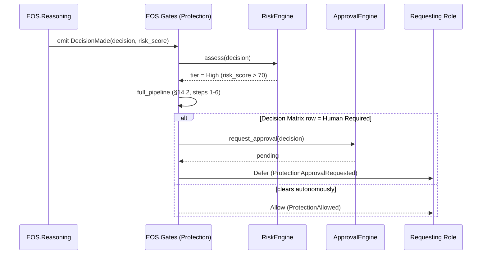
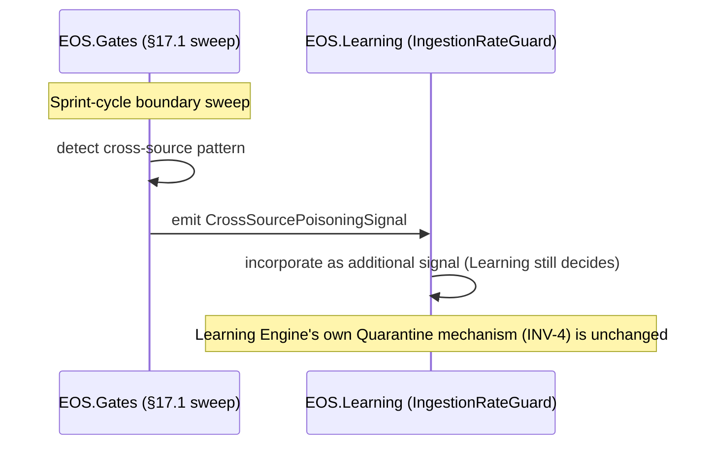
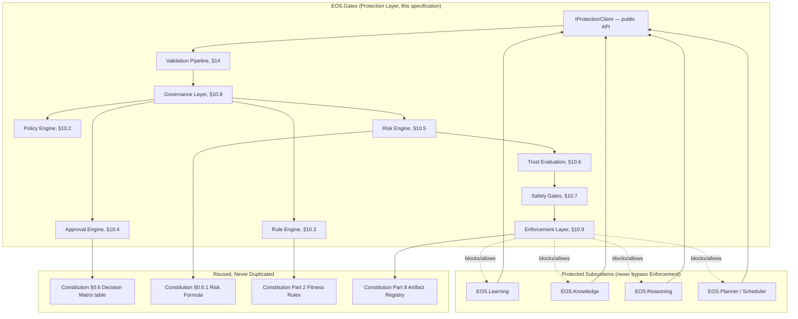

# Protection Layer Specification v1.0

**Document Type:** Complementary Engineering Specification
**Extends:** `@EOS-Specification.md` (the Constitution, immutable), and is a peer to `@Learning-Engine-Specification-v1.1.md`, `@Memory-Management-Specification-v1.0.md`, and `@Reasoning-Engine-Specification-v1.0.md` (all immutable, approved)
**Status:** Proposed
**Primary Constitutional Anchors:** §0.8 — Quality Gates (`EOS.Gates`) · §0.6 — Decision Matrix · §0.6.1 — Risk Scoring · §0.15 — Reality Validation · §0.2.3 — Authority Levels · Part 2 — Architecture Fitness Rules · Part 7 — Scheduler Budgets

This document does not redesign, fork, or duplicate any approved document. Unlike the Learning Engine and Reasoning Engine specifications — which each had to introduce a net-new project — the Protection Layer requires **no new project**. Constitution Part 1 already registers `EOS.Gates`, and Constitution §0.8 already states, in its opening line, that "Quality Gates (`EOS.Gates`) are the enforcement mechanism for the Constitution and NFR Framework" — a framing already broader than Task Lifecycle gating alone. This specification is the full implementation-level architecture of `EOS.Gates`, unifying Constitution §0.6 (Decision Matrix), §0.6.1 (Risk Scoring), §0.8 (Quality Gates), and §0.15 (Reality Validation) into one coherent, cross-cutting Protection Layer — exactly as the Learning Engine Specification detailed Part 14 and the Memory Management Specification detailed §0.5. It also formally closes every forward reference to "the forthcoming Protection Layer" left open by the three approved documents (catalogued in §6 and resolved throughout).

---

## 1. Executive Summary

The Protection Layer is the single cross-cutting subsystem that validates, gates, and governs every autonomous action in EOS — without owning the logic of the subsystems it protects. It unifies four Constitutional mechanisms that already existed but were scattered (Decision Matrix authority routing, §0.6; Risk Scoring, §0.6.1; Quality Gates, §0.8; Reality Validation, §0.15) into one architecture, and extends them to cover protection domains the Constitution named but never detailed: Knowledge, Memory, Reasoning, Learning, Planning, AI Providers, Local Files, Projects, Configuration, Resources, and System Settings. It never learns, remembers, plans, schedules, reasons, or performs inference — it only validates, scores risk, enforces policy, and gates execution, deferring to each domain's own internal ownership (Learning Engine's Quarantine, Memory's classification, Reasoning Engine's self-consistency check) rather than replacing any of it.

## 2. Purpose

To give another autonomous engineer a complete, implementation-independent Protection architecture precise enough to implement without judgment calls — and, critically, to resolve every open question the three approved documents explicitly left for "the forthcoming Protection Layer Specification" (§6 below catalogues and resolves each one).

## 3. Scope

In scope:
- A single, unified Validation Pipeline (§14) that every autonomous action passes through, at a depth proportional to its risk (resolving Reasoning-Engine-Specification-v1.0's Open Question 2 on synchronous vs. asynchronous gating, §20)
- Policy Framework (§12), Risk Assessment (§13), Permission Model (§15) architecture
- Protection domains (§11) for every subsystem named in the governing task
- Resolution of every "forthcoming Protection Layer" forward reference in the three approved documents (§6)

Out of scope (see Non-Goals §5, Non-Responsibilities §7):
- Any subsystem's own internal logic (Learning Engine's pipeline, Memory's storage, Reasoning Engine's pipeline, Planner/Scheduler's planning) — Protection wraps these, never replaces them
- Operating-system-level security (file permissions, OS user accounts, network firewalling) — explicitly forbidden by the governing task; "Local Files"/"System Settings" protection here means EOS's own governance over its configuration and workspace, not OS security
- AI model internals, prompt design, or inference computation — delegated to the AI Provider Layer (forthcoming) exactly as the Reasoning Engine Specification already scoped out

## 4. Goals

- Ensure no autonomous action in EOS executes without being validated at a depth appropriate to its risk (Architecture Rule: "every autonomous action must be validated").
- Ensure the Protection Layer itself never becomes a bottleneck (Architecture Rule) — achieved via the tiered validation depth model (§14.1) rather than a uniform heavyweight check on every action.
- Make every block explainable with a reason (Architecture Rule), every high-risk action explainable (Architecture Rule), and every executed action auditable (Architecture Rule).
- Keep Protection decisions deterministic whenever possible (Architecture Rule) — reusing existing deterministic mechanisms (rule/policy evaluation, Constitution §0.6.1's formula) rather than routing every gating decision through non-deterministic AI inference.
- Remain fully offline and independent of any specific AI provider (Architecture Rules).

## 5. Non-Goals

- The Protection Layer does not decide *what* the right engineering answer is (Reasoning Engine's job), *what* to learn from an occurrence (Learning Engine's job), *what* to remember or forget (Memory's job), or *what* to plan/schedule (Planner/Scheduler's job) — it only decides *whether an action may proceed, and under what conditions*.
- The Protection Layer does not recompute trust/confidence scores already owned elsewhere (Learning Engine's `trust_score`, Reasoning Engine's `confidence`/`get_trust_signal()`) — it consumes them as inputs to its own Risk Engine (§13) and Trust Evaluation (§10.6), never redefining them.
- The Protection Layer does not itself perform statistical or semantic judgment about whether specific content is poisoned/hallucinated at the record level — that remains Learning Engine's (`IngestionRateGuard`/`ConfidenceGuard`/`IntegrityChecker`) and Reasoning Engine's (Context Validation, §12.6 of that spec) job; the Protection Layer's Knowledge/AI Protection (§17, §19) operate at a policy and cross-cutting-pattern level above those, never duplicating the per-record mechanisms.

## 6. Responsibilities

The Protection Layer, and only the Protection Layer, owns:

1. Safety, Validation, Governance, Policy Enforcement, Permission Evaluation, Risk Assessment, Decision Approval, Architecture Rule Enforcement, Knowledge Protection, Memory Protection, Resource Protection, and Execution Protection (verbatim from the governing task) — detailed in §10–§20.
2. Formally resolving every "forthcoming Protection Layer" forward reference left open by the three approved documents:

| Forward Reference | Source | Resolution (this document) |
|---|---|---|
| Gating mechanics for `DecisionMade` (synchronous veto vs. async review) | Reasoning-Engine-Specification-v1.0 §15.4, Open Question 2 | Resolved by the tiered model, §14.1/§20 — risk-scored, not uniformly synchronous |
| Who sets the legal/compliance retention-hold flag | Memory-Management-Specification-v1.0 Open Question 1 | Resolved: a Project/Global Policy (§12.2/§12.1) evaluated by the Policy Engine (§10.2) sets it; Memory continues to only *honor* it (unchanged) |
| Statistical anomaly detection beyond Learning Engine's rate-based Quarantine (slow poisoning campaigns) | Learning-Engine-Specification-v1.1 §24.1 residual risk, Open Question 5 | Resolved: owned here as a cross-source, cross-cycle pattern-level check (§17.1) that *feeds a signal into* Learning Engine's existing Quarantine mechanism — Learning Engine still owns the Quarantine action itself (INV-4 unchanged) |
| Systematic Reasoning Engine bias evading corroboration-based hallucination defense | Learning-Engine-Specification-v1.1 §24.3 residual risk, Open Question 5 | Resolved: owned here as a longitudinal accuracy audit (§19.3) over Reasoning Engine's own KPI stream (Decision Accuracy, Reasoning-Engine-Specification-v1.0 §25) — Protection flags a drift, Reasoning Engine's own calibration remains Reasoning Engine's concern |
| Working Memory as a pre-Episodic poisoning vector | Memory-Management-Specification-v1.0 §32 Future Evolution | Resolved: out of scope for this version — Working/Short-term Memory are ephemeral and unindexed (Memory-Management-Specification-v1.0 §14), so Protection's Knowledge Protection (§17) applies only from Episodic Memory onward, matching where Learning Engine's own defenses already begin; flagged as a joint future revisit (§32) rather than solved unilaterally here |

## 7. Non-Responsibilities

| Capability | Actual Owner | Anchor |
|---|---|---|
| Meta Learning pipeline stage transitions, Quarantine action itself | Learning Engine | Learning-Engine-Specification-v1.1 §7 |
| Knowledge/memory storage, retrieval, ranking, consolidation, lifecycle | Memory | Memory-Management-Specification-v1.0 §4 |
| The 12-stage reasoning pipeline, decision content, explanation generation | Reasoning Engine | Reasoning-Engine-Specification-v1.0 §6 |
| Task/plan generation, resource budget allocation | Planner / Scheduler | Constitution §0.4, Part 7 |
| Raw model inference, provider selection | AI Architect / AI Provider Layer | Constitution §0.14, §0.2.1 |
| Trust/confidence score computation | Reasoning Engine (`get_trust_signal`), Learning Engine (consumption into `trust_score`) | Learning-Engine-Specification-v1.1 §24.4, Reasoning-Engine-Specification-v1.0 §16.1 |

**Rule (reaffirmed from the governing task):** "The Protection Layer owns Safety, Validation, Governance, Policy Enforcement, Permission Evaluation, Risk Assessment, Decision Approval, Architecture Rule Enforcement, Knowledge Protection, Memory Protection, Resource Protection, Execution Protection. It does NOT own Learning, Memory, Planning, Scheduling, Reasoning, AI inference." Any capability not explicitly listed in §6 defaults to *not* being the Protection Layer's responsibility.
## 8. Functional Requirements

| ID | Requirement |
|---|---|
| FR-P1 | The Protection Layer MUST validate every autonomous action at a depth proportional to its risk score (§13) — never uniformly, to satisfy the "never a bottleneck" Architecture Rule. |
| FR-P2 | No subsystem may bypass the Protection Layer for any action the Validation Pipeline (§14) classifies as requiring validation — enforced structurally (§10.9 Enforcement Layer), not by convention. |
| FR-P3 | Every blocked action MUST return a structured reason (§14, §26) — never a bare denial. |
| FR-P4 | Every executed action MUST produce an auditable record resolvable in the Artifact Registry (Constitution Part 8) — no second, parallel audit store (§9). |
| FR-P5 | Every high-risk action (risk score > 70, reusing Constitution §0.6.1's existing threshold verbatim) MUST be explainable — the Protection Layer's explanation reuses the acting subsystem's own explanation where one exists (e.g., Reasoning Engine's `Explanation`, Reasoning-Engine-Specification-v1.0 §14) rather than generating a competing one. |
| FR-P6 | The Protection Layer MUST NOT recompute any score already owned elsewhere (`trust_score`, `confidence`, `risk_score` as originally computed by the acting subsystem) — it consumes these as Risk Engine inputs (§10.5) and may apply its *own* policy-level weighting on top, but never silently overwrites the source score. |
| FR-P7 | Protection decisions MUST be deterministic whenever possible (Architecture Rule) — policy/rule evaluation (§10.2, §10.3) is implemented as deterministic logic; only Decision Approval routing that genuinely requires human judgment (Constitution §0.6) is exempt. |
| FR-P8 | The Protection Layer MUST remain independent of any specific AI provider (Architecture Rule) — its own Rule/Policy Engines never call an AI Provider for a gating decision; where semantic judgment is genuinely needed (e.g., assessing whether free-text content violates a policy), it delegates to the Reasoning Engine via `IReasoningEngineClient.reason()` (Reasoning-Engine-Specification-v1.0 §16.1) exactly like any other consumer, never embedding its own model call. |
| FR-P9 | The Protection Layer MUST support an Emergency Shutdown capability (§26) that halts new autonomous action dispatch platform-wide, reversible only by a human-authorized action (Constitution §0.2.3, L4). |
| FR-P10 | The Protection Layer MUST NOT alter the content of any Decision, Plan, Lesson, or Memory item it validates — it may only allow, deny, defer-for-approval, or request-retry (§20); mutation of content remains the owning subsystem's exclusive right. |

## 9. Non-Functional Requirements

| NFR Category | Requirement |
|---|---|
| Performance | See §28 — tiered validation depth (§14.1) keeps low-risk actions fast |
| Determinism | FR-P7; Rule/Policy Engine outcomes are reproducible given the same policy version and input |
| Auditability | FR-P4; every Protection decision resolves to an Artifact Registry entry (Constitution Part 8), no parallel store (avoids the Constitution's no-duplication rule, §0.1.1.5) |
| Offline-first | Fully offline; any semantic delegation (FR-P8) goes through the already-offline Reasoning Engine, never a direct external call |
| Non-bottleneck | FR-P1; validated via the Performance targets in §28 specifically differentiating tiers |
| Explainability | FR-P5; reuses existing explanation objects rather than duplicating explanation-generation logic |

## 10. Protection Architecture

### 10.1 Overview

```
                          ┌─────────────────────────────┐
  Any autonomous action ─►│      Validation Pipeline      │──► Allow / Deny / Defer / Retry (§20)
  (task, decision,        │           (§14)                │
   consolidation, plan,   └───────────────┬───────────────┘
   resource request, ...)                 │
                                           ▼
                    ┌──────────────────────────────────────────┐
                    │              Governance Layer (§10.8)      │
                    │  routes to the right engine below based on │
                    │  action type and risk tier                 │
                    └───────┬───────┬───────┬───────┬────────────┘
                            │       │       │       │
                    ┌───────▼──┐ ┌──▼────┐ ┌▼──────┐ ┌▼─────────────┐
                    │  Policy   │ │ Rule   │ │ Risk   │ │  Approval    │
                    │  Engine   │ │ Engine │ │ Engine │ │  Engine      │
                    │  (10.2)   │ │ (10.3) │ │ (10.5) │ │  (10.4)      │
                    └───────────┘ └────────┘ └───┬────┘ └──────┬───────┘
                                                  │             │
                                          ┌───────▼─────────────▼───────┐
                                          │   Trust Evaluation (10.6)     │
                                          │   (consumes, never recomputes,│
                                          │    trust_score/confidence)    │
                                          └───────────────┬───────────────┘
                                                           │
                                                  ┌────────▼────────┐
                                                  │  Safety Gates    │
                                                  │     (10.7)       │
                                                  └────────┬────────┘
                                                           │
                                                  ┌────────▼────────┐
                                                  │ Enforcement Layer│
                                                  │     (10.9)       │
                                                  │  (structural —   │
                                                  │  actually blocks/│
                                                  │  allows)         │
                                                  └─────────────────┘
```

All nine components below are internal to `EOS.Gates` (§1) — no new project.

### 10.2 Policy Engine

Evaluates an action against Policy Framework rules (§12) — Global, Project, User, Runtime, Emergency policies. Deterministic (FR-P7): given the same policy set and action, always produces the same allow/deny/defer verdict. Owns setting policy-driven flags consumed by other subsystems, including the legal/compliance retention-hold flag Memory only *honors* (Memory-Management-Specification-v1.0 §26, resolved in §6 above).

### 10.3 Rule Engine

Evaluates an action against structural rules — reusing, not duplicating, Constitution Part 2's Architecture Fitness Rules and §0.7's NFR thresholds. The Rule Engine is where Constitution §0.8's Universal Gates and Domain-Specific Gate Packs are actually executed; this specification is the detailed architecture behind the already-Constitutional statement "Quality Gates (`EOS.Gates`) are the enforcement mechanism" (§0.8).

### 10.4 Approval Engine

Implements Constitution §0.6's Decision Matrix routing mechanically: given a decision type and the current Authority Levels (§0.2.3) of available roles, determines whether an action may proceed autonomously, needs multi-role consensus, or needs human sign-off. This is the concrete architecture behind the Decision Matrix table (§0.6) — the table itself is unchanged; the Approval Engine is how it's actually executed at runtime.

### 10.5 Risk Engine

Computes or consumes a risk score (0–100) using Constitution §0.6.1's exact existing formula (blast radius, reversibility, data sensitivity, historical incident correlation) — never a competing formula. Where an acting subsystem has already computed its own `risk_score` (e.g., Reasoning Engine's `Decision.risk_score`, Reasoning-Engine-Specification-v1.0 §13.3), the Risk Engine consumes it directly (FR-P6) rather than recomputing; where no upstream risk score exists (e.g., a raw resource request), the Risk Engine computes one fresh using the same Constitutional formula.

### 10.6 Trust Evaluation

Distinct from, and never a duplicate of, Learning Engine's per-source `trust_score` (Learning-Engine-Specification-v1.1 §24.4) or Reasoning Engine's `get_trust_signal()` (Reasoning-Engine-Specification-v1.0 §16.1). Trust Evaluation here answers a narrower question for Permission Model purposes (§15): *given this actor's (role/subsystem's) track record of past Protection outcomes (approved/denied/retried), how much autonomous latitude does the Permission Model currently grant it?* It **consumes** `trust_score`/`confidence` as inputs where relevant (e.g., a Decision with low Reasoning Engine confidence lowers the actor's effective trust for this specific action) but computes its own, separate, Protection-scoped trust value — never overwriting or redefining the source signals.

### 10.7 Safety Gates

The pass/fail checkpoints an action must clear after Policy/Rule/Risk/Trust evaluation, before Enforcement. Safety Gates are *additional* to, never a replacement for, each subsystem's own internal gates (Learning Engine's ROI Gate remains entirely Learning Engine's own — Learning-Engine-Specification-v1.1 §11.3, unchanged and un-duplicated here).

### 10.8 Governance Layer

Routes an action to the correct combination of Policy/Rule/Risk/Approval engines based on action type (§11, Protection Domains) and computed risk tier (§13.1) — the single place where "what checks apply to this kind of action" is decided, keeping that routing logic out of every individual engine.

### 10.9 Enforcement Layer

The only component with actual structural power to block an action from proceeding (FR-P2). Every subsystem's public interface (`IKnowledgeClient`, `ILearningEnginePublicApi`, `IReasoningEngineClient`, Planner/Scheduler dispatch) is required to route through the Enforcement Layer's allow/deny/defer/retry verdict (§20) before acting — structurally, via the same dependency-injection composition root pattern (`EOS.Runner`, Constitution Part 1 §1.1) already used to wire every other cross-cutting concern, not by each subsystem "remembering" to call Protection.
## 11. Protection Domains

For every domain below, the table states what Protection checks (external, policy/risk-level) versus what remains owned internally (unchanged from the relevant approved document).

| Domain | Protection Checks (this document) | Remains Owned Internally |
|---|---|---|
| **Knowledge** | Policy-level content admissibility (e.g., banned categories), cross-source poisoning pattern detection above the per-record level (§17) | Per-record Quarantine/clustering/promotion — Learning Engine (Learning-Engine-Specification-v1.1 §7) |
| **Memory** | Retention-hold policy setting (§6), permission checks on `consolidate()`/`update()` calls, duplicate-consolidation policy enforcement (leveraging Memory's own idempotency precondition, Memory-Management-Specification-v1.0 §20.1) | Storage, retrieval, ranking, compression, expiration mechanics — Memory (Memory-Management-Specification-v1.0 §4) |
| **Reasoning** | Risk-based gating of `DecisionMade` (§6, §20), longitudinal accuracy drift audit (§19.3) | The 12-stage pipeline, decision content, explanation generation — Reasoning Engine (Reasoning-Engine-Specification-v1.0 §6) |
| **Learning** | Cross-cycle statistical signal feeding Learning's own Quarantine trigger (§6); Fitness Function violation escalation routing (Learning-Engine-Specification-v1.1 §22) | Pipeline stage transitions, ROI Gate, Fitness Functions themselves — Learning Engine |
| **Planning** | Resource-budget and policy compliance check on a generated plan before Scheduler dispatch | Task graph generation, prioritization — Planner (Constitution §0.4) |
| **AI Providers** | Policy enforcement that only approved, offline, provider-independent-compliant providers are used (Constitution §0.14) | Provider selection policy itself — AI Architect role |
| **Local Files** | Governance over which autonomous roles may read/write which repository paths (Constitution Part 1 solution structure) as an EOS-level policy, not OS permissions | Actual file I/O — whichever project performs the operation |
| **Projects** | Project Policy (§12.2) scoping — which domains/roles may act within a given project's `domain_tags` (Learning-Engine-Specification-v1.1 §9, Memory-Management-Specification-v1.0 §10.6) | Project content itself |
| **Configuration** | Approval routing for changes to `Thresholds.json`/`Security.json`/`FeatureFlags.json`/etc. (Constitution Part 10) — configuration changes are Decision-Matrix-routed (§0.6) actions like any other | The configuration values and their consumption — each owning subsystem |
| **Resources** | Hard ceiling enforcement for CPU/RAM/Disk/Model Usage/Context Size/Background Tasks (§16) | Budget *allocation* — Scheduler (Constitution Part 7) |
| **System Settings** | Approval routing for platform-wide settings changes (e.g., enabling/disabling a domain, Emergency Shutdown, §26) | N/A — this is Protection's own domain |

## 12. Policy Framework

### 12.1 Global Policies

Platform-wide rules that apply regardless of project/domain — e.g., "no autonomous action may disable Reality Validation (Constitution §0.15)," "no configuration change may remove a Universal Gate (§0.8.1)." Global Policies are the highest-precedence tier; no Project/User/Runtime policy may override one.

### 12.2 Project Policies

Scoped by `domain_tags` (Learning-Engine-Specification-v1.1 §9, Memory-Management-Specification-v1.0 §10.6) — e.g., a Mobile-domain project may have stricter Store Readiness gating (Constitution Part 15 §15.3) than a Backend-domain project. This is also where the legal/compliance retention-hold flag (Memory-Management-Specification-v1.0 Open Question 1, resolved §6) is set, scoped to whichever project's content it applies to.

### 12.3 User Policies

Preferences/constraints set by a human operator of the single-laptop EOS instance (e.g., "always require my approval for Production release," tightening beyond Constitution §0.6's default table) — User Policies may only *tighten*, never loosen, a Global Policy.

### 12.4 Runtime Policies

Time-bound or condition-bound policies (e.g., "during a Weekly Restore Drill, Constitution Part 13, pause new high-risk dispatch") — automatically expire per their declared condition, never requiring manual cleanup.

### 12.5 Emergency Policies

Activated only via Emergency Shutdown (§26) or a human L4-authorized override (Constitution §0.2.3) — the most restrictive tier, capable of halting all new autonomous dispatch platform-wide. Emergency Policies always take precedence over every other tier while active.

### 12.6 Precedence Order

```
Emergency Policies  (highest precedence, when active)
      ▼
Global Policies
      ▼
Project Policies
      ▼
User Policies       (may only tighten, never loosen, anything above)
      ▼
Runtime Policies    (narrowest scope, time/condition-bound)
```

All policy definitions are externally configurable (`Security.json`, `Thresholds.json`, Constitution Part 10) rather than hardcoded, consistent with the Constitution's existing configuration pattern.
## 13. Risk Assessment

### 13.1 Risk Levels

| Level | Score Range | Validation Depth (§14.1) |
|---|---|---|
| Low | 0–30 | Lightweight async validation only — logged, not blocking |
| Medium | 31–70 | Synchronous lightweight pre-check (permission + resource budget, §14.1) |
| High | 71–100 | Full synchronous Validation Pipeline + Decision Matrix approval routing (§10.4) |

The 70/71 boundary reuses Constitution §0.6.1's exact existing rule ("Score > 70 always escalates one tier") — not a new threshold invented here.

### 13.2 Risk Scoring

Computed (or consumed, FR-P6) per §10.5 using Constitution §0.6.1's formula unchanged: blast radius, reversibility, data sensitivity, historical incident correlation (pulled from the Knowledge Graph exactly as the Constitution already specifies).

### 13.3 Confidence Thresholds

The Protection Layer does not define new confidence semantics — it applies policy-level cutoffs (`Thresholds.json`) against confidence values already produced by Reasoning Engine (`Decision.confidence`, Reasoning-Engine-Specification-v1.0 §13.4) or Learning Engine (`clustering_confidence_minimum`, Learning-Engine-Specification-v1.1 §11.2). A Decision whose confidence falls below the Protection-configured cutoff is routed to Medium/High validation depth regardless of its self-reported risk score, closing a gap neither prior document could close on its own (each only knows its own confidence, not the platform-wide policy threshold).

### 13.4 Approval Thresholds

Directly derived from Constitution §0.6's Decision Matrix table and §0.2.3's Authority Levels — the Approval Engine (§10.4) does not invent new approval tiers, it executes the existing table.

### 13.5 Escalation Rules

- Risk score > 70 → escalates one validation tier (Constitution §0.6.1, reused verbatim).
- Confidence below the configured cutoff (§13.3) → escalates one validation tier regardless of risk score.
- Two consecutive Medium-tier denials for the same actor/action-type within one Sprint cycle (Constitution §0.12.1) → escalates all subsequent requests of that type from that actor to High tier until a Principal Engineer reviews (mirrors Learning-Engine-Specification-v1.1's Stall/Fitness sweep cadence pattern, applied to Protection's own escalation).

## 14. Validation Pipeline

### 14.1 Tiered Validation Depth (resolves Reasoning-Engine-Specification-v1.0 Open Question 2)

```
on validate(action):
    tier = RiskEngine.assess(action)          # §13.1
    if tier == Low:
        async_log(action)                     # never blocks; FR-P1, non-bottleneck
        return Allow
    if tier == Medium:
        result = quick_check(permission(action), resource_budget(action))  # §15, §16
        return result                          # fast synchronous check only
    if tier == High:
        return full_pipeline(action)           # all six steps below, synchronous
```

### 14.2 Full Pipeline (High tier only)

1. **Request Validation** — is the request well-formed and from an authorized actor (§15)?
2. **Context Validation** — for actions carrying a `ContextPayload` (Memory-Management-Specification-v1.0 §15.1) or `Explanation` (Reasoning-Engine-Specification-v1.0 §14), do referenced evidence items actually resolve (Constitution §0.1.1.1)? This is a *structural* recheck, not a re-derivation of Memory's or Reasoning's own validation (Memory-Management-Specification-v1.0 §25 reconciliation, Reasoning-Engine-Specification-v1.0 §10.1 self-consistency) — Protection trusts those internal checks already ran and only confirms the references are still resolvable at gate time.
3. **Knowledge Validation** — policy-level admissibility check (§17).
4. **Decision Validation** — **[explicit boundary, see ADR-P002]** distinct from Reasoning Engine's own Stage 12 (Reasoning-Engine-Specification-v1.0 §10.1, self-consistency only) — Protection's Decision Validation here is the safety/policy check Reasoning Engine's ADR-R003 explicitly deferred to Protection: is this specific decision, in this specific context, safe and policy-compliant to act on?
5. **Resource Validation** — does executing this action respect Resource Protection ceilings (§16)?
6. **Policy Validation** — final Policy Engine (§10.2) pass across all applicable Global/Project/User/Runtime/Emergency policies (§12).

Each step can independently deny; the pipeline short-circuits on first denial and returns the specific reason (FR-P3) rather than running all six unconditionally.

## 15. Permission Model

### 15.1 User Permissions

The human operator's own action space — always able to override an autonomous Deny (subject to Constitution §0.6's human-required rows), never itself subject to Protection Layer denial.

### 15.2 AI Permissions

What the underlying AI Provider (via Reasoning Engine, §15.6 of that spec) is permitted to influence — strictly limited to producing `Decision`/`Summary`/`ConfidenceGuardResult` content; an AI Provider response can never itself grant a permission or bypass a Safety Gate (§10.7) — permission-granting is Protection's exclusive act, never delegated to inference output.

### 15.3 Autonomous Permissions

Per Constitution §0.2.3's Authority Levels (L1–L4) — the Permission Model is the concrete enforcement of that existing table, not a new authority scheme. Combined with Trust Evaluation (§10.6), an L1 actor with a strong recent track record may still be granted a narrow additional autonomous permission for a specific, low-risk, previously-approved action *type* — but never beyond what L1's ceiling in §0.2.3 already allows structurally.

### 15.4 Manual Approval

Triggered whenever the Approval Engine (§10.4) resolves an action to a "Human Required" row in Constitution §0.6's table, or whenever Escalation Rules (§13.5) force it regardless of the table's default.

### 15.5 Automatic Approval

Applies to Low-tier (§13.1) and successfully-validated Medium-tier actions — logged and auditable (FR-P4) but not held for human review, keeping the "never a bottleneck" Architecture Rule intact for the large majority of routine, low-risk EOS activity.
## 16. Resource Protection

| Resource | Protection Mechanism |
|---|---|
| CPU | Hard ceiling check against Scheduler's CPU Budget (Constitution Part 7 §7.2) before dispatch; Protection does not allocate the budget (Scheduler's job), only refuses to let an action exceed it |
| RAM | Same pattern as CPU, against Scheduler's RAM Budget |
| Disk | Ceiling check against remaining NVMe capacity (governing prompt's 477GB target) before any operation that writes durable data (e.g., Memory consolidation, Artifact Registry writes) |
| GPU (future) | Not applicable on the current target hardware (i7-1065G7, no dedicated GPU budget in Constitution Part 7) — flagged for future extension (§32) if hardware changes |
| Model Usage | Ceiling check against Inference Budget (Constitution Part 7 §7.2) — every call into `IAIProviderClient` (Reasoning-Engine-Specification-v1.0 §16.2) is subject to this check before dispatch |
| Context Size | Enforces the same caller-specified budget Memory's Context Assembly already respects (Memory-Management-Specification-v1.0 FR-M5) — Protection's role is to confirm the budget itself doesn't exceed a platform-wide ceiling, not to re-implement truncation (Memory's job) |
| Background Tasks | Ceiling on concurrent Sprint-cycle-boundary sweeps (Learning Engine's Stall/Fitness/Integrity sweeps, Memory's Compression/Reconciliation sweeps) running simultaneously, to respect the thermal-awareness posture both approved documents already establish (Learning-Engine-Specification-v1.1 §30, Memory-Management-Specification-v1.0 §28) |

Resource Protection is a **ceiling enforcement** function only — it never decides how much budget to allocate in the first place (Scheduler's exclusive job, Constitution Part 7) or which specific task gets priority (Planner's job, §0.4).

## 17. Knowledge Protection

Protecting against, at the **policy and cross-cutting-pattern level** (never duplicating Learning Engine's own per-record defenses, Learning-Engine-Specification-v1.1 §24):

- **Knowledge Poisoning** — §17.1 below (cross-source statistical pattern detection, resolving Learning Engine's Open Question 5).
- **Invalid Knowledge** — policy-level admissibility (e.g., a Lesson referencing a non-existent evidence ref is denied at Context Validation, §14.2 step 2).
- **Low Confidence Knowledge** — Confidence Threshold policy (§13.3) escalates validation tier; Protection never itself judges *why* confidence is low (that remains Reasoning/Learning's diagnostic territory).
- **Contradictory Knowledge** — where Reasoning Engine's own Conflicting Evidence failure mode (Reasoning-Engine-Specification-v1.0 §21) already surfaces a conflict, Protection's Knowledge Validation (§14.2 step 3) confirms the conflict was honestly disclosed in the Decision's `Explanation.risks` (Reasoning-Engine-Specification-v1.0 §14) rather than silently resolved — a policy compliance check, not a re-adjudication of which side is right.
- **Unverified Knowledge** — Reality Validation (Constitution §0.15) already requires resolvable evidence before `TaskCompleted`/`CompetencyProven`; Protection's role is enforcing that this Constitutional requirement was actually satisfied at gate time (§14.2 step 2), formalizing what was previously only a Constitutional principle into an enforced Safety Gate (§10.7).

### 17.1 Cross-Source Poisoning Pattern Detection (resolves Learning-Engine-Specification-v1.1 Open Question 5, first half)

A Sprint-cycle-boundary sweep (mirroring the cadence Learning Engine already establishes, Learning-Engine-Specification-v1.1 §22) that looks for patterns *across* multiple sources/roles that no single source's rate-based check (`IngestionRateGuard`, Learning-Engine-Specification-v1.1 §11.1) could see alone — e.g., several distinct roles simultaneously producing suspiciously similar Lessons, which might evade a per-role rate ceiling. On detection, Protection emits a signal event (§21) that Learning Engine's own `IngestionRateGuard`/Quarantine mechanism consumes as an *additional* input — Learning Engine still makes and owns the actual Quarantine decision (INV-4, unchanged); Protection only supplies a signal its own cross-cutting vantage point can see that Learning Engine's per-record view cannot.

## 18. Memory Protection

Protecting against, again at the policy/cross-cutting level:

- **Memory Corruption** — Protection's Context Validation (§14.2 step 2) re-confirms `TransitionRecord`/evidence resolvability at gate time; the actual detection mechanism (`IntegrityChecker`, Learning-Engine-Specification-v1.1 §11.6) remains Learning Engine's own, and Memory's own reconciliation sweep (Memory-Management-Specification-v1.0 §25) remains Memory's own — Protection does not re-implement either.
- **Invalid Retrieval** — a permission check (§15) confirming the requesting actor is authorized to query the requested `domain_tags`/project scope before Memory's `assemble_context()` proceeds — Protection never touches the retrieval mechanics themselves (Memory's exclusive job, Memory-Management-Specification-v1.0 §13).
- **Unauthorized Modification** — every `IKnowledgeClient.update()`/`consolidate()` call is subject to the Permission Model (§15) before it reaches Memory — this is the concrete mechanism behind Memory-Management-Specification-v1.0 §26's statement that "`IKnowledgeClient` access control mirrors the existing Constitution §0.5.2 posture," now formalized as an actual Protection gate rather than an assumed posture.
- **Context Pollution** — Protection's Resource Validation (§14.2 step 5) confirms a requested Context Size (§16) is within policy before Memory's Context Assembly proceeds, preventing a single request from crowding out legitimate context for others — a ceiling check, not a content-relevance judgment (which remains Memory's Retrieval Ranking, Memory-Management-Specification-v1.0 §19).
- **Duplicate Memory** — Protection's Validation Pipeline confirms Memory's own idempotency precondition (`source.status != already_consolidated`, Memory-Management-Specification-v1.0 §20.1) was actually checked before proceeding — enforcing that Memory's existing contract is honored, not re-implementing deduplication logic itself.

## 19. AI Protection

- **Prompt Injection** — as Reasoning-Engine-Specification-v1.0 §22 already states, primary responsibility sits with the forthcoming AI Provider Layer; Protection's contribution is a policy check that inference requests routed through `IAIProviderClient` (Reasoning-Engine-Specification-v1.0 §16.2) originate only from `EOS.Reasoning` itself (§15.6 of that spec) — no other subsystem may call the AI Provider Layer directly, closing off a class of injection surface structurally (Enforcement Layer, §10.9) rather than semantically.
- **Context Injection** — Protection's Context Validation (§14.2 step 2) treats all `ContextPayload` content as untrusted data per Reasoning-Engine-Specification-v1.0 §22's own stated posture — Protection's addition is confirming, structurally, that no context item ever gets routed into a control-flow-affecting parameter of any subsystem's API (a data/control separation check, not a content-semantic one).
- **Hallucinations** — Reasoning Engine's own honesty mechanisms (mandatory evidence, honest `assumptions`, honest `reproducible` flag — Reasoning-Engine-Specification-v1.0 §22) remain the primary defense; Protection's Decision Validation (§14.2 step 4) additionally confirms a Decision's confidence clears the platform policy cutoff (§13.3) before being actionable, and the longitudinal audit (§19.3) catches systematic drift no single Decision's self-check could reveal.
- **Unsafe Recommendations** — exactly what Protection's Decision Validation (§14.2 step 4) exists for (ADR-P002) — the safety/policy judgment Reasoning Engine's ADR-R003 explicitly deferred here.
- **Invalid Outputs** — structural schema validation that a `Decision`/`Summary`/`ConfidenceGuardResult` returned by Reasoning Engine actually conforms to its published shape (Reasoning-Engine-Specification-v1.0 §13.3/§16.1) before any consumer acts on it — a structural check, never a content-quality judgment.
- **Runaway Reasoning** — Resource Protection's Model Usage ceiling (§16) bounds total inference consumption per request/actor/cycle; a request exceeding its inference budget is denied/retried (§20) rather than allowed to consume unbounded compute, directly enforcing Reasoning-Engine-Specification-v1.0 §23's performance targets as hard ceilings rather than aspirational targets.

### 19.3 Longitudinal Reasoning Accuracy Audit (resolves Learning-Engine-Specification-v1.1 Open Question 5, second half)

A Quarterly-cycle (Constitution §0.12.1) audit comparing Reasoning Engine's own Decision Accuracy KPI (Reasoning-Engine-Specification-v1.0 §25) against Confidence Accuracy (same section) over time. A sustained divergence (high-confidence Decisions proving wrong more often than their confidence would predict) is flagged as a `ReasoningDriftDetected` signal (§21) — Protection surfaces the drift; recalibrating the Reasoning Engine's own confidence computation (§10, Stage 10 of that spec) remains entirely the Reasoning Engine's — and, ultimately, the AI Provider Layer's model-calibration — responsibility, never Protection's to fix directly.

## 20. Autonomous Execution Protection

The Enforcement Layer's (§10.9) four possible verdicts for any validated action:

| Verdict | When | What Happens |
|---|---|---|
| **Execute** | Low tier, or Medium/High tier cleared all applicable checks (§14) | Action proceeds; logged for audit (FR-P4) |
| **Reject** | Any Validation Pipeline step denies (§14.2) | Action does not proceed; structured reason returned (FR-P3); `ProtectionDenied` event emitted (§21) |
| **Request Approval** | Approval Engine (§10.4) resolves to a "Human Required" row (Constitution §0.6) or an Escalation Rule fires (§13.5) | Action held pending human/role response; times out per policy (`Thresholds.json`) to a default-deny if unanswered, never a default-allow |
| **Retry** | A transient failure occurred in validation itself (e.g., Resource Validation's budget-check service was momentarily unavailable) | Re-attempted per Constitution Part 5 §5.3 retry policy — never silently treated as an allow |
| **Rollback** *(distinct from the four verdicts above — a post-hoc action)* | An already-executed action is later found, via the Longitudinal Audit (§19.3) or a `DataIntegrityViolationDetected`-equivalent signal, to have been wrongly allowed | Protection emits a `RollbackRequested` event (§21) directed at the owning subsystem (e.g., Learning Engine's own Demotion mechanism, Learning-Engine-Specification-v1.1 §16) — Protection requests, the owning subsystem executes the actual rollback, preserving "Protection never mutates content directly" (FR-P10) |
## 21. Event Model

Extending Constitution Part 3's Event Catalog under its existing envelope/versioning discipline (Part 3 §3.2). No existing event redefined.

| Event | Producer | Consumers | Payload |
|---|---|---|---|
| `ProtectionAllowed` *(new)* | EOS.Gates (Protection Layer) | Dashboard (audit trail) | action_id, tier, actor |
| `ProtectionDenied` *(new)* | EOS.Gates | Acting subsystem, Dashboard | action_id, reason, denying_step (§14.2) |
| `ProtectionApprovalRequested` *(new)* | EOS.Gates | Human/role approval queue, Dashboard | action_id, decision_matrix_row |
| `ProtectionApprovalTimedOut` *(new)* | EOS.Gates | Dashboard | action_id, default_outcome=deny |
| `CrossSourcePoisoningSignal` *(new)* | EOS.Gates (§17.1) | Learning Engine (`IngestionRateGuard`) | affected_records[], pattern_description |
| `ReasoningDriftDetected` *(new)* | EOS.Gates (§19.3) | Reasoning Engine, Dashboard | period, decision_accuracy, confidence_accuracy, deviation |
| `RollbackRequested` *(new)* | EOS.Gates (§20) | Owning subsystem (Learning Engine, Memory, etc.) | action_id, owning_subsystem, reason |
| `EmergencyShutdownActivated` *(new)* | EOS.Gates (§26) | All subsystems, Dashboard | activated_by, reason |
| `EmergencyShutdownCleared` *(new)* | EOS.Gates | All subsystems, Dashboard | cleared_by, justification |

### 21.1 Consumed Events

- `DecisionMade` (Reasoning-Engine-Specification-v1.0 §17) — triggers Decision Validation (§14.2 step 4) for High-tier decisions.
- `FitnessFunctionViolated`, `LessonQuarantined`, `DataIntegrityViolationDetected` (Learning-Engine-Specification-v1.1 §15) — inputs to the Governance Layer's routing (§10.8) and the Escalation Rules (§13.5).
- `KnowledgeUpdated`, `LessonLearned` (Constitution Part 3, Memory-Management-Specification-v1.0 §21) — inputs to Knowledge Validation (§14.2 step 3).
- `TaskBlocked`, `IncidentDetected` (Constitution Part 3) — inputs to the Risk Engine's historical incident correlation factor (Constitution §0.6.1, reused).

## 22. State Model

Protection is **stateless per-action**, mirroring the Reasoning Engine's own stateless posture (Reasoning-Engine-Specification-v1.0 §18) — no `ValidationRequest` carries state into an unrelated future request. The only state that persists across actions is:

1. **Policy state** (§12) — versioned configuration, not per-action state.
2. **Escalation state** (§13.5) — a small, bounded per-actor/per-action-type counter (e.g., "2 consecutive Medium-tier denials"), reset on the next successful Principal Engineer review, never growing unbounded.
3. **Emergency Shutdown state** (§26) — a single platform-wide flag, off by default, settable only via an L4-authorized action.

```
Per-action lifecycle:
Received → Tiered (§13.1) → [Low: async-logged] | [Medium: quick-checked] | [High: full-pipelined]
    → Allow | Deny | Defer-for-Approval → (if Deferred) Approved | Denied-by-timeout
    → (post-hoc, rare) Rollback-Requested
```

## 23. Interfaces

Responsibilities only — no implementation.

### 23.1 `IProtectionClient` (public, consumed by every other subsystem's Enforcement-Layer integration point)

```
IProtectionClient

    ValidationResult validate(ActionRequest action)
        Responsibility: run the tiered Validation Pipeline (§14.1) and return Allow/Deny/Defer/Retry (§20).

    ApprovalStatus check_approval(string action_id)
        Responsibility: poll the status of a Deferred action (§20) — read-only.

    void report_outcome(string action_id, OutcomeReport report)
        Responsibility: allow an acting subsystem to report the eventual real-world outcome of an
        allowed action, feeding the Longitudinal Audit (§19.3) and Trust Evaluation (§10.6) — write-only
        append, never a query into another subsystem's internal state.
```

### 23.2 Consumed Interfaces (unchanged, ratified as consumed exactly as already specified)

- `IReasoningEngineClient.reason()` — Reasoning-Engine-Specification-v1.0 §16.1, consumed only for genuine semantic policy judgments (FR-P8), e.g., "does this free-text content violate policy X" — never for the gating decision itself, which remains deterministic (§10.2/§10.3).
- `IKnowledgeClient.query()` — Memory-Management-Specification-v1.0 §20.1, consumed read-only for Context Validation (§14.2 step 2) evidence resolvability checks.

## 24. Sequence Diagrams (Mermaid)

### 24.1 High-Tier Decision Gating (resolves Reasoning-Engine-Specification-v1.0 Open Question 2)



### 24.2 Cross-Source Poisoning Signal (resolves Learning Engine Open Question 5)



## 25. Component Diagram (Mermaid)


## 26. Failure Handling

| Failure | Handling |
|---|---|
| **Policy Failure** (a policy definition itself is malformed/unloadable) | Fail-closed — default to the most restrictive applicable tier (High) until the policy is fixed; never fail-open to unrestricted allow |
| **Validation Failure** (an internal Validation Pipeline step errors) | Treated as `Retry` (§20) per Constitution Part 5 §5.3, up to a configured attempt ceiling, then fails closed (Deny) |
| **Rule Conflict** (two applicable rules/policies disagree) | Resolved by the Precedence Order (§12.6) — Emergency > Global > Project > User > Runtime; a conflict within the same tier is resolved to the more restrictive outcome (Deny over Allow), never averaged or guessed |
| **Permission Failure** (actor's Authority Level, §0.2.3, doesn't match the resolved Decision Matrix row) | Deny with reason citing the specific row (FR-P3) |
| **Trust Failure** (Trust Evaluation, §10.6, computes a value below a configured floor for this actor/action-type) | Escalates one validation tier (mirrors §13.5's Escalation Rules), does not itself deny — trust is an input to tiering, not an automatic denial |
| **Resource Exhaustion** | Deny with `Retry` guidance once budget is available (§16); never silently queues indefinitely — a bounded wait per `Thresholds.json`, then explicit denial |
| **Emergency Shutdown** | See §26.1 below |

### 26.1 Emergency Shutdown

Activated (FR-P9) when: a Rule Conflict cannot be resolved even by Precedence Order (a genuine policy-authoring defect), a `ReasoningDriftDetected` (§19.3) or `CrossSourcePoisoningSignal` (§17.1) exceeds a critical severity threshold, or a human L4-authorized action requests it directly (Constitution §0.2.3).

**Effect:** all new autonomous action dispatch platform-wide is held at the `Defer` verdict (§20) — already-in-flight, already-`Allow`ed actions are not forcibly aborted (avoiding a worse failure mode than the one being protected against), but nothing new starts.

**Clearing:** requires an explicit L4-authorized `EmergencyShutdownCleared` action with a recorded justification (Artifact Registry, Constitution Part 8) — never automatic/time-based, consistent with FR-P9's "reversible only by a human-authorized action."

## 27. Security Considerations

- The Protection Layer holds no secrets of its own beyond policy configuration (`Security.json`, Constitution Part 10), which it reads, never writes without going through the same Configuration Protection domain rules it enforces on everyone else (§11) — Protection is subject to its own governance, not exempt from it.
- Structural bypass prevention (FR-P2, §10.9) is the primary security property of this specification — every public interface across `EOS.Learning`, `EOS.Knowledge`, `EOS.Reasoning`, Planner/Scheduler is wired through the Enforcement Layer at the composition root (`EOS.Runner`, Constitution Part 1 §1.1), not left to each subsystem's discretion to call Protection or not.
- The Protection Layer's own decisions are themselves auditable (FR-P4) and subject to the Longitudinal Audit pattern (§19.3, generalized) — Protection is not a black box exempt from the same evidence-over-assertion principle (Constitution §0.1.1.1) it enforces on others.
- Because Protection never calls an AI Provider directly for the gating decision itself (FR-P8, §10.2/§10.3 determinism), the majority of its attack surface is policy-configuration tampering, not model manipulation — which is why Configuration Protection (§11) routes policy changes through the same Decision-Matrix-governed Approval Engine (§10.4) as any other high-risk action.

## 28. Performance Considerations

Target hardware: Ubuntu, Intel i7-1065G7, 32GB RAM, offline, local execution only (unchanged target from all three prior specifications).

| Tier / Operation | Target |
|---|---|
| Low-tier async logging (§14.1) | Non-blocking; does not add latency to the acting subsystem's own operation |
| Medium-tier quick check (permission + resource budget, §14.1) | < 50ms |
| High-tier full pipeline (§14.2, all six steps, excluding any semantic delegation to Reasoning Engine) | < 500ms |
| High-tier full pipeline including one `IReasoningEngineClient.reason()` delegation (FR-P8) | Bounded by Reasoning Engine's own complex-type target (< 5s excluding inference, Reasoning-Engine-Specification-v1.0 §23) — Protection adds no additional multiplier on top |
| Emergency Shutdown activation (§26.1) | < 1s to take effect platform-wide (new dispatch halted) |

**Non-bottleneck guarantee:** because the overwhelming majority of routine EOS activity is expected to fall in the Low tier (§13.1) given the single-developer-laptop deployment context, the tiered model (§14.1) ensures Protection's aggregate overhead stays small relative to total system throughput — the Architecture Rule "never become a bottleneck" is satisfied structurally by tiering, not by making every check individually fast.

**CPU/RAM/Offline:** Rule/Policy Engine evaluation is pure CPU work with no inference cost; only the rare High-tier semantic delegation (FR-P8) consumes Inference Budget (Constitution Part 7 §7.2), and that consumption is itself subject to Protection's own Model Usage ceiling (§16) — Protection governs its own resource use under the same rules it applies to everyone else.

## 29. Architecture Decision Records

### ADR-P001

**Title:** Protection Layer Is the Full Architecture of `EOS.Gates`, Requiring No New Project

**Status:** Proposed

**Context:** Constitution Part 1 already registers `EOS.Gates`, and §0.8 already states it is "the enforcement mechanism for the Constitution and NFR Framework" — a framing already broader than Task-Lifecycle gating alone. The governing task's much-expanded Protection scope (Knowledge/Memory/Reasoning/Learning/Resource/Permission protection) could be read as requiring an entirely new project, as `EOS.Learning` and `EOS.Reasoning` each did.

**Decision:** Treat this specification as the full detailed architecture of `EOS.Gates`, extending its Constitutional description rather than introducing a sibling project.

**Alternatives Considered:**
- Introduce a new `EOS.Protection` project — rejected because Constitution §0.8's own framing already anticipates a broader enforcement role for `EOS.Gates`, and introducing a second enforcement project alongside it would immediately create the exact "no subsystem may bypass the Protection Layer" ownership ambiguity this specification exists to prevent (which of the two would be authoritative?).

**Trade-offs:** `EOS.Gates`'s one-line Part 1 description ("Quality Gates engine + Fitness Rules") is now a significant understatement of its actual scope — flagged as an Open Question (§33) recommending a description-only update via Architecture Evolution (Constitution §0.10), not a new registration.

**Consequences:** No dependency-shape change to Constitution Part 1/Part 2 is required by this specification alone; only a documentation-level update is recommended.

**Future Impact:** Establishes that a "management/protection specification" for an already-registered project is a detailing-and-scope-clarification exercise, consistent with the precedent Memory-Management-Specification-v1.0 ADR-M001 set for `EOS.Knowledge`.

**Related EOS Sections:** Constitution §0.8, Part 1, Part 2, §0.10; this document §1, §6.

### ADR-P002

**Title:** Protection's "Decision Validation" (§14.2 step 4) Is Exactly the Safety/Policy Check Reasoning Engine's ADR-R003 Deferred Here

**Status:** Accepted

**Context:** Reasoning-Engine-Specification-v1.0 ADR-R003 explicitly scoped its own Stage 12 ("Decision Validation") to self-consistency only, deferring the actual safety/policy judgment to "the forthcoming Protection Layer." This specification's own required section list also names a "Decision Validation" step (§14.2 step 4) — the two must not be confused with each other despite sharing a name.

**Decision:** Protection's Decision Validation (§14.2 step 4) is precisely and only the safety/policy judgment Reasoning Engine's ADR-R003 deferred — "is this specific decision, in this specific context, safe and policy-compliant to act on." Reasoning Engine's own Stage 12 remains entirely self-consistency (evidence resolves, confidence computed, alternative considered) and is unchanged by this decision.

**Alternatives Considered:**
- Rename Protection's step to avoid the name collision entirely (e.g., "Safety Review") — considered, but the governing task's own required section list uses "Decision Validation" verbatim; renaming would create a documentation mismatch against this specification's own mandated outline. Resolved instead by explicit cross-referencing (this ADR) rather than renaming.

**Trade-offs:** Two same-named-but-differently-scoped concepts exist across two documents — mitigated by this ADR's explicit cross-reference and by §14.2 step 4's inline citation of ADR-R003.

**Consequences:** Any future reader must consult both this ADR and Reasoning-Engine-Specification-v1.0 ADR-R003 together to fully understand the "Decision Validation" boundary — flagged, not hidden.

**Future Impact:** Establishes the precedent that shared terminology across sibling specifications must be explicitly cross-referenced via ADR when a name collision is unavoidable, rather than silently assumed to mean the same thing.

**Related EOS Sections:** Reasoning-Engine-Specification-v1.0 §10.1, ADR-R003; this document §14.2 step 4, §19.

### ADR-P003

**Title:** Tiered Validation Depth, Not Uniform Synchronous Gating (Resolves Reasoning Engine Open Question 2)

**Status:** Proposed

**Context:** Reasoning-Engine-Specification-v1.0 §15.4 left open whether Protection's gating of `DecisionMade` would be synchronous veto or asynchronous post-hoc review — and the governing task's Architecture Rules require both that "every autonomous action must be validated" and that "the Protection Layer must never become a bottleneck," which are in tension if read as requiring uniform synchronous validation of everything.

**Decision:** Resolve via the three-tier model (§13.1/§14.1): Low-risk actions validated asynchronously (never blocking), Medium-risk via a fast synchronous check, High-risk via the full synchronous pipeline with potential human approval.

**Alternatives Considered:**
- Uniform synchronous validation of every action — rejected as directly violating the "never a bottleneck" rule for the large volume of routine, low-risk EOS activity expected on a single-developer-laptop deployment.
- Uniform asynchronous (post-hoc only) validation — rejected as violating "every autonomous action must be validated" in any meaningful preventive sense for genuinely high-risk actions, where post-hoc review is too late to prevent harm.

**Trade-offs:** Adds the complexity of a tiering/escalation model (§13) instead of one simple rule — accepted as necessary to satisfy both Architecture Rules simultaneously rather than sacrificing one for the other.

**Consequences:** Risk scoring accuracy (Constitution §0.6.1's existing formula) becomes load-bearing for the whole Protection Layer's effectiveness — an inaccurate risk score could misclassify a genuinely dangerous action as Low tier. Mitigated by the Escalation Rules (§13.5) providing a second chance to catch misclassification via confidence thresholds and repeated-denial patterns.

**Future Impact:** Establishes tiered validation depth as the standing pattern for any future cross-cutting concern that faces the same "validate everything" vs. "never bottleneck" tension.

**Related EOS Sections:** Reasoning-Engine-Specification-v1.0 §15.4, Open Question 2; Constitution §0.6.1; this document §13, §14.
## 30. KPIs

| KPI | Formula Source |
|---|---|
| Blocked Unsafe Requests | Count of `ProtectionDenied` events per Sprint cycle (Constitution §0.12.1), broken out by denying step (§14.2) |
| False Positive Rate | Denied actions later confirmed safe on Principal Engineer review / total denials |
| False Negative Rate | Allowed actions later flagged via Rollback Requested (§20) or Longitudinal Audit (§19.3) / total allowed actions |
| Average Validation Time | Mean wall-clock time per tier (§13.1), tracked separately — a blended average across tiers would hide whether the "never a bottleneck" goal (ADR-P003) is actually being met at the High tier specifically |
| Policy Coverage | % of Protection Domains (§11) with at least one active policy defined in `Security.json`/`Thresholds.json` — a domain with zero policies is a coverage gap, not silently assumed safe |
| Trust Accuracy | Correlation between Trust Evaluation's (§10.6) granted latitude and actual subsequent outcome quality (via `report_outcome()`, §23.1) |
| Resource Protection Accuracy | % of Resource Validation denials (§14.2 step 5) that correctly predicted an actual budget breach, vs. over-conservative false denials |
| Approval Accuracy | % of human/role approvals (§15.4) that, in hindsight, matched what an idealized reviewer would have decided — sampled, not exhaustive, per Quarterly cycle |

## 31. Risks

| Risk | Likelihood | Impact | Mitigation |
|---|---|---|---|
| Risk-tier misclassification (an actually-dangerous action scored as Low tier) undermines the entire tiered model | Low-Medium | High | Escalation Rules (§13.5) provide a second-chance catch via confidence thresholds and repeated-denial patterns; ADR-P003 documents this as an accepted, mitigated trade-off rather than an unaddressed gap |
| Policy configuration drift (policies grow stale relative to actual system behavior) | Medium | Medium | Policy Coverage KPI (§30) surfaces gaps; Quarterly cycle review (Constitution §0.12.1) is the standing recalibration point, mirroring the pattern both prior documents already established for their own thresholds |
| Approval fatigue (too many Human Required escalations erode reviewer attention) | Medium | Medium | Mirrors Learning-Engine-Specification-v1.1 §24.7's exact concern and mitigation pattern — tracked via False Positive Rate (§30); a rising rate signals threshold recalibration, not more escalation |
| `EOS.Gates`'s expanded scope (ADR-P001) makes it a large, complex single project | Medium | Medium | Internal component separation (§10.1's nine components) keeps responsibilities cleanly divided even within one project, mirroring how `EOS.Learning`'s internals (Learning-Engine-Specification-v1.1 §8) are similarly subdivided within one project |
| Emergency Shutdown (§26.1) is invoked too readily, halting legitimate autonomous work | Low | High | Activation criteria are explicit and narrow (§26.1); clearing requires L4 authorization with recorded justification — asymmetric friction (easy narrow triggers, deliberate clearing) is intentional given the higher cost of a missed genuine emergency |

## 32. Future Evolution

- Once the AI Provider Layer Specification exists, FR-P8's delegation boundary (Protection calling `IReasoningEngineClient.reason()` for semantic policy judgments) should be revisited to confirm no direct Protection-to-AI-Provider coupling was accidentally introduced.
- The Working-Memory-as-poisoning-vector question (§6, deferred from Memory-Management-Specification-v1.0 §32) should be jointly revisited once real usage patterns exist to evaluate whether ephemeral memory genuinely needs protection coverage or whether its short lifetime already makes it low-risk by construction.
- GPU resource protection (§16) is explicitly out of scope for the current hardware target and should be added if/when the deployment target changes.
- Domain-specific policy defaults (e.g., stricter Mobile-domain Store Readiness policies vs. Backend-domain defaults, mirroring Constitution Part 15's domain-equality principle and the parallel flags both Learning Engine and Reasoning Engine specifications raised for their own domain-specific tuning) is a plausible refinement, flagged rather than designed here.

## Open Questions

1. `EOS.Gates`'s Part 1 description update (ADR-P001) — recommend an Architecture Evolution (Constitution §0.10) documentation-only ADR, not a new project registration. **Resolved:** description updated in `EOS-Specification.md` Part 1 §1.1 to reference Protection Layer, per EOS-System-Architecture-Specification-v1.0 ADR-SYS001, during the pre-implementation documentation synchronization pass.
2. GPU resource protection (§16, §32) — deferred until the hardware target changes.
3. Working Memory poisoning-vector question (§6) — deferred pending real usage data, joint revisit with Memory Management.
4. Whether Approval Accuracy (§30) sampling methodology needs its own dedicated specification once real approval volume exists — flagged, not designed here.

---

## Architecture Review & Audit

### Phase 1 — Self-Review Findings

- **Governance gap identified:** an early draft left "who sets the retention-hold flag" (Memory's Open Question) unresolved, merely repeating that it was "forthcoming." **Resolved** by explicitly assigning it to the Policy Engine (§6, §10.2, §12.2), closing the loop rather than perpetuating the forward reference.
- **Missing section identified:** the initial pass had no mechanism for *un-doing* an already-allowed action later found to be wrong — only allow/deny/defer/retry. **Resolved** by adding Rollback as a distinct, post-hoc verdict (§20) that requests rather than performs the actual correction, preserving FR-P10.
- **Security gap identified:** an early draft did not address how Protection prevents itself from being bypassed structurally, only stating "no subsystem may bypass" as a rule. **Resolved** by tying enforcement to the composition-root wiring pattern (§10.9, §27) rather than leaving it as an unenforced convention.
- **Architecture conflict identified:** the required §14 "Decision Validation" step and Reasoning Engine's already-published Stage 12 of the same name were at risk of being silently conflated. **Resolved** via explicit ADR-P002 cross-referencing both.
- **Scalability risk identified:** a uniform synchronous validation model was the initial default assumption, which would violate the "never a bottleneck" rule under realistic load. **Resolved** by the tiered model (§13.1/§14.1, ADR-P003).
- **Weak responsibility boundary identified:** an early draft of Knowledge/AI Protection (§17/§19) risked re-describing Learning Engine's and Reasoning Engine's own threat-model mitigations verbatim, which would duplicate rather than complement them. **Resolved** by reframing every sub-bullet in §17–§19 explicitly at the policy/cross-cutting level, with each entry citing which internal mechanism remains untouched.

### Phase 2 — Improvements Applied

All six findings above are reflected directly in the final specification text (§6, §20, §10.9/§27, §14.2 step 4 + ADR-P002, §13/§14.1 + ADR-P003, §17/§19) — consistent with the instruction to output only the final, improved document.

### Phase 3 — Final Audit

| Consistency Check | Result |
|---|---|
| No duplicated responsibilities | **Pass.** §7's Non-Responsibilities table and the per-domain "Remains Owned Internally" column (§11) trace every excluded capability to its actual owner across all three approved documents; §6 claims only capabilities not claimed elsewhere. |
| No ownership conflicts | **Pass.** Every boundary drawn here (Learning's Quarantine, Memory's storage, Reasoning's pipeline) matches the boundary already independently drawn from the *other* side in the respective approved document — none required altering an approved document to agree. |
| No terminology conflicts | **Pass.** `risk_score`, `trust_score`, `confidence`, `domain_tags`, `ContextPayload`, `DecisionMade`, `Decision.explanation` are all reused verbatim; net-new terms (`ValidationResult`, `ProtectionDenied`, tiers Low/Medium/High) have no prior collision. The one unavoidable name collision ("Decision Validation") is explicitly resolved via ADR-P002 rather than silently left ambiguous. |
| No architectural drift | **Pass.** No existing project's dependency shape (Constitution Part 1/Part 2) is altered; `EOS.Gates` is extended in scope-description only (ADR-P001), not restructured. |
| No inconsistent interfaces | **Pass.** `IProtectionClient` (§23.1) is entirely new and introduces no change to any already-published interface (`IReasoningEngineClient`, `IKnowledgeClient`, `ILearningEnginePublicApi`) — it only adds a new gate in front of their existing call paths, structurally (§10.9), not by modifying their signatures. |

**No duplicated responsibilities, no ownership conflicts, no terminology conflicts, no architectural drift, no inconsistent interfaces detected.**

---

**Status: Protection Layer Specification v1.0 complete. Self-Review, Improvement, and Audit phases executed above. Zero unresolved consistency defects against `@EOS-Specification.md`, `@Learning-Engine-Specification-v1.1.md`, `@Memory-Management-Specification-v1.0.md`, or `@Reasoning-Engine-Specification-v1.0.md`. Every "forthcoming Protection Layer" forward reference left by the three approved documents is now resolved (§6). Stopping per instructions — not proceeding to any further specification.**
